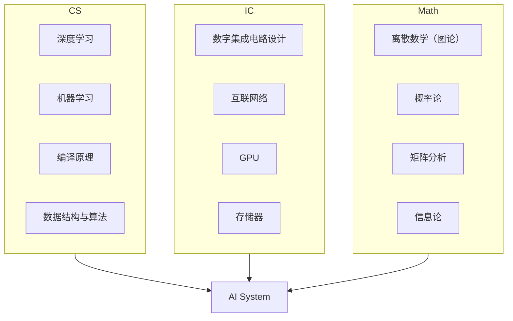

<!-- <div align="center">
  
</div> -->

# IC自学指南

> *本仓库基本框架完全继承自北京大学的[CS自学指南](https://github.com/pkuflyingpig/cs-self-learning/)，在其基础上添加了集成电路（IC）方向的自学资源、知识体系梳理等内容。因改动较大，故另起炉灶。但由于CS的内容基本保留，所以License未更改。*

[](https://crys-chen.github.io/Fudan-ME/)
[](https://github.com/Crys-Chen/Fudan-ME/blob/master/LICENSE)
[](https://github.com/Crys-Chen/Fudan-ME/issues)
[](https://github.com/Crys-Chen/Fudan-ME)

## 前言

### 微电子之殇

微电子科学与工程（Microelectronics, ME），或称集成电路（Integrated Circuits, IC），是是一门理工结合、多学科交叉的专业，它横跨材料、物理、化学、计算机等多领域知识，是工科中难度系数最高的专业之一。在大多数欧美高校，它一直从属于Electrical Engineering (EE) 或Electrical and Computer Engineering (ECE)，属于二级学科，从未独立。而近十年，内地各高校为响应国家号召，相继将其升级为一级学科，对本科生开放。

本科上来就学习这种交叉学科的一大问题是，什么都学，但什么都不精。诚然，本科应该追求广度而非深度。然而要想达到“广度”，必须要有一个知识谱系张成网状的培养方案。可惜现实中微电子培养方案里的各门课程相距过远，导致每门课都是一个孤立的结点，没法连成一张网，给人一种“**碎而不广**”的感觉。以复旦大学微电子专业为例，我们只从计算机那摘取了《程序设计》，这门课和集成电路主干之间隔了《操作系统》、《编译原理》两门课。此外，现有培养方案往往只涉及各门学科的几门高阶课程，对基础课程缺乏提炼，导致这些课程就像**无源之水**，学生只能对其囫囵吞枣。以《集成电路工艺》为例，其涉及到的化学知识非常多，可惜化学这门学科，我们在高考后就再无涉猎，导致上课像听天书。

问题就在这里——如果学生无法根据培养方案搭建自己的知识体系，广度便无从谈起。由于集成电路包罗万象，把所有知识都啃下来不可能也没必要。我认为比起知识的覆盖率，我们首先要保证的是知识的连续性。我们似乎并不需要既懂半导体物理又懂编译原理的人（这样的人能干嘛？），我们真正需要的是懂半导体物理+半导体器件+集成电路工艺的人，或懂程序设计+编译原理+计算机体系结构的人。前者可以做器件，后者可以研究架构。选择某个细分方向以点带面、开拓深挖，其他方向但当涉猎，才能既建立牢固的知识体系，又追求本科生的广度。

### 让知识回归连续

如何追求知识的连续性呢？我们在此以AI System为例，这一行所需要的知识体系如下：



这个方向是计算机+集成电路交叉的一个典型，目前没有一个本科专业能囊括该方向所需要的基础知识。因此，对这个方向感兴趣的同学，如果本科是集成电路，应该自行补充AI相关知识；如果本科学计算机，应该自行补充数字电路相关知识。我们之后会列出各个细分方向所需要的基础课程，高年级的同学可以以此为参考，查缺补漏；低年级的同学也可以根据自己的兴趣，在之后的选课中有所侧重。在网课如此兴盛的当下，什么课程都可以自学。尽管内地几百所高校凑不出一门能听的线性代数课程，但MIT早就将大牛Gilbert Strang的高质量课程公开，自助者天助之。

### 从ME到IC

本仓库继承自北京大学的[CS自学指南](https://github.com/pkuflyingpig/cs-self-learning/)，可以说是它的硬件孪生版。CS自学指南帮人自学计算机，这一份则帮人自学集成电路（IC, Integrated Circuits），故取名“IC自学指南”。原仓库关于CS的资源基本保留。集成电路与计算机本就同根，做架构与系统研究的CS同学，没有硬件知识同样寸步难行。因此本仓库虽以IC为主，也面向想补硬件的CS同学，欢迎大家参与贡献。

## 建站大纲

- **知识体系梳理**：以复旦大学IC的培养方案为基础，梳理知识体系。

- **科研方向巡礼**：介绍IC的各个学术前沿方向和所需的知识体系。横向涵盖电子设计自动化（EDA）、计算机体系结构、集成电路设计（数字、模拟、数模混合）、半导体器件工艺、先进封装技术等，纵向涵盖AI System、嵌入式SoC、射频、数模/模数转换器、FPGA、硬件安全、具身智能、近存计算等。

- **导师通讯录**：罗列国内外相关领域的知名教授及其研究方向，帮助大家匹配科研导师。

- **课程整理与资料分享**：以复旦大学专业课程为基础，无偿分享网课资源和学习资料。

- **开放评论区**：本站每一章节均设置评论区，可作为简易的评教交流网站。

  
  
  > - PPT：由于PPT涉及到任课老师的知识产权问题，假如老师未主动将课程资源上传到公开互联网，我们也不会上传该课程的PPT。
  > - 往年试题：各门课程的往年期中期末试题早已在学生群体内部广泛流传，假如我们继续掩耳盗铃，会让没有从学长姐处获得往年试题的同学处于劣势，这对不善交际或不屑于此的同学不公平。因此我们收集了一些广泛流传的往年试题，在此一并公开。也希望各位老师关注到后及时更新自己的题库。

## 如何成为贡献者

一个人的力量终究是有限的，对于本站你若有想要补充的内容，欢迎各位提出 [Pull Request](https://docs.github.com/en/pull-requests/collaborating-with-pull-requests/proposing-changes-to-your-work-with-pull-requests/creating-a-pull-request-from-a-fork)。

> 写作风格、内容尺度、价值取向等"软"性约束，详见站内 [参与建设](https://crys-chen.github.io/Fudan-ME/%E5%8F%82%E4%B8%8E%E5%BB%BA%E8%AE%BE/) 页。下面只讲"硬"性的——文件放哪、PR 怎么发。

### 仓库结构速查

```
Fudan-ME/
├── mkdocs.yml              # 站点配置 + nav + i18n nav_translations
├── template.md             # 新课程页的模板（必读）
├── docs/
│   ├── index.md            # 首页
│   ├── 知识谱系.md          # "学习地图"入口
│   ├── 后记.md
│   ├── 参与建设.md          # 贡献指南（软性约束）
│   ├── 科研方向/            # 17 个方向页 + index.md（星图入口）
│   │   ├── index.md
│   │   ├── AI算法与系统.md
│   │   ├── 半导体器件与先进工艺.md
│   │   └── ...
│   ├── 课程资源/            # 按学科分组的课程页
│   │   ├── 数学/
│   │   ├── 物理/
│   │   ├── 器件与工艺/
│   │   ├── 电路/
│   │   ├── 算法编程/
│   │   ├── 系统架构/
│   │   ├── 人工智能/
│   │   └── 必学工具/        # 工程工具教程都在这里
│   ├── stylesheets/extra.css
│   └── javascripts/        # orbit-galaxy.js / likes.js / prof-collapse.js / hero-scroll.js
└── overrides/              # MkDocs Material 主题覆盖（hero 横幅、giscus 评论）
```

**两条铁律**：
1. **新增任何 .md 文件，必须同步在 `mkdocs.yml` 的 `nav:` 段加一行链接**——否则页面不会出现在导航里。
2. **若该 .md 需要英文版**，按 `*.en.md` 命名（同目录下），并在 `mkdocs.yml` 的 `plugins.i18n.languages[en].nav_translations` 加中→英菜单映射。

### 一、改/补一门课程

**举例**：你想给 MIT 6.S081 加一段过来人的体验，或新增一门 UCB CS162 的课程页。

1. **找位置**：课程页按学科分组，路径模式是 `docs/课程资源/<学科>/<子分类>/<课程文件>.md`，例如
   - `docs/课程资源/系统架构/操作系统/MIT6.S081.md`
   - `docs/课程资源/数学/数学基础/线性代数/MITLA.md`
2. **新增课程页**：复制 [`template.md`](./template.md) 到目标位置，按七字段填（课号 / 所属大学 / 先修 / 编程语言 / 难度 🌟 / 学时 / 课程资源链接）。
3. **改已有课程页**：直接编辑文件即可。
4. **更新 nav**：编辑 `mkdocs.yml` 找到对应学科的 `- 课程资源/<学科>/...` 段，加一行：
   ```yaml
   - "MIT 6.S081 操作系统": "课程资源/系统架构/操作系统/MIT6.S081.md"
   ```
5. **本地验证**：`pip install -r requirements.txt && mkdocs serve`，浏览器开 `http://127.0.0.1:8000` 检查渲染、链接、是否出现在导航里。

### 二、改/补一个科研方向

**举例**：你想在"硬件安全与可信计算"方向加一段关于侧信道防御的最新进展，或者新增一个方向（如"光子计算"）。

1. **改已有方向**：编辑 `docs/科研方向/<方向名>.md`。方向页有固定七段骨架：
   - 这个方向在研究什么 / 适合什么样的人 / 核心研究问题 / 代表性机构 / 知识路径 / 入门三步走 / 相关课题组
   - 第 1 段"讲故事"是这个方向的灵魂，**别堆术语**，用具体案例
2. **新增方向**：
   - 新建 `docs/科研方向/<方向名>.md`，复制现有方向页（如 `AI算法与系统.md`）改
   - 在 `mkdocs.yml` 的"科研方向"段相应大类下加一行
   - 同步改 `docs/javascripts/orbit-galaxy.js` 里的 `ALL_CARDS`（17 张卡片的位置硬编码）和 `DIRS`（随机方向 nav 用），否则星图入口看不到新方向
   - 同步改 `docs/科研方向/index.md` 的 `.rg-fallback` 列表（移动端备份导航）
   - 同步改 `mkdocs.yml` 的 i18n nav_translations

### 三、改/补教授

**举例**：发现某教授链接 404 了；想加一位漏掉的清北复教授；某位港校教授中文名是简体应改繁体。

教授条目都在 `docs/科研方向/<方向>.md` 的"相关课题组"段，按"境内 / 境外"分两组 `<div class="grid cards prof-collapse" markdown>`。

**条目格式**（严格按此，不然 marker/CSS 不生效）：
```markdown
-   **[姓名](URL)** <span class="badge-XXX">学校</span>

    子方向1 · 子方向2 · 子方向3
```

- **badge**：`badge-tsinghua` / `badge-pku` / `badge-fudan` / `badge-other`（其他国内）/ `badge-hk` / `badge-intl`
- **女教授**：行末加 `<span class="prof-w"></span>`，CSS 自动给卡片改成复旦红边框
- **双教授合卡**：行末加 `<span class="prof-mixed-fm"></span>`（女在前）或 `<span class="prof-mixed-mf"></span>`（男在前），产生半红半蓝边框
- **海外华人**：`英文名（中文名）` 格式；粤语/威妥玛拼音的中文名用**繁体**（如 麥沛然、暨永雄、何宗易）；普通话拼音用简体
- **顺序**：境内段按"清华 → 北大 → 复旦 → 其他国内 → 港校"，境外段按高校名/影响力
- **不能编**：URL 必须能打开且确实是本人主页（不是同名不同人，不是学院/课题组主页）；子方向描述必须来自其主页/Scholar/课题组页可见内容

### 四、改/补工程工具教程

**举例**：写一篇 KiCad PCB 设计入门、Cadence Spectre 仿真常见报错排查。

工具页都在 `docs/课程资源/必学工具/` 下，分三类（在 `mkdocs.yml` 里看得到）：
- **通用工具**：Git / Vim / LaTeX / Docker / 翻墙等
- **EE 专用工具**：MATLAB / LTspice / KiCad / Vivado / Cadence / Gem5 等
- **构建与开发**：Docker / GitHub / VSCode 等

1. 新建 `docs/课程资源/必学工具/<工具名>.md`
2. **不要套课程模板**——工具教程不需要"七字段"。建议结构：
   - 一段"为什么要学这个工具"
   - 安装 / 配置（指明 OS、版本）
   - 一个 hello-world 级的最小例子
   - 你踩过的坑 / 常用快捷键 / 私房技巧（这部分最值钱）
3. 在 `mkdocs.yml` "工程工具"段对应小类下加链接
4. 同步 i18n nav_translations 加中→英映射

### 标准 PR 流程

无论上面哪类改动，最终都是同一套 GitHub 流程：

```bash
# 1. Fork & clone
git clone https://github.com/<你的用户名>/Fudan-ME.git
cd Fudan-ME

# 2. 装依赖、本地预览
pip install -r requirements.txt
mkdocs serve  # 打开 http://127.0.0.1:8000

# 3. 新建分支、改、提交
git checkout -b feat/add-csapp-page
# ...edit...
git add docs/课程资源/系统架构/计算机系统基础/CSAPP.md mkdocs.yml
git commit -m "feat: 补充 CMU 15213 CSAPP 课程页"

# 4. push 到你的 fork、发 PR
git push origin feat/add-csapp-page
```

PR 标题用一句话讲清楚改了什么（用 `feat:` / `fix:` / `docs:` 前缀更佳）。PR 描述里附上：（1）改了哪些文件；（2）本地预览截图（如果是新页面）。

> [!CAUTION]
> 上传课程资料前务必对个人信息做脱敏！姓名、学号、邮箱、聊天截图都要打码。

如果你发现错误但不想/不会发 PR，[开一个 Issue](https://github.com/Crys-Chen/Fudan-ME/issues/new) 报告即可——一句话也行。

## Star History

[](https://star-history.com/#Crys-Chen/Fudan-ME&Timeline)

## ✨ 鸣谢


<!--  support by https://contrib.rocks -->
<a href="https://github.com/Crys-Chen/Fudan-ME/graphs/contributors">
  
</a>

## 许可

项目贡献者编写的部分依照 [MIT LICENSE](https://www.tawesoft.co.uk/kb/article/mit-license-faq)。

其余部分（包括但不限于书中提到的课程资源、开源书籍以及视频内容）遵循原作者规定的许可。
