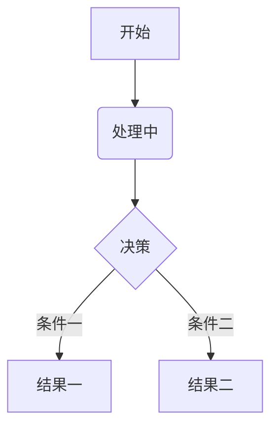
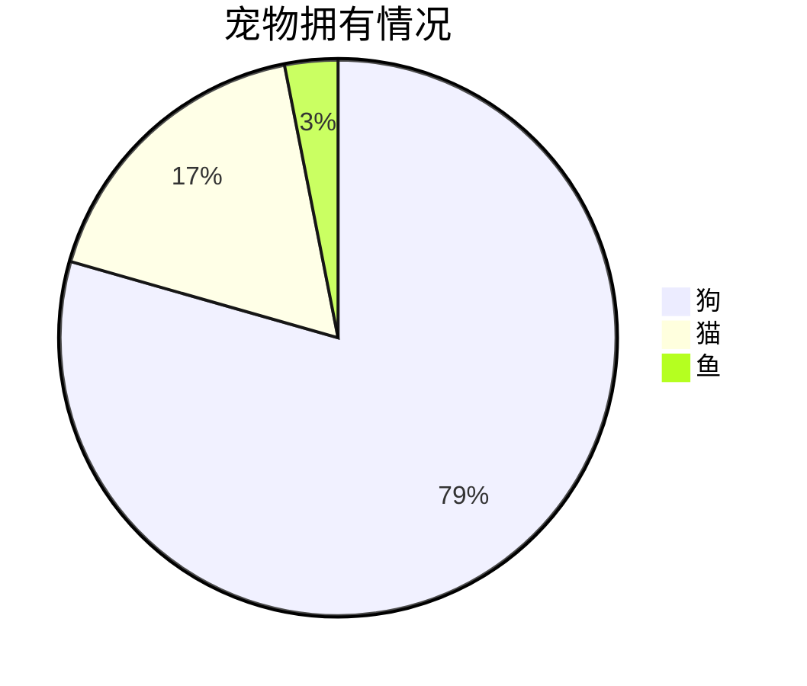

<!-- 

  

 -->

# IC/ME自学指南

> *本仓库基本框架完全继承自北京大学的[CS自学指南](https://github.com/pkuflyingpig/cs-self-learning/)，感谢前辈！*

## 前言：让知识回归连续

微电子科学与工程（集成电路）是是一门理工结合、多学科交叉的专业，它横跨材料、物理、化学、计算机等多领域知识，是工科中难度系数最高的专业之一。在大多数欧美高校，它一直从属于Electrical Engineering (EE) 或Electrical and Computer Engineering (ECE)，属于二级学科，从未独立。而近十年，内地各高校为响应国家号召，相继将其升级为一级学科，对本科生开放。

本科上来就学习这种交叉学科的一大问题是，什么都学，但什么都不精。诚然，本科应该追求广度而非深度。然而要想达到“广度”，必须要有一个知识谱系张成网状的培养方案。可惜现实中微电子培养方案里的各门课程相距过远，导致每门课都是一个孤立的结点，没法连成一张网，给人一种**“碎而不广”**的感觉。以复旦大学微电子专业为例，我们只从计算机那摘取了《程序设计》，这门课和集成电路主干之间隔了《操作系统》、《编译原理》两门课。此外，现有培养方案往往只涉及各门学科的几门高阶课程，对基础课程缺乏提炼，导致这些课程就像**无源之水**，学生只能对其囫囵吞枣。以《集成电路工艺》为例，其涉及到的化学知识非常多，可惜化学这门学科，我们在高考后就再无涉猎，导致上课像听天书。

问题就在这里——如果学生无法根据培养方案搭建自己的知识体系，广度便无从谈起。由于集成电路包罗万象，把所有知识都啃下来不可能也没必要。我认为比起知识的覆盖率，我们首先要保证的是知识的连续性。我们似乎并不需要既懂半导体物理又懂编译原理的人（这样的人能干嘛？），我们真正需要的是懂半导体物理+半导体器件+集成电路工艺的人，或懂程序设计+编译原理+计算机体系结构的人。前者可以做器件，后者可以研究架构。选择某个细分方向以点带面、开拓深挖，其他方向但当涉猎，才能既建立牢固的知识体系，又追求本科生的广度。

如何追求知识的连续性呢？我们在此以AI芯片为例，这一行所需要的知识体系如下：

这是一个流程图示例：

这是一个饼图示例：

这个方向是计算机+集成电路交叉的一个典型，目前没有一个本科专业能囊括该方向所需要的基础知识。因此，对这个方向感兴趣的同学，如果本科是集成电路，可以自行补充AI相关知识；如果本科学计算机，可以自行补充数字电路相关知识。我们之后会列出各个细分方向所需要的基础课程，高年级的同学可以以此为参考，查缺补漏；低年级的同学也可以根据自己的兴趣，在之后的选课中有所侧重。在网课如此兴盛的当下，尽管内地几百所高校凑不出一门能听的线性代数课程，但MIT早就将大牛Gilbert Strang的高质量课程公开，自助者天助之。

## 建站大纲

- **知识体系梳理**：以复旦大学微电子专业培养方案为基础，梳理微电子包罗万象的知识体系。

- **科研方向巡礼**：横向涵盖电子设计自动化（EDA）、计算机体系结构、集成电路设计（数字、模拟、数模混合）、半导体器件工艺、先进封装技术等，纵向涵盖AI芯片、嵌入式SoC、射频、数模/模数转换器、FPGA、硬件安全、具身智能、近存计算等。

- **导师通讯录**：罗列国内外相关领域的知名教授及其研究方向，帮助大家匹配科研导师。

- **课程整理与资料分享**：以复旦大学专业课程为基础，无偿分享网课资源和学习资料。

- **开放评论区**：本站每一章节均设置评论区，可作为简易的评教交流网站。

  
  
  > - PPT：由于PPT涉及到任课老师的知识产权问题，假如老师未主动将课程资源上传到公开互联网，我们也不会上传该课程的PPT。
  > - 往年试题：各门课程的往年期中期末试题早已在学生群体内部广泛流传，假如我们继续掩耳盗铃，会让没有从学长姐处获得往年试题的同学处于劣势，这对不善交际或不屑于此的同学不公平。因此我们收集了一些广泛流传的往年试题，在此一并公开。也希望各位老师关注到后及时更新自己的题库。

## 如何成为贡献者

一个人的力量终究是有限的，对于本站你若有想要补充的内容，欢迎各位提出 [Pull Request](https://docs.github.com/en/pull-requests/collaborating-with-pull-requests/proposing-changes-to-your-work-with-pull-requests/creating-a-pull-request-from-a-fork)。如果你想贡献一门新的课程，可以参考目前 repo 中的 [template](./template.md) 文件作为模版，并在 [mkdocs.yml](./mkdocs.yml) 文件中添加其navigation，当然你还可以在 [CS 学习规划](./docs/CS学习规划.md) 里的对应模块为其添加言简意赅的导语。如果你有想推荐的书籍，请参考 [好书推荐](https://raw.githubusercontent.com/Crys-Chen/Fudan-ME/master/docs/%E5%A5%BD%E4%B9%A6%E6%8E%A8%E8%8D%90.md) 模块上方的注释按相应格式添加内容。

同时由于个人水平有限，书中难免有笔误甚至概念错误之处，也请各位不吝赐教，在 issue 中提出来。

## Star History

## ✨ 鸣谢

<!--  support by https://contrib.rocks -->

## 许可

项目贡献者编写的部分依照 [MIT LICENSE](https://www.tawesoft.co.uk/kb/article/mit-license-faq)。

其余部分（包括但不限于书中提到的课程资源、开源书籍以及视频内容）遵循原作者规定的许可。
