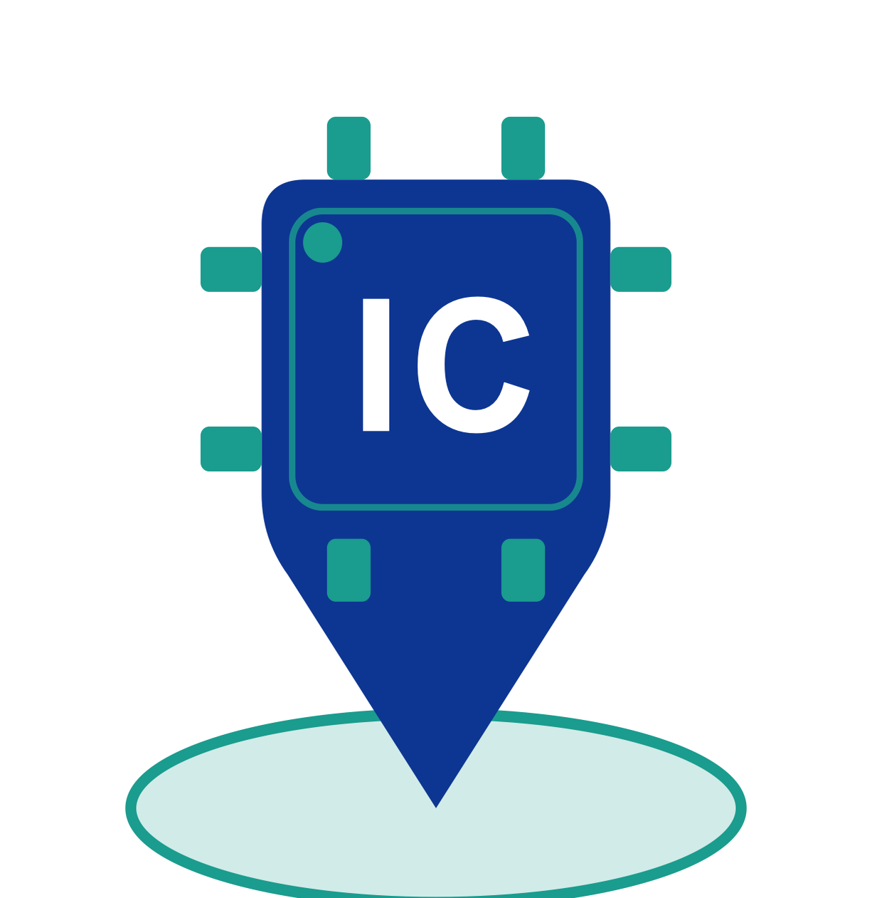

  

# IC Guide — 集成电路与微电子自学指南

**[https://crys-chen.github.io/ic-guide/](https://crys-chen.github.io/ic-guide/)**

面向 EE / ME 本科生和研究生的集成电路自学路径。站内有 17 个科研方向导览、分学科的课程地图和工程工具教程。内容由有实际经历的人写，持续更新。

---

## 如何成为贡献者

这是一张不完整的地图。一个人只能画出自己走过的路。如果你在某个方向做过研究、听过某门课、知道哪个信息已经过时，把那段补进来，后来者就少走一段弯路。

### 目前最缺

#### 科研方向教授 / 企业

以下是全部 17 个方向的教授/企业信息置信度。**低置信度方向最需要补充**，[填写表单 →](https://github.com/Crys-Chen/ic-guide/issues/new?template=add_entry.yml)

低置信度（8 个方向，最需要补充）

- EDA 与设计自动化
- 功率半导体与宽禁带器件
- 半导体器件与先进工艺
- 生物电子与脑机接口
- 量子计算与量子芯片
- 射频与毫米波 IC
- 模拟与混合信号 IC
- MEMS 与微纳传感器

中置信度（4 个方向）

- 具身智能
- 硬件安全与可信计算
- 可重构计算与 FPGA
- 类脑芯片

高置信度（5 个方向）

- 先进封装与异构集成
- 光电子与硅光集成
- 处理器架构与编译系统
- 存算一体与近存计算
- AI 算法与系统

#### 课程页

站内目前有 **80 余个课程页是纯占位骨架**，只有课程名和代码，没有课程简介、难度评价和学习资源。修过这些课的同学欢迎补全内容。另有 5 个分区完全空白，欢迎新建课程页。

**完全空白的分区（0 门课，从零写起）**

- 电路 → 控制与机器人
- 电路 → 生物电子
- 电路 → 数字验证
- 电路 → 功率电子
- 人工智能 → 类脑与 SNN

**待补充的骨架课程页（点击展开）**

器件与工艺（24 个）

- 材料：复旦：半导体材料
- 材料：复旦：有机微电子技术
- 材料：复旦：电子材料薄膜测试表征方法
- 材料：复旦：材料科学导论
- 材料：复旦：电子材料分析
- 材料：复旦：薄膜技术
- 材料：复旦：材料分析
- 集成电路工艺：复旦：集成电路制造仿真模拟原理和应用
- 集成电路工艺：复旦：现代集成电路光刻技术导论
- 集成电路工艺：复旦：集成电路纳米技术
- 集成电路工艺：复旦：先进集成电路工艺技术
- 存储器：复旦：存储器技术
- 存储器：复旦：闪存（FLASH）存储器技术与设计实现
- 存储器：复旦：存储器电路设计导论
- 前沿器件：复旦：新型微纳器件概论
- 前沿器件：复旦：半导体表面与界面
- 前沿器件：复旦：超低功耗半导体器件
- 先进封装：复旦：微电子封装材料及工艺
- 先进封装：复旦：集成电路封装与测试
- 先进封装：复旦：先进封装
- 半导体器件：复旦：半导体器件原理
- 功率半导体器件：复旦：特色工艺与功率半导体技术
- MEMS：复旦：传感器原理及应用
- MEMS：复旦：微机电系统应用

电路（24 个）

- EDA：复旦：器件模型与SPICE仿真
- EDA：复旦：模拟集成电路设计自动化基础
- EDA：复旦：数字集成电路设计自动化基础
- EDA：复旦：超大规模集成电路物理设计中的数学方法
- EDA：复旦：EDA系统软件分析和设计方法学
- 电路实验：复旦：模拟与数字电路实验
- 电路实验：复旦：集成电路实验(上)
- 电路实验：复旦：集成电路实验(下)
- 电路实验：复旦：集成电路设计实验
- 测试与可靠性：复旦：模拟电路测试原理
- 测试与可靠性：复旦：模拟测试原理与电路设计
- 测试与可靠性：复旦：射频微波测试基础
- 测试与可靠性：复旦：器件可靠性原理与测试
- 信号处理：复旦：模拟信号处理
- 模拟与射频/射频电路：复旦：高频电子线路A
- 模拟与射频/版图设计：复旦：集成电路版图设计基础
- 模拟与射频/模拟电子线路：Razavi Electronics 2（UCLA）
- 数字设计/ASIC与数字后端：复旦：数字电路逻辑综合及描述方法概论
- 数字设计/ASIC与数字后端：NPTEL：Synthesis of Digital Systems
- 数字设计/HDL：复旦：集成电路高级硬件描述语言
- 数字设计/HDL/HLS：高亚军：跟 Xilinx SAE 学 HLS
- 数字设计/HDL/HLS：HLS Programming with FPGAs（Lehigh）
- 数字设计/低功耗设计：复旦：超低功耗集成电路设计

人工智能（11 个）

- AI交叉应用：复旦：自动驾驶人工智能原理与实践
- AI交叉应用：复旦：人工智能的计算机软件基础
- AI交叉应用：复旦：AI半导体制造工艺
- AI交叉应用：复旦：人工智能算法在EDA的应用
- 机器学习理论：CMU 10-708: Probabilistic Graphical Models
- 机器学习理论：Stanford CS229M: Machine Learning Theory
- 入门速成：复旦：人工智能导论
- 入门速成：浙大 吴飞：人工智能：模型与算法
- 深度学习：李沐：动手学深度学习 v2
- 机器学习：复旦：机器学习算法
- 大语言模型：复旦：自然语言处理与大语言模型算法

系统架构（7 个）

- AI加速器：复旦：AI专用芯片设计
- AI加速器：复旦：AI专用处理器架构设计方法
- AI加速器：复旦：基于FPGA的人工智能算法加速及应用
- GPU体系结构：NPTEL：GPU Architectures and Programming
- GPU体系结构：ZOMI 酱：GPU 架构原理系列
- 并行与分布式系统：双笙子佯谬：高性能并行编程与优化
- 并行与分布式系统：中科大：并行计算（国家精品）

算法编程（8 个）

- 编程入门：复旦：程序设计
- 编程入门：复旦：Perl语言入门和提高
- 编程入门：复旦：计算机软件基础
- 编程入门/C：北大 郭炜：程序设计与算法（一）C语言
- 编程入门/C：浙大 翁恺：C语言程序设计
- 编程入门/Python：北大 陈斌：数据结构与算法 Python 版
- 编程入门/Rust：令狐壹冲：Rust 编程视频教程
- 编程入门/Rust：杨旭：Rust 编程语言入门教程

物理（8 个）

- 光学：复旦：光电子器件与集成
- 光学：复旦：半导体光电子器件
- 半导体物理：复旦：半导体物理
- 物理实验：复旦：基础物理实验
- 热力学与统计物理：复旦：热力学与统计物理I
- 固体物理：复旦：固体物理（物理系）
- 电磁场与微波：复旦：电磁场与电磁波
- 量子计算：北大 李彤阳：量子计算

数学（4 个）

- 代数/线性代数：复旦：线性代数
- 分析/数学分析：复旦：高等数学A（上/下）
- 数值与优化/数值分析：复旦：计算物理基础
- 入门速成：复旦：工程数学及概率方法

### 怎么贡献

#### 随手改错

发现错别字、死链、教授信息过时、事实错误，直接在**页面底部评论区**留言（需要 GitHub 登录），或者[开一个 Issue](https://github.com/Crys-Chen/ic-guide/issues/new)，一句话描述就够。

#### 补充教授或企业

[填写表单 →](https://github.com/Crys-Chen/ic-guide/issues/new?template=add_entry.yml)

选好归属方向，填姓名/名称、主页 URL、子方向描述，提交后维护者来处理。唯一硬约束：URL 必须能打开，且确实是本人个人主页或企业官网，不接受学院门户页。

#### 完善现有页面某一节

发现某一节有问题或缺失——[开 Issue 说一句](https://github.com/Crys-Chen/ic-guide/issues/new)你想改哪节、改成什么，或者直接发 PR。按页面已有结构写就行，不需要提前对齐。

#### 新建课程页

按[课程页模板](./template.md)写，发 PR。

文件命名规则：

- 有课号的课：`校名缩写_课号.md`，如 `MIT_6.042J.md`、`FDU_MICR130008.md`
- 无课号的大学课：`校名缩写_教师拼音.md`，否则用 `校名缩写_主题.md`
- 个人 / 平台创作者：`作者_主题.md`，如 `karpathy_zero2hero.md`

分隔符只用下划线，不用空格和全角字符。

#### 新建科研方向页

建议先[开 Issue 说明你想做哪个方向](https://github.com/Crys-Chen/ic-guide/issues/new)，确认范围再动手，免得写完发现不对路。方向页有七节结构，第一节（这个方向在研究什么）最难写，模板里有说明。

#### 分享笔记

[填写表单 →](https://github.com/Crys-Chen/ic-guide/issues/new?template=submit_notes.yml)，文件直接拖进 Issue 正文（PDF / zip，单个 ≤ 25 MB）。笔记放在自己网盘或仓库的，PR 里加一行链接也行。投稿经审核后会挂到笔记索引页。

### 三条底线

1. **不能编**：教授信息必须来自可验证的公开来源（个人主页、Google Scholar、课题组页）；课程资源必须是能打开的直链，找不到就留空。
2. **用了 LLM 就重写**：LLM 生成的内容直接提交不会过审。用 LLM 打草稿可以，但必须自己读一遍、改成自己的话、核实所有事实后再提交。
3. **批制度，不苛责个人**：可以写"某某方向在国内发展受限"，不写"某某教授水平不行"。

### 一点说明

不接受产品推广或付费推广。课题组招生、企业招聘等免费社区信息视站点发展情况另议，未来可能会单独开辟一个分区供大家投放此类信息。

愿意署名就署名，想匿名也完全 OK。

---

## Star History

## 鸣谢

## 许可

项目贡献者编写的部分依照 [MIT LICENSE](https://www.tawesoft.co.uk/kb/article/mit-license-faq)。

其余部分（包括但不限于站内提到的课程资源、开源书籍及视频内容）遵循原作者规定的许可。
