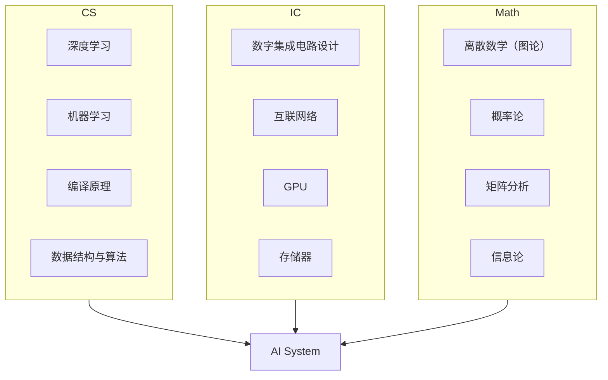

---
hide:
  - navigation
  - toc
---
<!-- ══════════════ NIGHT MODE HERO (slate only) ══════════════ -->

ECE 自学指南 · 复旦大学

<h1 class="df-title">让知识 回归连续</h1>

从器件工艺到量子芯片，15 个前沿科研方向，200+ 门精选课程

<a href="科研方向/" class="df-btn">探索科研方向 →</a>
<a href="知识谱系/" class="df-ghost">知识谱系</a>

<!-- ══════════════ DAY MODE HERO (default only) ══════════════ -->

ECE 自学指南 · 复旦大学

<h1 class="df-lhl">让知识 回归连续</h1>

从器件工艺到量子芯片——复旦大学微电子专业自学指南，覆盖 15 个前沿科研方向与 200 余门精选课程。

<a href="科研方向/" class="df-lbp">探索科研方向 →</a>
<a href="知识谱系/" class="df-lbg-btn">知识谱系</a>

<nav class="df-lnav">
<a href="科研方向/" class="df-lnc">🔬科研方向</a>
<a href="课程资源/数学/" class="df-lnc">📚课程资源</a>
<a href="知识谱系/" class="df-lnc">🗺️知识谱系</a>
<a href="课程资源/必学工具/Git/" class="df-lnc">🛠️工程工具</a>
</nav>

<!-- ══════════════ NIGHT MODE CARDS (slate only) ══════════════ -->

<a href="科研方向/" class="df-card">
🔬→
<h3>科研方向</h3>
15 个前沿方向，器件·电路·架构·应用
</a>
<a href="课程资源/数学/" class="df-card">
📚→
<h3>课程资源</h3>
200+ 精选课程，国内外顶级高校收录
</a>
<a href="知识谱系/" class="df-card">
🗺️→
<h3>知识谱系</h3>
跨学科知识地图，明确路径与依赖
</a>
<a href="课程资源/必学工具/Git/" class="df-card">
🛠️→
<h3>工程工具</h3>
Git · Linux · LaTeX · Docker 速通
</a>

## 前言

### 微电子之殇

微电子科学与工程（Microelectronics, ME），或称集成电路（Integrated Circuits, IC），是是一门理工结合、多学科交叉的专业，它横跨材料、物理、化学、计算机等多领域知识，是工科中难度系数最高的专业之一。在大多数欧美高校，它一直从属于Electrical Engineering (EE) 或Electrical和Computer Engineering (ECE)，属于二级学科，从未独立。而近十年，内地各高校为响应国家号召，相继将其升级为一级学科，对本科生开放。

本科上来就学习这种交叉学科的一大问题是，什么都学，但什么都不精。诚然，本科应该追求广度而非深度。然而要想达到"广度"，必须要有一个知识谱系张成网状的培养方案。可惜现实中微电子培养方案里的各门课程相距过远，导致每门课都是一个孤立的结点，没法连成一张网，给人一种"**碎而不广**"的感觉。以复旦大学微电子专业为例，我们只从计算机那摘取了《程序设计》，这门课和集成电路主干之间隔了《操作系统》、《编译原理》两门课。此外，现有培养方案往往只涉及各门学科的几门高阶课程，对基础课程缺乏提炼，导致这些课程就像**无源之水**，学生只能对其囫囵吞枣。以《集成电路工艺》为例，其涉及到的化学知识非常多，可惜化学这门学科，我们在高考后就再无涉猎，导致上课像听天书。

问题就在这里——如果学生无法根据培养方案搭建自己的知识体系，广度便无从谈起。由于集成电路包罗万象，把所有知识都啃下来不可能也没必要。我认为比起知识的覆盖率，我们首先要保证的是知识的连续性。我们似乎并不需要既懂半导体物理又懂编译原理的人（这样的人能干嘛？），我们真正需要的是懂半导体物理+半导体器件+集成电路工艺的人，或懂程序设计+编译原理+计算机体系结构的人。前者可以做器件，后者可以研究架构。选择某个细分方向以点带面、开拓深挖，其他方向但当涉猎，才能既建立牢固的知识体系，又追求本科生的广度。

### 让知识回归连续

如何追求知识的连续性呢？我们在此以AI System为例，这一行所需要的知识体系如下：

这个方向是计算机+集成电路交叉的一个典型，目前没有一个本科专业能囊括该方向所需要的基础知识。因此，对这个方向感兴趣的同学，如果本科是集成电路，应该自行补充AI相关知识；如果本科学计算机，应该自行补充数字电路相关知识。我们之后会列出各个细分方向所需要的基础课程，高年级的同学可以以此为参考，查缺补漏；低年级的同学也可以根据自己的兴趣，在之后的选课中有所侧重。在网课如此兴盛的当下，什么课程都可以自学。尽管内地几百所高校凑不出一门能听的线性代数课程，但MIT早就将大牛Gilbert Strang的高质量课程公开，自助者天助之。

### 从ME到ECE

由于本仓库继承自[CS自学指南](https://github.com/pkuflyingpig/cs-self-learning/)，其原有关于CS的资源基本保留，因此叫"IC/ME自学指南"并不合适。思量再三，决定叫"ECE自学指南"。ECE全称是Electrical Computer Engineering，指电子与计算机工程，是一门软硬兼修的专业。计算机（Computer Science, CS）的同学，如若想做架构和系统研究，没有硬件知识也是寸步难行。因此，本仓库也面向有志于从事架构研究的CS同学，为其提供硬件相关的自学资源，也欢迎CS的同学参与贡献。
