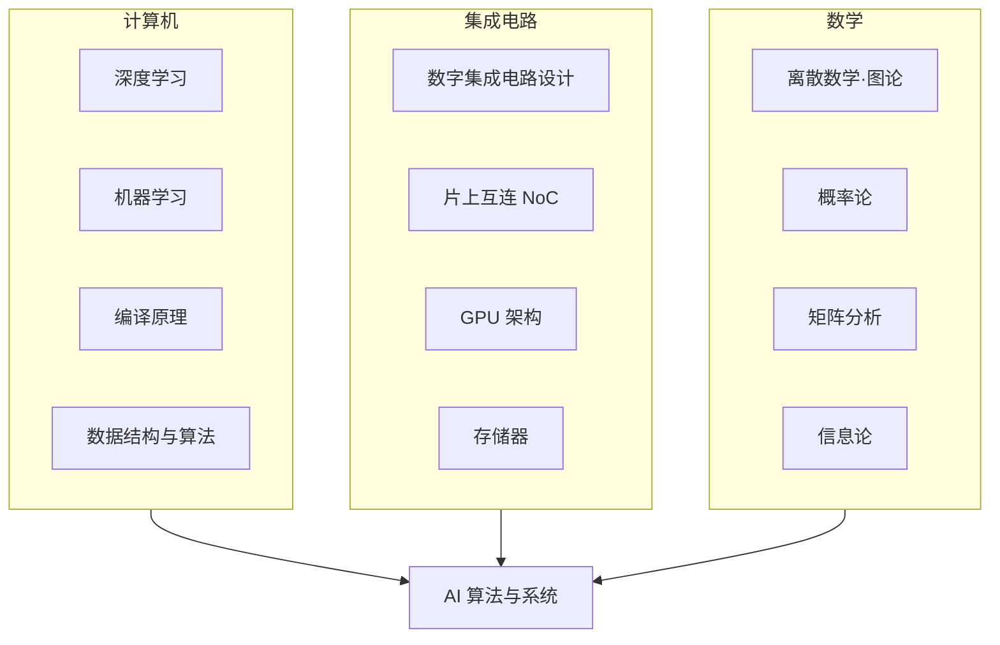

---
hide:
  - navigation
---
<!-- ══════════════ NIGHT MODE HERO (slate only) ══════════════ -->

ECE 自学指南 · 复旦大学

<h1 class="df-title">让知识 回归连续</h1>

从器件工艺到量子芯片，17 个前沿科研方向，200+ 门精选课程

<a href="科研方向/" class="df-btn">探索科研方向 →</a>
<a href="学习地图/" class="df-ghost">学习地图</a>

<!-- ══════════════ DAY MODE HERO (default only) ══════════════ -->

ECE 自学指南 · 复旦大学

<h1 class="df-lhl">让知识 回归连续</h1>

从器件工艺到量子芯片——复旦大学微电子专业自学指南，覆盖 17 个前沿科研方向与 200 余门精选课程。

<a href="科研方向/" class="df-lbp">探索科研方向 →</a>
<a href="学习地图/" class="df-lbg-btn">学习地图</a>

<nav class="df-lnav">

<a href="工程工具/Git/" class="df-lnc">01工程工具Git · Linux · Docker</a>
<a href="专题社区/" class="df-lnc">02专题社区一生一芯 · 具身智能</a>
<a href="https://github.com/Crys-Chen/Fudan-ME" class="df-lnc" target="_blank" rel="noopener">03参与建设GitHub 开源共建</a>
<a href="#" class="df-lnc">04课堂笔记学习记录与分享</a>

</nav>

<!-- ══════════════ NIGHT MODE CARDS (slate only) ══════════════ -->

<a href="科研方向/" class="df-card">
🔬→
<h3>科研方向</h3>
17 个前沿方向，器件·电路·架构·应用
</a>
<a href="学习地图/数学/" class="df-card">
📚→
<h3>学习地图</h3>
200+ 精选课程，国内外顶级高校收录
</a>
<a href="学习地图/" class="df-card">
🗺️→
<h3>学习地图</h3>
跨学科知识地图，明确路径与依赖
</a>
<a href="工程工具/Git/" class="df-card">
🛠️→
<h3>工程工具</h3>
Git · Linux · LaTeX · Docker 速通
</a>

## 前言

### 微电子之殇

微电子科学与工程（Microelectronics, ME），或称集成电路（Integrated Circuits, IC），是一门理工结合、多学科交叉的专业，横跨材料、物理、化学、计算机等多个领域，是工科里难度系数最高的专业之一。在大多数欧美高校，它从来不是一个独立的系或专业，只是电子工程（EE）或电子与计算机工程（ECE）底下的一个分支。而近十年，内地为响应国家号召，相继把它立成一级学科，向本科生敞开。

本科上来就学这种交叉学科，最大的问题是什么都学，但什么都不精。诚然，本科应当追求广度而非深度。但要达到广度，前提是有一份知识谱系张成网状的培养方案。可惜现实中微电子培养方案里各门课程相距太远，每门课都是一个孤立的结点，连不成一张网，给人一种“**碎而不广**”的感觉。以复旦微电子2021级的培养方案为例，我们只从计算机那边摘了一门《程序设计》，这门课和集成电路主干之间隔着《操作系统》《编译原理》两门课。此外，现有培养方案往往只涉及各领域的几门高阶课，对基础课缺乏提炼，让它们成了**无源之水**。以《集成电路工艺》为例，它涉及的化学知识非常多，可惜化学这门学科我们高考后就再没碰过，上课像听天书。

此外，不同课由不同教授开设，学院很难把这些以科研为主的老师聚到一起，让他们坐下来商量课程之间怎么衔接。所以不同课程之间要么叠床架屋，要么彼此之间隔着巨大的 gap 要学生自学。在复旦微电上课，有点像刷短视频，一会上这个，一会上那个，一会又把同样的东西刷一遍，效率低，体验也不好。

问题就出在这里。如果学生没法照着培养方案搭起自己的知识体系，广度便无从谈起。集成电路包罗万象，皓首穷经，把所有知识都啃下来既不可能也没必要。我认为比起知识的覆盖率，首先要保证的是知识的**连续性**。我们似乎并不需要既懂半导体物理又懂编译原理的人（这样的人能干嘛？），真正需要的是懂半导体物理 + 半导体器件 + 集成电路工艺的人，或懂数据结构与算法 + 编译原理 + 计算机体系结构的人。前者能做器件，后者能研究架构。选定一个细分方向以点带面、深挖下去，其他方向但当涉猎，才能既搭起牢固的知识体系，又不失本科生该有的广度。

对于刚刚入门的同学，面对这样一个浩如烟海的学科，我们到底要怎么知道自己要学什么呢？主要两个路径。一个是从培养方案出发，自底向上，看看整棵知识树长成什么样。另一个是去了解前沿的科研与产业方向，自顶向下，倒过来连，知道要够到那个方向得爬哪几根树枝。这个网站就是致力于在两边同时架桥，在中间汇合。所以我们有两大板块——「学习地图」和「科研方向」。

### 让知识回归连续

我们以 **AI 算法与系统** 为例，这个方向需要的知识体系大致如下：

这个方向是计算机 + 集成电路交叉的典型，在我就读的时候，没有任何一个本科专业能囊括它所需的全部基础，所以当时对它感兴趣的同学，本科是集成电路的，就要自行补 AI 相关知识；本科是 AI 或计算机的，就要自行补充电路相关知识。

现在复旦微电的培养方案开始有 AI 相关内容了，但我们必须意识到，对于这样一门快速迭代的学科，培养方案总是后知后觉的。与其被动地等学校开设新课程，不如自己上网找网课，把 AI 当助教。尽管内地几百所高校凑不出一门能听的线性代数，但 MIT 早就把 Gilbert Strang 的课公开了；尽管集成电路的论坛不像计算机那么活跃，但现在有 AI，什么傻瓜问题都能得到耐心的解答。

本网站主要就是给培养方案打补丁，提供各个细分方向所需的基础课程以及相关资源。高年级同学可以照着查缺补漏，低年级同学也可以将其作为一个学习辅助文档或选课的参考。自助者天助之。

### 让信息回归透明

再说自顶向下。前沿方向到底在干嘛，光看课表是看不出来的。

刚入学时，一位学长对我说："微电子，本科打基础，硕士算入门，博士顶多叫略懂。"这个专业本科毕业的工作机会很少，很多人硕士起步。放眼其他专业，除了基础学科，知识门槛能和微电子掰手腕的恐怕只有医学。现在不少同学本科就提前进实验室，看自己到底适不适合做科研，这是好事。但对于这样一个艰深晦涩的学科，刚入门就一头扎进某个方向，容易“只见树木，不见森林”。带我们做科研的学长姐也不一定清楚自己在干嘛，老师也不一定愿意花时间带我们真正入门。整个集成电路的学术圈，对于本科生来说就像一座密不透风的堡垒，我们一直身处局外，不知从哪进去。微电并不像计算机有浓厚的开源社区和分享氛围，

微电子相关的科研方向，我自己梳理了一下，一共 17 个。过去几年广泛的探索与阅读里，我或门外汉、或局内人地，建立起对这 17 个方向的初步了解，有了一个较为全局的视角。比起教学相长，我更喜欢用写作来梳理自己的认知。临近毕业，总算有空用 vibe coding 把零零碎碎的笔记一次分享出来。我个人觉得其中最精华的，当属[巡礼](科研方向/巡礼.md)这一篇，它对 17 个科研方向做了提纲挈领式的综述。此外，想了解某个细分领域的同学，也可以直接点开它的页面，看看这个方向在研究什么、适合什么样的同学，有哪些课题组和对口企业。希望对大家有帮助。

其实现在 AI 这么发达，直接问 AI 也行。但我自信我的文章，无论信息密度还是可读性，都不是当下的 AI 写得出的。当然，你也可以让 AI 扫一遍这个网站，把我提供的信息揉碎了消化。

### 学院也在做这件事情

我本科这几年，微电子的培养方案发生了巨大的变化。我把 21级 和 25级 对比了一下，改革的趋势非常明朗。作为地基的核心必修一门没动基本保留，而进阶课程的整体风格从原本零碎的拼凑，转向了以前沿需求为导向组织课程。方向和本网站的初衷完全一致。

|  | 2021 级 | 2025 级 |
|---|---|---|
| 进阶路径 | 按工序切块：工艺器件 · 设计方法 · 芯片集成测试 | 按前沿立模块：新算力 · 新制造 · 芯粒集成 |
| 课程总数 | 70 余门 | 90 余门 |
| AI 相关课 | 几乎没有 | AI 成建制入侵 |

然而，现在复旦微电的同学应该都有同感，就是培养方案里很多课其实是"假课"，现实中根本没有开设，或者隔几个学期才开一次。比如我本科四年就一直想选修《存储器电路设计导论》，但这门课两年才开一次，开的时候又跟我必修课时间撞上了，完全没机会修读。据我了解下来，现在这种“阴阳课表”的情况依然很严重。大家每学期能选的课其实就那么几门，所有人上的课都大差不差，并不存在按自己需要 DIY 课表的理想情况。只能说学校和学院的出发点是好的，就是不知道他们到底出发了没有。但改革总是文件先行嘛，可以理解。相信领导们之后会修复这个 bug。

### 从 ME 到 ECE

非新工科专业的同学，可以看着玩，看不懂很正常，我的文字功底还没厉害到能让非工科的人看懂。这个网站也不只微电子同学能用，计算机同学也能用。一些经管的同学，无论创业还是做行研，也能通过它了解我们硬件行业。

本仓库继承自 [CS 自学指南](https://github.com/pkuflyingpig/cs-self-learning/)，原有关于 CS 的资源基本保留，因此叫"IC/ME 自学指南"并不合适。思量再三，决定叫"ECE 自学指南"。ECE 全称 Electrical and Computer Engineering，电子与计算机工程，是一门软硬兼修的专业。计算机（Computer Science, CS）的同学，若想做架构和系统研究，没有硬件知识也寸步难行。因此本仓库也面向有志于架构研究的 CS 同学，为他们提供硬件方向的自学资源，也欢迎 CS 同学参与贡献。

