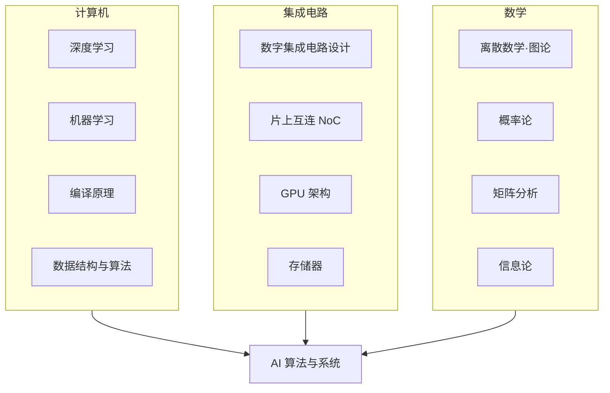

---
hide:
  - navigation
---
<!-- ══════════════ NIGHT MODE HERO (slate only) ══════════════ -->

IC 自学指南 · 复旦大学

<h1 class="df-title">让知识 回归连续</h1>

从器件工艺到量子芯片，17 个前沿科研方向，200+ 门精选课程

<a href="科研方向/" class="df-btn">探索科研方向 →</a>
<a href="学习地图/" class="df-ghost">学习地图</a>

<a class="df-scroll" href="#_1">序言↓</a>

<!-- ══════════════ DAY MODE HERO (default only) ══════════════ -->

IC 自学指南 · 复旦大学

<h1 class="df-lhl">让知识 回归连续</h1>

从器件工艺到量子芯片——复旦大学微电子专业自学指南，覆盖 17 个前沿科研方向与 200 余门精选课程。

<a href="科研方向/" class="df-lbp">探索科研方向 →</a>
<a href="学习地图/" class="df-lbg-btn">学习地图</a>

<nav class="df-lnav">

<a href="工程工具/Git/" class="df-lnc">01工程工具Git · Linux · Docker</a>
<a href="专题社区/" class="df-lnc">02专题社区一生一芯 · 具身智能</a>
<a href="https://github.com/Crys-Chen/Fudan-ME" class="df-lnc" target="_blank" rel="noopener">03参与建设GitHub 开源共建</a>
<a href="#" class="df-lnc">04课堂笔记学习记录与分享</a>

</nav>

<a class="df-scroll" href="#_1">序言↓</a>

<!-- ══════════════ NIGHT MODE CARDS (slate only) ══════════════ -->

<a href="科研方向/" class="df-card">
🔬→
<h3>科研方向</h3>
17 个前沿方向，器件·电路·架构·应用
</a>
<a href="学习地图/数学/" class="df-card">
📚→
<h3>学习地图</h3>
200+ 精选课程，国内外顶级高校收录
</a>
<a href="学习地图/" class="df-card">
🗺️→
<h3>学习地图</h3>
跨学科知识地图，明确路径与依赖
</a>
<a href="工程工具/Git/" class="df-card">
🛠️→
<h3>工程工具</h3>
Git · Linux · LaTeX · Docker 速通
</a>

## 前言

### 微电子之殇

本科选择复旦微电子时，我并不知道微电子到底在学什么。未谈恋爱便步入婚姻，几年来在围城里爱过、恨过、挣扎过、出走过，如今达到一种微妙的平和。

微电子科学与工程（Microelectronics, ME），或称集成电路（Integrated Circuits, IC），是一门理工结合、多学科交叉的专业，它横跨材料、物理、化学、计算机等多个领域，是工科里难度系数最高的专业之一。但在大多数欧美高校，它从来不是一个独立的系或专业，只是电子工程（EE）或电子与计算机工程（ECE）底下的一个分支。近十年，内地高校为响应国家号召，才相继把它立成一级学科，向本科生敞开。

我们就是在这样的背景下选择了该专业。本科上来就学这种交叉学科，好处是节省时间，不必学相关学科中不相关的内容；坏处是容易什么都学，但什么都不精。诚然，本科应当追求广度而非深度。但现实中微电子培养方案里各门课程相距太远，每门课都是一个孤立的结点，给人一种“**碎而不广**”的感觉。以复旦微电子 2021 级的培养方案为例，我们从计算机摘了一门《程序设计》过来，但这门课和集成电路主干之间隔着《操作系统》《编译原理》两门课。此外，现有培养方案往往只涉及各领域的几门高阶课，对基础课缺乏提炼，让它们成了**无源之水**。以《集成电路工艺》为例，它涉及的化学知识非常多，可惜化学这门学科我们高考后就再没碰过，上课像听天书。

不仅是课程设置存在断层，师资的调配也加剧了这种脱节。不同课程由不同教授独立开设，学院很难将这些以科研为重心的老师们聚拢到一起，去细致打磨课程间的衔接。这就导致课程之间要么叠床架屋、内容重复，要么留着巨大的 gap 让学生自行跨越。在复旦微电上课，有点像刷短视频，一会上这个，一会上那个，一会又把同样的东西刷一遍，效率低，体验也不佳。要真是短视频就好了，至少有成瘾性，可惜没有！

面对这种现状，我们必须承认，学院本身确实在努力。对比21级和25级的培养方案，可以发现改革的趋势非常明朗。作为地基的核心必修基本保留，而进阶课程的整体风格则从原本零碎的按工序拼凑，变成了以前沿需求为导向。这种改革方向，和本网站的初衷是不谋而合的。

|  | [2021 级](学习地图/复旦微电子课程表.md) | [2025 级](学习地图/复旦集成电路课程表.md) |
|---|---|---|
| 进阶路径 | 按工序分：工艺器件 · 设计方法 · 芯片集成测试 | 按前沿模块分：新算力 · 新制造 · 芯粒集成 |
| 课程总数 | 70 余门 | 90 余门 |
| AI 相关课 | 几乎没有 | 增设诸多 AI 课程 |

然而，理想与现实之间依然存在着落差。培养方案其实有很多“假课”，它们要么在现实中根本不开设，要么隔几个学期诈尸一下。这点相信复旦微电这几届同学都深有同感。我本科四年一直想选修《存储器电路设计导论》，但这门课两年才开一次，开课时又恰好与我的核心必修课时间冲突，导致我最终也未能如愿。这种“阴阳课表”的现象至今依然严重。大家每学期真正能选的课其实就那么几门，所有人上的课大差不差，所谓的“按需 DIY 课表”目前还只是一种奢望。只能说学校和学院的出发点是好的，就是不知道他们到底出发了没有。

改革总是文件先行，这完全可以理解，相信领导们在未来的版本更新中会逐步修复这个 bug。但对于身处系统之中的个体而言，面对集成电路这样一门浩如烟海的学科，和当前这套既稀碎又缺乏合理衔接的培养体系，我们到底应该如何搭建起知识体系呢？我想无外乎两条路：一是**自底向上**，从那份理想的培养方案出发，让凌乱的课程连点成线，理清整个知识谱系；二是**自顶向下**，去了解最前沿的科研与产业方向，再倒推回来，明白想要攀上那个枝头，中途需要经过哪几根枝杈。

这个网站存在的意义，便是在这两端架桥。我们设立了「[学习地图](学习地图/index.md)」与「[科研方向](科研方向/index.md)」两大核心板块，帮助大家制订自己的学习路径。

### 让知识回归连续

集成电路包罗万象，想要皓首穷经地把所有知识全盘吸收，既不可能也没必要。比起盲目追求知识的覆盖率，我们首先要保证的是**知识的连续性**。

行业似乎并不需要一个既精通半导体物理、又能手写编译的人（这样的交叉人才能干嘛？），真正渴求的，是那些点满“半导体物理 + 半导体器件 + 集成电路工艺”技能树的器件专家，或是精通“数据结构与算法 + 编译原理 + 计算机体系结构”的架构人才。前者深耕物理底层，后者主攻系统架构。选定一个细分方向，以点带面地挖出一个坑，对其他方向则“但当涉猎，见往事耳“。这样既能既构筑起沉甸甸的知识体系，又能保证本科生应有的视野。

我们以 **[AI 算法与系统](科研方向/AI算法与系统.md)** 为例，这个方向需要的知识体系大致如下：

这一方向是计算机与集成电路深度交叉的典型。在我就读时，没有任何一个本科专业能囊括它所需的全部基础。因此，对它感兴趣的同学，如果本科学的是集成电路，就必须自行补充 AI 相关知识；反之，如果本科学的是 AI 或计算机，就得自己去啃电路原理。

面对这样快速迭代的学科，体制内的培养方案永远是后知后觉的。与其被动地等待，不如主动出击，上网寻找优质网课，把 AI 当作自己的专属助教。尽管内地几百所高校或许凑不出一门令人满意的线性代数，但 MIT 早就将 [Gilbert Strang 教授的经典神课](学习地图/数学/数学基础/线性代数/MITLA.md)公之于众；尽管集成电路的开源论坛远不如计算机领域活跃，但如今有了 AI 的加持，什么傻瓜问题都能得到耐心的解答。

本网站的「[学习地图](学习地图/index.md)」板块，就是为了给现有的培养方案打补丁，把所有相关知识与课程都连接起来，构成一张连续的网。我们将各个细分方向所需的基础课程及相关优质资源进行了汇总，高年级同学可以按图索骥、查漏补缺；低年级同学也可以将其视为一份学习辅助文档或选课指南。自助者天助之。

### 让信息回归透明

刚入学时，一位学长对我说："微电子，本科打基础，硕士算入门，博士顶多叫略懂。"由于本科毕业直接对口的高质量工作机会较少，很多人都不得不选择读研深造。因此，尽早想清楚自己是否适合做科研、究竟对哪个方向感兴趣，就显得格外重要。现在不少同学在大一大二就提前进入实验室，这当然是件好事。可要做出正确的判断，前提是得看清大盘——有哪些细分方向？每个方向具体在干什么？然而，这恰恰是本科生最难获取的信息。原因有三：

1. “只见树木，不见森林”：这门学科本身太过艰深，本科生刚入门就一头扎进某个细分课题，容易要么在一棵树上吊死，钻进死胡同出不来；要么浅尝辄止，误把一个狭窄方向的体验当成了整个学术界的全貌。

2. “欲济无舟楫”：课题组的老师未必有时间精力将一个本科生真正领进门，而负责带教的学长学姐，有时甚至也未必清楚自己在干嘛。

3. “独学而无友”：微电子圈没有计算机圈那种浓厚的开源与分享氛围，网络上的干货信息极其匮乏。整个学术圈对本科生来说就像一座密不透风的堡垒，大家始终是门外汉，连门朝哪开都不知道。

这个网站所能做的，就是努力在这座堡垒的墙上凿开一个透光的口子。我自己梳理了一下，微电子相关的科研方向大约有 17 个。这几年我东一榔头西一棒槌地试错下来，总算积累了一点系统性的认知。比起教学相长，我更喜欢用写作来巩固自己的认知，所以积累了很多笔记。

如今我本科即将毕业，我将这些笔记系统整理后放在了网站的「[科研方向](科研方向/index.md)」板块中，尽力勾勒出一个较为完整的学术谱系，希望能帮大家拨开迷雾。如果屏幕前的你还是一名科研小白，强烈建议直接阅读[巡礼](科研方向/index.md#巡礼)这一篇。它对这 17 个科研方向做了提纲挈领式的综述。找到感兴趣的方向后，再点击进入细分页面，你就能看到该方向的具体研究内容、是否与你契合，以及目前有哪些对口的课题组和企业。

### 如何使用该网站

最初我只想搭一个小小的个人主页，把高年级攒下的一点认知和笔记分享出去，范围不出复旦。可慢慢地我觉得这样没意思，毕竟在这个专业里挣扎的远不止复旦学子。要是哪天有别校的同学从社交媒体慕名点进来，却发现满屏资源都是复旦专属，那该多失落！于是它一点点长成了现在的样子。

现在这个网站大概适合这么几类人：

- 集成电路等硬件相关专业的同学
- 想做架构与系统研究、需要补硬件的计算机同学
- 计划进组做科研or申请，但不知道有哪些课题组的同学
- 查漏补缺的高年级科研人员
- 做行研、想摸清硬件行业的经管同学
- 留学/升学辅导中介

本科的我是“学术吕布”，没有拘泥于某个方向，而是在好几个课题组之间流转打杂，深一脚浅一脚地上过不少网课、做过不少项目、摸过不少方向。但对正常求学的同学来说，自当是“弱水三千，只取一瓢”，完全不必把本站的内容全吃透，更不必像我一样到处乱趟。

想要高效使用本站很简单，把「科研方向」与「学习地图」配合着看就行。不知道未来做什么、准备找课题组的同学，可以先去「科研方向」里摸清大盘，选中心水的方向后，再按图索骥去「学习地图」里学习对应的前置知识；如果是对培养方案的一头雾水的低年级同学，可以先看看「学习地图」，学到哪个硬核知识点觉得有点意思，再顺藤摸瓜去「科研方向」里看看它未来到底能用来做什么。

简单来说，「科研方向」可以帮你仰望星空定目标，「学习地图」则帮你脚踏实地补基础。

我当年探索时，没有这样一份地图，只能自己一个方向一个方向去试错。希望现在这个网站可以让大家不必再走我的弯路，也不必再低效地内卷。

我走到哪，就把路铺到哪。

### Let's Make IC Great Again

最后，要特别致敬北京大学的 [CS 自学指南](https://github.com/pkuflyingpig/cs-self-learning/)。这个网站最初的灵感和底层框架，都源自那个伟大的开源仓库。在某种程度上，「IC 自学指南」就是它的硬件孪生版，其中部分基础工具与通识课程的教程，也直接沿用了原仓库的优质内容。

在我眼里，程序员一直是个很伟大的群体。在还没有 AI 的年代，他们本可以把技术攥在手里、自抬身价，但他们中很多人没有这样做，他们始终坚持开源共享。如今迎来了 AI 时代，他们中最顶尖的那批人做的第一件事，反倒是毫不留情地亲手革自己的命，把安身立命的饭碗一件件教给 AI 。我之所以决定做出这个网站，也是深受开源精神的感召。

但但个人的力量终究是有限的。

我本人未来会从事体系结构方向的研究，所以像处理器架构与编译系统、AI 算法与系统、光电子与硅光集成、存算一体与近存计算、先进封装与异构集成等方向，我可以说有着十足的把握。但像量子计算与量子芯片、MEMS 与微纳传感器、功率半导体与宽禁带器件等领域，我也只是听过几场讲座、做过些许调研。因为没有亲手做过相关项目，光凭纸上谈兵，写下的文字可能难免滥竽充数，如今放出来，权当是抛砖引玉。此外，我并没有真的认识那么多教授，也不可能熟悉那么多企业。除了我求学时了解过的教授能保证信息准确外，其余很多内容，是我让 AI 爬取信息后经过多轮对抗性检验生成的，没有覆盖领域内所有教授，已有的教授信息也未必绝对可靠。

同样，「学习地图」里如今也还留有不少空缺，毕竟我充其量只是对前沿科研方向有所涉猎，不可能真的把所有硬核基础课都上过一遍。欢迎大家补充和分享课程或其他形式的自学资源。

所以，如果你恰好在这个浩瀚学科的某个角落里深耕，如果你也认同这份开源的诚意，欢迎点击导航栏的「[参与建设](参与建设.md)」，在这个网站留下你的一份智慧。

Let's make IC great again!

