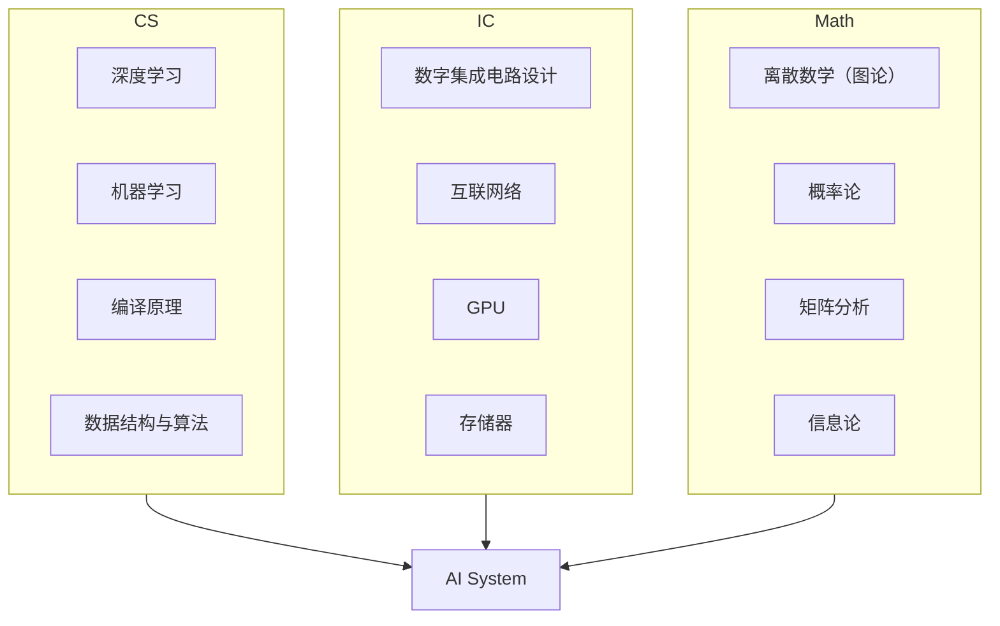

---
hide:
  - navigation
  - toc
---
<!-- ══════════════ NIGHT MODE HERO (slate only) ══════════════ -->

ECE 自学指南 · 复旦大学

<h1 class="df-title">让知识 回归连续</h1>

从器件工艺到量子芯片，15 个前沿科研方向，200+ 门精选课程

<a href="科研方向/" class="df-btn">探索科研方向 →</a>
<a href="学习地图/" class="df-ghost">学习地图</a>

<!-- ══════════════ DAY MODE HERO (default only) ══════════════ -->

ECE 自学指南 · 复旦大学

<h1 class="df-lhl">让知识 回归连续</h1>

从器件工艺到量子芯片——复旦大学微电子专业自学指南，覆盖 15 个前沿科研方向与 200 余门精选课程。

<a href="科研方向/" class="df-lbp">探索科研方向 →</a>
<a href="学习地图/" class="df-lbg-btn">学习地图</a>

<nav class="df-lnav">

<a href="工程工具/Git/" class="df-lnc">01工程工具Git · Linux · Docker</a>
<a href="专题社区/" class="df-lnc">02专题社区一生一芯 · 具身智能</a>
<a href="https://github.com/Crys-Chen/Fudan-ME" class="df-lnc" target="_blank" rel="noopener">03参与建设GitHub 开源共建</a>
<a href="#" class="df-lnc">04课堂笔记学习记录与分享</a>

</nav>

<!-- ══════════════ NIGHT MODE CARDS (slate only) ══════════════ -->

<a href="科研方向/" class="df-card">
🔬→
<h3>科研方向</h3>
15 个前沿方向，器件·电路·架构·应用
</a>
<a href="学习地图/数学/" class="df-card">
📚→
<h3>学习地图</h3>
200+ 精选课程，国内外顶级高校收录
</a>
<a href="学习地图/" class="df-card">
🗺️→
<h3>学习地图</h3>
跨学科知识地图，明确路径与依赖
</a>
<a href="工程工具/Git/" class="df-card">
🛠️→
<h3>工程工具</h3>
Git · Linux · LaTeX · Docker 速通
</a>

## 前言

### 微电子之殇

微电子科学与工程（Microelectronics, ME），或称集成电路（Integrated Circuits, IC），是是一门理工结合、多学科交叉的专业，它横跨材料、物理、化学、计算机等多领域知识，是工科中难度系数最高的专业之一。在大多数欧美高校，它一直从属于Electrical Engineering (EE) 或Electrical and Computer Engineering (ECE)，属于二级学科，从未独立。而近十年，内地各高校为响应国家号召，相继将其升级为一级学科，对本科生开放。

本科上来就学习这种交叉学科的一大问题是，什么都学，但什么都不精。诚然，本科应该追求广度而非深度。然而要想达到"广度"，必须要有一个知识谱系张成网状的培养方案。可惜现实中微电子培养方案里的各门课程相距过远，导致每门课都是一个孤立的结点，没法连成一张网，给人一种"**碎而不广**"的感觉。以复旦大学微电子专业为例，我们只从计算机那摘取了《程序设计》，这门课和集成电路主干之间隔了《操作系统》、《编译原理》两门课。此外，现有培养方案往往只涉及各个领域的几门高阶课程，对基础课程缺乏提炼，导致这些课程就像**无源之水**，学生只能对其囫囵吞枣。以《集成电路工艺》为例，其涉及到的化学知识非常多，可惜化学这门学科，我们在高考后就再无涉猎，导致上课像听天书。

问题就在这里——如果学生无法根据培养方案搭建自己的知识体系，广度便无从谈起。由于集成电路包罗万象，把所有知识都啃下来不可能也没必要。我认为比起知识的覆盖率，我们首先要保证的是知识的连续性。我们似乎并不需要既懂半导体物理又懂编译原理的人（这样的人能干嘛？），我们真正需要的是懂半导体物理+半导体器件+集成电路工艺的人，或懂数据结构与算法+编译原理+计算机体系结构的人。前者可以做器件，后者可以研究芯片架构。选择某个细分方向以点带面、开拓深挖，其他方向但当涉猎，才能既建立牢固的知识体系，又追求本科生的广度。

### 让知识回归连续

如何追求知识的连续性呢？我们在此以**AI算法与系统**为例，这一行所需要的知识体系如下：

这个方向是计算机+集成电路交叉的一个典型，目前没有一个本科专业能囊括该方向所需要的基础知识。因此，对这个方向感兴趣的同学，如果本科是集成电路，应该自行补充AI相关知识；如果本科学计算机，应该自行补充数字电路相关知识。我们之后会列出各个细分方向所需要的基础课程，高年级的同学可以以此为参考，查缺补漏；低年级的同学也可以根据自己的兴趣，在之后的选课中有所侧重。在网课如此兴盛的当下，什么课程都可以自学。尽管内地几百所高校凑不出一门能听的线性代数课程，但MIT早就将大牛Gilbert Strang的高质量课程公开，自助者天助之。

### 让信息回归透明

刚入学时，有一位学长对我说：“微电子，本科打基础，硕士算入门，博士只能说略懂。”这一专业本科毕业的工作机会很少，很多人会选择硕士起步。放眼其他专业，除了基础学科以外，知识门槛能和微电子匹敌的恐怕只有医学。现在有很多同学在本科时会提前进实验室干活，看自己到底是否适合做科研，这是很好的。本科生做科研，容易“只见树木，不见森林”。哐哐一顿猛干，不知道自己在干嘛，也没干出来什么东西。

微电子相关的科研方向，我自己梳理了一下，一共有17个。在过去几年广泛的探索与阅读中，我或门外汉，或局内人地，建立起了对这17个科研方向的初步了解，有了一个较为全局的视角。比起”教学相长“，我更喜欢通过写作来梳理自己的认知。临近毕业，我总算有空用vibe coding的方式，将我零零碎碎的笔记一次性分享出来。我个人觉得其中最精华的，当属”计算的本质“这一篇，这是对集成电路17个相关科研方向提纲挈领式的综述。此外，同学们若想了解某一个细分领域，也可以直接点开它的页面，看看该方向”在研究什么“，”适合什么样的同学“，有哪些课题组，对口有哪些企业。希望对大家有所帮助。

其实，现在AI如此发达，大家直接向AI提问也可以。但我自信我的文章，无论是信息密度还是可读性，都不是当下的AI的写作水平可以碰瓷的。当然，大家也可以让AI扫一遍这个网站，把我提供的信息揉碎了消化。

这个网站也不止微电子同学可以用，计算机也可以。一些经管的同学，无论是创业还是做行研，也可以通过这个网站了解我们硬件行业的信息。

### 从ME到ECE

非新工科专业的同学，可以看着玩，看不懂很正常。我的文字功底，还没法厉害到让非工科专业的人看懂。

由于本仓库继承自[CS自学指南](https://github.com/pkuflyingpig/cs-self-learning/)，其原有关于CS的资源基本保留，因此叫"IC/ME自学指南"并不合适。思量再三，决定叫"ECE自学指南"。ECE全称是Electrical Computer Engineering，指电子与计算机工程，是一门软硬兼修的专业。计算机（Computer Science, CS）的同学，如若想做架构和系统研究，没有硬件知识也是寸步难行。因此，本仓库也面向有志于从事架构研究的CS同学，为其提供硬件相关的自学资源，也欢迎CS的同学参与贡献。

