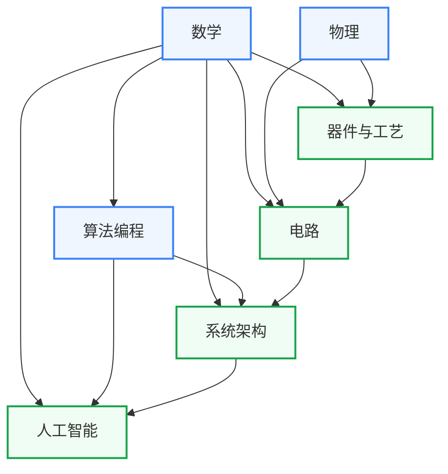

# 学习地图

学习地图从培养方案出发，按知识领域分为七个板块，每个板块给出可自学的课程直链。与「科研方向」配合使用。科研方向页说明做某个方向需要哪些知识，这里给出对应的课程和学习顺序。

如你所见，现在这份学习地图里面，以复旦的课程为主，而且还有很多课程jin

一些复旦校内课程没有上网，只是为了更好服务复旦的同学而挂上来，作为一个评教和分享笔记的页面。请各位同学尊重老师的知识产权，如若老师没有主动分享课程资源到公网，那大家在分享前请先征得老师同意。至于往年试题......还是私下流传吧。

导航中标注「征集中」的槽位虚位以待，欢迎通过[参与建设](../参与建设.md)推荐你验证过的好课。

## 七大板块

| 板块 | 定位 |
|---|---|
| [数学](数学/index.md) | 微积分到凸优化，信号处理、机器学习、EDA算法的数学基础 |
| [物理](物理/index.md) | 量子力学到半导体物理，器件研究和模拟电路的物理前置 |
| [器件与工艺](器件与工艺/index.md) | 晶体管原理与IC制造工艺，IC设计物理约束的来源 |
| [电路](电路/index.md) | 数字设计、模拟与射频、信号处理三条路线，从逻辑门到射频集成电路 |
| [系统架构](系统架构/index.md) | 体系结构、操作系统、编译原理，AI系统和处理器设计研究的软件侧知识 |
| [算法编程](算法编程/index.md) | 程序设计、数据结构与算法，EDA工具开发和AI框架的编程基础 |
| [人工智能](人工智能/index.md) | 机器学习到大模型系统，AI算法与AI芯片协同设计的知识库 |

复旦课表参考：[2021年课程表](复旦微电子课程表.md) · [2026年课程表](复旦集成电路课程表.md)

## 板块间的依赖关系

箭头从前置板块指向后置板块，表示学习后者通常需要先有前者的基础。

数学是除物理以外所有板块的共同基础。物理→器件与工艺→电路构成器件和模拟方向的纵向路径。算法编程→系统架构→人工智能构成数字和AI方向的纵向路径。

## 芯片生产流程

下图展示从 RTL 设计到晶圆量产的完整链条，供理解各板块知识在工业流程中的位置参考。

