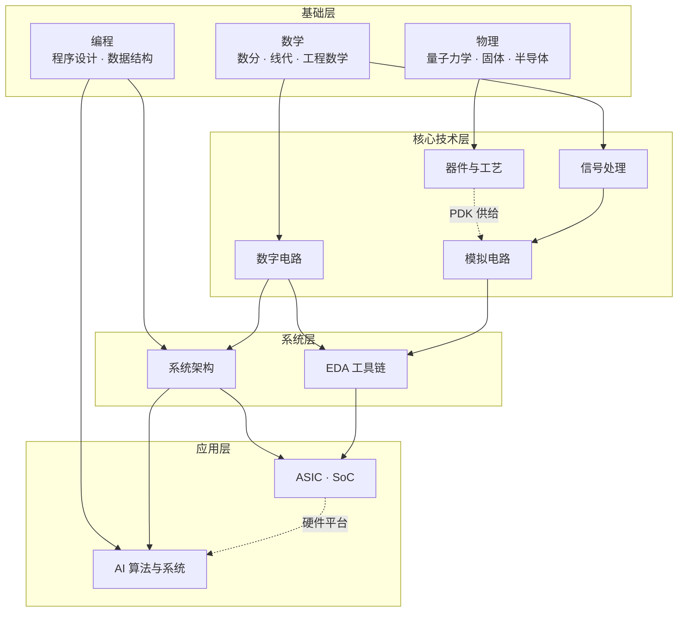
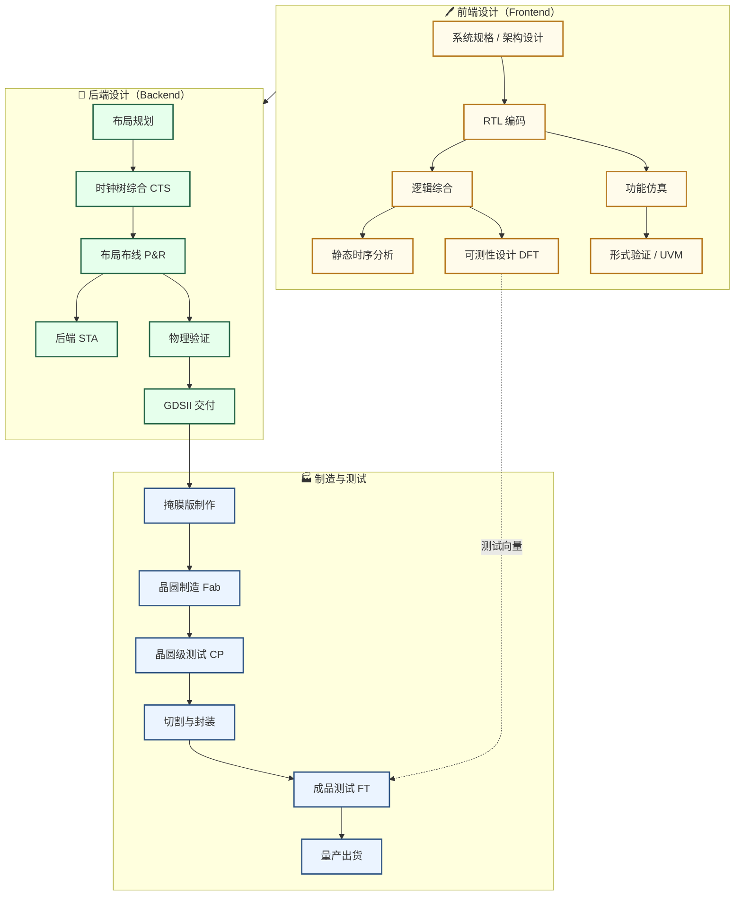

---
hide:
  - toc
---

# 学习地图

学习地图是本站的"自底向上"入口。从培养方案出发把知识连成网，每个板块给出可自学的课程直链。与「科研方向」配合使用：那边告诉你某方向要爬哪几根树枝，这边告诉你每根树枝怎么爬。

## 七大板块

- [数学](数学/index.md) · [物理](物理/index.md) · [电路](电路/index.md) · [器件与工艺](器件与工艺/index.md)
- [算法编程](算法编程/index.md) · [系统架构](系统架构/index.md) · [人工智能](人工智能/index.md)

导航中标注「征集中」的槽位虚位以待，欢迎通过[参与建设](../参与建设.md)推荐你验证过的好课。

## 复旦课表参考

- [2021年课程表](复旦微电子课程表.md) · [2026年课程表](复旦集成电路课程表.md)

## 宏观全局视图

以复旦微电子学院培养方案为核心坐标，覆盖 IC 工程师所需的完整知识体系。可点击节点折叠/展开，滚轮缩放，拖拽平移。详细前后依赖关系见下方各分领域详图。

> **学完知识体系想动手做项目?** 看 [专题社区](../专题社区/index.md)——收录"一生一芯"、"Embodied-AI-Guide"等带完整训练路径的综合学习生态。

<div class="markmap">
<script type="text/template">
---
markmap:
  maxWidth: 300
  initialExpandLevel: 2
  colorFreezeLevel: 3
  duration: 400
---
# IC / ECE 知识体系
## 🏛️ 基础层
### 数学分析
### 线性代数
### 工程数学
### 量子力学
### 固体物理
### 半导体物理
### 程序设计基础
### 数据结构与算法
## 🔬 器件与工艺
### 半导体器件原理
### IC工艺原理
### 先进工艺技术
## 🔢 数字电路
### 数字逻辑基础
### 硬件描述语言
### 数字EDA工具
### FPGA系统设计
### 数字集成电路设计原理
## 〰️ 模拟电路
### 电路分析基础
### 模拟电子线路
### 模拟EDA
### 模拟集成电路设计
### 高频电子线路
### 射频集成电路
## 📡 信号处理
### 信号与系统
### MATLAB
### 数字信号处理
### ADC / DAC
## 🖥️ 系统架构
### 计算机组成原理
### 操作系统
## 🚀 系统集成与应用
### ASIC设计
### 嵌入式SoC
### EDA工具开发
## 🛠️ 工程工具
### 通用：Git · Vim · LaTeX · Docker · Linux Shell
### EE 专用：MATLAB · LTspice · KiCad · ModelSim · Cadence · Vivado · Gem5 · GPGPU-Sim
### 构建：GNU Make · CMake · Scoop · Emacs
</script>
</div>

## 跨领域依赖图



---

## 分领域详图

=== "器件与工艺"

    ```mermaid
    graph TB
        QM["量子力学"]
        SSP["固体物理"]
        SCP["半导体物理"]
        DEV["半导体器件原理"]
        PROC["IC工艺原理"]
        ADPROC["先进工艺技术"]
        PDK["工艺设计套件 PDK"]
        
        QM --> SSP --> SCP --> DEV --> PROC --> ADPROC
        PROC --> PDK
        ADPROC --> PDK
        PDK -.->|供给| 电路设计
        
        classDef device fill:#FDE8D8,stroke:#C0530A,stroke-width:2px
        class QM,SSP,SCP,DEV,PROC,ADPROC,PDK device
    ```

=== "数字 IC"

    ```mermaid
    graph TB
        DE["数字逻辑基础"]
        HDLv["Verilog HDL"]
        HDLc["Chisel / HLS"]
        DEDA["数字EDA工具"]
        FPGA["FPGA 设计"]
        DIGIC["数字集成电路设计原理"]
        DFT["可测性设计 DFT"]
        ASICFE["ASIC 前端"]
        ASICBE["ASIC 后端"]
        UVM["芯片验证"]
        
        DE --> HDLv
        DE --> HDLc
        HDLv --> DEDA
        HDLv --> DIGIC
        DEDA --> FPGA
        HDLv --> FPGA
        DIGIC --> FPGA
        DIGIC --> ASICFE
        HDLv --> ASICFE
        HDLv --> UVM
        ASICFE --> DFT
        ASICFE --> ASICBE
        DFT --> ASICBE

        classDef digital fill:#FFFBEB,stroke:#B7791F,stroke-width:2px
        class DE,HDLv,HDLc,DEDA,FPGA,DIGIC,DFT,ASICFE,ASICBE,UVM digital
    ```

=== "模拟 IC"

    ```mermaid
    graph TB
        CB["电路分析基础"]
        AE["模拟电子线路"]
        AEDA["模拟EDA"]
        ANIC["模拟集成电路设计"]
        BGR["基准与偏置电路"]
        HF["高频电子线路"]
        RF["射频集成电路"]
        ADDA["ADC / DAC"]
        
        CB --> AE --> ANIC
        AE --> AEDA
        AEDA --> ANIC
        ANIC --> BGR
        ANIC --> HF --> RF
        ANIC --> ADDA
        
        classDef analog fill:#E6FFEC,stroke:#276749,stroke-width:2px
        class CB,AE,AEDA,ANIC,BGR,HF,RF,ADDA analog
    ```

=== "信号处理"

    ```mermaid
    graph TB
        EM["工程数学"]
        SS["信号与系统"]
        MATLAB["MATLAB"]
        DSP["数字信号处理"]
        ADDA["ADC / DAC"]
        IT["信息论"]
        COM["数字通信"]
        
        EM --> SS
        SS --> DSP
        MATLAB --> DSP
        DSP --> ADDA
        IT -.->|可选深化| DSP
        DSP --> COM
        ADDA --> COM
        
        classDef signal fill:#EBF4FF,stroke:#2C5282,stroke-width:2px
        class EM,SS,MATLAB,DSP,ADDA,IT,COM signal
    ```

=== "系统架构"

    ```mermaid
    graph TB
        PROG["程序设计基础"]
        DS["数据结构与算法"]
        ARCH["计算机组成原理"]
        OS["操作系统"]
        EMB["嵌入式开发"]
        SOC["嵌入式 SoC 设计"]
        RISC["RISC-V 处理器实现"]
        
        PROG --> DS --> ARCH --> OS
        ARCH --> EMB --> SOC
        ARCH --> RISC
        OS -.->|软件栈| SOC
        RISC -.->|硬件实现| SOC
        
        classDef system fill:#F3E8FF,stroke:#553C9A,stroke-width:2px
        class PROG,DS,ARCH,OS,EMB,SOC,RISC system
    ```

---

## 芯片完整生产流程



