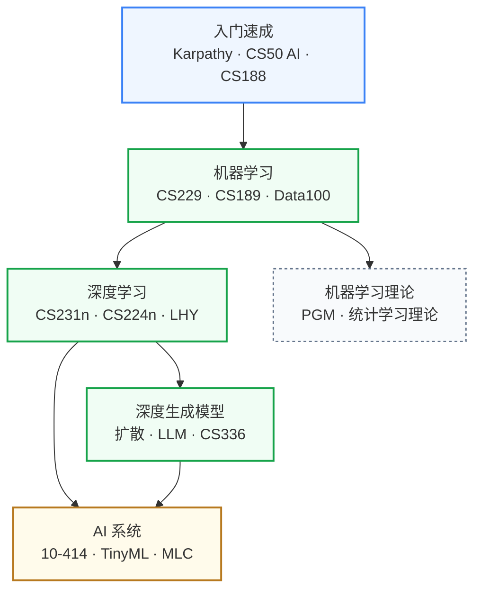

# 人工智能

从机器学习的数学基础到大语言模型的系统实现，这个板块覆盖 AI 算法与系统的完整知识链。对做硬件研究的人来说，机器学习基础和 AI 系统（ML Systems）是与芯片设计交叉最深的两个子方向。

## 知识谱系

水平方向是"算法层":入门 → ML 基础 → DL 主流 → 生成模型前沿。**AI 系统**是垂直一层,讲怎么把这些模型高效跑起来——这一层是芯片研究者最该投入的。

---

**[入门速成](入门速成/)** — Neural Networks: Zero to Hero、CS50 AI、CS188；几天之内建立 AI 的基本图景，适合从零开始。

**[机器学习](机器学习/)** — CS229、CS189、Data100；监督学习、优化、泛化理论；做 AI 硬件协同设计的数学基础。

**[AI 系统](AI系统/)** — CMU 10-414、TinyML、MLC（mlc.ai）；研究如何把 AI 模型高效部署到各类硬件上，与处理器架构、存算一体方向直接交叉。

**[深度学习](深度学习/)** — CS231n、CS224n、李宏毅机器学习；神经网络的主流模型（CNN、Transformer）及训练技术。

**[深度生成模型](深度生成模型/)** — 扩散模型、LLM 训练与推理；了解 AI 前沿模型的工作原理与计算需求。

**[机器学习理论](机器学习理论/)** — 概率图模型、统计学习理论；理论方向的进一步深入。

## 对科研方向的作用

| 对应科研方向 | 推荐子板块 | 为什么 |
|---|---|---|
| [AI 算法与系统](../../科研方向/AI算法与系统.md) | AI 系统 + 深度学习 + 深度生成模型 | 这是本方向的本体——量化、推理优化、LLM serving 都来自这里 |
| [处理器架构与编译系统](../../科研方向/处理器架构与编译系统.md) | AI 系统 (TVM/MLC) | AI 编译器是当前体系结构最热的研究分支之一 |
| [存算一体与近存计算](../../科研方向/存算一体与近存计算.md) | 入门速成 + AI 系统 | 至少要看懂 attention、MAC 在做什么,才能设计 PIM 加速器 |
| [类脑芯片](../../科研方向/类脑芯片.md) | 机器学习 + 深度学习 | SNN 与 ANN 共享反向传播框架 |
| [具身智能](../../科研方向/具身智能.md) | 深度学习 (CS285 强化学习) + 深度生成模型 | 机器人控制策略是 RL + LLM Agent 的混合 |
| [EDA 与设计自动化](../../科研方向/EDA与设计自动化.md) | 机器学习 + 深度学习 | ML for EDA 是该方向的子领域,GNN/RL 用于布局布线 |

> **写给硬件方向的同学**: 不必把所有算法原理都吃透,但**至少要能看懂 PyTorch 一段 forward 代码,以及一个 transformer block 的计算量分布**——这是和 AI 同事沟通的最低门槛。AI 系统板块比深度学习板块对你更直接。
