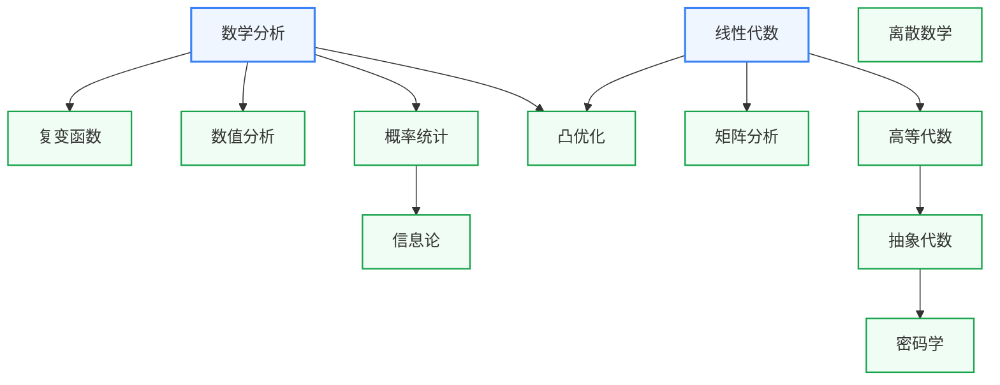

# 数学

数学是除物理以外所有板块的共同基础。信号处理依赖复变函数，机器学习依赖概率统计和矩阵分析，EDA 算法依赖离散数学和数值分析。本板块分两层，数学基础是本科前两年的必修内容，数学进阶按需选学。

## 课程关系

箭头从前置课程指向后置课程。数学分析和线性代数是图中所有进阶课程的公共起点。

进阶课程分三条线。分析线从数学分析延伸出复变函数、数值分析、概率统计，概率统计再支撑信息论。代数线从线性代数延伸出矩阵分析和高等代数，高等代数经抽象代数通向密码学。凸优化同时依赖数学分析和线性代数。离散数学不依赖分析与代数，可以直接学。

## 子板块

### 数学基础

- **数学分析** — 极限、微积分、级数。复旦数学分析（MATH120016/17）与 MIT 公开课可互为补充
- **线性代数** — 向量空间、线性变换、矩阵理论。MIT 18.06（Strang）是公认的最佳入门

### 数学进阶

- **入门速成** — CS70、MIT 6.042J 这类离散数学与概率混合课，为转入 CS 类课程快速补数学语言
- **概率统计** — 机器学习和随机信号处理的基础。Harvard Stat 110 讲得最透
- **矩阵分析** — 矩阵求导、SVD、最小二乘。深度学习反向传播的数学语言，普通线性代数课不覆盖
- **高等代数** — 线性代数的理论深化版，为抽象代数做准备
- **抽象代数** — 群环域。密码学的代数基础
- **密码学** — 加密、签名、零知识证明。硬件安全方向的理论基础
- **信息论** — 熵、信道容量、数据压缩。通信系统和机器学习理论都建立在它之上
- **离散数学** — 图论、逻辑、组合。EDA 算法和数据结构的理论基础
- **数值分析** — 非线性方程、数值积分、迭代法。SPICE 仿真器和 TCAD 求解器的算法内核
- **凸优化** — 对偶理论、KKT 条件。机器学习训练和 EDA 布局布线的优化框架
- **复变函数** — 留数、共形映射。信号系统频域分析和滤波器设计的数学工具
- **数理方程**（征集中）

## 对科研方向的作用

| 数学子分支 | 主要服务的科研方向 |
|---|---|
| 数学分析 + 线性代数 | 所有方向(基础) |
| 复变函数 | [模拟与混合信号 IC](../../科研方向/模拟与混合信号IC.md)、[射频与毫米波 IC](../../科研方向/射频与毫米波IC.md) |
| 概率统计 + 信息论 | [AI 算法与系统](../../科研方向/AI算法与系统.md)、[硬件安全与可信计算](../../科研方向/硬件安全与可信计算.md) |
| 矩阵分析 + 凸优化 | [AI 算法与系统](../../科研方向/AI算法与系统.md)、[EDA 与设计自动化](../../科研方向/EDA与设计自动化.md)(布局布线优化) |
| 离散数学 + 图论 | [EDA 与设计自动化](../../科研方向/EDA与设计自动化.md)、[处理器架构与编译系统](../../科研方向/处理器架构与编译系统.md) |
| 数值分析 | 所有需要仿真的方向(EDA/电磁/电路/MEMS) |
| 抽象代数 + 密码学 | [硬件安全与可信计算](../../科研方向/硬件安全与可信计算.md) |

## 征集中的槽位

以下子领域已规划进知识框架，但还没有经过验证的课程推荐。欢迎通过[参与建设](../../参与建设.md)补全：

- [数理方程](数学进阶/数理方程/index.md)（征集中）
