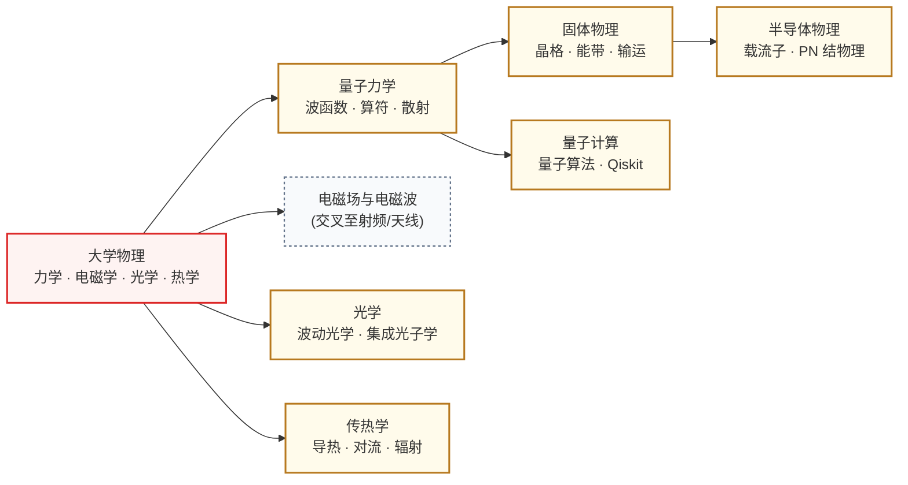

# 物理

物理是器件与工艺、模拟电路两条路线的前置。半导体器件的工作原理建立在量子力学和固体物理之上，跳过这两层直接学半导体物理会非常吃力。具身智能的运动控制和传感、量子计算的算法与硬件，同样依赖对应的物理基础。

## 课程关系

箭头从前置课程指向后置课程。

主链是大学物理 → 量子力学 → 固体物理 → 半导体物理，这条链是器件和工艺方向的硬核前置，不可跳步。其余分支按方向选学。电磁场理论是射频、天线、光电子方向的另一条主线。光学是硅光、光互连方向的物理基础。传热学服务先进封装和功率半导体方向，芯片功率密度逼近极限后，散热已经和性能、功耗并列为一阶设计约束。量子计算以量子力学为前置，覆盖量子算法与 Qiskit 实操。

---

**[大学物理](大学物理/)** — 力学、电磁学、光学、热力学；高中物理的"加强版",所有理工科学生的共同基础。

**[量子力学](量子力学/)** — 薛定谔方程、本征值问题、散射理论；理解半导体能带和量子计算的入口。

**量子计算** — 量子算法（Grover/Shor）与 Qiskit 实操；课程见导航栏量子计算分组。

**[固体物理](固体物理/)** — 晶格振动、电子能带、声子；衔接量子力学与半导体物理的桥梁。

**[半导体物理](半导体物理/)** — 载流子统计、PN 结、欧姆接触；所有半导体器件设计的物理基础。

**[光学](光学/)** — 波动光学、光电子器件、集成光子学;面向硅光集成、光互连、光计算方向的精选课程链。

**[传热学](传热学/)** — 导热、对流、辐射;面向先进封装、功率半导体方向——做芯片散热/热-电协同设计的物理基础。

**[其他](其他/)** — 物理实验、特殊主题。

## 对科研方向的作用

| 物理子分支 | 主要服务的科研方向 |
|---|---|
| 大学物理 + 电磁学 | [射频与毫米波 IC](../../科研方向/射频与毫米波IC.md)、[光电子与硅光集成](../../科研方向/光电子与硅光集成.md) |
| 量子力学 | [量子计算与量子芯片](../../科研方向/量子计算与量子芯片.md)、[半导体器件与先进工艺](../../科研方向/半导体器件与先进工艺.md) |
| 固体物理 | [半导体器件与先进工艺](../../科研方向/半导体器件与先进工艺.md)、[功率半导体与宽禁带器件](../../科研方向/功率半导体与宽禁带器件.md) |
| 半导体物理 | 所有[器件与工艺](../器件与工艺/index.md)子方向的本体前置 |
| 力学(运动学/动力学) | [具身智能](../../科研方向/具身智能.md)(机器人运动控制)、[MEMS 与微纳传感器](../../科研方向/MEMS与微纳传感器.md) |
| 光学(几何光学/波动光学) | [光电子与硅光集成](../../科研方向/光电子与硅光集成.md) |
| 热力学 | [先进封装与异构集成](../../科研方向/先进封装与异构集成.md)(热-电协同设计)、[功率半导体与宽禁带器件](../../科研方向/功率半导体与宽禁带器件.md) |

## 选修建议

按方向反推:
- **做器件/工艺**: 量子力学 → 固体物理 → 半导体物理(三步走,不可跳)
- **做模拟/射频 IC**: 大物中的电磁学要扎实,半导体物理略懂即可
- **做数字 IC / 体系结构**: 大物即可,半导体物理只为读懂工艺参数
- **做量子计算**: 量子力学要学到能用 Dirac notation 计算
- **做具身智能**: 力学 + 控制理论(交叉至[算法编程](../算法编程/index.md))

## 征集中的槽位

以下子领域已规划进知识框架，但还没有经过验证的课程推荐。欢迎熟悉这些领域的同学通过[参与建设](../../参与建设.md)补全：

- [电磁场与微波](电磁场与微波/index.md)（征集中）
- [热力学与统计物理](热力学与统计物理/index.md)（征集中）
