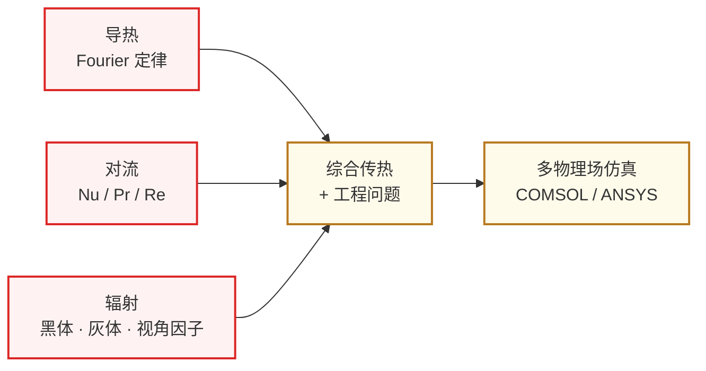

# 传热学

传热学(Heat Transfer)研究**热量在材料中的传递规律**——导热、对流、辐射三种方式。对 ECE 学生来说,它服务于两个具体方向:

- **[先进封装与异构集成](../../../科研方向/先进封装与异构集成.md)** — 2.5D/3D 集成芯片的热流分析、热阻设计、热岛问题
- **[功率半导体与宽禁带器件](../../../科研方向/功率半导体与宽禁带器件.md)** — SiC/GaN 功率器件的散热设计、热-电协同仿真

随着芯片功率密度逼近物理极限,**"热"已经成为继性能、功耗后的第三个一阶设计约束**。Chiplet/HBM 堆叠之后,芯片热设计与电气设计的耦合越来越深,做这两个方向的同学绕不开传热学。

## 知识谱系

主链 **三种传热模式 → 综合工程问题 → 多物理场仿真**。前面是物理基础,后面是 IC 工程应用。

## 推荐课程

### 英文 / 海外名校

- **[MIT 2.051: Introduction to Heat Transfer](MIT2.051.md)** ★ 入门首选 — MIT 机械系本科入门课,Kripa Varanasi 主讲,OCW 完整公开;半学期课程,适合 ECE 学生作为通识
- **[MIT 2.51: Intermediate Heat and Mass Transfer](MIT2.51.md)** — MIT 高级本科课,深入分析与建模,适合做研究方向后深化

### 中文 / 国内

- **[西安交大 陶文铨 传热学](XJTU_taowq.md)** ★ 中文首选 — 陶文铨院士主讲,**国内中文传热学公认最高水平**;B 站+MOOC 完整公开
- **[上海交大 传热学](SJTU_heat_transfer.md)** — 团队主讲,与杨世铭/陶文铨经典教材配套

### 工具

- **COMSOL Multiphysics** — 多物理场耦合仿真业界标准,**做封装/功率方向必学**
- **ANSYS Icepak** — 电子封装专用热仿真工具
- **OpenFOAM** — 开源 CFD,适合学术研究

## 学习路径建议

**只为通识了解**: MIT 2.051 半学期足矣(~20 学时),建立"导热/对流/辐射"心智模型

**做先进封装研究**:
1. MIT 2.051 或 西安交大陶文铨(系统打基础)
2. COMSOL 或 ANSYS Icepak 实操几个芯片散热案例
3. 读 ECTC / IEEE Transactions on CPMT 上的热分析论文

**做功率半导体研究**:
1. 先看 [功率半导体器件](../../器件与工艺/半导体器件/index.md) 基础
2. 再补传热学(MIT 2.051 或西交版)
3. 实战 SiC/GaN 器件热-电耦合仿真

## 对应的科研方向

- [先进封装与异构集成](../../../科研方向/先进封装与异构集成.md) — 热阻分析、热-电协同设计、Chiplet 散热
- [功率半导体与宽禁带器件](../../../科研方向/功率半导体与宽禁带器件.md) — 高压器件的热失控分析、散热结构设计
- [MEMS 与微纳传感器](../../../科研方向/MEMS与微纳传感器.md) — 热传感器、热致动器的设计也用得到

> 对纯数字 IC / 模拟 IC 方向的同学:传热学不是必需,**作为通识了解 10-15 学时即可**——主要懂"芯片为什么会热、设计时怎么留 margin"这些工程直觉。
