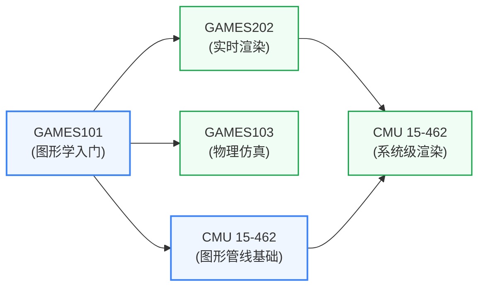

# 计算机图形学

让计算机生成、渲染、操控视觉图像——从光线追踪到实时渲染、从骨骼动画到物理仿真。在 ECE 研究里，计算机图形学和 GPU 架构、AI 视觉、具身智能等方向有最直接的交叉。

## 知识谱系

---

**入门首选: [GAMES101](GAMES101.md)** — 闫令琪老师的中文公开课,从光栅化、光线追踪、着色到几何处理逐步覆盖,作业逐步搭出一个简易渲染器,**国内中文图形学入门第一推荐**。

**进阶: [GAMES202](GAMES202.md) / [GAMES103](GAMES103.md)** — 实时渲染(光照、阴影、PBR)与物理仿真(布料、流体、刚体);依然是闫令琪团队主讲。

**英文经典: [CMU 15-462](15462.md)** — 系统化讲解图形管线,含一个完整的渲染器项目,适合想做研究的同学。

**国内补充: [USTC 计算机图形学](USTC ComputerGraphics.md)** — 中科大刘利刚老师的版本,数学推导更细。

## 对科研方向的作用

| 对应科研方向 | 为什么 |
|---|---|
| [处理器架构与编译系统](../../../科研方向/处理器架构与编译系统.md) | GPU 是图形学的硬件载体——研究 GPU 架构必须懂 graphics pipeline、shader、纹理采样 |
| [AI 算法与系统](../../../科研方向/AI算法与系统.md) | NeRF、3D Gaussian Splatting、扩散模型生成图像/视频——计算机视觉与图形学的交叉是 AI 的前沿 |
| [具身智能](../../../科研方向/具身智能.md) | 机器人仿真平台(Isaac Sim、MuJoCo、Gazebo)的核心是物理引擎 + 渲染;GAMES103 的物理仿真直接相关 |
| [可重构计算与FPGA](../../../科研方向/可重构计算与FPGA.md) | 实时光线追踪硬件加速器(NVIDIA RT Core、AMD Ray Accelerator)是 FPGA 研究的热点 |

## 对硬件研究者的特别提示

- 如果你不打算做 GPU/CV 研究,**GAMES101 + 一两个简单作业**就足够建立"图形管线"心智模型;不必通学整个序列
- 想深入 GPU 架构(对应 [处理器架构与编译系统](../../../科研方向/处理器架构与编译系统.md)),建议:GAMES101 → CMU 15-462 → 自己搭一个软光栅化 demo
- 想做 NeRF/3D Gaussian 等 AI × 图形交叉,补完 [深度学习](../../人工智能/深度学习/index.md) 后再接 GAMES101 / CV 方向论文
