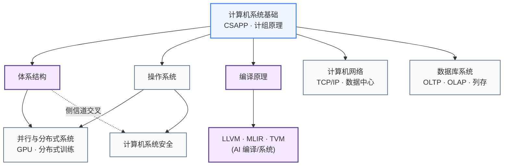

# 系统架构

从计算机如何执行一条指令，到分布式系统如何协调数千台机器，这个板块覆盖"软件如何在硬件上运行"这条完整的知识链。对做硬件研究的人来说，体系结构和编译原理是最直接相关的两个子方向。

## 知识谱系

---

**[计算机系统基础](入门速成/)** — 计算机组成原理、CSAPP；从头建立"程序在硬件上怎么跑"的系统性图景，是所有后续内容的前置。

**[体系结构](体系结构/)** — 处理器微架构、流水线、缓存层次、内存系统；研究处理器和加速器设计的核心知识。

**[编译原理](编译原理/)** — 词法分析、中间表示、代码优化；理解编译器如何把高级语言映射到硬件指令，是研究 LLVM/MLIR/TVM 的前置基础。

**[并行与分布式系统](并行与分布式系统/)** — GPU 编程模型、分布式训练、一致性协议；做 AI 系统和大规模计算的必备背景。

**[计算机系统安全](系统安全/)** — 系统漏洞、侧信道攻击的软件层理解；与硬件安全研究方向有直接交叉。

**[操作系统](操作系统/)** / **[计算机网络](计算机网络/)** / **[数据库系统](数据库系统/)** — 完整系统栈的其余层次，按需选修。

## 对科研方向的作用

| 对应科研方向 | 推荐子板块 | 为什么 |
|---|---|---|
| [处理器架构与编译系统](../../科研方向/处理器架构与编译系统.md) | 体系结构 + 编译原理 + 计算机系统基础 | 这是该方向的本体课程链——ISCA/MICRO/CGO/PLDI 论文的全部前置 |
| [可重构计算与FPGA](../../科研方向/可重构计算与FPGA.md) | 体系结构 + 编译原理 | HLS、Overlay、FPGA 软核都依赖这两个领域 |
| [存算一体与近存计算](../../科研方向/存算一体与近存计算.md) | 体系结构 (内存层次) | 近存计算的根问题是 memory wall——CSAPP/CS61C 的内存章节 |
| [AI 算法与系统](../../科研方向/AI算法与系统.md) | 并行与分布式 + 编译原理 | vLLM/Megatron 内部就是分布式系统 + 编译优化 |
| [硬件安全与可信计算](../../科研方向/硬件安全与可信计算.md) | 计算机系统安全 + 体系结构 | 侧信道攻击需要同时懂软件漏洞模型和硬件微架构 |
| [EDA 与设计自动化](../../科研方向/EDA与设计自动化.md) | 编译原理 | 数字 EDA 综合本质是编译,只是目标语言换成硬件 |

> 做硬件研究的同学,推荐顺序:**计算机系统基础 → 体系结构 → 编译原理**——这三门是与芯片设计交叉最深的子板块,操作系统/网络/数据库选修即可。
