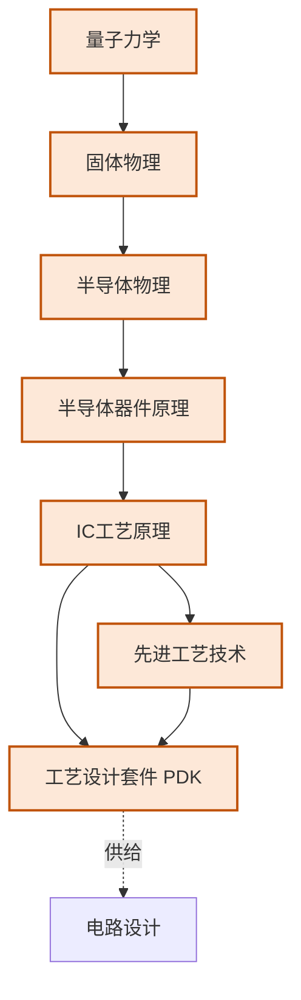
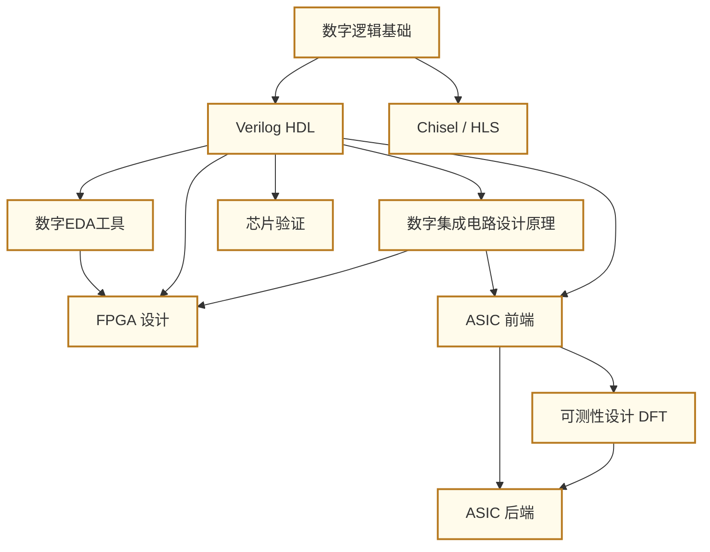
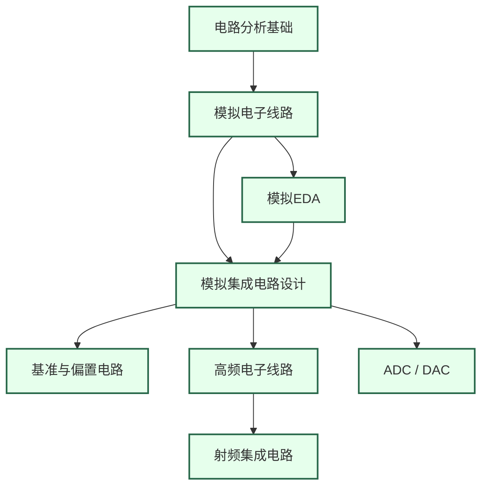
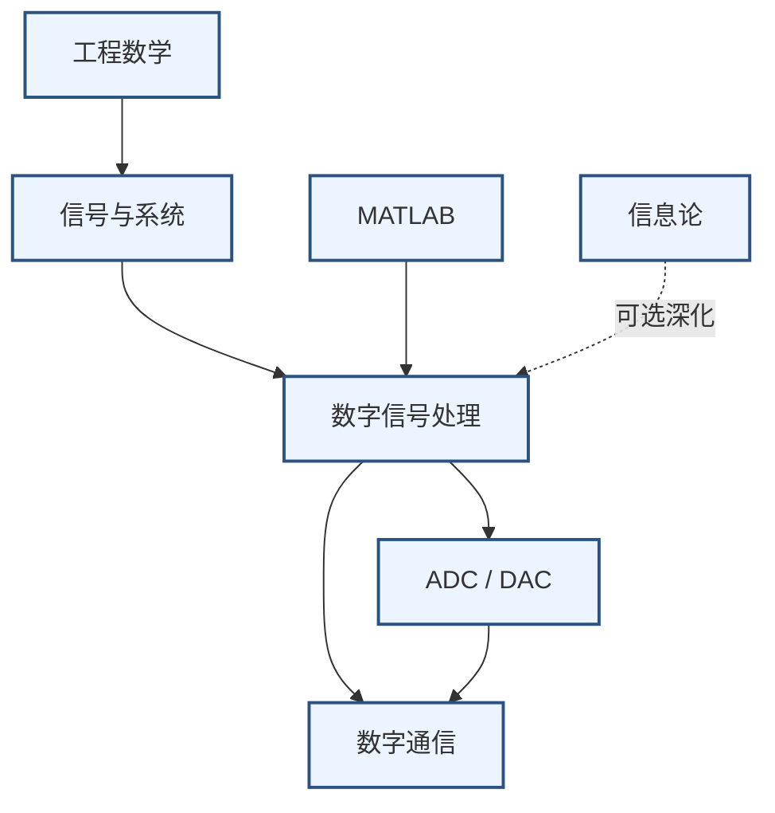
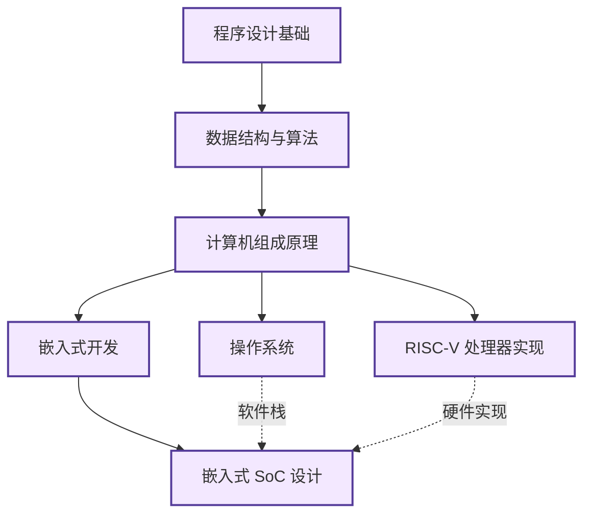
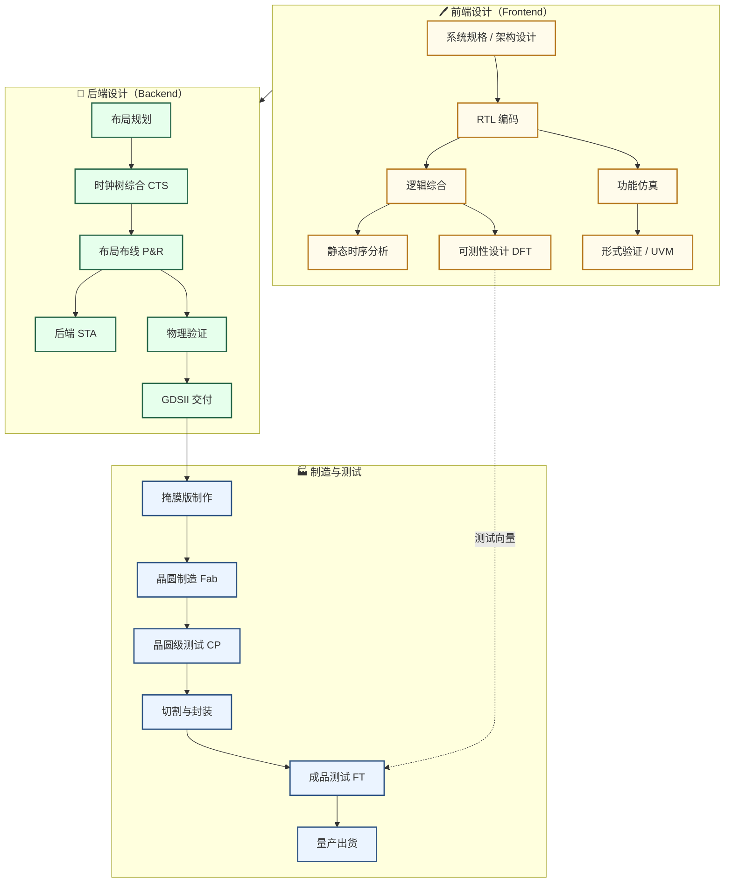

---
hide:
  - navigation
  - toc
---

# 知识谱系

## 宏观全局视图

以复旦微电子学院培养方案为核心坐标，覆盖 IC 工程师所需的完整知识体系。可点击节点折叠/展开，滚轮缩放，拖拽平移。详细前后依赖关系见下方各分领域详图。

<div class="markmap">
<script type="text/template">
---
markmap:
  maxWidth: 300
  initialExpandLevel: 2
  colorFreezeLevel: 3
  duration: 400
---
# IC / ECE 知识体系
## 🏛️ 基础层
### 数学分析（微积分·级数·ODE）
### 线性代数
### 工程数学（复变函数·积分变换·概率统计）
### 量子力学
### 固体物理
### 半导体物理
### 程序设计基础（C / Python）
### 数据结构与算法
## 🔬 器件与工艺
### 半导体器件原理（pn结·MOSFET·BJT）
### IC工艺原理（光刻·沉积·蚀刻·掺杂）
### 先进工艺技术（FinFET·EUV·GAA）
## 🔢 数字电路
### 数字逻辑基础（组合·时序·状态机）
### 硬件描述语言（Verilog / Chisel）
### 数字EDA工具（Vivado / Synopsys DC）
### FPGA系统设计（时序约束·IP核·SoC）
### 数字集成电路设计原理（CMOS逻辑·时序·功耗）
## 〰️ 模拟电路
### 电路分析基础（KCL·KVL·阻抗）
### 模拟电子线路（BJT·MOSFET放大器）
### 模拟EDA（Cadence Virtuoso·Spectre仿真）
### 模拟集成电路设计（差分对·运放·稳定性）
### 高频电子线路（S参数·传输线·匹配网络）
### 射频集成电路（LNA·混频器·VCO·PA·PLL）
## 📡 信号处理
### 信号与系统（傅里叶·拉普拉斯·Z变换）
### MATLAB（数值计算·仿真）
### 数字信号处理（FFT·FIR·IIR）
### ADC / DAC（数模转换器设计）
## 🖥️ 系统架构
### 计算机组成原理（ISA·流水线·Cache）
### 操作系统（进程·内存管理·驱动）
## 🚀 系统集成与应用
### ASIC设计（RTL→综合→P&R→流片）
### 嵌入式SoC（CPU+外设+软硬协同）
### EDA工具开发（综合算法·布局布线）
</script>
</div>

---

## 分领域详图

### 器件与工艺知识链



---

### 数字 IC 设计知识链



---

### 模拟 IC 设计知识链



---

### 信号处理知识链



---

### 系统架构与 SoC 知识链



---

## 芯片完整生产流程



---

## 学习路径建议

### 数字方向（Digital IC / ASIC 工程师）

```
数学分析 + 线性代数
    → 量子力学 → 固体物理 → 半导体物理
    → 半导体器件原理
    → 数字逻辑基础
    → Verilog HDL + 数字EDA工具（Vivado）
    → 数字集成电路设计原理
    → FPGA 系统设计（验证平台）
    → 芯片验证（SystemVerilog / UVM）
    → ASIC 前端（综合/STA）
    → ASIC 后端（P&R/物理验证）
    → 流片
```

### 模拟方向（Analog IC / RF 工程师）

```
数学分析 + 工程数学（复变/积分变换）
    → 量子力学 → 固体物理 → 半导体物理
    → 半导体器件原理
    → 电路分析基础 → 模拟电子线路
    → 模拟EDA（Cadence Virtuoso）
    → 模拟集成电路设计原理
    → 高频电子线路
    → 射频集成电路（LNA/VCO/PLL）
```

### 信号处理 / 混合信号方向

```
数学分析 + 线性代数 + 工程数学
    → 信号与系统 + MATLAB
    → 数字信号处理（DSP）
    → 模拟IC基础（模拟电子线路）
    → ADC / DAC 设计
    → 混合信号系统
```

### SoC / 嵌入式方向

```
程序设计基础（C/C++）
    → 数据结构与算法
    → 计算机组成原理
    → 操作系统 / RTOS
    → Verilog + FPGA（硬件部分）
    → 嵌入式 SoC 设计（软硬协同）
```
