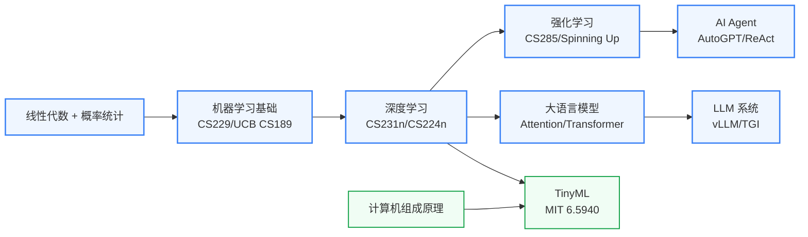

---
hide:
  - navigation
---
研究让机器"更聪明"的算法与系统基础——强化学习、大语言模型、AI Agent，以及让这些算法在真实系统上高效运行的软硬件基础设施。

## 这个方向在研究什么

卷积神经网络（CNN）在 1989 年就被 LeCun 发明出来了，但 AlexNet 要等到 2012 年才出现。中间隔了二十三年，不是因为算法进步太慢，而是因为 GPU 和大规模数据集还没有到位。等到 Krizhevsky 把 LeNet 的基本思路放到双 GTX 580 GPU 上训练，在 ImageNet 的 120 万张图片上跑，错误率就比第二名低了将近 11 个百分点。这个结果告诉了整个行业一件事：这个领域的进步，不只是算法的进步，更是算法 × 硬件 × 数据的联合进步。

这个认识在随后十年被反复验证并放大。Transformer 架构（2017）之所以成为 LLM 的基础，不只因为注意力机制在理论上更好，还因为它的矩阵乘法可以在 GPU 上高度并行运行，这是 RNN 做不到的。当 OpenAI 用 GPT-3（1750 亿参数）证明"规模扩展就会更智能"时，随之而来的是另一个发现：当模型大到一定程度，如何高效地运行它，就和设计它一样困难——甚至更困难。一块 A100 GPU 内存只有 80 GB，装不下一个 GPT-3，需要把它拆开、分摊到几十块乃至几千块 GPU 上协同运行。模型并行、流水线并行、张量并行的切法，直接决定模型能否训练收敛，这是算法与系统之间真正的研究问题。

<svg viewBox="0 0 860 200" xmlns="http://www.w3.org/2000/svg" style="width:100%;max-width:860px;display:block;margin:1.2em auto;">
  <!-- Background panel -->
  <rect x="6" y="8" width="848" height="184" rx="10" fill="#F8FAFC" stroke="#CBD5E1" stroke-width="1.5"/>
  <!-- Column 1: 算法层 (purple) -->
  <rect x="30" y="28" width="220" height="140" rx="8" fill="#EDE9FE" stroke="#7C3AED" stroke-width="2"/>
  <text x="140" y="52" text-anchor="middle" font-size="13" font-weight="bold" fill="#5B21B6" font-family="sans-serif">算法层</text>
  <text x="140" y="72" text-anchor="middle" font-size="11" fill="#7C3AED" font-family="sans-serif">LLM / RL / Vision</text>
  <text x="140" y="90" text-anchor="middle" font-size="10.5" fill="#6D28D9" font-family="sans-serif">Transformer · PPO · DINO</text>
  <text x="140" y="108" text-anchor="middle" font-size="10" fill="#8B5CF6" font-family="sans-serif">研究目标：更好的智能</text>
  <!-- Column 2: 系统层 (blue) -->
  <rect x="310" y="28" width="220" height="140" rx="8" fill="#DBEAFE" stroke="#3B82F6" stroke-width="2"/>
  <text x="420" y="52" text-anchor="middle" font-size="13" font-weight="bold" fill="#1D4ED8" font-family="sans-serif">系统层</text>
  <text x="420" y="72" text-anchor="middle" font-size="11" fill="#3B82F6" font-family="sans-serif">vLLM / TVM / PyTorch</text>
  <text x="420" y="90" text-anchor="middle" font-size="10.5" fill="#2563EB" font-family="sans-serif">分布式训练 · 推理框架</text>
  <text x="420" y="108" text-anchor="middle" font-size="10" fill="#3B82F6" font-family="sans-serif">研究目标：更快的运行</text>
  <!-- Column 3: 硬件层 (green) -->
  <rect x="590" y="28" width="220" height="140" rx="8" fill="#DCFCE7" stroke="#16A34A" stroke-width="2"/>
  <text x="700" y="52" text-anchor="middle" font-size="13" font-weight="bold" fill="#166534" font-family="sans-serif">硬件层</text>
  <text x="700" y="72" text-anchor="middle" font-size="11" fill="#16A34A" font-family="sans-serif">GPU / NPU / 边缘芯片</text>
  <text x="700" y="90" text-anchor="middle" font-size="10.5" fill="#15803D" font-family="sans-serif">A100 · 昇腾 · 树莓派</text>
  <text x="700" y="108" text-anchor="middle" font-size="10" fill="#16A34A" font-family="sans-serif">研究目标：更省的算力</text>
  <!-- Arrows between columns -->
  <!-- 算法→系统 -->
  <line x1="250" y1="90" x2="304" y2="90" stroke="#94A3B8" stroke-width="1.8"/>
  <polygon points="304,86 316,90 304,94" fill="#94A3B8"/>
  <text x="281" y="80" text-anchor="middle" font-size="9" fill="#64748B" font-family="sans-serif">算法需求 ↓</text>
  <!-- 系统→算法 (back arrow) -->
  <line x1="310" y1="112" x2="256" y2="112" stroke="#94A3B8" stroke-width="1.8"/>
  <polygon points="256,108 244,112 256,116" fill="#94A3B8"/>
  <text x="281" y="128" text-anchor="middle" font-size="9" fill="#64748B" font-family="sans-serif">硬件约束 ↑</text>
  <!-- 系统→硬件 -->
  <line x1="530" y1="90" x2="584" y2="90" stroke="#94A3B8" stroke-width="1.8"/>
  <polygon points="584,86 596,90 584,94" fill="#94A3B8"/>
  <text x="561" y="80" text-anchor="middle" font-size="9" fill="#64748B" font-family="sans-serif">算法需求 ↓</text>
  <!-- 硬件→系统 (back arrow) -->
  <line x1="590" y1="112" x2="536" y2="112" stroke="#94A3B8" stroke-width="1.8"/>
  <polygon points="536,108 524,112 536,116" fill="#94A3B8"/>
  <text x="561" y="128" text-anchor="middle" font-size="9" fill="#64748B" font-family="sans-serif">硬件约束 ↑</text>
  <!-- Glowing intersection label (amber) at center -->
  <rect x="345" y="148" width="150" height="32" rx="6" fill="#FEF3C7" stroke="#D97706" stroke-width="1.8"/>
  <text x="420" y="162" text-anchor="middle" font-size="10" font-weight="bold" fill="#92400E" font-family="sans-serif">硬件-算法协同</text>
  <text x="420" y="176" text-anchor="middle" font-size="9" fill="#D97706" font-family="sans-serif">EE 背景的机会空间</text>
</svg>

Flash Attention（2022）是一个典型的"系统工作改变算法能力"案例：注意力机制本来的内存访问模式对 GPU 不友好，Dao 等人重新排列计算顺序让数据在 GPU 片上 SRAM 里复用，在不改变计算结果的前提下把推理速度提升了 3 倍、内存占用降低了 5 倍——这直接改变了 LLM 可行上下文长度的上限，从几千 token 推向数万 token。vLLM 解决的是另一个问题：多用户同时请求 LLM 推理时，KV Cache 分配如何做到高效——借鉴操作系统"虚拟内存"的思路消除 GPU 内存碎片，吞吐量提升 24 倍。这些工作发在 OSDI、MLSys 等系统顶会，同时也被 NeurIPS 接收，代表了这个领域"最有趣的问题住在接缝处"的特点。

TinyML 和高效推理把同样的问题推到了另一个极端：不是怎么在一千块 GPU 上运行大模型，而是怎么在几百毫瓦的手机 NPU 上运行它。剪枝（去掉贡献小的权重）、量化（从 32 位浮点压缩到 4 位整数）、知识蒸馏（让小模型学大模型的行为）是三种核心手段。MIT Song Han 组的 AWQ 量化和 SpAtten 稀疏注意力是代表成果——这类论文同时投递 NeurIPS 和 ISSCC 不是巧合，而是因为问题本来就同时属于算法和硬件两个领域，理解芯片物理约束的研究者在这里有独特的切入优势。强化学习（RLHF）则从另一个方向进入了 LLM 训练的核心：ChatGPT 之所以"懂得怎么回答"，不是靠更大的模型，而是靠让人类反馈信号引导模型对齐人类偏好——这是 RL 与语言模型系统的结合，也是近两年 AI 研究里生长最快的交叉地带之一。

## 适合什么样的人

这个方向是一个"桥梁"方向——专为有 EE/微电子背景、想向 AI 研究延伸的同学而设。你不需要抛弃原有的硬件直觉，恰恰相反，这里最有价值的研究往往来自"既懂算法又懂芯片"的人。

入场的前提条件是：你需要对 Python 和机器学习工作流感到自在。PyTorch 是这个方向的通用语言，不熟悉的话需要优先补上。和处理器架构不同，这里的实验主要在 GPU 上用 Python 跑，发论文的速度快得多——NeurIPS/ICML 截止日期一年有几次，一个好想法从实现到投稿可以在三四个月内完成，这和 ISCA 的节奏完全不同。

如果你对 AI 感兴趣但不确定从哪里切入，TinyML 是最自然的起点：量化和剪枝的问题，你的硬件背景会让你比纯软件同学理解得更深，而且这类工作可以同时被 AI 顶会和硬件顶会接收，选题灵活度高。如果你更想做系统侧（vLLM 类的推理框架优化），计算机系统的基础（操作系统、并行计算）是必要储备。如果你对 RL 和 Agent 感兴趣，要做好心理准备：这条路的基础数学要求更高，且研究风格更接近 CS 理论，和 EE 背景的距离稍远一些。

## 核心研究问题

- **LLM 推理效率**：注意力机制的 KV Cache 随序列长度线性增长，如何用算法和系统联合优化降低推理延迟和内存占用？
- **RL 样本效率**：强化学习需要大量与环境的交互样本，如何设计更高效的探索策略和离线学习算法？
- **Agent 可靠性**：基于 LLM 的 Agent 在多步骤任务中容易累积错误，如何设计可验证、可纠错的 Agent 框架？
- **硬件-算法协同**：量化和剪枝改变了模型的计算模式，如何让硬件加速器感知这些变化并最大化利用？

## 代表性机构

| | 国际 | 国内 |
|--|------|------|
| **企业** | OpenAI、Google DeepMind、Meta AI、Anthropic | 智谱AI、月之暗面、百度、阿里通义 |
| **顶会** | NeurIPS、ICML、ICLR、CVPR、EMNLP、MLSys | — |

## 知识路径

图中节点对应以下知识板块（按需选修）：

- [人工智能（全板块）](../课程资源/人工智能/index.md)
- [系统架构（计算机系统基础）](../课程资源/系统架构/index.md)
- [算法编程](../课程资源/算法编程/index.md)

## 入门三步走

**典型研究长什么样**

一篇 TinyML / 高效推理方向的论文通常是这样的：作者发现某个模型（如 LLaMA-7B）在边缘设备上因内存带宽不足而推理速度慢，提出一种新的量化或稀疏化方法，在 PyTorch 中实现并在 GPU/NPU 上测量实际推理延迟和精度损失，最终与 FP16 基线和其他量化方法对比，报告精度-效率 Pareto 曲线。系统侧（vLLM 类）的论文则通常关注批处理调度或内存管理，实验部分会测量不同负载下的吞吐量和 P99 延迟。RL/Agent 方向的论文实验设计差异更大，但通常需要在标准基准（Atari/MuJoCo/MMLU）上有系统性的消融实验。

**第一步：补齐算法基础**  
如果你的 CS 背景薄弱，先跟完 Andrej Karpathy 的 [Neural Networks: Zero to Hero](https://www.youtube.com/playlist?list=PLAqhIrjkxbuWI23v9cThsA9GvCAUhRvKZ) 系列（约 20 小时），手写 GPT-2，从零理解 Transformer 的每一行代码。这是目前最高质量的 LLM 入门路径。

**第二步：理解系统约束**  
阅读 [Efficient ML](https://efficientml.ai/)（Song Han MIT 6.5940 课程主页），特别是关于量化和剪枝的讲义。你的硬件背景会让你在这一步比纯软件背景的同学理解得更深。

**第三步：选一个具体问题**  
RL/Agent/LLM 三条路各有不同的研究文化和发表节奏。建议先读 3 篇你感兴趣方向的最近 NeurIPS/ICML 论文，感受问题的粒度和评价指标，再决定深入哪个子方向。

## 相关课题组

### 境内

-   **[朱军](https://ml.cs.tsinghua.edu.cn/~jun/index.shtml)** 清华

    生成模型 · 贝叶斯深度学习 · 扩散模型理论

-   **[唐杰](https://keg.cs.tsinghua.edu.cn/jietang/)** 清华

    知识图谱 · 大语言模型 · AI 社会系统

-   **[刘知远](https://nlp.csai.tsinghua.edu.cn/~lzy/)** 清华

    大语言模型 · 知识增强预训练 · NLP 系统

-   **[陈键飞](https://ml.cs.tsinghua.edu.cn/~jianfei/)** 清华

    神经网络量化 · 高效机器学习 · 随机优化算法

-   **[曹婷](https://air.tsinghua.edu.cn/en/info/1046/1941.htm)** 清华 AIR 

    边缘 AI · 神经网络推理系统 · AI 加速器 · 基础模型算法

-   **[吴翼](https://jxwuyi.weebly.com/)** 清华 IIIS

    大规模强化学习 · LLM 对齐 · 多智能体系统

-   **[崔斌](https://cuibinpku.github.io/)** 北大

    分布式 AI 系统 · 大模型训练与服务 · ML 系统基础设施

-   **[杨耀东](https://yangyaodong.com/)** 北大

    强化学习 · 多智能体 · AI 对齐 · 具身 AI

-   **[董豪](http://zsdonghao.github.io)** 北大

    深度强化学习 · 机器学习系统 · 开源 AI 框架（TensorLayer）

-   **[邱锡鹏](https://xpqiu.github.io/)** 复旦

    大语言模型新架构 · 多模态后训练 · 高效 NLP 系统（FastNLP）

-   **[陈涛](https://eetchen.github.io/)** 复旦

    边缘 AI · 轻量深度视觉 · 模型压缩与嵌入式部署

-   **[陈全](https://www.cs.sjtu.edu.cn/~chen-quan/)** 交大

    端边云 AI 推理系统 · LLM serving · 并行计算

-   **[蒋力](https://cs.sjtu.edu.cn/~jiangli/)** 交大

    AI 专用处理器与编译器 · 神经网络压缩 · 存内计算架构

-   **[吴飞](https://person.zju.edu.cn/wufei)** 浙大

    端云协同分布式 ML · 垂域基础模型 · AI 系统平台

-   **[陈云霁](https://novel.ict.ac.cn/ychen_cn/)** 中科院计算所

    深度学习专用处理器 · 神经网络指令集（寒武纪）· 存算协同架构

-   **[Tao Yu（余涛）](https://taoyds.github.io/)** 港大

    LLM Agent · 代码生成（Spider/SWE） · 计算机使用智能体（OSWorld）

<button class="prof-show-all">显示全部 ↓</button>

### 境外

-   **[Song Han（韩松）](https://hanlab.mit.edu/songhan)** MIT

    高效深度学习 · LLM 量化与压缩（AWQ/SpAtten）· TinyML · 硬件感知 NAS

-   **[Vivienne Sze](https://eems.mit.edu/)** MIT 

    硬件高效深度学习 · 神经网络加速器设计 · 边缘视觉计算

-   **[Tianqi Chen（陈天奇）](https://tqchen.com/)** CMU

    AI 编译器（TVM/Apache MXNet）· LLM 全平台部署（MLC-LLM）· ML 系统全栈

-   **[Zhihao Jia（贾志豪）](https://www.cs.cmu.edu/~zhihaoj2/)** CMU

    ML 编译器 · 分布式 DL 并行化 · LLM 推理（FlexFlow/SpecInfer）

-   **[Graham Neubig](https://www.phontron.com/)** CMU

    LLM Agent · 代码生成 · 多语言 NLP

-   **[Ion Stoica](https://people.eecs.berkeley.edu/~istoica/)** UC Berkeley

    LLM 推理系统（vLLM/Ray）· 分布式 AI 基础设施

-   **[Matei Zaharia](https://people.eecs.berkeley.edu/~matei/)** UC Berkeley

    LLM 应用系统（DSPy）· 分布式 ML 运行时 · Sky Lab

-   **[Joseph Gonzalez](https://people.eecs.berkeley.edu/~jegonzal/)** UC Berkeley

    LLM serving（SGLang）· LLM Agent 系统 · ML 推理优化

-   **[Pieter Abbeel](https://people.eecs.berkeley.edu/~pabbeel/)** UC Berkeley

    深度强化学习 · 模仿学习 · 机器人操控策略

-   **[Sergey Levine](https://people.eecs.berkeley.edu/~svlevine/)** UC Berkeley

    离线强化学习 · 机器人学习 · 决策 Transformer

-   **[马毅](https://people.eecs.berkeley.edu/~yima/)** UC Berkeley

    可解释深度学习理论 · 稀疏/低秩表示 · 神经网络几何

-   **[Chelsea Finn](https://ai.stanford.edu/~cbfinn/)** Stanford 

    元学习 · 高效学习适应 · 机器人强化学习

-   **[Percy Liang](https://cs.stanford.edu/~pliang/)** Stanford

    基础模型评测（HELM）· LLM 可靠性与鲁棒性 · AI 系统基础设施

-   **[Fei-Fei Li（李飞飞）](https://profiles.stanford.edu/fei-fei-li)** Stanford 

    计算机视觉 · ImageNet · 以人为本 AI（HAI）· 视觉-语言基础模型

-   **[Emma Brunskill](https://cs.stanford.edu/people/ebrun/)** Stanford 

    强化学习理论 · 教育与医疗 RL · 样本效率

-   **[Vijay Janapa Reddi](https://scholar.harvard.edu/vijay-janapa-reddi)** Harvard

    TinyML · 边缘 AI 系统 · MLPerf 基准测试 · 移动设备推理

-   **[Deming Chen（陈德铭）](https://dchen.ece.illinois.edu/)** UIUC

    LLM 加速器设计 · ML for EDA · FPGA 推理加速

-   **[Danqi Chen（陈丹琦）](https://www.cs.princeton.edu/~danqic/)** Princeton 

    大语言模型 · 稠密检索（DPR）· 上下文学习 · 高效 NLP 系统

-   **[Kai Chen（陈凯）](https://cse.hkust.edu.hk/~kaichen/)** 港科大

    机器学习系统 · 分布式训练网络 · AI 集群调度

-   **[James Tin Yau Kwok（郭天佑）](https://www.cse.ust.hk/~jamesk/)** 港科大

    模型压缩与量化 · 高效深度学习 · 联邦学习

-   **[Xiaowen Chu（褚晓文）](https://sites.google.com/view/chuxiaowen)** 港科大（广州）

    ML 系统 · GPU 计算 · LLM 稀疏推理

-   **[Karthik Narasimhan](https://karthikncode.github.io/)** Princeton

    LLM Agent · ReAct / Tree-of-Thoughts · SWE-bench / SWE-agent

-   **[Beidi Chen（陈贝迪）](https://www.andrew.cmu.edu/user/beidic/)** CMU 

    高效 LLM 推理 · 上下文稀疏性（Deja Vu） · 单卡推理（FlexGen）

-   **[Yuandong Tian（田渊栋）](https://yuandong-tian.com/)** Meta FAIR

    LLM 推理与规划 · 强化学习 · ML-guided 优化 · 表征学习理论

<button class="prof-show-all">显示全部 ↓</button>
