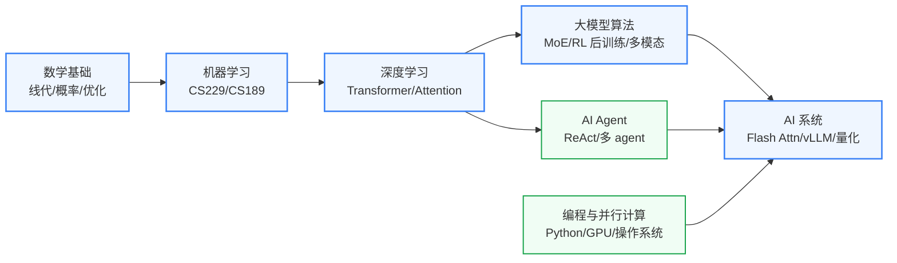

---
hide:
  - navigation
---
研究让机器"更聪明"的算法与系统基础——强化学习、大语言模型、AI Agent，以及让这些算法在真实系统上高效运行的软硬件基础设施。

## 这个方向在研究什么

2024 年 7 月，OpenAI 披露了一份内部 AGI 路线图，把 AI 的发展分成五级：

- **L1：对话型**(自然语言交互)
- **L2：推理型**(解博士级问题)
- **L3：行动型**(自主完成几小时到几天的多步任务)
- **L4：创新型**(协助发明)
- **L5：组织型**(替代整个组织)

随着思维链(Chain-of-Thought)技术让模型具备深度推理能力，**L2 已完全实现**。截止至2026年6月，Claude Code、OpenAI Codex 在过去半年快速迭代，**L3 也基本实现**。目前**L4**正在大力研发中，普通人还没有感受到 AI for Science 的威力。但据新闻通稿，AI 已经在蛋白质结构(AlphaFold)、新材料发现等方向取得突破。从 L1 到 L4，再到未来的 L5，AI 的每一步发展都需要 **算法、系统、数据** 三方面协同突破，这就是本方向在研究的事情。

<svg viewBox="0 0 880 305" xmlns="http://www.w3.org/2000/svg" style="width:100%;max-width:880px;display:block;margin:1.5rem auto;font-family:system-ui,-apple-system,sans-serif">
  <text x="440.0" y="28" text-anchor="middle" font-size="14" font-weight="700" fill="#1E293B">OpenAI 2024 年 7 月披露的 AGI 5 级路线图</text>
  <text x="440.0" y="46" text-anchor="middle" font-size="11" fill="#64748B">每跨一级,需要算法、系统、数据三方面同步突破</text>
  <rect x="10.0" y="60" width="164.0" height="6" rx="2" fill="#3B82F6"/>
  <rect x="10.0" y="66" width="164.0" height="224" rx="0" fill="#DBEAFE" stroke="#1E40AF" stroke-width="1.2"/>
  <text x="92.0" y="98" text-anchor="middle" font-size="22" font-weight="800" fill="#1E40AF">L1</text>
  <text x="92.0" y="124" text-anchor="middle" font-size="15" font-weight="700" fill="#1E293B">对话型</text>
  <text x="92.0" y="140" text-anchor="middle" font-size="10" fill="#64748B" font-style="italic">Chatbots</text>
  <line x1="24.0" y1="152" x2="160.0" y2="152" stroke="#1E40AF" stroke-width="0.6" opacity="0.4"/>
  <text x="92.0" y="168" text-anchor="middle" font-size="10" fill="#475569">对话能力 / 自然语言交互</text>
  <text x="92.0" y="197" text-anchor="middle" font-size="9" fill="#94A3B8">代表产品</text>
  <text x="92.0" y="211" text-anchor="middle" font-size="10" font-weight="600" fill="#1E40AF">ChatGPT</text>
  <text x="92.0" y="223" text-anchor="middle" font-size="10" font-weight="600" fill="#1E40AF">Claude</text>
  <text x="92.0" y="235" text-anchor="middle" font-size="10" font-weight="600" fill="#1E40AF">Gemini</text>
  <rect x="52.0" y="268" width="80" height="16" rx="3" fill="#1E40AF"/>
  <text x="92.0" y="279" text-anchor="middle" font-size="9" font-weight="700" fill="#FFFFFF">已稳定</text>
  <rect x="184.0" y="60" width="164.0" height="6" rx="2" fill="#06B6D4"/>
  <rect x="184.0" y="66" width="164.0" height="224" rx="0" fill="#CFFAFE" stroke="#0E7490" stroke-width="1.2"/>
  <text x="266.0" y="98" text-anchor="middle" font-size="22" font-weight="800" fill="#0E7490">L2</text>
  <text x="266.0" y="124" text-anchor="middle" font-size="15" font-weight="700" fill="#1E293B">推理型</text>
  <text x="266.0" y="140" text-anchor="middle" font-size="10" fill="#64748B" font-style="italic">Reasoners</text>
  <line x1="198.0" y1="152" x2="334.0" y2="152" stroke="#0E7490" stroke-width="0.6" opacity="0.4"/>
  <text x="266.0" y="168" text-anchor="middle" font-size="10" fill="#475569">博士级问题求解</text>
  <text x="266.0" y="197" text-anchor="middle" font-size="9" fill="#94A3B8">代表产品</text>
  <text x="266.0" y="211" text-anchor="middle" font-size="10" font-weight="600" fill="#0E7490">o1 / o3</text>
  <text x="266.0" y="223" text-anchor="middle" font-size="10" font-weight="600" fill="#0E7490">DeepSeek-R1</text>
  <text x="266.0" y="235" text-anchor="middle" font-size="10" font-weight="600" fill="#0E7490">Claude thinking</text>
  <rect x="226.0" y="268" width="80" height="16" rx="3" fill="#0E7490"/>
  <text x="266.0" y="279" text-anchor="middle" font-size="9" font-weight="700" fill="#FFFFFF">已实现 (2024)</text>
  <rect x="358.0" y="60" width="164.0" height="6" rx="2" fill="#F59E0B"/>
  <rect x="358.0" y="66" width="164.0" height="224" rx="0" fill="#FEF3C7" stroke="#B45309" stroke-width="1.2"/>
  <text x="440.0" y="98" text-anchor="middle" font-size="22" font-weight="800" fill="#B45309">L3</text>
  <text x="440.0" y="124" text-anchor="middle" font-size="15" font-weight="700" fill="#1E293B">行动型</text>
  <text x="440.0" y="140" text-anchor="middle" font-size="10" fill="#64748B" font-style="italic">Agents</text>
  <line x1="372.0" y1="152" x2="508.0" y2="152" stroke="#B45309" stroke-width="0.6" opacity="0.4"/>
  <text x="440.0" y="168" text-anchor="middle" font-size="10" fill="#475569">自主完成长任务</text>
  <text x="440.0" y="181" text-anchor="middle" font-size="10" fill="#475569">(数小时-数天)</text>
  <text x="440.0" y="210" text-anchor="middle" font-size="9" fill="#94A3B8">代表产品</text>
  <text x="440.0" y="224" text-anchor="middle" font-size="10" font-weight="600" fill="#B45309">Claude Code</text>
  <text x="440.0" y="236" text-anchor="middle" font-size="10" font-weight="600" fill="#B45309">Devin</text>
  <text x="440.0" y="248" text-anchor="middle" font-size="10" font-weight="600" fill="#B45309">ChatGPT Operator</text>
  <rect x="400.0" y="268" width="80" height="16" rx="3" fill="#B45309"/>
  <text x="440.0" y="279" text-anchor="middle" font-size="9" font-weight="700" fill="#FFFFFF">加速中</text>
  <rect x="532.0" y="60" width="164.0" height="6" rx="2" fill="#94A3B8"/>
  <rect x="532.0" y="66" width="164.0" height="224" rx="0" fill="#F1F5F9" stroke="#64748B" stroke-width="1.2"/>
  <text x="614.0" y="98" text-anchor="middle" font-size="22" font-weight="800" fill="#64748B">L4</text>
  <text x="614.0" y="124" text-anchor="middle" font-size="15" font-weight="700" fill="#1E293B">创新型</text>
  <text x="614.0" y="140" text-anchor="middle" font-size="10" fill="#64748B" font-style="italic">Innovators</text>
  <line x1="546.0" y1="152" x2="682.0" y2="152" stroke="#64748B" stroke-width="0.6" opacity="0.4"/>
  <text x="614.0" y="168" text-anchor="middle" font-size="10" fill="#475569">协助科学发明 / 提出新想法</text>
  <text x="614.0" y="197" text-anchor="middle" font-size="9" fill="#94A3B8">代表产品</text>
  <text x="614.0" y="211" text-anchor="middle" font-size="10" font-weight="600" fill="#64748B">—</text>
  <rect x="574.0" y="268" width="80" height="16" rx="3" fill="#64748B"/>
  <text x="614.0" y="279" text-anchor="middle" font-size="9" font-weight="700" fill="#FFFFFF">远期</text>
  <rect x="706.0" y="60" width="164.0" height="6" rx="2" fill="#94A3B8"/>
  <rect x="706.0" y="66" width="164.0" height="224" rx="0" fill="#F1F5F9" stroke="#64748B" stroke-width="1.2"/>
  <text x="788.0" y="98" text-anchor="middle" font-size="22" font-weight="800" fill="#64748B">L5</text>
  <text x="788.0" y="124" text-anchor="middle" font-size="15" font-weight="700" fill="#1E293B">组织型</text>
  <text x="788.0" y="140" text-anchor="middle" font-size="10" fill="#64748B" font-style="italic">Organizations</text>
  <line x1="720.0" y1="152" x2="856.0" y2="152" stroke="#64748B" stroke-width="0.6" opacity="0.4"/>
  <text x="788.0" y="168" text-anchor="middle" font-size="10" fill="#475569">替代整个组织运作</text>
  <text x="788.0" y="197" text-anchor="middle" font-size="9" fill="#94A3B8">代表产品</text>
  <text x="788.0" y="211" text-anchor="middle" font-size="10" font-weight="600" fill="#64748B">—</text>
  <rect x="748.0" y="268" width="80" height="16" rx="3" fill="#64748B"/>
  <text x="788.0" y="279" text-anchor="middle" font-size="9" font-weight="700" fill="#FFFFFF">远期</text>
</svg>

算法层的核心是有三个方向。**一是更高效的 scaling**：Llama 3 的 405B 版本，Meta 动用 1.6 万张 H100 训了 54 天，纯堆参数已经撞墙；**MoE**(DeepSeek-V3，2024)把模型拆成多个"专家"、每次只激活其中一两个，让参数规模和计算成本解耦。**二是更聪明的训练**：强化学习成为核心——R1-Zero 范式只用一份很小的"冷启动"数据告诉模型推理格式，后面全靠 RL 让模型自己摸索，这是 L2 思维链能稳定落地的关键。**三是更广的输入**：**多模态**(GPT-4V、Sora) 让模型从纯文本走向能理解图像、视频。

以上三个方向都是在 LLM 这条路线上的努力。但 LLM 并非唯一答案。图灵奖得主、深度学习三巨头之一 的 **Yann LeCun** 长期质疑 LLM 的 token 级预测学不到物理世界的规律。他主导的 **JEPA 系列** 让 AI 预测视频/图像中被遮部分的高层语义("这是个球，正在落地")，而不是像素本身。**Neuro-symbolic AI** 则把神经网络的模糊感知和符号系统的严格推理结合。

系统层面，**L3 agent** 把推理转化为对外部世界的多步操作：Claude Code 在终端写代码、跑测试、调试 bug；**多 agent** 让多个角色协作：一个分解任务、一个执行、一个评估，**OpenClaw**是代表。模型训练好之后，如何低成本推理同样很重要。**Flash Attention** 用矩阵分块，让数据从 HBM 取出来后在片上尽可能多地运算，之后再存回 HBM，节省大量片外访存开销。**vLLM 的 PagedAttention** 则是借鉴了虚拟内存的分页系统，高效地管理模型回顾上下文所需要的 KV Cache。神经网络的权重值绝大多数集中在很小的区间，32 位浮点的精度大半浪费——把权重压到 8 位甚至 4 位整数，离散化得当时精度几乎不损，这就是 **量化**。

数据层面，模型最终学到什么不靠架构、靠数据。GPT-4、Llama 3 量级的训练数据在 10-15 万亿 token，基本把开放互联网的高质量内容训了一遍。Sam Altman 和 Ilya Sutskever 都公开承认过：**互联网公开数据快用光了**。下一步走两条路。一条是**合成数据**：让强模型生成新数据训练后续模型，微软 Phi 系列已经验证这条路可行，Tesla 的 FSD 也用模拟器生成小孩冲马路、暴雨夜驾这类极端场景来训练自动驾驶。另一条是**专家精选数据**，比如科学论文、专业的推理过程标注。

此外，**AI 的可解释性**(Interpretability) 和 **AI 安全** 同样重要——只有真正理解模型、给它可控的行为边界，才能放心把更多决策交给它。2026 年 2 月，美军一次导弹打击把伊朗的一所小学误当成军火库，156 条无辜生命遇难，事后查明根因是过时的人工情报坐标，而 Claude 正被用在这套打击规划流程里；同类风险还有越狱攻击、ChatGPT 写法律文书引用虚构判例被法庭处罚等。**AI 安全** 给模型一套可控的行为边界，比如 Anthropic 的 **宪法 AI**(Constitutional AI) 让模型按一组原则做生成时的自检；**可解释性** 则去搞清楚模型内部在做什么，比如 Anthropic 的稀疏自编码器(SAE)能在大模型的中间表征里识别出"概念神经元"，某个神经元的激活恰好对应"金门大桥"或"代码里的 bug"。

如今**前沿模型的训练已经被大厂垄断**。表面原因是钱，单次训练 1 亿美元起。但更深的壁垒是**数据**和**数据中心**。开放互联网的数据是公共的，但 Google 的搜索行为、Meta 的社交内容、字节的视频互动这类**高质量私有数据**只有大厂自己有，这才决定模型在真实任务上的上限。这也是为什么几乎所有 AI 在讲中文时都喜欢"稳稳地接住你"。中文语料贫乏单一，加上各家 AI 互相蒸馏，风格自然趋同。**万卡级 H100 集群**则是另一道门，涉及电力、液冷、高速互联，学校募几十亿也建不起来。但学术界并没有被边缘化，反而和大厂形成了一种**对称依赖**。工业界做前沿大模型并把训练好的开源放出来，比如 Llama、DeepSeek 系列。学术界拿这些做后训练、推理优化、可解释性研究，Flash Attention 出自 Stanford，vLLM 出自 UC Berkeley，AWQ 出自 MIT，这些工作反过来又被大厂的推理引擎采用。**学术界的真正机会，不在和大厂比规模，而在那些能让所有模型用得更好的算法、系统与数据方法上。**

### 核心研究问题

- **在算力瓶颈下如何继续提高模型能力**：纯堆参数已撞墙，MoE 把参数规模和算力解耦但路由与稀疏激活没解，高质量语料快训光、合成数据怕退化，新架构和数据工程要一起往前推。
- **强化学习与后训练**：R1-Zero 式 RL 撑起了 L2 思维链，但奖励设计、训练稳定性、对齐和样本效率都不成熟，这是当下最热的一大簇。
- **Agent 与多智能体**：L3 agent 把推理变成对外界的多步操作，长任务里错误一路累积，多个角色怎么协作、怎么做到可验证可纠错还没定论。
- **训练与 serving 系统**：万卡集群上的并行训练、低成本 LLM serving、端边云推理调度，要在带宽、显存、通信之间反复权衡。
- **高效推理与量化（IC 切口）**：上下文越长 KV Cache 越吃显存，Flash Attention 靠片上分块省访存、量化把权重压到 4 位几乎不掉点，但哪些权重该保精度、加速器和编译怎么真正吃到这份红利是软硬协同的开放问题。
- **多模态**：从纯文本走向理解图像视频，视觉-语言基础模型怎么对齐不同模态、又不丢失各自的信息仍在摸索。
- **可解释性与 AI 安全**：把更多决策交给模型，得靠稀疏自编码器这类工具看清内部在做什么，再用宪法 AI 一类机制划出可控的行为边界。
- **下一代范式**：LeCun 的 JEPA 和 Neuro-symbolic 质疑 token 级预测学不到世界规律，另起世界模型与符号推理融合的路线，胜负未分。

### 知识路径

图中节点对应以下知识板块（按需选修）：

- [数学（线代 / 概率 / 优化基础）](../学习地图/数学/index.md)
- [深度学习（Transformer / 训练）](../学习地图/人工智能/深度学习/index.md)
- [AI 系统（推理 / 量化 / 部署）](../学习地图/人工智能/AI系统/index.md)
- [算法编程（Python / 工程基础）](../学习地图/算法编程/index.md)
- [系统架构（操作系统 / 并行与分布式）](../学习地图/系统架构/并行与分布式系统/index.md)

## 这个方向适合谁

这个方向适合真心对"让模型更聪明、更高效"有热情的人，而不是想蹭热度换赛道。微电子本科最稳的切口在系统侧。推理引擎优化、量化、训练推理基础设施离你最近，纯软件出身谈量化常停在调 bit 数，你却能从访存带宽和算子映射理解它为什么省。这类工作能同时投 AI 顶会和 MLSys，也对接 NVIDIA、寒武纪这类做推理芯片与软件栈的去向。诚实提醒一句，入场得先把 PyTorch 练熟，越往纯 RL、纯理论走数学要求越重，要下决心补而不是靠硬件直觉硬扛。

## 学术界

### 课题组

**境内**

-   **[朱军](https://ml.cs.tsinghua.edu.cn/~jun/index.shtml)** 清华

    生成模型 · 贝叶斯深度学习 · 扩散模型理论

-   **[唐杰](https://keg.cs.tsinghua.edu.cn/jietang/)** 清华

    知识图谱 · 大语言模型 · AI 社会系统

-   **[刘知远](https://nlp.csai.tsinghua.edu.cn/~lzy/)** 清华

    大语言模型 · 知识增强预训练 · NLP 系统

-   **[陈键飞](https://ml.cs.tsinghua.edu.cn/~jianfei/)** 清华

    神经网络量化 · 高效机器学习 · 随机优化算法

-   **[曹婷](https://air.tsinghua.edu.cn/en/info/1046/1941.htm)** 清华 

    边缘 AI · 神经网络推理系统 · AI 加速器 · 基础模型算法

-   **[吴翼](https://jxwuyi.weebly.com/)** 清华

    大规模强化学习 · LLM 对齐 · 多智能体系统

-   **[崔斌](https://cuibinpku.github.io/)** 北大

    分布式 AI 系统 · 大模型训练与服务 · ML 系统基础设施

-   **[杨耀东](https://yangyaodong.com/)** 北大

    强化学习 · 多智能体 · AI 对齐 · 具身 AI

-   **[邱锡鹏](https://xpqiu.github.io/)** 复旦

    大语言模型新架构 · 多模态后训练 · 高效 NLP 系统（FastNLP）

-   **[陈涛](https://eetchen.github.io/)** 复旦

    边缘 AI · 轻量深度视觉 · 模型压缩与嵌入式部署

-   **[陈全](https://www.cs.sjtu.edu.cn/~chen-quan/)** 交大

    端边云 AI 推理系统 · LLM serving · 并行计算

-   **[蒋力](https://cs.sjtu.edu.cn/~jiangli/)** 交大

    AI 专用处理器与编译器 · 神经网络压缩 · 存内计算架构

-   **[张伟楠](https://wnzhang.net/)** 交大

    强化学习 · 决策大模型 · AI Agent · 具身智能

-   **[温颖](https://yingwen.io/)** 交大

    多智能体强化学习 · 智能体协作 · 大模型推理与博弈

-   **[刘鹏飞](https://www.cs.sjtu.edu.cn/jiaoshiml/liupengfei.html)** 交大

    大模型复杂推理（o1 复现）· 预训练数据工程 · 生成式 AI（GAIR）

-   **[张拳石](https://faculty.sjtu.edu.cn/zhangquanshi/zh_CN/index.htm)** 交大

    神经网络可解释性（XAI 理论）· 博弈交互解释 · 深度学习理论

-   **[吴飞](https://person.zju.edu.cn/wufei)** 浙大

    端云协同分布式 ML · 垂域基础模型 · AI 系统平台

-   **[陈云霁](https://novel.ict.ac.cn/ychen_cn/)** 中科院

    深度学习专用处理器 · 神经网络指令集（寒武纪）· 存算协同架构

-   **[谢洪](https://faculty.ustc.edu.cn/xiehong1/zh_CN/index.htm)** 中科大

    样本高效强化学习 · 大模型强化微调 · 智能体 · 科学智能

-   **[康奇宇](https://faculty.ustc.edu.cn/kangqiyu/zh_CN/index.htm)** 中科大

    大模型轻量化与高效推理 · 多模态大模型 · 物理信息神经网络

-   **[高阳](https://cs.nju.edu.cn/gaoyang/)** 南大

    强化学习 · 多智能体学习 · 元学习 · 智能 Agent

-   **[周志华](https://cs.nju.edu.cn/zhouzh/)** 南大

    机器学习理论 · 集成学习 · 弱监督学习 · 机器学习+逻辑推理（反绎学习）

<button class="prof-show-all">显示全部 ↓</button>

**境外**

-   **[Tao Yu（余涛）](https://taoyds.github.io/)** 港大

    LLM Agent · 代码生成（Spider/SWE） · 计算机使用智能体（OSWorld）

-   **[Song Han（韩松）](https://hanlab.mit.edu/songhan)** MIT

    高效深度学习 · LLM 量化与压缩（AWQ/SpAtten）· TinyML · 硬件感知 NAS

-   **[Vivienne Sze（施）](https://eems.mit.edu/)** MIT 

    硬件高效深度学习 · 神经网络加速器设计 · 边缘视觉计算

-   **[Tianqi Chen（陈天奇）](https://tqchen.com/)** CMU

    AI 编译器（TVM/Apache MXNet）· LLM 全平台部署（MLC-LLM）· ML 系统全栈

-   **[Zhihao Jia（贾志豪）](https://www.cs.cmu.edu/~zhihaoj2/)** CMU

    ML 编译器 · 分布式 DL 并行化 · LLM 推理（FlexFlow/SpecInfer）

-   **[Graham Neubig](https://www.phontron.com/)** CMU

    LLM Agent · 代码生成 · 多语言 NLP

-   **[Ion Stoica](https://people.eecs.berkeley.edu/~istoica/)** UC Berkeley

    LLM 推理系统（vLLM/Ray）· 分布式 AI 基础设施

-   **[Matei Zaharia](https://people.eecs.berkeley.edu/~matei/)** UC Berkeley

    LLM 应用系统（DSPy）· 分布式 ML 运行时 · Sky Lab

-   **[Joseph Gonzalez](https://people.eecs.berkeley.edu/~jegonzal/)** UC Berkeley

    LLM serving（SGLang）· LLM Agent 系统 · ML 推理优化

-   **[Pieter Abbeel](https://people.eecs.berkeley.edu/~pabbeel/)** UC Berkeley

    深度强化学习 · 模仿学习 · 机器人操控策略

-   **[Sergey Levine](https://people.eecs.berkeley.edu/~svlevine/)** UC Berkeley

    离线强化学习 · 机器人学习 · 决策 Transformer

-   **[马毅](https://people.eecs.berkeley.edu/~yima/)** UC Berkeley

    可解释深度学习理论 · 稀疏/低秩表示 · 神经网络几何

-   **[Percy Liang（梁）](https://cs.stanford.edu/~pliang/)** Stanford

    基础模型评测（HELM）· LLM 可靠性与鲁棒性 · AI 系统基础设施

-   **[Fei-Fei Li（李飞飞）](https://profiles.stanford.edu/fei-fei-li)** Stanford 

    计算机视觉 · ImageNet · 以人为本 AI（HAI）· 视觉-语言基础模型

-   **[Emma Brunskill](https://cs.stanford.edu/people/ebrun/)** Stanford 

    强化学习理论 · 教育与医疗 RL · 样本效率

-   **[Vijay Janapa Reddi](https://scholar.harvard.edu/vijay-janapa-reddi)** Harvard

    TinyML · 边缘 AI 系统 · MLPerf 基准测试 · 移动设备推理

-   **[Deming Chen（陈德铭）](https://dchen.ece.illinois.edu/)** UIUC

    LLM 加速器设计 · ML for EDA · FPGA 推理加速

-   **[Danqi Chen（陈丹琦）](https://www.cs.princeton.edu/~danqic/)** Princeton 

    大语言模型 · 稠密检索（DPR）· 上下文学习 · 高效 NLP 系统

-   **[Kai Chen（陈凯）](https://cse.hkust.edu.hk/~kaichen/)** 港科大

    机器学习系统 · 分布式训练网络 · AI 集群调度

-   **[James Tin Yau Kwok（郭天佑）](https://www.cse.ust.hk/~jamesk/)** 港科大

    模型压缩与量化 · 高效深度学习 · 联邦学习

-   **[Xiaowen Chu（褚晓文）](https://sites.google.com/view/chuxiaowen)** 港科大

    ML 系统 · GPU 计算 · LLM 稀疏推理

-   **[Karthik Narasimhan](https://karthikncode.github.io/)** Princeton

    LLM Agent · ReAct / Tree-of-Thoughts · SWE-bench / SWE-agent

-   **[Beidi Chen（陈贝迪）](https://www.andrew.cmu.edu/user/beidic/)** CMU 

    高效 LLM 推理 · 上下文稀疏性（Deja Vu） · 单卡推理（FlexGen）

-   **[Yuandong Tian（田渊栋）](https://yuandong-tian.com/)** Meta FAIR

    LLM 推理与规划 · 强化学习 · ML-guided 优化 · 表征学习理论

<button class="prof-show-all">显示全部 ↓</button>

### 学术会议与期刊

  
会议
    NeurIPS
    ICML
    ICLR
    CVPR
    ICCV
    ACL
    EMNLP
    AAAI
    MLSys
    OSDI
  

  
期刊
    JMLR
    TPAMI
    Nature Machine Intelligence
  

## 毕业去向

### 企业

  
国内
    <a href="https://www.zhipuai.cn">智谱 AI（Z.ai）</a>
    <a href="https://www.minimaxi.com">MiniMax（稀宇科技）</a>
    <a href="https://tongyi.aliyun.com">阿里巴巴 · 通义千问</a>
    <a href="https://hunyuan.tencent.com">腾讯 · 混元</a>
    <a href="https://yiyan.baidu.com">百度 · 文心</a>
    <a class="dm-chip" href="https://www.doubao.com">字节跳动 · 豆包</a>
    <a class="dm-chip" href="https://www.deepseek.com">深度求索 DeepSeek</a>
    <a class="dm-chip" href="https://www.moonshot.cn">月之暗面 Kimi</a>
  

  
国外
    <a href="https://www.nvidia.com">NVIDIA</a>
    <a href="https://deepmind.google">Google DeepMind</a>
    <a href="https://ai.meta.com">Meta AI</a>
    <a class="dm-chip" href="https://openai.com">OpenAI</a>
    <a class="dm-chip" href="https://www.anthropic.com">Anthropic</a>
    <a class="dm-chip" href="https://cognition.ai">Cognition</a>
    <a class="dm-chip" href="https://www.together.ai">Together AI</a>
    <a class="dm-chip" href="https://scale.com">Scale AI</a>
    <a class="dm-chip" href="https://www.worldlabs.ai">World Labs</a>
    <a class="dm-chip" href="https://mistral.ai">Mistral AI</a>
  

### 科研院所

  
国内
    <a class="dm-chip" href="https://www.shlab.org.cn" title="&quot;书生&quot;大模型 · 多模态与通用人工智能">上海人工智能实验室</a>
    <a class="dm-chip" href="https://www.baai.ac.cn" title="悟道大模型 · BGE 检索 · FlagEval 评测开源生态">北京智源人工智能研究院（BAAI）</a>
    <a class="dm-chip" href="https://www.zhejianglab.org" title="智能计算 · AI for Science · 算力基础设施">之江实验室</a>
    <a class="dm-chip" href="https://www.ia.cas.cn" title="多模态大模型（紫东太初）· 决策智能">中科院自动化研究所</a>
  

  
国外
    <a class="dm-chip" href="https://www.csail.mit.edu" title="高效深度学习 · ML 系统 · AI 算法基础研究">MIT CSAIL</a>
    <a class="dm-chip" href="https://hai.stanford.edu" title="基础模型评测（HELM）· 以人为本 AI · AI Index">Stanford HAI</a>
    <a class="dm-chip" href="https://ai.meta.com/research/" title="开源大模型与基础研究 · PyTorch">Meta FAIR</a>
    <a class="dm-chip" href="https://allenai.org" title="全开源大模型（OLMo）· AI for Science">Allen Institute for AI（Ai2）</a>
  

