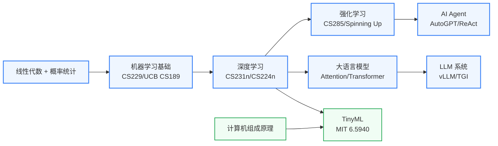

# AI 算法与系统

## 一句话定义

研究让机器"更聪明"的算法与系统基础——强化学习、大语言模型、AI Agent，以及让这些算法在真实系统上高效运行的软硬件基础设施。

## 这个方向在研究什么

这个板块写给有硬件背景、想向算法侧延伸的同学。

微电子出身的学生往往具备一个独特优势：你比纯软件背景的人更了解计算的物理约束——内存带宽是多少、一次矩阵乘法到底消耗多少能量、量化误差从哪里来。这种"懂底层"的直觉在今天的 AI 研究里非常稀缺，因为当前最前沿的 AI 系统问题，往往不是算法理论的问题，而是算法与系统之间如何高效协作的问题。

**大语言模型（LLM）**是当前 AI 最密集的研究焦点。GPT/LLaMA 等模型的核心是 Transformer 架构，其注意力机制的计算复杂度随序列长度平方增长——这意味着长文本推理不仅消耗算力，更受内存带宽瓶颈制约。研究者在多个层面同时攻克这一问题：算法层面有 Flash Attention（内存访问感知的注意力实现）、量化（INT4/INT8 权重压缩）、稀疏化（只激活部分参数）；系统层面有连续批处理（PagedAttention/vLLM）、流水线并行、张量并行等分布式推理框架；硬件层面就回到了你熟悉的计算芯片和存算一体方向。

**强化学习（RL）**和**AI Agent**是另一条快速发展的主线。经典 RL（PPO、SAC 等算法）通过让智能体与环境交互、以累积奖励为优化目标，学会复杂的决策策略。DeepMind 的 AlphaGo/AlphaFold 和 OpenAI 的 RLHF 都是这个框架的产物。近年来，Agent 研究把 LLM 的语言理解能力与 RL 的行动决策能力结合，形成能够使用工具、规划多步骤任务的系统。具身智能（Embodied AI）则进一步把 Agent 放进机器人体里，让它在物理世界中行动——这也是 AI 与 ECE 交叉最密集的前沿之一。

**TinyML 与高效推理**是硬件背景同学切入 AI 算法研究最自然的入口。核心问题是：如何让大模型在资源受限的设备上（手机、MCU、传感器）实时运行？主要手段包括：剪枝（去掉对精度贡献小的参数）、量化（用低精度表示浮点数）、知识蒸馏（让小模型学习大模型的行为）、神经架构搜索（NAS，自动设计适合目标硬件的网络结构）。MIT Song Han 组的 AWQ、SpAtten 等工作是这个方向的代表成果，这些工作往往同时发 AI 顶会（NeurIPS/ICML）和硬件顶会（ISCA/ISSCC）。

## 核心研究问题

- **LLM 推理效率**：注意力机制的 KV Cache 随序列长度线性增长，如何用算法和系统联合优化降低推理延迟和内存占用？
- **RL 样本效率**：强化学习需要大量与环境的交互样本，如何设计更高效的探索策略和离线学习算法？
- **Agent 可靠性**：基于 LLM 的 Agent 在多步骤任务中容易累积错误，如何设计可验证、可纠错的 Agent 框架？
- **硬件-算法协同**：量化和剪枝改变了模型的计算模式，如何让硬件加速器感知这些变化并最大化利用？

## 代表性机构与企业

| | 国际 | 国内 |
|--|------|------|
| **企业** | OpenAI、Google DeepMind、Meta AI、Anthropic | 智谱AI、月之暗面、百度、阿里通义 |
| **高校** | MIT、CMU、Stanford、UCB、UIUC | 清华、北大、浙大、上交 |
| **顶会** | NeurIPS、ICML、ICLR、CVPR、EMNLP、MLSys | — |

## 相关课题组

-   **[Song Han（韩松）](https://hanlab.mit.edu/songhan)** MIT

    高效深度学习 · LLM 量化与压缩（AWQ/SpAtten）· TinyML · 硬件感知 NAS

-   **[Vijay Janapa Reddi](https://scholar.harvard.edu/vijay-janapa-reddi)** Harvard

    TinyML · 边缘 AI 系统 · MLPerf 基准测试 · 移动设备推理

-   **[Pieter Abbeel](https://people.eecs.berkeley.edu/~pabbeel/)** UC Berkeley

    深度强化学习 · 模仿学习 · 机器人操控策略

-   **[Sergey Levine](https://people.eecs.berkeley.edu/~svlevine/)** UC Berkeley

    离线强化学习 · 机器人学习 · 决策 Transformer

-   **[Emma Brunskill](https://cs.stanford.edu/people/ebrun/)** Stanford

    强化学习理论 · 教育与医疗 RL · 样本效率

-   **[Percy Liang](https://cs.stanford.edu/~pliang/)** Stanford

    基础模型评测（HELM）· LLM 可靠性与鲁棒性 · AI 系统基础设施

-   **[Graham Neubig](https://www.phontron.com/)** CMU

    LLM Agent · 代码生成 · 多语言 NLP

-   **[Ion Stoica](https://people.eecs.berkeley.edu/~istoica/)** UC Berkeley

    LLM 推理系统（vLLM/Ray）· 分布式 AI 基础设施

-   **[朱军](https://ml.cs.tsinghua.edu.cn/~jun/index.shtml)** 清华

    生成模型 · 贝叶斯深度学习 · 扩散模型理论

-   **[唐杰](https://keg.cs.tsinghua.edu.cn/jietang/)** 清华

    知识图谱 · 大语言模型 · AI 社会系统

-   **[马毅](https://people.eecs.berkeley.edu/~yima/)** UC Berkeley

    可解释深度学习理论 · 稀疏/低秩表示 · 神经网络几何

-   **[Deming Chen](https://dchen.ece.illinois.edu/)** UIUC

    LLM 加速器设计 · ML for EDA · FPGA 推理加速

<button class="prof-show-all" onclick="this.previousElementSibling.classList.add('show-all');this.style.display='none'">显示全部 ↓</button>

## 知识路径

**本站相关课程：**

- [机器学习（Stanford CS229）](../课程资源/人工智能/机器学习/CS229.md)
- [深度学习（CS231n）](../课程资源/人工智能/深度学习/CS231.md) · [CS224n](../课程资源/人工智能/深度学习/CS224n.md)
- [强化学习（UCB CS285）](../课程资源/人工智能/深度学习/CS285.md)
- [TinyML（MIT 6.5940）](../课程资源/人工智能/机器学习系统/EML.md)
- [大语言模型系统（CMU 11-868）](../课程资源/人工智能/深度生成模型/大语言模型/CMU11-868.md)

## 入门三步走

**第一步：补齐算法基础**  
如果你的 CS 背景薄弱，先跟完 Andrej Karpathy 的 [Neural Networks: Zero to Hero](https://www.youtube.com/playlist?list=PLAqhIrjkxbuWI23v9cThsA9GvCAUhRvKZ) 系列（约 20 小时），手写 GPT-2，从零理解 Transformer 的每一行代码。这是目前最高质量的 LLM 入门路径。

**第二步：理解系统约束**  
阅读 [Efficient ML](https://efficientml.ai/)（Song Han MIT 6.5940 课程主页），特别是关于量化和剪枝的讲义。你的硬件背景会让你在这一步比纯软件背景的同学理解得更深。

**第三步：选一个具体问题**  
RL/Agent/LLM 三条路各有不同的研究文化和发表节奏。建议先读 3 篇你感兴趣方向的最近 NeurIPS/ICML 论文，感受问题的粒度和评价指标，再决定深入哪个子方向。
