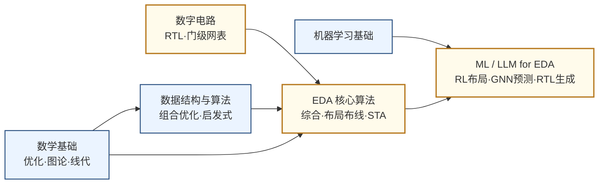

---
hide:
  - navigation
---
用算法和软件让芯片设计本身自动化——从逻辑综合、布局布线到用机器学习和大语言模型辅助设计决策。

## 这个方向在研究什么

芯片设计的规模，大到没法用直觉去想象。一块 Apple M4 大约有 280 亿颗晶体管，挤在约 165 平方毫米的硅片上，等于要在指甲盖大的地方把几百亿个零件摆好、连对。这么大的东西，没人能一个晶体管一个晶体管地画。工程师能做的，是用**硬件描述语言（HDL）**，如Verilog、Chisel、HLS等，在高层描述"我要什么逻辑"，至于怎么把这份意图变成能送进晶圆厂的版图，全部交给软件。从 HDL 到版图，中间要走逻辑综合、布局、时钟树、布线、寄生提取、静态时序分析等数十步，每一步都在啃亿级规模的图或几何优化。这整套自动化流程就是 **EDA（Electronic Design Automation）**，没有它，现代芯片根本造不出来。

EDA的工作，本质是在求解一连串 **NP hard 甚至更难的优化问题**，而且远不止"布局布线"这一块。往前有逻辑综合、功能验证，往后有布局、布线、时序收敛、寄生提取、热分析、可制造性，每一步都是自成一体的难题。就拿最经典的布局来说。把几亿个逻辑单元摆到芯片平面上，既要让关键路径上的连线短、布线不拥塞，还要电源压降均匀，这几个目标彼此打架，而可行解的数量是个天文数字。几十年来，工具靠**人想出来的启发式**（模拟退火、力导向）在合理时间里凑个"够好"的解，可设计越做越大、工艺越来越严，这些老办法越来越吃力。时序收敛尤其磨人。布完线发现一条路径超时，就得局部重布，可改完又牵动别处，改布局、跑时序、再改布局，这么一个循环常常要耗上几周。

<svg viewBox="0 0 860 220" xmlns="http://www.w3.org/2000/svg" style="width:100%;max-width:860px;display:block;margin:1.2em auto;">
  <!-- Background panel -->
  <rect x="6" y="10" width="848" height="200" rx="10" fill="#F8FAFC" stroke="#CBD5E1" stroke-width="1.5"/>
  <!-- Flow boxes (blue) -->
  <!-- Box 1: RTL代码 -->
  <rect x="20" y="50" width="120" height="52" rx="7" fill="#DBEAFE" stroke="#3B82F6" stroke-width="1.8"/>
  <text x="80" y="72" text-anchor="middle" font-size="12" font-weight="bold" fill="#1D4ED8" font-family="sans-serif">RTL 代码</text>
  <text x="80" y="90" text-anchor="middle" font-size="10" fill="#3B82F6" font-family="sans-serif">Verilog / VHDL</text>
  <!-- Arrow 1→2 -->
  <line x1="140" y1="76" x2="164" y2="76" stroke="#64748B" stroke-width="2"/>
  <polygon points="164,72 176,76 164,80" fill="#64748B"/>
  <!-- Box 2: 逻辑综合 -->
  <rect x="176" y="50" width="120" height="52" rx="7" fill="#DBEAFE" stroke="#3B82F6" stroke-width="1.8"/>
  <text x="236" y="72" text-anchor="middle" font-size="12" font-weight="bold" fill="#1D4ED8" font-family="sans-serif">逻辑综合</text>
  <text x="236" y="90" text-anchor="middle" font-size="10" fill="#3B82F6" font-family="sans-serif">门级网表</text>
  <!-- Arrow 2→3 -->
  <line x1="296" y1="76" x2="320" y2="76" stroke="#64748B" stroke-width="2"/>
  <polygon points="320,72 332,76 320,80" fill="#64748B"/>
  <!-- Box 3: 布局布线 -->
  <rect x="332" y="50" width="120" height="52" rx="7" fill="#DBEAFE" stroke="#3B82F6" stroke-width="1.8"/>
  <text x="392" y="72" text-anchor="middle" font-size="12" font-weight="bold" fill="#1D4ED8" font-family="sans-serif">布局布线</text>
  <text x="392" y="90" text-anchor="middle" font-size="10" fill="#3B82F6" font-family="sans-serif">P&amp;R</text>
  <!-- Arrow 3→4 -->
  <line x1="452" y1="76" x2="476" y2="76" stroke="#64748B" stroke-width="2"/>
  <polygon points="476,72 488,76 476,80" fill="#64748B"/>
  <!-- Box 4: 时序验证 -->
  <rect x="488" y="50" width="120" height="52" rx="7" fill="#DBEAFE" stroke="#3B82F6" stroke-width="1.8"/>
  <text x="548" y="72" text-anchor="middle" font-size="12" font-weight="bold" fill="#1D4ED8" font-family="sans-serif">时序验证</text>
  <text x="548" y="90" text-anchor="middle" font-size="10" fill="#3B82F6" font-family="sans-serif">STA</text>
  <!-- Arrow 4→5 -->
  <line x1="608" y1="76" x2="632" y2="76" stroke="#64748B" stroke-width="2"/>
  <polygon points="632,72 644,76 632,80" fill="#64748B"/>
  <!-- Box 5: GDSII -->
  <rect x="644" y="50" width="120" height="52" rx="7" fill="#DBEAFE" stroke="#3B82F6" stroke-width="1.8"/>
  <text x="704" y="72" text-anchor="middle" font-size="12" font-weight="bold" fill="#1D4ED8" font-family="sans-serif">GDSII 版图</text>
  <text x="704" y="90" text-anchor="middle" font-size="10" fill="#3B82F6" font-family="sans-serif">送厂流片</text>
  <!-- Problem annotation under Box 3 -->
  <rect x="308" y="114" width="168" height="38" rx="5" fill="#FEF9C3" stroke="#D97706" stroke-width="1.2"/>
  <text x="392" y="129" text-anchor="middle" font-size="9.5" fill="#92400E" font-family="sans-serif">NP-难 | 数十亿单元</text>
  <text x="392" y="145" text-anchor="middle" font-size="9.5" fill="#92400E" font-family="sans-serif">可能迭代数周</text>
  <line x1="392" y1="102" x2="392" y2="114" stroke="#D97706" stroke-width="1.2" stroke-dasharray="4,3"/>
  <!-- AI/ML acceleration box (amber) -->
  <rect x="174" y="158" width="132" height="40" rx="6" fill="#FEF3C7" stroke="#D97706" stroke-width="1.8"/>
  <text x="240" y="175" text-anchor="middle" font-size="11" font-weight="bold" fill="#92400E" font-family="sans-serif">ML 模型</text>
  <text x="240" y="192" text-anchor="middle" font-size="9.5" fill="#D97706" font-family="sans-serif">AI / ML 加速</text>
  <!-- Arrow from ML box to Box 2 -->
  <line x1="236" y1="158" x2="236" y2="108" stroke="#D97706" stroke-width="1.5" stroke-dasharray="5,3"/>
  <polygon points="232,108 236,96 240,108" fill="#D97706"/>
  <!-- Arrow from ML box to Box 3 -->
  <line x1="280" y1="178" x2="360" y2="110" stroke="#D97706" stroke-width="1.5" stroke-dasharray="5,3"/>
  <polygon points="356,103 364,112 352,113" fill="#D97706"/>
</svg>

机器学习闯进 EDA，正是冲着这些痛点来的，如今已是这个方向最热的战场。最有名的一仗是布局。2021 年 Google 在 *Nature* 上发表了后来被命名为 **AlphaChip** 的强化学习布局方法，把"哪个模块摆哪里"建模成一盘棋，让强化学习智能体反复试错、自己悟出摆法。在 TPU 的实际设计里，它几个小时给出的布局胜过人类工程师几周的手工优化，而且已经用在量产芯片上。但 AI 远不止于布局，它正渗进流程的每一步。**图神经网络**能提前预测哪里会拥塞、哪条路径会超时，让工程师早早就改，不必等到最后返工。**机器学习**扫一遍版图，就能挑出将来光刻会出问题的"热点"。到了最上游，**大语言模型**开始把自然语言需求直接写成可综合的 RTL，把开头那条"抽象层"又往上抬了一级，从 HDL 抬到了人话。

AI 能够用于 EDA ,主要源于两点。一是 EDA 的核心对象天生就是**图和搜索**。网表是图、布局是图、时序路径是图，正对图神经网络和强化学习的胃口。二是有了 **CircuitNet**（北大林亦波团队）这类开源数据集，模型才头一次有了足够多、足够规整的样本可学。不过，像AlphaChip 那样真进量产的还是少数，大量 AI for EDA 仍停在论文和实验阶段，离"换掉传统工具"还远着。

以上的 AI for EDA，主要 for 数字电路的 EDA。模拟电路的 EDA，目前对 AI 的抗性还比较强。数字 EDA 之所以能让 AI 学明白，是因为它有"满足时序"这么一把清晰、可量化的尺。好不好，一个数说了算。模拟没有这把尺。它的指标是一整张相互牵制的清单，增益、带宽、噪声、线性度、摆幅、功耗、稳定性，改好一个往往牺牲另几个，根本没有单一目标可优化。更糟的是，模拟极度依赖工艺仿真模型（SPICE），而它在高频下误差不小，仿真和真实流片对不上，机器连个可信的"标准答案"都拿不到，自然学不出规律。这就是为什么数字 EDA 已相当成熟，模拟 EDA 却至今大半靠老师傅手工调，成了这个领域最难啃的骨头。

<svg viewBox="0 0 820 320" xmlns="http://www.w3.org/2000/svg" style="width:100%;max-width:820px;display:block;margin:1.5rem auto;">
  <defs>
    <marker id="edaArr" markerWidth="8" markerHeight="8" refX="6" refY="3" orient="auto"><path d="M0,0 L0,6 L8,3 z" fill="#475569"/></marker>
  </defs>
  <rect width="820" height="320" rx="10" fill="#F8FAFC" stroke="#CBD5E1" stroke-width="1.5"/>
  <text x="410" y="30" text-anchor="middle" font-size="13" font-weight="bold" fill="#1E293B">为什么 AI 学得动数字、学不动模拟</text>
  <line x1="410" y1="50" x2="410" y2="292" stroke="#CBD5E1" stroke-width="1.2" stroke-dasharray="4,4"/>
  <text x="205" y="74" text-anchor="middle" font-size="11.5" font-weight="bold" fill="#15803D">数字 EDA：一把清晰的尺</text>
  <path d="M120,210 A85,85 0 0,1 205,125" fill="none" stroke="#DC2626" stroke-width="10" stroke-linecap="round"/>
  <path d="M205,125 A85,85 0 0,1 290,210" fill="none" stroke="#16A34A" stroke-width="10" stroke-linecap="round"/>
  <line x1="205" y1="210" x2="246" y2="160" stroke="#334155" stroke-width="3" marker-end="url(#edaArr)"/>
  <circle cx="205" cy="210" r="5" fill="#334155"/>
  <text x="138" y="232" text-anchor="middle" font-size="10" fill="#B91C1C">✗ 超时</text>
  <text x="272" y="232" text-anchor="middle" font-size="10" fill="#15803D">✓ 达标</text>
  <text x="205" y="262" text-anchor="middle" font-size="10.5" fill="#334155">满足时序？好坏一个数说了算</text>
  <text x="205" y="282" text-anchor="middle" font-size="10" fill="#15803D">→ 有明确学习信号，机器学得动</text>
  <text x="615" y="74" text-anchor="middle" font-size="11.5" font-weight="bold" fill="#9A3412">模拟 EDA：相互牵制的清单</text>
  <polygon points="615,107 556,141 556,209 615,243 674,209 674,141" fill="none" stroke="#CBD5E1" stroke-width="1.2"/>
  <line x1="615" y1="175" x2="615" y2="107" stroke="#E2E8F0" stroke-width="1"/>
  <line x1="615" y1="175" x2="556" y2="141" stroke="#E2E8F0" stroke-width="1"/>
  <line x1="615" y1="175" x2="556" y2="209" stroke="#E2E8F0" stroke-width="1"/>
  <line x1="615" y1="175" x2="615" y2="243" stroke="#E2E8F0" stroke-width="1"/>
  <line x1="615" y1="175" x2="674" y2="209" stroke="#E2E8F0" stroke-width="1"/>
  <line x1="615" y1="175" x2="674" y2="141" stroke="#E2E8F0" stroke-width="1"/>
  <polygon points="615,124 570,149 567,201 615,226 659,197 656,151" fill="#FED7AA" stroke="#D97706" stroke-width="1.6" opacity="0.85"/>
  <text x="615" y="100" text-anchor="middle" font-size="9" fill="#9A3412">增益</text>
  <text x="549" y="138" text-anchor="end" font-size="9" fill="#9A3412">带宽</text>
  <text x="549" y="216" text-anchor="end" font-size="9" fill="#9A3412">噪声</text>
  <text x="615" y="258" text-anchor="middle" font-size="9" fill="#9A3412">功耗</text>
  <text x="681" y="216" text-anchor="start" font-size="9" fill="#9A3412">稳定性</text>
  <text x="681" y="138" text-anchor="start" font-size="9" fill="#9A3412">线性度</text>
  <text x="615" y="284" text-anchor="middle" font-size="10" fill="#9A3412">改好一个常牺牲另几个，没有单一目标 → 拿不到可学信号</text>
</svg>

还有一类新难题，跟 AI 学不学得动无关，而是芯片结构发生了变化。摩尔定律放缓，单层硅片上塞不下更多东西，工程师就把芯片往上叠。多颗裸片靠 TSV、混合键合堆成三维，或者拆成一块块小芯片（chiplet）再拼到一起。芯片一立起来，EDA 的设计空间也从二维变成三维。布局布线不再是一块平面上的事，得跨着好几层裸片协同，版图还要管好上下层的对齐和垂直互连。最难解决的问题是散热。几层裸片紧贴着叠在一起，夹在中间那层的热量几乎跑不出去，温度一上来，时序和可靠性就全乱了套。过去只是配角的热仿真，如今成了三维芯片绕不开的头等大事。

<svg viewBox="0 0 820 300" xmlns="http://www.w3.org/2000/svg" style="width:100%;max-width:820px;display:block;margin:1.5rem auto;">
  <defs>
    <marker id="heatUp" markerWidth="8" markerHeight="8" refX="4" refY="1" orient="auto"><path d="M0,7 L4,0 L8,7 z" fill="#EA580C"/></marker>
  </defs>
  <rect width="820" height="300" rx="10" fill="#F8FAFC" stroke="#CBD5E1" stroke-width="1.5"/>
  <text x="410" y="30" text-anchor="middle" font-size="13" font-weight="bold" fill="#1E293B">芯片从平铺走向堆叠：热成了一等问题</text>
  <line x1="410" y1="50" x2="410" y2="270" stroke="#CBD5E1" stroke-width="1.2" stroke-dasharray="4,4"/>
  <text x="205" y="76" text-anchor="middle" font-size="11.5" font-weight="bold" fill="#1E40AF">2D · 平铺</text>
  <rect x="90" y="200" width="230" height="20" rx="3" fill="#E2E8F0" stroke="#94A3B8" stroke-width="1"/>
  <text x="205" y="214" text-anchor="middle" font-size="9" fill="#475569">封装基板</text>
  <rect x="120" y="172" width="170" height="28" rx="3" fill="#DBEAFE" stroke="#3B82F6" stroke-width="1.4"/>
  <text x="205" y="190" text-anchor="middle" font-size="10" fill="#1E40AF">单层裸片</text>
  <line x1="150" y1="172" x2="150" y2="144" stroke="#EA580C" stroke-width="2" marker-end="url(#heatUp)"/>
  <line x1="205" y1="172" x2="205" y2="140" stroke="#EA580C" stroke-width="2" marker-end="url(#heatUp)"/>
  <line x1="260" y1="172" x2="260" y2="144" stroke="#EA580C" stroke-width="2" marker-end="url(#heatUp)"/>
  <text x="205" y="250" text-anchor="middle" font-size="10.5" fill="#475569">热往上自由散掉</text>
  <text x="615" y="76" text-anchor="middle" font-size="11.5" font-weight="bold" fill="#9A3412">3D · 堆叠</text>
  <rect x="510" y="200" width="210" height="18" rx="3" fill="#E2E8F0" stroke="#94A3B8" stroke-width="1"/>
  <rect x="530" y="178" width="170" height="20" rx="2" fill="#DBEAFE" stroke="#3B82F6" stroke-width="1.3"/>
  <rect x="530" y="156" width="170" height="20" rx="2" fill="#FCA5A5" stroke="#DC2626" stroke-width="1.6"/>
  <rect x="530" y="134" width="170" height="20" rx="2" fill="#DBEAFE" stroke="#3B82F6" stroke-width="1.3"/>
  <line x1="560" y1="134" x2="560" y2="198" stroke="#64748B" stroke-width="2"/>
  <line x1="615" y1="134" x2="615" y2="198" stroke="#64748B" stroke-width="2"/>
  <line x1="670" y1="134" x2="670" y2="198" stroke="#64748B" stroke-width="2"/>
  <text x="712" y="148" text-anchor="start" font-size="9" fill="#475569">TSV 跨die</text>
  <text x="712" y="169" text-anchor="start" font-size="9" fill="#B91C1C">热困中层</text>
  <line x1="585" y1="156" x2="585" y2="140" stroke="#EA580C" stroke-width="2"/>
  <line x1="645" y1="156" x2="645" y2="140" stroke="#EA580C" stroke-width="2"/>
  <line x1="553" y1="132" x2="677" y2="132" stroke="#B91C1C" stroke-width="2" stroke-dasharray="3,2"/>
  <text x="615" y="250" text-anchor="middle" font-size="10.5" fill="#9A3412">中间层的热无处可逃 → 热仿真 / 热感知设计</text>
</svg>

最后说说这个方向的分量。EDA 是整条芯片产业链里最典型的卡脖子环节。Synopsys、Cadence、Siemens 三家美国公司握着全球八成以上的市场，2019 年那道对华为的禁令，几乎一夜之间让海思失去了推进先进制程的工具。但反过来看，这也意味着一个更好的算法真能撬动整个行业。EDA 是少数"做出来就能改变游戏规则"的基础设施级方向。

### 核心研究问题

- **物理设计是 NP 难优化**：综合、布局、布线、时序收敛搜索空间都是天文数字、目标相互牵制，布完线发现违例就要局部重布又牵动别处，工程师常迭代数周，老启发式在工艺趋严、设计变大时越来越吃力。
- **AI for EDA（当前主战场）**：EDA 的对象天生是图与搜索、又有了 CircuitNet 这类开源数据，强化学习做布局、GNN 预测拥塞、LLM 写 RTL 都在渗进流程，但它能多大程度替代传统启发式、又在哪里失灵仍不清楚。
- **模拟 EDA 学不动**：模拟没有"满足时序"这样的单一标尺，增益带宽噪声功耗相互牵制，又依赖高频下不准的 SPICE 模型，机器拿不到可信标签，至今大半靠老师傅手调。
- **器件建模与电路仿真求解器（IC 切口）**：寄生参数提取、互连电磁场求解、SPICE 仿真要在巨型稀疏矩阵上又快又准，器件模型一到宽禁带或先进节点就要重标定，是 EDA 最贴硬件的内核。
- **高层次综合与领域专用加速**：HLS 让人写 C/C++ 自动出 RTL，可工具决定循环展开、流水线、片上存储时仍笨拙，怎么自动逼近手写质量、把芯片直接综合给专用加速器还在攻。
- **3D 与热**：芯片走向 3D 堆叠后布局布线要跨 die 协同，chiplet 与先进封装的设计自动化要重做，夹在中层的热无处可逃，热仿真与热感知设计怎么从配角变成一等公民是新难题。

### 知识路径

图中节点对应以下知识板块（按需选修）：

- [数学基础（优化·图论·线性代数）](../学习地图/数学/index.md)
- [数据结构与算法（组合优化的算法内核）](../学习地图/算法编程/数据结构与算法/index.md)
- [电路（数字方向，理解 RTL 与综合对象）](../学习地图/电路/数字/index.md)
- [EDA（综合·物理设计·时序分析专题）](../学习地图/电路/EDA/index.md)
- [人工智能（机器学习，ML/LLM for EDA 的根基）](../学习地图/人工智能/机器学习/index.md)

## 这个方向适合谁

这个方向适合喜欢把芯片设计当数学题解、对组合优化和图算法机器学习有兴趣的人。微电子本科在这里有纯算法出身补不上的领域直觉，你更容易明白为什么时序收敛这么难、为什么模拟 EDA 至今啃不动。从数字后端的布局布线算法切入，或者从更贴硬件的寄生提取、电路仿真求解器切入，把算法在标准 benchmark 上推进一截，正是华大九天、概伦电子这类国产 EDA 厂要的人。诚实提醒一句，这是个会议驱动的社区，评审只认实打实的指标，纯讲故事很难过关。

## 学术界

### 课题组

**境内**

-   **[喻文健](http://numbda.cs.tsinghua.edu.cn/~yuwj/)** 清华

    EDA 算法 · 电磁场求解器 · IC 互连参数提取

-   **[叶佐昌](https://www.sic.tsinghua.edu.cn/en/info/1085/1414.htm)** 清华

    VLSI CAD 数值算法 · 电磁仿真 · 模拟/混合信号电路仿真

-   **[王彦](https://www.sic.tsinghua.edu.cn/en/info/1094/1421.htm)** 清华 

    器件建模与 EDA · 电路-器件协同仿真 · 宽禁带半导体器件

-   **[梁云（Eric Liang）](https://ericlyun.me/)** 北大

    EDA · FPGA HLS 编译优化 · AI 异构计算加速

-   **[罗国杰](http://ceca.pku.edu.cn/en/people_/faculty_/guojie_luo/)** 北大

    物理设计自动化 · FPGA 布局布线 · 领域专用加速器

-   **[林亦波](https://ic.pku.edu.cn/szdw/zzjs/sjzdhyjsxtx1/lyb_ae03bbb7dd1548659c1ffe83edd4a047/index.htm)** 北大

    AI for EDA · GPU/FPGA 加速 EDA 算法 · CircuitNet 数据集

-   **[李萌（Meng Li）](https://mengli.me/)** 北大

    EDA 与硬件软件协同设计 · 高效安全 AI 加速

-   **[陈建利](https://sme.fudan.edu.cn/5f/c6/c31141a352198/page.htm)** 复旦

    IC 布局算法 · VLSI 物理设计优化

-   **[曾璇](https://asic-skl.fudan.edu.cn/d2/0c/c29516a315916/page.htm)** 复旦 

    模拟电路 EDA · ML 辅助 IC 设计自动化 · 高速互连分析

-   **[杨帆](https://faculty.fudan.edu.cn/yangfan/zh_CN/index.htm)** 复旦

    电路级仿真 · 互连仿真 · 热分析 EDA

-   **[郭新飞（Xinfei Guo）](https://sites.gc.sjtu.edu.cn/xinfei-guo/)** 交大

    AI 辅助 EDA · 低功耗设计 · FPGA 加速器

-   **[严昌浩](https://icmne.fudan.edu.cn/2d/4e/c48925a732494/page.htm)** 复旦

    模拟电路设计自动化 · 寄生参数提取 · 可制造性设计（DFM）

-   **[金洲](https://person.zju.edu.cn/person/0025054)** 浙大 

    EDA 电路仿真 · 稀疏矩阵并行求解 · 面向科学计算的软硬件协同

-   **[蒋力](https://www.cs.sjtu.edu.cn/jiaoshiml/jiangli.html)** 交大

    芯片设计自动化 · ML 辅助硬件设计 · AI 加速器与存算架构

-   **[卓成](https://person.zju.edu.cn/chengzhuo)** 浙大

    设计自动化 · 低功耗芯片设计 · AI 算法与硬件协同

-   **[孙奇（Qi Sun）](https://qisunchn.top/)** 浙大

    ML for EDA · LLM 辅助设计与 DTCO · 设计空间探索

-   **[陈松](https://faculty.ustc.edu.cn/chensong/zh_CN/index.htm)** 中科大

    高层次综合 · 物理设计自动化 · 片上网络与神经网络加速器

-   **[钱超](http://www.lamda.nju.edu.cn/qianc/)** 南大

    演化计算与机器学习 · AI for EDA · 时序驱动芯片布局

-   **[严骏驰（Junchi Yan）](https://thinklab.sjtu.edu.cn/)** 交大

    ML for EDA · 组合优化求解器与逻辑综合 · 图学习驱动布局布线/时序预测

-   **[郑飞君](https://person.zju.edu.cn/frank_zheng)** 浙大

    数模混合芯片 EDA · 设计制造一体化与零缺陷制造 · AI 辅助 EDA 算法

-   **[王杰（Jie Wang）](https://miralab.ai/publication/)** 中科大

    AI for EDA · 芯片宏单元布局（LaMPlace/ChiPBench） · 强化学习与神经逻辑综合

-   **[杜源（Yuan Du）](https://ese.nju.edu.cn/dy/list.htm)** 南大

    AI/LLM 辅助模拟电路设计 · 晶体管级电路与版图自动生成 · 高速接口 EDA

<button class="prof-show-all">显示全部 ↓</button>

**境外**

-   **[Zhiyao Xie（谢知遥）](https://zhiyaoxie.com/)** 港科大

    AI 辅助 EDA · LLM for RTL 生成 · 时序分析

-   **[Bei Yu（余备）](https://www.cse.cuhk.edu.hk/~byu/)** 港中大

    ML + EDA · 光刻热点检测 · 布局布线优化

-   **[Tsung-Yi Ho（何宗易）](https://www.cse.cuhk.edu.hk/people/faculty/tsung-yi-ho/)** 港中大

    3D IC/先进封装 EDA · Chiplet 设计自动化

-   **[Qiang Xu（徐强）](https://www.cse.cuhk.edu.hk/~qxu/)** 港中大

    EDA 测试与验证 · 硬件安全 · 近似计算

-   **[Andrew Kahng](https://vlsicad.ucsd.edu/~abk/)** UCSD

    物理设计 · 布局布线 · OpenROAD 开源 EDA

-   **[Jason Cong（丛京生）](https://vast.cs.ucla.edu/people/faculty/jason-cong)** UCLA

    FPGA 设计自动化 · HLS · 领域专用计算

-   **[David Z. Pan（潘志刚）](https://users.ece.utexas.edu/~dpan/)** UT Austin

    EDA · AI/IC 协同优化 · 模拟/RF 设计自动化

-   **[Azalia Mirhoseini](https://profiles.stanford.edu/azalia-mirhoseini)** Stanford 

    ML 驱动芯片布局 · AlphaChip

-   **[Larry Pileggi](https://users.ece.cmu.edu/~pileggi/)** CMU

    互连建模与时序仿真 · IC 设计方法学 · 电力系统优化

-   **[Diana Marculescu](https://www.ece.utexas.edu/people/faculty/diana-marculescu)** UT Austin 

    能效与可靠性感知计算 · 硬件感知机器学习 · 嵌入式系统

-   **[Deming Chen（陈德铭）](https://ece.illinois.edu/about/directory/faculty/dchen)** UIUC

    高层次综合（HLS） · FPGA 重构计算 · ML 硬件加速自动化

<button class="prof-show-all">显示全部 ↓</button>

### 学术会议与期刊

  
会议
    DAC
    ICCAD
    DATE
    ASP-DAC
    ISPD
  

  
期刊
    IEEE TCAD
    IEEE TVLSI
    ACM TODAES
    IEEE TC
  

## 毕业去向

### 企业

  
国内
    <a href="https://www.empyrean.com.cn/">华大九天 Empyrean</a>
    <a href="https://www.primarius-tech.com/">概伦电子 Primarius</a>
    <a href="https://www.semitronix.com/">广立微 Semitronix</a>
    <a class="dm-chip" href="https://www.x-epic.com/">芯华章 X-EPIC</a>
    <a class="dm-chip" href="https://www.xpeedic.com/">芯和半导体 Xpeedic</a>
  

  
国外
    <a href="https://www.synopsys.com/">Synopsys</a>
    <a href="https://www.cadence.com/">Cadence</a>
    <a href="https://www.siemens.com/en-us/company/electronic-design-automation/">Siemens EDA（原 Mentor）</a>
  

### 科研院所

  
国内
    <a class="dm-chip" href="https://www.ime.ac.cn/eda/" title="设计方法学与国产 EDA 工具研发">中科院微电子所 EDA 中心</a>
    <a class="dm-chip" href="https://www.pcl.ac.cn/" title="大规模算力支撑的 EDA 算法加速">鹏城实验室</a>
  

  
国外
    <a class="dm-chip" href="https://theopenroadproject.org/" title="开源 RTL-to-GDS 数字后端流程，AI for EDA 标准实验平台">OpenROAD（UCSD VLSI CAD 实验室主导）</a>
    <a class="dm-chip" href="https://www.imec-int.com/en" title="DTCO/工艺-设计协同与先进节点设计方法学">imec</a>
  

