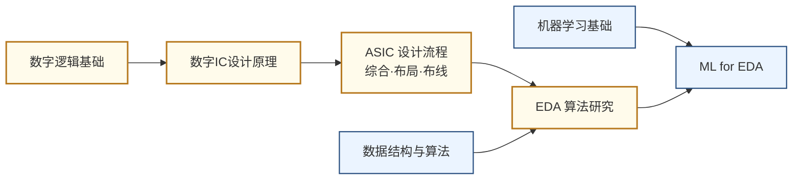

# EDA 与设计自动化

## 一句话定义

用算法和软件让芯片设计本身自动化——从逻辑综合、布局布线到用机器学习和大语言模型辅助设计决策。

## 为什么重要

一块现代 SoC 有数十亿个晶体管，靠人工一个个排布是不可能的。EDA（Electronic Design Automation）工具就是"造芯片的工具"，没有它，芯片设计无从谈起。

这个方向在中国有特殊战略意义：全球 EDA 市场被 Synopsys、Cadence、Siemens（Mentor）三家美国公司垄断，是半导体产业链中最核心的卡脖子环节之一。国内 EDA 公司（华大九天、概伦电子）正在从零追赶，学术界需要大量人才。

近年来，机器学习和大模型正在深度介入 EDA，AlphaChip（Google，2023 年 Nature）用强化学习做芯片布局，打开了"AI for EDA"的新局面。

## 核心研究问题

- **可扩展性**：2nm 以下工艺下，布局布线的搜索空间指数级爆炸，现有算法如何扩展？
- **ML for EDA**：如何用强化学习、图神经网络替代或加速传统启发式算法？
- **LLM for Chip Design**：大语言模型能否直接生成可综合的 RTL 代码，甚至理解设计意图？
- **模拟 EDA**：模拟电路的自动化设计远比数字难，如何建立可靠的模拟综合流程？

## 代表性机构与企业

| | 国际 | 国内 |
|--|------|------|
| **企业** | Synopsys、Cadence、Siemens EDA | 华大九天、概伦电子、芯华章 |
| **高校** | UCSD（Andrew Kahng）、UT Austin、UCLA | 北大、清华、复旦、东南大学 |
| **顶会** | DAC、ICCAD、DATE、ASP-DAC | — |

## 知识路径

**本站相关课程：**

- [数字集成电路设计原理（复旦）](../课程资源/电路/数字/数字集成电路/数字集成电路设计原理_FDU/MICR130029.md)
- [ASIC 设计（复旦）](../课程资源/电路/ASIC/INFO130094.md)
- [EDA 工具（复旦）](../课程资源/电路/EDA/MICR130035.md) · [Vivado 入门](../课程资源/电路/EDA/vivado.md) · [Cadence Virtuoso 入门](../课程资源/电路/EDA/cadence.md)
- [数据结构与算法（复旦）](../课程资源/算法编程/数据结构与算法/MICR130009.md)

## 入门三步走

**第一步：理解工具在做什么**  
亲手跑一遍 Vivado 或 Cadence 的完整设计流程（见本站 EDA 课程页），感受"RTL→综合→布局布线→时序分析"每一步的输入和输出。

**第二步：了解算法原理**  
阅读 Lavagno et al. 主编的 *Electronic Design Automation for IC Implementation, Circuit Design, and Process Technology*（有开放章节），或 UCSD Andrew Kahng 课程的公开讲义（DAC tutorial slides）。

**第三步：跟进 AI for EDA 前沿**  
- Mirhoseini et al., *A graph placement methodology for fast chip design* (Nature, 2021) — AlphaChip 原始论文  
- 关注 OpenROAD 项目：<https://theopenroadproject.org/>，完整开源的数字后端流程，是学术研究的标准平台
