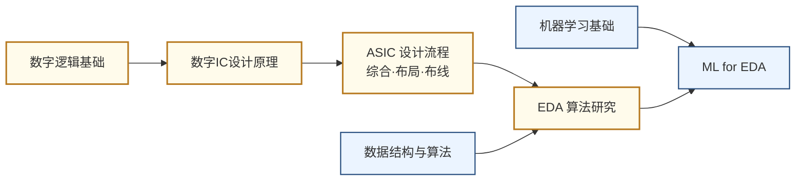

# EDA 与设计自动化

## 一句话定义

用算法和软件让芯片设计本身自动化——从逻辑综合、布局布线到用机器学习和大语言模型辅助设计决策。

## 这个方向在研究什么

芯片设计的规模大到一个令人难以直觉化的程度。一块 Apple M4 芯片大约有 280 亿颗晶体管，排列在约 300 平方毫米的硅片上。工程师写 Verilog 代码时描述的是逻辑功能——"这个模块做加法"——但要把这个逻辑意图变成可以送进晶圆厂的物理版图，中间需要经过逻辑综合、布局规划、详细布局、时钟树综合、详细布线、寄生参数提取、静态时序分析等数十个步骤，每一步都在处理亿级节点的图或者复杂的几何优化问题。这整套流程就是 EDA（Electronic Design Automation）要解决的问题，没有它，现代芯片设计根本无从谈起。

EDA 工具本质上是在求解一系列 NP 难甚至更难的优化问题。以布局为例：把几亿个逻辑单元放在芯片的物理平面上，目标是让关键路径的连线尽量短（影响时序）、拥塞尽量低（影响布线可行性）、电源网络压降尽量均匀——这些目标相互竞争，而搜索空间是天文数字级别的。传统方法用模拟退火、力导向等启发式算法在合理时间内找到"足够好"的解，但随着设计规模扩大和工艺要求趋严，这些算法越来越捉襟见肘。时序收敛（timing closure）尤其痛苦：工具布完线后发现某条路径违反了时序约束，需要局部重新布局，改完又可能影响其他路径，工程师有时要在布局-时序-布局的循环里反复迭代数周。

机器学习在这个背景下进入 EDA 并非偶然。2021 年 Google DeepMind 在 *Nature* 发表 AlphaChip，用强化学习来做芯片布局——把各大功能模块的摆放问题建模成游戏，智能体通过反复试错学习"把什么放在哪里会让整体指标更好"。在 TPU v5 的实际设计上，AlphaChip 在几小时内产出的布局方案优于人类工程师数周的手工优化结果。此后，图神经网络被用来预测布线拥塞和时序违例发生的位置，使工程师能在设计早期就调整，而不是等到最后一步才发现返工。大语言模型则被用来辅助写 RTL 代码和设计验证的 testbench，NVIDIA 专为芯片设计任务微调了 ChipNemo，Synopsys 和 Cadence 也相继把 AI 助手集成进了自己的工具套件。

模拟 EDA 是这个领域里至今最难啃的骨头。数字电路的设计质量可以用"满足时序约束"这一个核心标准来量化，但模拟电路的指标是一张相互牵制的清单——增益、带宽、噪声系数、线性度、输入输出摆幅、功耗、稳定性，没有哪个可以单独优化，改善一个往往以恶化另几个为代价。更麻烦的是，模拟电路极为依赖工艺仿真模型（SPICE model）的准确性，而这些模型在高频下误差显著，仿真结果和流片结果之间的差距让算法很难从历史数据里"学到"有价值的规律。这也解释了为什么数字 EDA 相对成熟、模拟 EDA 研究进展缓慢。

从国家战略的角度看，EDA 是芯片产业链里最典型的卡脖子环节：Synopsys、Cadence、Siemens EDA 三家美国公司占据全球市场 80% 以上的份额，2019 年对华为的禁令直接暴露了这一脆弱点，海思几乎在一夜之间失去了推进先进制程设计的工具。国内华大九天在模拟 EDA 工具上已有量产能力，DARPA 资助的 OpenROAD 是完全开源的数字后端全流程平台，被学术界广泛用于研究 AI for EDA 算法——这是目前进入这个方向最直接的实验基础。

## AI for EDA

AI for EDA 是过去五年增长最快的子方向，核心逻辑是：EDA 中的优化问题大多是 NP 难的组合优化，传统启发式算法在设计规模指数级增长后逐渐失效，而深度学习恰好擅长从海量历史设计数据中提炼规律。以下是几个最活跃的研究分支：

**强化学习做布局（RL for Floorplanning）**：Google 2021 年在 *Nature* 发表 AlphaChip，把宏单元摆放建模为序列决策问题，智能体通过反复试错学习"哪里放最优"，在 TPU 实际设计上超越人类工程师数周手工优化结果。此后 DeepMind 将其改名为 AlphaChip 并用于 TPU v5 全流程。

**图神经网络做时序与拥塞预测（GNN for Timing/Congestion）**：布线完成前就能预测哪些区域会拥塞、哪条路径会违例，让工程师在设计早期介入调整，而非等到布线后才发现返工。NVIDIA、Synopsys 均已将 GNN 集成进商业工具。

**大语言模型做 RTL 生成（LLM for RTL/EDA）**：NVIDIA 的 ChipNemo、RTLCoder、VerilogCoder 等模型可以把自然语言需求直接转成可综合的 Verilog 代码，或自动生成验证 testbench。HKUST 谢知遥团队是学术界在 LLM for EDA 上最活跃的组之一（ASPLOS 2026 Best Paper）。

**开源研究平台**：DARPA 资助的 [OpenROAD](https://github.com/The-OpenROAD-Project/OpenROAD) 提供完整的数字后端开源流程（综合到 GDSII），是研究 AI for EDA 算法的标准实验基础；北大林亦波团队发布的 [CircuitNet](https://circuitnet.github.io/) 是国内首个面向 AI for EDA 的大规模开源数据集。

## 核心研究问题

- **可扩展性**：2nm 以下工艺下，布局布线的搜索空间指数级爆炸，现有算法如何扩展？
- **ML for EDA**：如何用强化学习、图神经网络替代或加速传统启发式算法？
- **LLM for Chip Design**：大语言模型能否直接生成可综合的 RTL 代码，甚至理解设计意图？
- **模拟 EDA**：模拟电路的自动化设计远比数字难，如何建立可靠的模拟综合流程？

## 代表性机构与企业

| | 国际 | 国内 |
|--|------|------|
| **企业** | Synopsys、Cadence、Siemens EDA | 华大九天、概伦电子、芯华章 |
| **高校** | UCSD（Andrew Kahng）、UT Austin、UCLA | 北大、清华、复旦、东南大学 |
| **顶会** | DAC、ICCAD、DATE、ASP-DAC | — |

## 相关课题组

-   **[喻文健](http://numbda.cs.tsinghua.edu.cn/~yuwj/)** 清华

    EDA 算法 · 电磁场求解器 · IC 互连参数提取

-   **[叶佐昌](https://www.sic.tsinghua.edu.cn/en/info/1085/1414.htm)** 清华

    VLSI CAD 数值算法 · 电磁仿真 · 模拟/混合信号电路仿真

-   **[王彦](https://www.sic.tsinghua.edu.cn/en/info/1094/1421.htm)** 清华

    器件建模与 EDA · 电路-器件协同仿真 · 宽禁带半导体器件

-   **[梁云（Eric Liang）](https://ericlyun.me/)** 北大

    EDA · FPGA HLS 编译优化 · AI 异构计算加速

-   **[罗国杰](http://ceca.pku.edu.cn/en/people_/faculty_/guojie_luo/)** 北大

    物理设计自动化 · FPGA 布局布线 · 领域专用加速器

-   **[林亦波](https://ic.pku.edu.cn/szdw/zzjs/sjzdhyjsxtx1/lyb_ae03bbb7dd1548659c1ffe83edd4a047/index.htm)** 北大

    AI for EDA · GPU/FPGA 加速 EDA 算法 · CircuitNet 数据集

-   **[李萌（Meng Li）](https://mengli.me/)** 北大

    EDA 与硬件软件协同设计 · 高效安全 AI 加速

-   **[陈建利](https://sme.fudan.edu.cn/5f/c6/c31141a352198/page.htm)** 复旦

    IC 布局算法 · VLSI 物理设计优化

-   **[曾璇](https://asic-skl.fudan.edu.cn/d2/0c/c29516a315916/page.htm)** 复旦

    模拟电路 EDA · ML 辅助 IC 设计自动化 · 高速互连分析

-   **[杨帆](https://faculty.fudan.edu.cn/yangfan/zh_CN/index.htm)** 复旦

    电路级仿真 · 互连仿真 · 热分析 EDA

-   **[郭新飞（Xinfei Guo）](https://sites.gc.sjtu.edu.cn/xinfei-guo/)** 交大

    AI 辅助 EDA · 低功耗设计 · FPGA 加速器

-   **[谢知遥（Zhiyao Xie）](https://zhiyaoxie.com/)** 港科大

    AI 辅助 EDA · LLM for RTL 生成 · 时序分析

-   **[余蓓（Bei Yu）](https://www.cse.cuhk.edu.hk/~byu/)** CUHK

    ML + EDA · 光刻热点检测 · 布局布线优化

-   **[何宗毅（Tsung-Yi Ho）](https://www.cse.cuhk.edu.hk/people/faculty/tsung-yi-ho/)** CUHK

    3D IC/先进封装 EDA · Chiplet 设计自动化

-   **[徐强（Qiang Xu）](https://www.cse.cuhk.edu.hk/~qxu/)** CUHK

    EDA 测试与验证 · 硬件安全 · 近似计算

-   **[Andrew Kahng](https://vlsicad.ucsd.edu/~abk/)** UCSD

    物理设计 · 布局布线 · OpenROAD 开源 EDA

-   **[Jason Cong（丛京生）](https://vast.cs.ucla.edu/people/faculty/jason-cong)** UCLA

    FPGA 设计自动化 · HLS · 领域专用计算

-   **[David Z. Pan](https://users.ece.utexas.edu/~dpan/)** UT Austin

    EDA · AI/IC 协同优化 · 模拟/RF 设计自动化

-   **[Azalia Mirhoseini](https://profiles.stanford.edu/azalia-mirhoseini)** Stanford

    ML 驱动芯片布局 · AlphaChip

## 知识路径

**本站相关课程：**

- [数字集成电路设计原理（复旦）](../课程资源/电路/数字/数字集成电路/数字集成电路设计原理_FDU/MICR130029.md)
- [ASIC 设计（复旦）](../课程资源/电路/ASIC/INFO130094.md)
- [EDA 工具（复旦）](../课程资源/电路/EDA/MICR130035.md) · [Vivado 入门](../课程资源/电路/EDA/vivado.md) · [Cadence Virtuoso 入门](../课程资源/电路/EDA/cadence.md)
- [数据结构与算法（复旦）](../课程资源/算法编程/数据结构与算法/MICR130009.md)

## 入门三步走

**第一步：理解工具在做什么**  
亲手跑一遍 Vivado 或 Cadence 的完整设计流程（见本站 EDA 课程页），感受"RTL→综合→布局布线→时序分析"每一步的输入和输出。

**第二步：了解算法原理**  
阅读 Lavagno et al. 主编的 *Electronic Design Automation for IC Implementation, Circuit Design, and Process Technology*（有开放章节），或 UCSD Andrew Kahng 课程的公开讲义（DAC tutorial slides）。

**第三步：跟进 AI for EDA 前沿**  
- Mirhoseini et al., *A graph placement methodology for fast chip design* (Nature, 2021) — AlphaChip 原始论文  
- 关注 OpenROAD 项目：<https://theopenroadproject.org/>，完整开源的数字后端流程，是学术研究的标准平台
