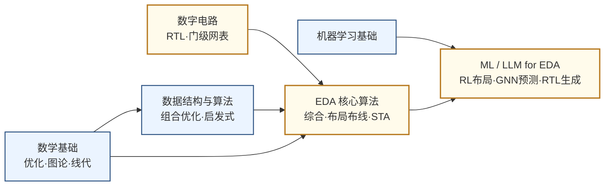

---
hide:
  - navigation
---
用算法和软件让芯片设计本身自动化——从逻辑综合、布局布线到用机器学习和大语言模型辅助设计决策。

## 这个方向在研究什么

芯片设计的规模大到一个令人难以直觉化的程度。一块 Apple M4 芯片大约有 280 亿颗晶体管，排列在约 300 平方毫米的硅片上。工程师写 Verilog 代码时描述的是逻辑功能——"这个模块做加法"——但要把这个逻辑意图变成可以送进晶圆厂的物理版图，中间需要经过逻辑综合、布局规划、详细布局、时钟树综合、详细布线、寄生参数提取、静态时序分析等数十个步骤，每一步都在处理亿级节点的图或者复杂的几何优化问题。这整套流程就是 EDA（Electronic Design Automation）要解决的问题，没有它，现代芯片设计根本无从谈起。

EDA 工具本质上是在求解一系列 NP 难甚至更难的优化问题。以布局为例：把几亿个逻辑单元放在芯片的物理平面上，目标是让关键路径的连线尽量短（影响时序）、拥塞尽量低（影响布线可行性）、电源网络压降尽量均匀——这些目标相互竞争，而搜索空间是天文数字级别的。传统方法用模拟退火、力导向等启发式算法在合理时间内找到"足够好"的解，但随着设计规模扩大和工艺要求趋严，这些算法越来越捉襟见肘。时序收敛（timing closure）尤其痛苦：工具布完线后发现某条路径违反了时序约束，需要局部重新布局，改完又可能影响其他路径，工程师有时要在布局-时序-布局的循环里反复迭代数周。

<svg viewBox="0 0 860 220" xmlns="http://www.w3.org/2000/svg" style="width:100%;max-width:860px;display:block;margin:1.2em auto;">
  <!-- Background panel -->
  <rect x="6" y="10" width="848" height="200" rx="10" fill="#F8FAFC" stroke="#CBD5E1" stroke-width="1.5"/>
  <!-- Flow boxes (blue) -->
  <!-- Box 1: RTL代码 -->
  <rect x="20" y="50" width="120" height="52" rx="7" fill="#DBEAFE" stroke="#3B82F6" stroke-width="1.8"/>
  <text x="80" y="72" text-anchor="middle" font-size="12" font-weight="bold" fill="#1D4ED8" font-family="sans-serif">RTL 代码</text>
  <text x="80" y="90" text-anchor="middle" font-size="10" fill="#3B82F6" font-family="sans-serif">Verilog / VHDL</text>
  <!-- Arrow 1→2 -->
  <line x1="140" y1="76" x2="164" y2="76" stroke="#64748B" stroke-width="2"/>
  <polygon points="164,72 176,76 164,80" fill="#64748B"/>
  <!-- Box 2: 逻辑综合 -->
  <rect x="176" y="50" width="120" height="52" rx="7" fill="#DBEAFE" stroke="#3B82F6" stroke-width="1.8"/>
  <text x="236" y="72" text-anchor="middle" font-size="12" font-weight="bold" fill="#1D4ED8" font-family="sans-serif">逻辑综合</text>
  <text x="236" y="90" text-anchor="middle" font-size="10" fill="#3B82F6" font-family="sans-serif">门级网表</text>
  <!-- Arrow 2→3 -->
  <line x1="296" y1="76" x2="320" y2="76" stroke="#64748B" stroke-width="2"/>
  <polygon points="320,72 332,76 320,80" fill="#64748B"/>
  <!-- Box 3: 布局布线 -->
  <rect x="332" y="50" width="120" height="52" rx="7" fill="#DBEAFE" stroke="#3B82F6" stroke-width="1.8"/>
  <text x="392" y="72" text-anchor="middle" font-size="12" font-weight="bold" fill="#1D4ED8" font-family="sans-serif">布局布线</text>
  <text x="392" y="90" text-anchor="middle" font-size="10" fill="#3B82F6" font-family="sans-serif">P&amp;R</text>
  <!-- Arrow 3→4 -->
  <line x1="452" y1="76" x2="476" y2="76" stroke="#64748B" stroke-width="2"/>
  <polygon points="476,72 488,76 476,80" fill="#64748B"/>
  <!-- Box 4: 时序验证 -->
  <rect x="488" y="50" width="120" height="52" rx="7" fill="#DBEAFE" stroke="#3B82F6" stroke-width="1.8"/>
  <text x="548" y="72" text-anchor="middle" font-size="12" font-weight="bold" fill="#1D4ED8" font-family="sans-serif">时序验证</text>
  <text x="548" y="90" text-anchor="middle" font-size="10" fill="#3B82F6" font-family="sans-serif">STA</text>
  <!-- Arrow 4→5 -->
  <line x1="608" y1="76" x2="632" y2="76" stroke="#64748B" stroke-width="2"/>
  <polygon points="632,72 644,76 632,80" fill="#64748B"/>
  <!-- Box 5: GDSII -->
  <rect x="644" y="50" width="120" height="52" rx="7" fill="#DBEAFE" stroke="#3B82F6" stroke-width="1.8"/>
  <text x="704" y="72" text-anchor="middle" font-size="12" font-weight="bold" fill="#1D4ED8" font-family="sans-serif">GDSII 版图</text>
  <text x="704" y="90" text-anchor="middle" font-size="10" fill="#3B82F6" font-family="sans-serif">送厂流片</text>
  <!-- Problem annotation under Box 3 -->
  <rect x="308" y="114" width="168" height="38" rx="5" fill="#FEF9C3" stroke="#D97706" stroke-width="1.2"/>
  <text x="392" y="129" text-anchor="middle" font-size="9.5" fill="#92400E" font-family="sans-serif">NP-难 | 数十亿单元</text>
  <text x="392" y="145" text-anchor="middle" font-size="9.5" fill="#92400E" font-family="sans-serif">可能迭代数周</text>
  <line x1="392" y1="102" x2="392" y2="114" stroke="#D97706" stroke-width="1.2" stroke-dasharray="4,3"/>
  <!-- AI/ML acceleration box (amber) -->
  <rect x="174" y="158" width="132" height="40" rx="6" fill="#FEF3C7" stroke="#D97706" stroke-width="1.8"/>
  <text x="240" y="175" text-anchor="middle" font-size="11" font-weight="bold" fill="#92400E" font-family="sans-serif">ML 模型</text>
  <text x="240" y="192" text-anchor="middle" font-size="9.5" fill="#D97706" font-family="sans-serif">AI / ML 加速</text>
  <!-- Arrow from ML box to Box 2 -->
  <line x1="236" y1="158" x2="236" y2="108" stroke="#D97706" stroke-width="1.5" stroke-dasharray="5,3"/>
  <polygon points="232,108 236,96 240,108" fill="#D97706"/>
  <!-- Arrow from ML box to Box 3 -->
  <line x1="280" y1="178" x2="360" y2="110" stroke="#D97706" stroke-width="1.5" stroke-dasharray="5,3"/>
  <polygon points="356,103 364,112 352,113" fill="#D97706"/>
</svg>

机器学习在这个背景下进入 EDA 并非偶然。2021 年 Google DeepMind 在 *Nature* 发表 AlphaChip，用强化学习来做芯片布局——把各大功能模块的摆放问题建模成游戏，智能体通过反复试错学习"把什么放在哪里会让整体指标更好"。在 TPU v5 的实际设计上，AlphaChip 在几小时内产出的布局方案优于人类工程师数周的手工优化结果。此后，图神经网络被用来预测布线拥塞和时序违例发生的位置，使工程师能在设计早期就调整，而不是等到最后一步才发现返工。大语言模型则被用来辅助写 RTL 代码和设计验证的 testbench，NVIDIA 专为芯片设计任务微调了 ChipNemo，RTLCoder、VerilogCoder 等开源模型把自然语言需求转成可综合 Verilog；HKUST 谢知遥团队是学术界在 LLM for EDA 上最活跃的组之一，斩获 ASPLOS 2026 最佳论文。开源实验平台方面，DARPA 资助的 OpenROAD 提供完整的数字后端流程，北大林亦波团队发布的 CircuitNet 是国内首个面向 AI for EDA 的大规模开源数据集，是入门这个方向最直接的实验基础。

模拟 EDA 是这个领域里至今最难啃的骨头。数字电路的设计质量可以用"满足时序约束"这一个核心标准来量化，但模拟电路的指标是一张相互牵制的清单——增益、带宽、噪声系数、线性度、输入输出摆幅、功耗、稳定性，没有哪个可以单独优化，改善一个往往以恶化另几个为代价。更麻烦的是，模拟电路极为依赖工艺仿真模型（SPICE model）的准确性，而这些模型在高频下误差显著，仿真结果和流片结果之间的差距让算法很难从历史数据里"学到"有价值的规律。这也解释了为什么数字 EDA 相对成熟、模拟 EDA 研究进展缓慢。

从国家战略的角度看，EDA 是芯片产业链里最典型的卡脖子环节：Synopsys、Cadence、Siemens EDA 三家美国公司占据全球市场 80% 以上的份额，2019 年对华为的禁令直接暴露了这一脆弱点，海思几乎在一夜之间失去了推进先进制程设计的工具。国内华大九天在模拟 EDA 工具上已有量产能力；对于想做 AI for EDA 研究的学者，OpenROAD 和 CircuitNet 是目前最直接的开源实验基础。

### 核心研究问题

- **组合爆炸 vs 算力**：把亿级逻辑单元摆上物理平面，是 NP 难甚至更难的优化问题，搜索空间天文数字。模拟退火、力导向这类启发式在工艺趋严、设计变大的当下越来越捉襟见肘，如何让算法继续扩展？
- **时序收敛（timing closure）**：布完线发现某条路径违反时序约束，局部重布又牵动其他路径，工程师常在"布局—时序—布局"循环里迭代数周。能否预测违例位置、在早期就避免这种反复返工？
- **ML for EDA**：强化学习（AlphaChip 式的布局博弈建模）、图神经网络（预测布线拥塞与时序违例）能在多大程度上替代或加速传统启发式？怎样的开源数据（如 CircuitNet）才足以让模型学到可迁移的规律？
- **LLM for Chip Design**：大语言模型能否把自然语言需求直接转成可综合的 RTL、自动写验证 testbench，乃至真正"理解"设计意图，而不只是模式拼接？
- **模拟 EDA 的不可学性**：模拟指标是增益/带宽/噪声/线性度/功耗相互牵制的清单，且高度依赖 SPICE 模型——高频下仿真与流片差距显著，算法难从历史数据里学到规律。如何建立可靠的模拟综合流程？

### 知识路径

图中节点对应以下知识板块（按需选修）：

- [数学基础（优化·图论·线性代数）](../学习地图/数学/index.md)
- [数据结构与算法（组合优化的算法内核）](../学习地图/算法编程/数据结构与算法/index.md)
- [电路（数字方向，理解 RTL 与综合对象）](../学习地图/电路/数字/index.md)
- [EDA（综合·物理设计·时序分析专题）](../学习地图/电路/EDA/index.md)
- [人工智能（机器学习，ML/LLM for EDA 的根基）](../学习地图/人工智能/机器学习/index.md)

## 这个方向适合谁

EDA 是一个少见的方向——它的内核是不折不扣的**算法**问题，但领域知识全部来自**芯片设计**，产业影响又极为直接。如果你喜欢把芯片设计当成一道数学题来解，对组合优化、图算法、约束求解、机器学习有兴趣，同时又希望自己写的算法不是停在论文里、而是真的被工具厂集成进流程，那这个方向几乎是为你准备的。布局、布线、时序优化的本质，就是亿级规模上的图优化与启发式搜索；强化学习和图神经网络在这里不是赶时髦的点缀，而是直接对着"组合爆炸""时序收敛要迭代数周"这些真痛点开火的武器。

正因如此，CS 和数学背景的同学在这里格外吃香。你不需要先成为资深芯片设计师，但需要弄懂综合、布局、布线、STA 这条流水线上每一步在干什么——这个门槛，跑一遍 OpenROAD 的完整数字后端、再拿 CircuitNet 这类开源数据集做几个实验，基本就迈过去了。反过来，EE/微电子背景的同学有另一种优势：你更容易直觉到为什么某个优化目标重要、为什么时序收敛这么难、为什么模拟 EDA 至今啃不动——这种领域直觉在提出有意义的问题时很值钱，纯算法出身的人往往要绕很久才能补上。

发表节奏上要有现实预期。EDA 是一个会议驱动的社区，旗舰是 DAC、ICCAD，加上欧洲的 DATE、亚太的 ASP-DAC 和专做物理设计的 ISPD；期刊以 IEEE TCAD 为领域旗舰，TVLSI、TODAES 次之。这些顶会评审看重的是"在标准 benchmark 上把指标实打实推进"，纯讲故事、缺少可复现实验和数据的工作很难过关——这也是为什么 OpenROAD、CircuitNet 这类开源底座如今几乎是入场券。好处是这个圈子不算太大，方向清晰、迭代快，一个想法从实现到见刊的周期相对可控。

最后说影响力。EDA 是为数不多"做出来就能撬动整个行业"的方向：一个更好的布局或时序算法，可能真的被 Synopsys、Cadence 或国内的华大九天吃进产品，影响此后几年所有用这套工具流片的芯片。叠加上它是芯片产业链里最典型的卡脖子环节——三家美国公司握着八成以上市场，2019 年那道禁令把脆弱点暴露得淋漓尽致——如果你想做的是"基础设施级"的、带国家分量的研究，EDA 会让你觉得手里的工作真有重量。

## 学术界

### 课题组

**境内**

-   **[喻文健](http://numbda.cs.tsinghua.edu.cn/~yuwj/)** 清华

    EDA 算法 · 电磁场求解器 · IC 互连参数提取

-   **[叶佐昌](https://www.sic.tsinghua.edu.cn/en/info/1085/1414.htm)** 清华

    VLSI CAD 数值算法 · 电磁仿真 · 模拟/混合信号电路仿真

-   **[王彦](https://www.sic.tsinghua.edu.cn/en/info/1094/1421.htm)** 清华 

    器件建模与 EDA · 电路-器件协同仿真 · 宽禁带半导体器件

-   **[梁云（Eric Liang）](https://ericlyun.me/)** 北大

    EDA · FPGA HLS 编译优化 · AI 异构计算加速

-   **[罗国杰](http://ceca.pku.edu.cn/en/people_/faculty_/guojie_luo/)** 北大

    物理设计自动化 · FPGA 布局布线 · 领域专用加速器

-   **[林亦波](https://ic.pku.edu.cn/szdw/zzjs/sjzdhyjsxtx1/lyb_ae03bbb7dd1548659c1ffe83edd4a047/index.htm)** 北大

    AI for EDA · GPU/FPGA 加速 EDA 算法 · CircuitNet 数据集

-   **[李萌（Meng Li）](https://mengli.me/)** 北大

    EDA 与硬件软件协同设计 · 高效安全 AI 加速

-   **[陈建利](https://sme.fudan.edu.cn/5f/c6/c31141a352198/page.htm)** 复旦

    IC 布局算法 · VLSI 物理设计优化

-   **[曾璇](https://asic-skl.fudan.edu.cn/d2/0c/c29516a315916/page.htm)** 复旦 

    模拟电路 EDA · ML 辅助 IC 设计自动化 · 高速互连分析

-   **[杨帆](https://faculty.fudan.edu.cn/yangfan/zh_CN/index.htm)** 复旦

    电路级仿真 · 互连仿真 · 热分析 EDA

-   **[郭新飞（Xinfei Guo）](https://sites.gc.sjtu.edu.cn/xinfei-guo/)** 交大

    AI 辅助 EDA · 低功耗设计 · FPGA 加速器

-   **[严昌浩](https://icmne.fudan.edu.cn/2d/4e/c48925a732494/page.htm)** 复旦

    模拟电路设计自动化 · 寄生参数提取 · 可制造性设计（DFM）

-   **[金洲](https://person.zju.edu.cn/person/0025054)** 浙大 

    EDA 电路仿真 · 稀疏矩阵并行求解 · 面向科学计算的软硬件协同

-   **[纪志罡](https://icisee.sjtu.edu.cn/jiaoshiml/jizhigang.html)** 交大

    电路/器件协同可靠性设计 · 新型范式计算 · 硬件安全 EDA

-   **[蒋力](https://www.cs.sjtu.edu.cn/jiaoshiml/jiangli.html)** 交大

    芯片设计自动化 · ML 辅助硬件设计 · AI 加速器与存算架构

-   **[卓成](https://person.zju.edu.cn/chengzhuo)** 浙大

    设计自动化 · 低功耗芯片设计 · AI 算法与硬件协同

-   **[孙奇（Qi Sun）](https://qisunchn.top/)** 浙大

    ML for EDA · LLM 辅助设计与 DTCO · 设计空间探索

-   **[陈松](https://faculty.ustc.edu.cn/chensong/zh_CN/index.htm)** 中科大

    高层次综合 · 物理设计自动化 · 片上网络与神经网络加速器

-   **[钱超](http://www.lamda.nju.edu.cn/qianc/)** 南大

    演化计算与机器学习 · AI for EDA · 时序驱动芯片布局

-   **[杜力](https://ese.nju.edu.cn/dl/list.htm)** 南大

    AI 算法辅助 EDA · 模拟/射频集成电路设计 · AI 芯片架构

-   **[严骏驰（Junchi Yan）](https://thinklab.sjtu.edu.cn/)** 交大

    ML for EDA · 组合优化求解器与逻辑综合 · 图学习驱动布局布线/时序预测

-   **[郑飞君](https://person.zju.edu.cn/frank_zheng)** 浙大

    数模混合芯片 EDA · 设计制造一体化与零缺陷制造 · AI 辅助 EDA 算法

-   **[王杰（Jie Wang）](https://miralab.ai/publication/)** 中科大

    AI for EDA · 芯片宏单元布局（LaMPlace/ChiPBench） · 强化学习与神经逻辑综合

-   **[杜源（Yuan Du）](https://ese.nju.edu.cn/dy/list.htm)** 南大

    AI/LLM 辅助模拟电路设计 · 晶体管级电路与版图自动生成 · 高速接口 EDA

<button class="prof-show-all">显示全部 ↓</button>

**境外**

-   **[Zhiyao Xie（谢知遥）](https://zhiyaoxie.com/)** 港科大

    AI 辅助 EDA · LLM for RTL 生成 · 时序分析

-   **[Bei Yu（余备）](https://www.cse.cuhk.edu.hk/~byu/)** 港中大

    ML + EDA · 光刻热点检测 · 布局布线优化

-   **[Tsung-Yi Ho（何宗易）](https://www.cse.cuhk.edu.hk/people/faculty/tsung-yi-ho/)** 港中大

    3D IC/先进封装 EDA · Chiplet 设计自动化

-   **[Qiang Xu（徐强）](https://www.cse.cuhk.edu.hk/~qxu/)** 港中大

    EDA 测试与验证 · 硬件安全 · 近似计算

-   **[Andrew Kahng](https://vlsicad.ucsd.edu/~abk/)** UCSD

    物理设计 · 布局布线 · OpenROAD 开源 EDA

-   **[Jason Cong（丛京生）](https://vast.cs.ucla.edu/people/faculty/jason-cong)** UCLA

    FPGA 设计自动化 · HLS · 领域专用计算

-   **[David Z. Pan（潘志刚）](https://users.ece.utexas.edu/~dpan/)** UT Austin

    EDA · AI/IC 协同优化 · 模拟/RF 设计自动化

-   **[Azalia Mirhoseini](https://profiles.stanford.edu/azalia-mirhoseini)** Stanford 

    ML 驱动芯片布局 · AlphaChip

-   **[Larry Pileggi](https://users.ece.cmu.edu/~pileggi/)** CMU

    互连建模与时序仿真 · IC 设计方法学 · 电力系统优化

-   **[Diana Marculescu](https://www.ece.utexas.edu/people/faculty/diana-marculescu)** UT Austin 

    能效与可靠性感知计算 · 硬件感知机器学习 · 嵌入式系统

-   **[Deming Chen（陈德铭）](https://ece.illinois.edu/about/directory/faculty/dchen)** UIUC

    高层次综合（HLS） · FPGA 重构计算 · ML 硬件加速自动化

<button class="prof-show-all">显示全部 ↓</button>

### 学术会议与期刊

  
会议
    DAC
    ICCAD
    DATE
    ASP-DAC
    ISPD
  

  
期刊
    IEEE TCAD
    IEEE TVLSI
    ACM TODAES
    IEEE TC
  

## 毕业去向

### 企业

  
国内
    <a href="https://www.empyrean.com.cn/">华大九天 Empyrean</a>
    <a href="https://www.primarius-tech.com/">概伦电子 Primarius</a>
    <a href="https://www.semitronix.com/">广立微 Semitronix</a>
    <a class="dm-chip" href="https://www.x-epic.com/">芯华章 X-EPIC</a>
    <a class="dm-chip" href="https://www.xpeedic.com/">芯和半导体 Xpeedic</a>
    <a class="dm-chip" href="https://www.hisilicon.com/cn">华为海思 HiSilicon</a>
  

  
国外
    <a href="https://www.synopsys.com/">Synopsys</a>
    <a href="https://www.cadence.com/">Cadence</a>
    <a href="https://www.siemens.com/en-us/company/electronic-design-automation/">Siemens EDA（原 Mentor）</a>
    <a href="https://www.nvidia.com/">NVIDIA</a>
  

### 科研院所

  
国内
    <a class="dm-chip" href="https://www.ime.ac.cn/eda/" title="设计方法学与国产 EDA 工具研发">中科院微电子所 EDA 中心</a>
    <a class="dm-chip" href="https://www.zhejianglab.org/" title="智能计算与 AI for EDA">之江实验室</a>
    <a class="dm-chip" href="https://www.pcl.ac.cn/" title="大规模算力支撑的 EDA 算法加速">鹏城实验室</a>
  

  
国外
    <a class="dm-chip" href="https://theopenroadproject.org/" title="开源 RTL-to-GDS 数字后端流程，AI for EDA 标准实验平台">OpenROAD（UCSD VLSI CAD 实验室主导）</a>
    <a class="dm-chip" href="https://www.imec-int.com/en" title="DTCO/工艺-设计协同与先进节点设计方法学">imec</a>
    <a class="dm-chip" href="https://deepmind.google/" title="强化学习芯片布局">Google DeepMind</a>
  

