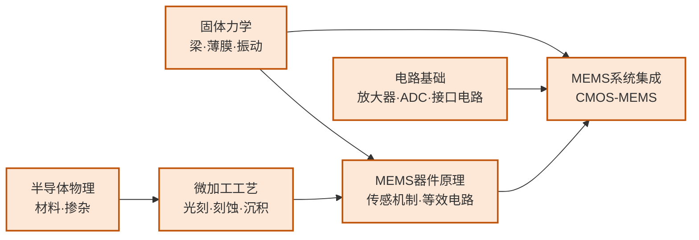

---
hide:
  - navigation
---
用半导体微加工工艺制造出与力学、热、声、化学等多物理场交互的微纳尺度器件——从手机里的加速度计到超声医学成像探头，MEMS 正是 IC 工艺与传感感知世界的交汇点。

## 这个方向在研究什么

微机电系统（MEMS, Micro-Electro-Mechanical Systems）的核心思路是：用已经高度成熟的半导体平面工艺——光刻、薄膜沉积、各向异性刻蚀——在硅片上雕刻出微米到毫米尺度的三维机械结构，让它们能感受物理世界的各种信号（加速度、压力、温度、气体浓度、声波），并转化为电信号输出。这套思路让传感器的批量制造成本降至极低：一片 8 英寸晶圆可以同时生产数千个加速度计，这正是今天每部智能手机里都有三轴加速度计、陀螺仪和气压计，而成本却只有几分钱的原因。

<svg viewBox="0 0 880 220" style="width:100%;max-width:860px;display:block;margin:1.5em auto;font-family:system-ui,-apple-system,sans-serif">
  <defs>
    <marker id="arr3" markerWidth="8" markerHeight="8" refX="6" refY="3" orient="auto">
      <path d="M0,0 L0,6 L8,3 z" fill="#1E40AF"/>
    </marker>
  </defs>
  <!-- Panel 1: MEMS 加速度计 弹簧-质量系统 -->
  <rect x="10" y="10" width="420" height="200" rx="8" fill="#F8FAFC" stroke="#CBD5E1" stroke-width="1.5"/>
  <text x="220" y="30" text-anchor="middle" font-size="13" font-weight="700" fill="#1E293B">MEMS 加速度计（弹簧-质量系统）</text>
  <!-- Left anchor -->
  <rect x="30" y="88" width="30" height="44" rx="3" fill="#94A3B8" stroke="#64748B" stroke-width="1.5"/>
  <text x="45" y="114" text-anchor="middle" font-size="9" fill="#F8FAFC">锚</text>
  <!-- Left spring (zigzag) -->
  <polyline points="60,110 70,96 80,124 90,96 100,124 110,96 120,110" fill="none" stroke="#D97706" stroke-width="2.5" stroke-linejoin="round"/>
  <!-- Central mass -->
  <rect x="120" y="72" width="160" height="76" rx="5" fill="#BFDBFE" stroke="#3B82F6" stroke-width="2"/>
  <text x="200" y="110" text-anchor="middle" font-size="12" font-weight="600" fill="#1E40AF">质量块</text>
  <text x="200" y="126" text-anchor="middle" font-size="10" fill="#3B82F6">mass</text>
  <!-- Right spring (zigzag) -->
  <polyline points="280,110 290,96 300,124 310,96 320,124 330,96 340,110" fill="none" stroke="#D97706" stroke-width="2.5" stroke-linejoin="round"/>
  <!-- Right anchor -->
  <rect x="340" y="88" width="30" height="44" rx="3" fill="#94A3B8" stroke="#64748B" stroke-width="1.5"/>
  <text x="355" y="114" text-anchor="middle" font-size="9" fill="#F8FAFC">锚</text>
  <!-- Top sense electrode -->
  <rect x="148" y="52" width="104" height="16" rx="3" fill="#DCFCE7" stroke="#16A34A" stroke-width="1.5"/>
  <text x="200" y="63" text-anchor="middle" font-size="9" fill="#166534">固定感应极板</text>
  <!-- Bottom sense electrode -->
  <rect x="148" y="152" width="104" height="16" rx="3" fill="#DCFCE7" stroke="#16A34A" stroke-width="1.5"/>
  <text x="200" y="163" text-anchor="middle" font-size="9" fill="#166534">固定感应极板</text>
  <!-- External force arrow -->
  <line x1="15" y1="110" x2="55" y2="110" stroke="#1E40AF" stroke-width="2" marker-end="url(#arr3)"/>
  <text x="12" y="103" font-size="10" fill="#1E40AF">外力 a</text>
  <!-- Caption -->
  <text x="220" y="184" text-anchor="middle" font-size="10" fill="#475569">质量块在外力下位移 → 改变电容 → 测量加速度</text>
  <text x="220" y="198" text-anchor="middle" font-size="10" fill="#94A3B8">手机 IMU · 汽车 ABS · 无人机飞控</text>
  <!-- Panel 2: CMUT 超声换能器 -->
  <rect x="450" y="10" width="420" height="200" rx="8" fill="#F8FAFC" stroke="#CBD5E1" stroke-width="1.5"/>
  <text x="660" y="30" text-anchor="middle" font-size="13" font-weight="700" fill="#1E293B">CMUT 超声换能器</text>
  <!-- Bottom electrode (substrate) -->
  <rect x="510" y="140" width="300" height="22" rx="3" fill="#E2E8F0" stroke="#94A3B8" stroke-width="1.5"/>
  <text x="660" y="154" text-anchor="middle" font-size="10" fill="#475569">底部电极（衬底）</text>
  <!-- Gap cavity -->
  <rect x="510" y="118" width="300" height="22" rx="2" fill="#EFF6FF" stroke="#BFDBFE" stroke-width="1" stroke-dasharray="4,2"/>
  <text x="660" y="132" text-anchor="middle" font-size="9" fill="#93C5FD">气隙（gap）</text>
  <!-- Membrane (deflected) -->
  <path d="M510,118 Q570,100 660,96 Q750,100 810,118" fill="none" stroke="#D97706" stroke-width="3"/>
  <text x="660" y="92" text-anchor="middle" font-size="10" fill="#92400E">振动薄膜（deflected）</text>
  <!-- Voltage label -->
  <text x="480" y="130" text-anchor="middle" font-size="12" font-weight="700" fill="#7C3AED">V</text>
  <line x1="488" y1="118" x2="510" y2="118" stroke="#7C3AED" stroke-width="1.5"/>
  <line x1="488" y1="140" x2="510" y2="140" stroke="#7C3AED" stroke-width="1.5"/>
  <!-- Ultrasound waves -->
  <path d="M620,70 Q640,55 660,50 Q680,55 700,70" fill="none" stroke="#16A34A" stroke-width="1.5"/>
  <path d="M610,58 Q635,38 660,32 Q685,38 710,58" fill="none" stroke="#16A34A" stroke-width="1.5" opacity="0.7"/>
  <path d="M600,46 Q630,22 660,15 Q690,22 720,46" fill="none" stroke="#16A34A" stroke-width="1.5" opacity="0.4"/>
  <text x="660" y="80" text-anchor="middle" font-size="9" fill="#166534">超声波辐射</text>
  <!-- Caption -->
  <text x="660" y="178" text-anchor="middle" font-size="10" fill="#475569">施加交流电压 → 薄膜振动 → 发射/接收超声</text>
  <text x="660" y="195" text-anchor="middle" font-size="10" fill="#94A3B8">超声指纹识别 · 便携医疗成像</text>
</svg>

每一部现代智能手机里，至少有五个 MEMS 器件在工作。加速度计感知手机的空间方向，让画面随握持方式自动旋转；陀螺仪测量角速度，让 AR 应用和防抖摄影成为可能；气压传感器辅助 GPS 室内定位；MEMS 麦克风把声波转为电信号；屏下超声波指纹识别则是最新的一员——CMUT 阵列以超声频率振动的薄膜感知手指皮肤反射图案来验证身份。这五种器件，物理原理各不相同，但都建立在同一套半导体工艺平台上批量制造，成本低到每颗几分钱。

惯性 MEMS 的设计核心是微型弹簧-质量系统。以加速度计为例：一个几十微米见方的质量块通过折叠弹簧悬挂在衬底上，两侧排列着梳状固定电极。当手机受到加速度时，质量块相对衬底偏移，可动梳齿与固定梳齿之间的电容差发生变化，读出电路把这个变化转换成加速度读数。这个器件的每一个参数——质量块面积、弹簧刚度、梳齿间距、气膜阻尼——都需要同时满足力学、电学和热噪声约束，是典型的多物理场协同设计问题。陀螺仪则利用科里奥利力：以固定频率振动的质量块在器件旋转时受到垂直方向的侧向力，通过测量侧向力即可得到角速度。现代手机 IMU 把三轴加速度计和三轴陀螺仪集成在一颗毫米级芯片上，是过去十年消费 MEMS 的核心竞争场地。

CMUT（电容式微加工超声换能器）代表了 MEMS 从惯性传感向声学感知的扩展。传统压电陶瓷超声换能器无法与 CMOS 工艺兼容，每个阵列元件都需要独立封装，成本高且集成度受限。CMUT 用微机械薄膜和电容驱动替代：硅片上刻出空腔，覆盖几百纳米厚的振动膜，施加偏置电压后薄膜以超声频率振动发射声波，接收时反射波引起薄膜偏移改变电容，整个结构可直接与 CMOS 读出电路单片集成。屏下超声指纹是已量产的应用；医疗超声成像正从大型落地设备向手持便携式转变，背后是 CMUT 阵列+CMOS SoC 的单芯片化趋势——经颅超声神经调控和血管内 IVUS 导管方向还有大量开放性研究问题。

气体传感和 RF MEMS 谐振器是两个扩展方向。气体传感器把氧化锡（SnO₂）等对特定气体敏感的材料沉积在 MEMS 加热平台上，加热器将材料升温至工作点，待测气体与表面反应引起电阻变化，以此检测气体种类和浓度；关键挑战是同时实现微瓦级待机功耗和 ppb 级检测灵敏度，在食品安全、室内空气质量和工业泄漏监测中有实际需求。RF MEMS 谐振器则研究用机械谐振来做高品质因数频率选择器件：MEMS 谐振器的 Q 值可超过 10⁶，远高于 CMOS 振荡器，在手机和 5G 基站的频率参考和带通滤波上有替代石英晶振的潜力；如何把这些机械器件直接集成在 CMOS 芯片上而非单独封装，至今仍是 RF MEMS 核心的开放工程问题。

## 适合什么样的人

MEMS 研究是实验驱动的，日常工作有大量时间在洁净间里完成：硅深刻蚀（DRIE）、薄膜沉积、释放刻蚀，以及用探针台或真空测试台对制备出来的微结构做电学和力学表征。如果你对亲手制作出一个肉眼看不见却能感知加速度或声波的微结构有强烈好奇心，这个方向的实验环节会很有吸引力。

这个方向有一个独特之处：它要求同时懂力学和电学。固体力学（梁的弯曲、谐振模态）和电容传感原理需要一并掌握，而不是单纯的电路或单纯的材料背景。本科阶段如果同时接触过材料力学和模拟电路，会有很好的起步优势；如果只有纯电路背景，需要补充结构力学的基础。COMSOL 多物理场仿真是这个方向几乎必用的工具，提前熟悉会大幅降低入门门槛。

仿真驱动型的同学可以专注于 MEMS 系统建模和等效电路分析，不必亲手做所有工艺，但理解工艺约束对设计的影响是必须的，否则仿真结论很难落到可制造的结构上。不太适合的情况：如果你对物理世界的感知和机械结构完全没有兴趣，纯粹只想做数字芯片或算法，MEMS 的研究氛围和关注点会显得相当陌生；而且这个方向的论文发表周期（从器件设计到工艺验证到测试）通常比纯仿真方向长，适合有耐心做完整实验闭环的研究者。

## 核心研究问题

- **多物理场耦合仿真**：MEMS 器件同时涉及结构力学、流体力学、静电场、热场，如何在设计早期准确预测多场耦合行为？
- **CMOS-MEMS 单片集成**：MEMS 工艺与 CMOS 工艺的温度预算和材料体系不兼容，如何实现高集成度的单片方案？
- **微封装与可靠性**：MEMS 可动结构对应力、温湿度、冲击敏感，如何实现稳定的晶圆级气密封装？
- **微型化与能耗**：传感节点要求极低功耗（微瓦级）并能从环境中获取能量（压电/电磁能量采集），如何兼顾灵敏度与能效？

## 代表性机构

| | 国际 | 国内 |
|--|------|------|
| **企业** | Bosch（惯性MEMS）、TDK（超声）、STMicroelectronics、Honeywell | 明皜传感、矽睿科技、赛微电子 |
| **顶会** | Transducers · IEEE MEMS · Sensors · IEEE JMEMS | — |

## 知识路径

图中节点对应以下知识板块（按需选修）：

- [物理基础](../课程资源/物理/index.md)（固体物理·半导体物理）
- [器件与工艺](../课程资源/器件与工艺/index.md)（器件原理·IC工艺原理）
- [电路](../课程资源/电路/index.md)（模拟电路·接口电路方向）

## 入门三步走

**典型研究长什么样**

Transducers 和 IEEE MEMS 的顶会论文通常以"新型 MEMS 结构或新工艺"为主线：制备一个微型传感器或执行器，报告其灵敏度、噪声底（noise floor）、量程和功耗，核心图表是频响曲线、噪声谱密度和与同类器件的性能对比表。器件层的研究不需要完整的系统流片，但至少需要在工艺平台（如 PolyMUMPs、自研工艺）上完成工艺验证；结论格式通常是"器件 X 实现了指标 Y，相比基线提升 Z 倍，其工作机制由 COMSOL 仿真和实测结果共同确认"。与 IC 研究不同，MEMS 论文很少需要大规模阵列良率数据，单个或少量器件的精确表征即可支撑发表。

**第一步：建立基本直觉**  
阅读 Senturia《Microsystem Design》第 1-3 章（MEMS 概述、器件建模思路、等效电路），这是 MEMS 领域被引最广的教材。

**第二步：了解主流工艺平台**  
访问 MEMSCAP（memscap.com）和 CMC Microsystems，了解 PolyMUMPs、SOIMUMPs 等开放 MEMS 工艺的流程和设计规则，感受真实的工艺约束。

**第三步：动手仿真**  
COMSOL Multiphysics 的 MEMS 模块可以对机电耦合结构做有限元仿真，从电容式加速度计的模态分析入手，是掌握多物理场仿真最直接的方式。

## 相关课题组

### 境内

-   **[金晓冬](https://sme.fudan.edu.cn/83/6c/c31146a689004/page.htm)** 复旦

    新型 MEMS 器件设计 · MEMS 专用 ASIC 芯片 · MEMS 可靠性

-   **[卢红亮](https://sme.fudan.edu.cn/60/ba/c31133a352442/page.htm)** 复旦

    MEMS 气体传感器 · 新型氧化物半导体材料 · ALD 纳米功能薄膜

-   **[任天令](https://www.sic.tsinghua.edu.cn/info/1033/1545.htm)** 清华

    石墨烯/二维材料微纳器件 · 柔性可穿戴传感器 · 声学 MEMS · IEEE Fellow

-   **[阮勇](https://faculty.dpi.tsinghua.edu.cn/ruanyong/zh_CN/index/13066/list/index.htm)** 清华

    硅基 MEMS 加工技术 · MEMS 继电器 · 恶劣环境传感器与执行器

-   **[张大成](https://ic.pku.edu.cn/szdw/zzjs/Z1/zdc/index.htm)** 北大

    硅 MEMS 微加工工艺 · CMOS-MEMS 单片集成 · 多物理量传感器

-   **[杨振川](https://ic.pku.edu.cn/szdw/zzjs/jcwnxtx1/yzc/index.htm)** 北大

    物理量 MEMS 传感器（声矢量传感器、流量、压力） · 惯性传感器

-   **[张海霞](https://ic.pku.edu.cn/szdw/zzjs/jcwnxtx1/zhx/index.htm)** 北大

    微纳系统 · MEMS 微能源（压电/摩擦纳米发电机） · 微纳制造

-   **[李志宏](https://ic.pku.edu.cn/szdw/zzjs/L1/lzh/index.htm)** 北大

    生物 MEMS（BioMEMS） · 微纳流控系统 · 植入式神经探针

-   **[卢奕鹏](https://ic.pku.edu.cn/szdw/zzjs/jcwnxtx1/lyp/index.htm)** 北大

    压电 MEMS（PMUT）超声传感器 · CMOS-MEMS 集成 · 超声指纹识别

<button class="prof-show-all">显示全部 ↓</button>

### 境外

-   **[李贻昆（Yi-Kuen Lee）](https://seng.hkust.edu.hk/about/people/faculty/yi-kuen-lee)** 港科大

    CMOS MEMS 传感器（AIoT 应用） · 微纳流控生物医疗 MEMS

-   **[田志楠（Norman Tien）](https://www.eee.hku.hk/people/nctien/)** 港大

    MEMS 微纳制造（通信/医疗/环境监测）· Taikoo Chair Professor of Microsystems Technology

-   **[廖维新（Wei-Hsin Liao）](https://www4.mae.cuhk.edu.hk/peoples/liao-wei-hsin/)** 港中大

    MEMS 智能材料 · 压电/磁致伸缩执行器 · 振动能量回收 · ASME Da Vinci Award

-   **[Butrus Khuri-Yakub](https://kyg.stanford.edu/)** Stanford

    电容式微加工超声换能器（CMUT） · 医学超声成像 · 化学/生物传感器

-   **[Clark T.-C. Nguyen](https://people.eecs.berkeley.edu/~ctnguyen/index.html)** UC Berkeley

    MEMS 谐振器/滤波器/振荡器 · RF MEMS 信号处理 · BSAC 执行主任

-   **[Kristofer Pister](https://www2.eecs.berkeley.edu/Faculty/Homepages/pister.html)** UC Berkeley

    自主微系统（Smart Dust 概念发明者） · 硅微机器人 · MEMS 传感节点

-   **[Khalil Najafi](https://eecs.engin.umich.edu/people/najafi-khalil/)** U Michigan

    MEMS 惯性传感器（微机械振动环陀螺先驱） · 晶圆级气密封装 · 神经接口微系统

-   **[Yogesh Gianchandani](https://gianchandani.engin.umich.edu/)** U Michigan

    微传感器/微执行器（惯性/环境/生物医疗） · 微流控 · WIMS² Institute 主任

-   **[Gary Fedder](https://www.ece.cmu.edu/directory/bios/fedder-gary.html)** CMU

    CMOS-MEMS 单片集成工艺与设计方法学 · 微加速度计与陀螺 · IEEE Fellow

<button class="prof-show-all">显示全部 ↓</button>
