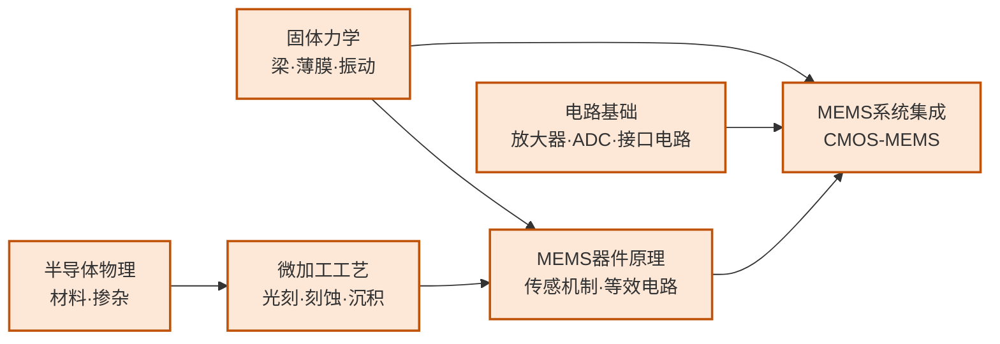

---
hide:
  - navigation
---
# MEMS与微纳传感器

## 一句话定义

用半导体微加工工艺制造出与力学、热、声、化学等多物理场交互的微纳尺度器件——从手机里的加速度计到超声医学成像探头，MEMS 正是 IC 工艺与传感感知世界的交汇点。

## 这个方向在研究什么

微机电系统（MEMS, Micro-Electro-Mechanical Systems）的核心思路是：用已经高度成熟的半导体平面工艺——光刻、薄膜沉积、各向异性刻蚀——在硅片上雕刻出微米到毫米尺度的三维机械结构，让它们能感受物理世界的各种信号（加速度、压力、温度、气体浓度、声波），并转化为电信号输出。这套思路让传感器的批量制造成本降至极低：一片 8 英寸晶圆可以同时生产数千个加速度计，这正是今天每部智能手机里都有三轴加速度计、陀螺仪和气压计，而成本却只有几分钱的原因。

惯性 MEMS 是最成熟的产品线。MEMS 加速度计的工作原理是：悬挂在弹簧上的质量块在外力作用下偏移，通过测量可动电极与固定电极之间电容的变化感知加速度。MEMS 陀螺仪则利用科里奥利力——以固定频率振动的质量块在旋转时受到的侧向力——来测量角速度。现代手机、汽车 ABS 系统、无人机飞控中使用的 IMU（惯性测量单元）正是加速度计与陀螺仪的集成。设计这些器件需要同时掌握固体力学（梁的弯曲、振动模态）、电容传感原理和工艺约束，是典型的多物理场耦合问题。

声学 MEMS 是近年发展最快的方向之一，核心器件是超声换能器。电容式微加工超声换能器（CMUT, Capacitive Micromachined Ultrasonic Transducer）和压电式（PMUT）将微机械振动薄膜与超声收发耦合，相比传统压电陶瓷换能器，在带宽、集成度和工艺兼容性上有明显优势。CMUT/PMUT 已在手机超声指纹识别、便携式医疗超声成像中实现量产。更前沿的方向是将 CMUT 阵列与 CMOS 读出电路单片集成（CMOS-MEMS），实现全集成超声成像 SoC。

气体传感器和化学传感器将 MEMS 工艺与新型敏感材料结合，形成一个独特的研究分支。氧化锡（SnO₂）等金属氧化物半导体材料在不同气体环境下的电阻率显著变化，可用于检测 H₂S、CO、NO₂ 等气体。将这些材料通过 ALD（原子层沉积）或溅射工艺集成到 MEMS 加热器平台上，可以实现微瓦量级功耗下 ppb 级的气体检测灵敏度——这在食品安全、工业监测、室内空气质量传感中有重要应用。

RF MEMS 和谐振器是另一个重要分支，研究用机械谐振来实现高品质因数（Q 值）的频率选择器件，替代传统的石英晶振和表面声波（SAW）滤波器。MEMS 谐振器的 Q 值可以超过 10⁶，是 CMOS 电路的几个数量级倍，在无线通信的频率参考和带通滤波器中有巨大的应用价值。Clark Nguyen 在 UCB 提出的"1-chip radio"愿景——用 MEMS 谐振器阵列实现一块芯片上的完整收发信机——至今仍是 RF MEMS 领域的长期目标。

## 核心研究问题

- **多物理场耦合仿真**：MEMS 器件同时涉及结构力学、流体力学、静电场、热场，如何在设计早期准确预测多场耦合行为？
- **CMOS-MEMS 单片集成**：MEMS 工艺与 CMOS 工艺的温度预算和材料体系不兼容，如何实现高集成度的单片方案？
- **微封装与可靠性**：MEMS 可动结构对应力、温湿度、冲击敏感，如何实现稳定的晶圆级气密封装？
- **微型化与能耗**：传感节点要求极低功耗（微瓦级）并能从环境中获取能量（压电/电磁能量采集），如何兼顾灵敏度与能效？

## 代表性机构与企业

| | 国际 | 国内 |
|--|------|------|
| **企业** | Bosch（惯性MEMS）、TDK（超声）、STMicroelectronics、Honeywell | 明皜传感、矽睿科技、赛微电子 |
| **高校** | MIT、Stanford、UCB、UMich | 复旦、北大、清华 |
| **顶会** | Transducers · IEEE MEMS · Sensors · IEEE JMEMS | — |

## 知识路径

**本站相关课程：**

- [固体物理（复旦）](../课程资源/物理/固体物理/MICR130013.md)
- [半导体器件原理（复旦）](../课程资源/器件与工艺/半导体器件/半导体器件原理_FDU/MICR130006.md)
- [IC工艺原理（复旦）](../课程资源/器件与工艺/集成电路工艺/集成电路工艺原理_FDU/MICR130007.md)
- [模拟电子线路（复旦）](../课程资源/电路/模拟/模拟电子线路/MICR130002.md)

## 入门三步走

**第一步：建立基本直觉**  
阅读 Senturia《Microsystem Design》第 1-3 章（MEMS 概述、器件建模思路、等效电路），这是 MEMS 领域被引最广的教材。

**第二步：了解主流工艺平台**  
访问 MEMSCAP（memscap.com）和 CMC Microsystems，了解 PolyMUMPs、SOIMUMPs 等开放 MEMS 工艺的流程和设计规则，感受真实的工艺约束。

**第三步：动手仿真**  
COMSOL Multiphysics 的 MEMS 模块可以对机电耦合结构做有限元仿真，从电容式加速度计的模态分析入手，是掌握多物理场仿真最直接的方式。

## 相关课题组

### 境内

-   **[金晓冬](https://sme.fudan.edu.cn/83/6c/c31146a689004/page.htm)** 复旦

    新型 MEMS 器件设计 · MEMS 专用 ASIC 芯片 · MEMS 可靠性

-   **[卢红亮](https://sme.fudan.edu.cn/60/ba/c31133a352442/page.htm)** 复旦

    MEMS 气体传感器 · 新型氧化物半导体材料 · ALD 纳米功能薄膜

-   **[任天令](https://www.sic.tsinghua.edu.cn/info/1033/1545.htm)** 清华

    石墨烯/二维材料微纳器件 · 柔性可穿戴传感器 · 声学 MEMS · IEEE Fellow

-   **[阮勇](https://faculty.dpi.tsinghua.edu.cn/ruanyong/zh_CN/index/13066/list/index.htm)** 清华

    硅基 MEMS 加工技术 · MEMS 继电器 · 恶劣环境传感器与执行器

-   **[张大成](https://ic.pku.edu.cn/szdw/zzjs/Z1/zdc/index.htm)** 北大

    硅 MEMS 微加工工艺 · CMOS-MEMS 单片集成 · 多物理量传感器

-   **[杨振川](https://ic.pku.edu.cn/szdw/zzjs/jcwnxtx1/yzc/index.htm)** 北大

    物理量 MEMS 传感器（声矢量传感器、流量、压力） · 惯性传感器

-   **[张海霞](https://ic.pku.edu.cn/szdw/zzjs/jcwnxtx1/zhx/index.htm)** 北大

    微纳系统 · MEMS 微能源（压电/摩擦纳米发电机） · 微纳制造

-   **[李志宏](https://ic.pku.edu.cn/szdw/zzjs/L1/lzh/index.htm)** 北大

    生物 MEMS（BioMEMS） · 微纳流控系统 · 植入式神经探针

-   **[卢奕鹏](https://ic.pku.edu.cn/szdw/zzjs/jcwnxtx1/lyp/index.htm)** 北大

    压电 MEMS（PMUT）超声传感器 · CMOS-MEMS 集成 · 超声指纹识别

<button class="prof-show-all">显示全部 ↓</button>

### 境外

-   **[李贻昆（Yi-Kuen Lee）](https://seng.hkust.edu.hk/about/people/faculty/yi-kuen-lee)** 港科大

    CMOS MEMS 传感器（AIoT 应用） · 微纳流控生物医疗 MEMS

-   **[田志楠（Norman Tien）](https://www.eee.hku.hk/people/nctien/)** 港大

    MEMS 微纳制造（通信/医疗/环境监测）· Taikoo Chair Professor of Microsystems Technology

-   **[廖维新（Wei-Hsin Liao）](https://www4.mae.cuhk.edu.hk/peoples/liao-wei-hsin/)** 港中大

    MEMS 智能材料 · 压电/磁致伸缩执行器 · 振动能量回收 · ASME Da Vinci Award

-   **[Butrus Khuri-Yakub](https://kyg.stanford.edu/)** Stanford

    电容式微加工超声换能器（CMUT） · 医学超声成像 · 化学/生物传感器

-   **[Clark T.-C. Nguyen](https://people.eecs.berkeley.edu/~ctnguyen/index.html)** UC Berkeley

    MEMS 谐振器/滤波器/振荡器 · RF MEMS 信号处理 · BSAC 执行主任

-   **[Kristofer Pister](https://www2.eecs.berkeley.edu/Faculty/Homepages/pister.html)** UC Berkeley

    自主微系统（Smart Dust 概念发明者） · 硅微机器人 · MEMS 传感节点

-   **[Khalil Najafi](https://eecs.engin.umich.edu/people/najafi-khalil/)** U Michigan

    MEMS 惯性传感器（微机械振动环陀螺先驱） · 晶圆级气密封装 · 神经接口微系统

-   **[Yogesh Gianchandani](https://gianchandani.engin.umich.edu/)** U Michigan

    微传感器/微执行器（惯性/环境/生物医疗） · 微流控 · WIMS² Institute 主任

-   **[Gary Fedder](https://www.ece.cmu.edu/directory/bios/fedder-gary.html)** CMU

    CMOS-MEMS 单片集成工艺与设计方法学 · 微加速度计与陀螺 · IEEE Fellow

<button class="prof-show-all">显示全部 ↓</button>
