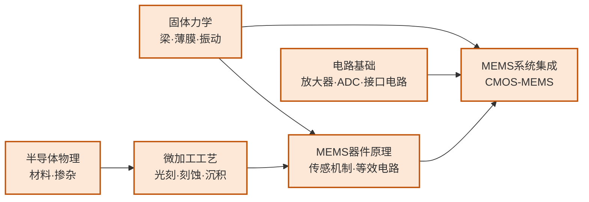

---
hide:
  - navigation
---
用半导体微加工工艺制造出与力学、热、声、化学等多物理场交互的微纳尺度器件——从手机里的加速度计到超声医学成像探头，MEMS 正是 IC 工艺与传感感知世界的交汇点。

## 这个方向在研究什么

汽车以 60 公里时速撞上护栏，车身开始形变的那一刻，气囊必须在 20 毫秒内充气。再晚一点，驾驶员的头就撞上方向盘了。触发这整个过程的，是一块芯片上一根几十微米的硅弹簧。碰撞产生的减速度让弹簧末端的质量块偏移，两侧梳齿间电容变化，信号送出，点火。这根弹簧不是机床加工的，是用光刻胶和刻蚀液从硅晶圆上直接雕出来的，和做处理器用的是同一套工艺。今天每部 iPhone 里至少有五个这样的器件：加速度计感知方向让画面随握持旋转，陀螺仪让 AR 防抖成为可能，气压传感器辅助室内定位，MEMS 麦克风把声波转成电信号，屏下超声指纹识别让你按一下就解锁。它们物理原理各不相同，却都建立在同一套半导体工艺平台上，单颗几分钱，一片晶圆同时出几千颗。MEMS 的本质只有一件事：用 IC 工艺把某种物理现象翻译成电信号，翻译的物理量不同，但平台是同一套。

<svg viewBox="0 0 880 220" style="width:100%;max-width:860px;display:block;margin:1.5em auto;font-family:system-ui,-apple-system,sans-serif">
  <defs>
    <marker id="arr3" markerWidth="8" markerHeight="8" refX="6" refY="3" orient="auto">
      <path d="M0,0 L0,6 L8,3 z" fill="#1E40AF"/>
    </marker>
  </defs>
  <!-- Panel 1: MEMS 加速度计 弹簧-质量系统 -->
  <rect x="10" y="10" width="420" height="200" rx="8" fill="#F8FAFC" stroke="#CBD5E1" stroke-width="1.5"/>
  <text x="220" y="30" text-anchor="middle" font-size="13" font-weight="700" fill="#1E293B">MEMS 加速度计（弹簧-质量系统）</text>
  <!-- Left anchor -->
  <rect x="30" y="88" width="30" height="44" rx="3" fill="#94A3B8" stroke="#64748B" stroke-width="1.5"/>
  <text x="45" y="114" text-anchor="middle" font-size="9" fill="#F8FAFC">锚</text>
  <!-- Left spring (zigzag) -->
  <polyline points="60,110 70,96 80,124 90,96 100,124 110,96 120,110" fill="none" stroke="#D97706" stroke-width="2.5" stroke-linejoin="round"/>
  <!-- Central mass -->
  <rect x="120" y="72" width="160" height="76" rx="5" fill="#BFDBFE" stroke="#3B82F6" stroke-width="2"/>
  <text x="200" y="110" text-anchor="middle" font-size="12" font-weight="600" fill="#1E40AF">质量块</text>
  <text x="200" y="126" text-anchor="middle" font-size="10" fill="#3B82F6">mass</text>
  <!-- Right spring (zigzag) -->
  <polyline points="280,110 290,96 300,124 310,96 320,124 330,96 340,110" fill="none" stroke="#D97706" stroke-width="2.5" stroke-linejoin="round"/>
  <!-- Right anchor -->
  <rect x="340" y="88" width="30" height="44" rx="3" fill="#94A3B8" stroke="#64748B" stroke-width="1.5"/>
  <text x="355" y="114" text-anchor="middle" font-size="9" fill="#F8FAFC">锚</text>
  <!-- Top sense electrode -->
  <rect x="148" y="52" width="104" height="16" rx="3" fill="#DCFCE7" stroke="#16A34A" stroke-width="1.5"/>
  <text x="200" y="63" text-anchor="middle" font-size="9" fill="#166534">固定感应极板</text>
  <!-- Bottom sense electrode -->
  <rect x="148" y="152" width="104" height="16" rx="3" fill="#DCFCE7" stroke="#16A34A" stroke-width="1.5"/>
  <text x="200" y="163" text-anchor="middle" font-size="9" fill="#166534">固定感应极板</text>
  <!-- External force arrow -->
  <line x1="15" y1="110" x2="55" y2="110" stroke="#1E40AF" stroke-width="2" marker-end="url(#arr3)"/>
  <text x="12" y="103" font-size="10" fill="#1E40AF">外力 a</text>
  <!-- Caption -->
  <text x="220" y="184" text-anchor="middle" font-size="10" fill="#475569">质量块在外力下位移 → 改变电容 → 测量加速度</text>
  <text x="220" y="198" text-anchor="middle" font-size="10" fill="#94A3B8">手机 IMU · 汽车 ABS · 无人机飞控</text>
  <!-- Panel 2: CMUT 超声换能器 -->
  <rect x="450" y="10" width="420" height="200" rx="8" fill="#F8FAFC" stroke="#CBD5E1" stroke-width="1.5"/>
  <text x="660" y="30" text-anchor="middle" font-size="13" font-weight="700" fill="#1E293B">CMUT 超声换能器</text>
  <!-- Bottom electrode (substrate) -->
  <rect x="510" y="140" width="300" height="22" rx="3" fill="#E2E8F0" stroke="#94A3B8" stroke-width="1.5"/>
  <text x="660" y="154" text-anchor="middle" font-size="10" fill="#475569">底部电极（衬底）</text>
  <!-- Gap cavity -->
  <rect x="510" y="118" width="300" height="22" rx="2" fill="#EFF6FF" stroke="#BFDBFE" stroke-width="1" stroke-dasharray="4,2"/>
  <text x="660" y="132" text-anchor="middle" font-size="9" fill="#93C5FD">气隙（gap）</text>
  <!-- Membrane (deflected) -->
  <path d="M510,118 Q570,100 660,96 Q750,100 810,118" fill="none" stroke="#D97706" stroke-width="3"/>
  <text x="660" y="92" text-anchor="middle" font-size="10" fill="#92400E">振动薄膜（deflected）</text>
  <!-- Voltage label -->
  <text x="480" y="130" text-anchor="middle" font-size="12" font-weight="700" fill="#7C3AED">V</text>
  <line x1="488" y1="118" x2="510" y2="118" stroke="#7C3AED" stroke-width="1.5"/>
  <line x1="488" y1="140" x2="510" y2="140" stroke="#7C3AED" stroke-width="1.5"/>
  <!-- Ultrasound waves -->
  <path d="M620,70 Q640,55 660,50 Q680,55 700,70" fill="none" stroke="#16A34A" stroke-width="1.5"/>
  <path d="M610,58 Q635,38 660,32 Q685,38 710,58" fill="none" stroke="#16A34A" stroke-width="1.5" opacity="0.7"/>
  <path d="M600,46 Q630,22 660,15 Q690,22 720,46" fill="none" stroke="#16A34A" stroke-width="1.5" opacity="0.4"/>
  <text x="660" y="80" text-anchor="middle" font-size="9" fill="#166534">超声波辐射</text>
  <!-- Caption -->
  <text x="660" y="178" text-anchor="middle" font-size="10" fill="#475569">施加交流电压 → 薄膜振动 → 发射/接收超声</text>
  <text x="660" y="195" text-anchor="middle" font-size="10" fill="#94A3B8">超声指纹识别 · 便携医疗成像</text>
</svg>

加速度计翻译的是惯性力。一块几十微米的硅质量块通过折叠弹簧悬在衬底上，两侧排着梳状电极；受到加速度时质量块偏移，可动梳齿和固定梳齿之间的电容差变化，读出电路把这个差值换算成加速度。这个翻译需要同时满足力学、电学和热噪声三方面约束，质量块面积、弹簧刚度、梳齿间距、气膜阻尼每个参数都不能孤立设计，是典型的多物理场协同问题。超声 MEMS 翻译的是声压：CMUT 在振膜和底部电极之间悬空一道气隙，施加交流电压时振膜振动发出超声，接收时声压使振膜形变、电容变化。更新的 PMUT 在振膜上沉积压电材料，灵敏度更高，高通的屏下超声指纹走的就是这条路线。这两类翻译机制都已经量产。把结构继续往下做小，量子力学就进场了。

把结构从微米压到纳米，力学发生质变。在微米尺度，热涨落是背景噪声；到了纳米尺度，热涨落的量级和器件本身的运动相当，成为测量的极限。SiN 纳米谐振鼓的 Q 从微米器件的 10⁵ 做到了 10⁸，谐振器能感知的最小质量精细到单个分子。一个蛋白质落在薄膜上，频率偏移就能被读出，每次只测一个分子，是经典方法根本做不到的分辨率。再往极限走，量子 NEMS 把振子冷却到量子基态，与光场耦合，振子的运动态本身进入量子叠加，开出量子传感和引力波探测的空间。**芯片级原子钟**走的是另一条极致化的路。传统铷钟是机柜级设备，GPS 拒止的场景下用不了。MEMS 工艺把原子蒸气封进微米尺度的玻璃气室，VCSEL 激光锁定原子跃迁频率，微加热线圈和磁补偿线圈全部集成，整颗钟缩到米粒大小，频率稳定度达到 10⁻¹¹，在 GPS 信号到达不了的地方自主计时。

另一道边界来自材料本身。硅不兼容生命体，也不会弯曲，这两个限制把 MEMS 挡在人体和曲面之外。BioMEMS 绕过第一道墙，把结构材料换成 PDMS、水凝胶和可降解聚合物，这些材料柔软，能和组织长期共存，最终被人体吸收。植入式闭环神经接口读取脊髓信号、驱动肌肉电刺激，让截瘫患者重新控制肢体；organ-on-chip 在微流控芯片上重建肺、肝、肠的微环境，让药物毒性测试不再完全依赖动物实验。柔性 MEMS 绕过第二道墙。石墨烯和 MoS₂ 制成的 NEMS 薄膜只有 0.3 nm，能感知单个原子吸附引起的质量变化，也能共形贴附在曲面上；可拉伸版本贴在皮肤上持续监测电生理信号；可降解版本在体内完成诊断任务后被吸收，不需要二次手术取出。材料的边界，决定了 MEMS 能进的环境。

## 适合什么样的人

MEMS 研究是实验驱动的，日常工作有大量时间在洁净间里完成：硅深刻蚀（DRIE）、薄膜沉积、释放刻蚀，以及用探针台或真空测试台对制备出来的微结构做电学和力学表征。如果你对亲手制作出一个肉眼看不见却能感知加速度或声波的微结构有强烈好奇心，这个方向的实验环节会很有吸引力。

这个方向有一个独特之处：它要求同时懂力学和电学。固体力学（梁的弯曲、谐振模态）和电容传感原理需要一并掌握，而不是单纯的电路或单纯的材料背景。本科阶段如果同时接触过材料力学和模拟电路，会有很好的起步优势；如果只有纯电路背景，需要补充结构力学的基础。COMSOL 多物理场仿真是这个方向几乎必用的工具，提前熟悉会大幅降低入门门槛。

仿真驱动型的同学可以专注于 MEMS 系统建模和等效电路分析，不必亲手做所有工艺，但理解工艺约束对设计的影响是必须的，否则仿真结论很难落到可制造的结构上。不太适合的情况：如果你对物理世界的感知和机械结构完全没有兴趣，纯粹只想做数字芯片或算法，MEMS 的研究氛围和关注点会显得相当陌生；而且这个方向的论文发表周期（从器件设计到工艺验证到测试）通常比纯仿真方向长，适合有耐心做完整实验闭环的研究者。

## 核心研究问题

- **多物理场耦合仿真**：MEMS 器件同时涉及结构力学、流体力学、静电场、热场，如何在设计早期准确预测多场耦合行为？
- **CMOS-MEMS 单片集成**：MEMS 工艺与 CMOS 工艺的温度预算和材料体系不兼容，如何实现高集成度的单片方案？
- **微封装与可靠性**：MEMS 可动结构对应力、温湿度、冲击敏感，如何实现稳定的晶圆级气密封装？
- **微型化与能耗**：传感节点要求极低功耗（微瓦级）并能从环境中获取能量（压电/电磁能量采集），如何兼顾灵敏度与能效？

## 代表性机构

> 这个方向毕业后能去的代表性企业与科研院所（国内外）。上市公司附实时股价链接，便于了解产业景气度。

### 企业

**国内**

- [歌尔股份](https://www.goertek.com/) · [实时股价](https://quote.eastmoney.com/sz002241.html) — MEMS 麦克风全球市占第一、声学/光学传感器
- [瑞声科技（AAC）](https://www.aactechnologies.com/) · [实时股价](https://quote.eastmoney.com/hk/02018.html) — 声学器件、MEMS 麦克风
- [赛微电子（Silex/赛莱克斯）](https://www.smeiic.com/) · [实时股价](https://quote.eastmoney.com/sz300456.html) — MEMS 晶圆代工龙头
- [敏芯股份（MEMSensing）](https://www.memsensing.com/) · [实时股价](https://quote.eastmoney.com/sh688286.html) — MEMS 麦克风/压力/惯性传感器设计，"MEMS 第一股"
- [矽睿科技（QST）](https://www.qstcorp.com/)（IMU/加速度计/磁传感器，科创板筹备中，未上市）
- [明皜传感（MiraMEMS）](http://www.miramems.com/)（加速度计/陀螺仪，母公司苏州固锝控股）· [母公司股价](https://quote.eastmoney.com/sz002079.html)
- [卓胜微（Maxscend）](https://www.maxscend.com/) · [实时股价](https://quote.eastmoney.com/sz300782.html) — RF 声学器件、SAW/BAW 滤波器（IPD/MEMS 工艺）
- [天奥电子（Spaceon）](https://www.elecspn.com/) · [实时股价](https://quote.eastmoney.com/sz002935.html) — 时间频率器件、芯片级/小型原子钟

**国外**

- [Bosch Sensortec](https://www.bosch-sensortec.com/)（惯性 MEMS 全球龙头，博世基金会控股，未上市）
- [STMicroelectronics](https://www.st.com/) · [实时股价](https://finance.yahoo.com/quote/STM) — IMU/MEMS 传感器，智能手机市占领先
- [TDK InvenSense](https://invensense.tdk.com/) · [实时股价](https://finance.yahoo.com/quote/6762.T) — 运动传感器、超声 MEMS
- [Qualcomm](https://www.qualcomm.com/products/features/fingerprint-sensors) · [实时股价](https://finance.yahoo.com/quote/QCOM) — 3D Sonic 超声指纹（PMUT）
- [Butterfly Network](https://www.butterflynetwork.com/) · [实时股价](https://finance.yahoo.com/quote/BFLY) — CMUT 超声片上化（Ultrasound-on-Chip）便携医学成像
- [Qorvo](https://www.qorvo.com/) · [实时股价](https://finance.yahoo.com/quote/QRVO) — BAW/FBAR 射频 MEMS 声学滤波器
- [Microchip](https://www.microchip.com/en-us/products/clock-and-timing/components/atomic-clocks) · [实时股价](https://finance.yahoo.com/quote/MCHP) — 芯片级原子钟 CSAC（MEMS 原子气室）
- [Honeywell](https://www.honeywell.com/) · [实时股价](https://finance.yahoo.com/quote/HON) — 工业/航空惯性与压力 MEMS

### 科研院所

**国内**

- [中科院上海微系统与信息技术研究所](https://www.sim.cas.cn/) — 传感技术全国重点实验室，硅微机械加工与微系统
- [中科院苏州纳米技术与纳米仿生研究所](http://sinano.cas.cn/) — MEMS 中试/代工平台与微纳加工
- [中科院微电子研究所](https://www.ime.ac.cn/) — MEMS 工艺平台与传感器集成

**国外**

- [Berkeley Sensor & Actuator Center (BSAC)](https://bsac.berkeley.edu/) — 全球顶尖高校 MEMS 研究中心
- [Michigan 集成传感器中心（WIMS²/Lurie Nanofab）](https://lnf.umich.edu/) — 惯性传感器、晶圆级封装、神经接口
- [imec](https://www.imec-int.com/en) — 硅基传感器与超声 MEMS 工艺
- [NIST 时间频率部](https://www.nist.gov/pml/time-and-frequency-division) — 芯片级原子钟发源地、NEMS 精密测量
- [Fraunhofer ISIT](https://www.isit.fraunhofer.de/) — MEMS 工艺与微系统量产化（欧洲）

## 顶会顶刊

**顶会**：Transducers · IEEE MEMS · IEEE Sensors · Hilton Head Workshop · IEDM（器件级）

**顶刊**：IEEE/ASME J. of MEMS (JMEMS) · IEEE Sensors Journal · Sensors and Actuators A/B · Microsystems & Nanoengineering · IEEE TED

## 知识路径

图中节点对应以下知识板块（按需选修）：

- [物理基础](../学习地图/物理/index.md)（固体物理·半导体物理）
- [器件与工艺](../学习地图/器件与工艺/index.md)（器件原理·IC工艺原理）
- [电路](../学习地图/电路/index.md)（模拟电路·接口电路方向）

## 入门三步走

**典型研究长什么样**

Transducers 和 IEEE MEMS 的顶会论文通常以"新型 MEMS 结构或新工艺"为主线：制备一个微型传感器或执行器，报告其灵敏度、噪声底（noise floor）、量程和功耗，核心图表是频响曲线、噪声谱密度和与同类器件的性能对比表。器件层的研究不需要完整的系统流片，但至少需要在工艺平台（如 PolyMUMPs、自研工艺）上完成工艺验证；结论格式通常是"器件 X 实现了指标 Y，相比基线提升 Z 倍，其工作机制由 COMSOL 仿真和实测结果共同确认"。与 IC 研究不同，MEMS 论文很少需要大规模阵列良率数据，单个或少量器件的精确表征即可支撑发表。

**第一步：建立基本直觉**  
阅读 Senturia《Microsystem Design》第 1-3 章（MEMS 概述、器件建模思路、等效电路），这是 MEMS 领域被引最广的教材。

**第二步：了解主流工艺平台**  
访问 MEMSCAP（memscap.com）和 CMC Microsystems，了解 PolyMUMPs、SOIMUMPs 等开放 MEMS 工艺的流程和设计规则，感受真实的工艺约束。

**第三步：动手仿真**  
COMSOL Multiphysics 的 MEMS 模块可以对机电耦合结构做有限元仿真，从电容式加速度计的模态分析入手，是掌握多物理场仿真最直接的方式。

## 相关课题组

### 境内

-   **[金晓冬](https://sme.fudan.edu.cn/83/6c/c31146a689004/page.htm)** 复旦

    新型 MEMS 器件设计 · MEMS 专用 ASIC 芯片 · MEMS 可靠性

-   **[卢红亮](https://sme.fudan.edu.cn/60/ba/c31133a352442/page.htm)** 复旦

    MEMS 气体传感器 · 新型氧化物半导体材料 · ALD 纳米功能薄膜

-   **[任天令](https://www.sic.tsinghua.edu.cn/info/1033/1545.htm)** 清华

    石墨烯/二维材料微纳器件 · 柔性可穿戴传感器 · 声学 MEMS · IEEE Fellow

-   **[阮勇](https://faculty.dpi.tsinghua.edu.cn/ruanyong/zh_CN/index/13066/list/index.htm)** 清华

    硅基 MEMS 加工技术 · MEMS 继电器 · 恶劣环境传感器与执行器

-   **[张大成](https://ic.pku.edu.cn/szdw/zzjs/Z1/zdc/index.htm)** 北大

    硅 MEMS 微加工工艺 · CMOS-MEMS 单片集成 · 多物理量传感器

-   **[杨振川](https://ic.pku.edu.cn/szdw/zzjs/jcwnxtx1/yzc/index.htm)** 北大

    物理量 MEMS 传感器（声矢量传感器、流量、压力） · 惯性传感器

-   **[张海霞](https://ic.pku.edu.cn/szdw/zzjs/jcwnxtx1/zhx/index.htm)** 北大 

    微纳系统 · MEMS 微能源（压电/摩擦纳米发电机） · 微纳制造

-   **[李志宏](https://ic.pku.edu.cn/szdw/zzjs/L1/lzh/index.htm)** 北大

    生物 MEMS（BioMEMS） · 微纳流控系统 · 植入式神经探针

-   **[卢奕鹏](https://ic.pku.edu.cn/szdw/zzjs/jcwnxtx1/lyp/index.htm)** 北大

    压电 MEMS（PMUT）超声传感器 · CMOS-MEMS 集成 · 超声指纹识别

-   **[刘景全](https://icisee.sjtu.edu.cn/jiaoshiml/782.html)** 交大

    MEMS 脑机接口器件与微系统 · 极端环境 MEMS 智能传感器 · 微纳加工与集成

-   **[丁桂甫](https://gpmems.sjtu.edu.cn/Web/Show/1014)** 交大

    非硅 MEMS 微纳加工 · MEMS 微执行器/微继电器 · 高密度 3D 集成制造

-   **[杨卓青](https://faculty.sjtu.edu.cn/yangzhuoqing)** 交大

    MEMS 微纳传感器与执行器 · MEMS 惯性开关 · 柔性纤维传感器与电子皮肤

-   **[张文明](https://me.sjtu.edu.cn/teacher_directory1/zhangwenming)** 交大

    微纳机电系统（M/NEMS）动力学 · 微机械谐振器 · 振动能量采集

-   **[谢金](https://person.zju.edu.cn/xiejin)** 浙大

    MEMS 设计与加工 · 微传感器与执行器 · 振动与声学测量

-   **[罗吉魁（Jikui Luo）](https://person.zju.edu.cn/en/LuoJikui)** 浙大

    声表面波（SAW）/薄膜体声波（FBAR）谐振器 · 物理化学传感器 · 自供能无线微系统

-   **[骆季奎](https://sensor.zju.edu.cn/zh/author/骆季奎/)** 浙大

    生物 MEMS · 微纳能量收集 · 无线无源与自供能传感系统

-   **[左成杰](https://sme.ustc.edu.cn/2022/0601/c30996a556916/page.htm)** 中科大

    RF-MEMS · 压电（AlN）谐振器 · FBAR/SAW 滤波器 · MEMS-IC 协同集成

-   **[许磊](http://leinao.ustc.edu.cn/2021/0430/c25925a483537/page.htm)** 中科大

    低功耗 MEMS 气体传感器 · MEMS 流量传感器 · 嗅觉芯片

-   **[卢明辉](https://eng.nju.edu.cn/lmh/main.htm)** 南大

    MEMS 热线式矢量传声器 · 声质点振速/声矢量探测 · 声学超构材料

<button class="prof-show-all">显示全部 ↓</button>

### 境外

-   **[Yi-Kuen Lee（李貽昆）](https://seng.hkust.edu.hk/about/people/faculty/yi-kuen-lee)** 港科大

    CMOS MEMS 传感器（AIoT 应用） · 微纳流控生物医疗 MEMS

-   **[Norman Tien（田之楠）](https://www.eee.hku.hk/people/nctien/)** 港大

    MEMS 微纳制造（通信/医疗/环境监测）· Taikoo Chair Professor of Microsystems Technology

-   **[Wei-Hsin Liao（廖維新）](https://www4.mae.cuhk.edu.hk/peoples/liao-wei-hsin/)** 港中大

    MEMS 智能材料 · 压电/磁致伸缩执行器 · 振动能量回收 · ASME Da Vinci Award

-   **[Butrus Khuri-Yakub](https://kyg.stanford.edu/)** Stanford

    电容式微加工超声换能器（CMUT） · 医学超声成像 · 化学/生物传感器

-   **[Clark T.-C. Nguyen](https://people.eecs.berkeley.edu/~ctnguyen/index.html)** UC Berkeley

    MEMS 谐振器/滤波器/振荡器 · RF MEMS 信号处理 · BSAC 执行主任

-   **[Kristofer Pister](https://www2.eecs.berkeley.edu/Faculty/Homepages/pister.html)** UC Berkeley

    自主微系统（Smart Dust 概念发明者） · 硅微机器人 · MEMS 传感节点

-   **[Khalil Najafi](https://eecs.engin.umich.edu/people/najafi-khalil/)** U Michigan

    MEMS 惯性传感器（微机械振动环陀螺先驱） · 晶圆级气密封装 · 神经接口微系统

-   **[Yogesh Gianchandani](https://gianchandani.engin.umich.edu/)** U Michigan

    微传感器/微执行器（惯性/环境/生物医疗） · 微流控 · WIMS² Institute 主任

-   **[Gary Fedder](https://www.ece.cmu.edu/directory/bios/fedder-gary.html)** CMU

    CMOS-MEMS 单片集成工艺与设计方法学 · 微加速度计与陀螺 · IEEE Fellow

<button class="prof-show-all">显示全部 ↓</button>
