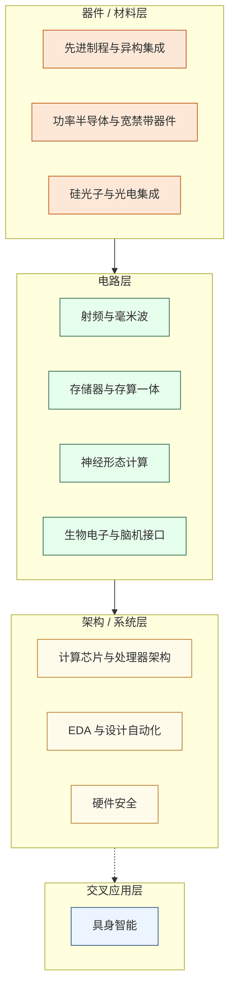

# 科研方向指引

这个板块写给大一大二的同学。

你还不需要现在就做决定，但早一点知道"这个领域在研究什么、需要什么基础"，能让你在选课、读论文、找实验室时少走很多弯路。

每个词条不是课程表，而是一张地图——告诉你这个方向在解决什么真实问题、哪些人在做、你现在应该学什么来靠近它。

---

## 十一个方向

按照知识依赖的层次，这些方向大致分布在四个层面：

---

## 如何选择

与其按热度排名，不如问自己几个问题：

**你更喜欢物理直觉还是数学推导？**
偏物理直觉 → 器件/工艺层（先进制程、功率半导体）  
偏数学推导 → 信号/电路层（射频、存算一体）

**你喜欢靠近硬件还是靠近软件？**
靠近硬件 → 器件层、电路层  
靠近软件 → 计算芯片架构、EDA、具身智能

**你对什么应用场景最感兴趣？**
AI / 大模型 → 计算芯片架构、存算一体、EDA  
新能源 / 汽车 → 功率半导体  
通信 / 5G / 卫星 → 射频与毫米波  
生命健康 → 生物电子与脑机接口  
机器人 → 具身智能  

---

## 方向一览

| 方向 | 一句话定义 | 最相关基础课 |
|------|-----------|------------|
| [计算芯片与处理器架构](计算芯片与处理器架构.md) | 设计让计算机"想得更快"的核心硬件 | 数字IC设计、计算机组成原理 |
| [存储器与存算一体](存储器与存算一体.md) | 打破"存"与"算"分离的冯·诺依曼瓶颈 | 半导体器件、模拟IC设计 |
| [EDA 与设计自动化](EDA与设计自动化.md) | 用算法让芯片设计本身自动化 | 数字IC、ASIC、数据结构 |
| [射频与毫米波](射频与毫米波.md) | 设计让无线信号穿越空气的芯片 | 模拟IC、高频电路 |
| [功率半导体与宽禁带器件](功率半导体与宽禁带器件.md) | 控制高压大电流的"电力开关" | 固体物理、半导体器件 |
| [先进制程与异构集成](先进制程与异构集成.md) | 把更多晶体管塞进更小空间 | IC工艺、先进工艺 |
| [硅光子与光电集成](硅光子与光电集成.md) | 用光传输和处理信息 | 固体物理、模拟电路 |
| [神经形态计算](神经形态计算.md) | 模仿大脑结构与工作方式的芯片 | 半导体器件、模拟IC |
| [生物电子与脑机接口](生物电子与脑机接口.md) | 芯片与神经系统的接口 | 模拟IC、ADC/DAC |
| [具身智能](具身智能.md) | 让机器在物理世界中像人一样行动 | 机器学习、嵌入式SoC |
| [硬件安全](硬件安全.md) | 从硬件层面攻击和防御计算系统 | 数字IC、计算机组成 |
