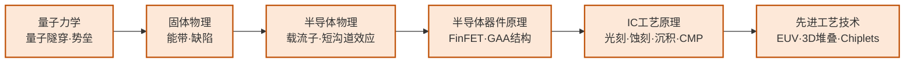

# 先进制程与异构集成

## 一句话定义

研究如何在一块硅片上塞入更多晶体管（先进制程），以及当单片集成触及物理极限时，如何把多个不同工艺的芯片整合成一个高效系统（异构集成/Chiplets）。

## 你身边的产品

你用的 MacBook 里的 M4 芯片，是台积电 3nm 工艺制造的，里面集成了约 280 亿颗晶体管，面积大约 300 平方毫米——比指甲盖稍大。把晶体管塞到这个密度，需要光刻机用波长 13.5nm 的极紫外（EUV）光在硅片上"印刷"电路图案，光源的精度要求相当于从月球上看清地球上一粒硬币。ASML 是全球唯一能制造 EUV 光刻机的公司，每台售价约 2 亿美元，交货周期以年计。

AMD 的 Ryzen 9000 系列处理器用的是另一个思路：把 CPU 核心、缓存、I/O 控制器分成多块独立的小芯片（Chiplet），分别用不同工艺制造，再通过封装技术拼在一起。这样做的好处是每块小芯片的良率远高于同面积的单片大芯片，还可以把不同的功能模块交给最适合的工厂来做。苹果 M1 Ultra 把两块 M1 Max 芯片用硅桥直连，对外呈现为一块统一的芯片，这是异构集成思路在消费电子里最直观的体现。

## 为什么重要

摩尔定律从未停止，但它的形式正在改变。2nm 以下的制程节点面临极紫外光刻（EUV）随机效应、量子隧穿、热管理等物理极限。Chiplet 架构（苹果 M系列、AMD EPYC、Intel Meteor Lake）正成为突破单片集成瓶颈的主流路线。

这是半导体产业最"硬核"的研究方向，与 TSMC、Samsung、Intel 的竞争直接相关，也是中国在高端制程上面临最大封锁的领域。

## 当前最前沿（2024-2025）

台积电 N2（2nm）工艺于 2025 年进入量产，首批客户是 Apple 和 NVIDIA，采用全环绕栅（GAA）晶体管结构，每平方毫米晶体管密度较 N3 再次提升约 15%。Intel 的 18A 节点（1.8nm）引入了 RibbonFET（Intel 版 GAA）和背面供电网络（PowerVia），目标是 2025 年量产——这是 Intel 在先进制程上试图追回台积电的最重要赌注。两家公司的竞争正处于历史上最激烈的阶段。

异构集成方面，CoWoS（Chip on Wafer on Substrate）是台积电为 AI 芯片开发的先进封装方案，把 GPU 和 HBM 内存集成在同一个封装体内，已被 NVIDIA H100/H200 大规模采用。UCIe（Universal Chiplet Interconnect Express）是行业正在推进的 Chiplet 互联标准，试图让不同厂家的小芯片能互相连接，就像 USB 标准统一了外设接口一样。中芯国际目前量产最先进的制程是 14nm，正在开发 7nm 工艺，但受限于无法获得 EUV 光刻机，与台积电的差距仍在 3-4 代左右。

## 核心研究问题

- **EUV 随机效应**：极紫外光源光子数量有限，导致图形随机变化（stochastic effects），如何通过工艺和设计协同优化？
- **GAA 晶体管**：Gate-All-Around（环绕栅）是 3nm 以下的关键器件结构，如何解决寄生电容和制造难题？
- **3D 堆叠散热**：多层芯片垂直堆叠后，热量无法有效散出，如何设计热管理方案？
- **异构集成标准**：不同厂商的 Chiplet 如何通过统一接口（UCIe）互联，同时保证信号完整性？

## 代表性机构与企业

| | 国际 | 国内 |
|--|------|------|
| **企业** | TSMC、Samsung、Intel、ASML | 中芯国际、华虹、通富微电、长电科技 |
| **高校/研究机构** | IMEC、Stanford、MIT | 复旦、北大、中科院微电子所 |
| **顶会** | IEDM、VLSI Symposium、ISSCC、ECTC | — |

## 知识路径

**本站相关课程：**

- [量子力学（复旦）](../课程资源/物理/量子力学/MICR130015.md)
- [固体物理（复旦）](../课程资源/物理/固体物理/MICR130013.md)
- [半导体物理（复旦）](../课程资源/物理/半导体物理/MICR130005.md)
- [半导体器件原理（复旦）](../课程资源/器件与工艺/半导体器件/半导体器件原理_FDU/MICR130006.md)
- [IC工艺原理（复旦）](../课程资源/器件与工艺/集成电路工艺/集成电路工艺原理_FDU/MICR130007.md)
- [先进集成电路工艺技术（复旦）](../课程资源/器件与工艺/先进集成电路工艺技术_FDU/MICR130018.md)

## 入门三步走

**第一步：了解产业地图**  
阅读 WikiChip 网站（wikichip.org）对 TSMC N3/N2 工艺节点的技术分析，以及 SemiAnalysis 博客对先进制程竞争的深度报道——这两个免费资源是业界最高质量的技术科普。

**第二步：理解器件物理**  
Mark Lundstrom 在 nanoHUB 的课程（nanohub.org/courses/ECE606）从量子力学出发推导现代器件工作原理，是该方向最严格的入门资料。

**第三步：跟进 Chiplet 前沿**  
阅读 UCIe（Universal Chiplet Interconnect Express）联盟的技术规范（免费公开），以及 ECTC 近年关于先进封装的综述论文。
