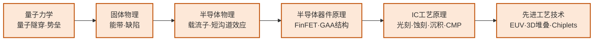

# 先进制程与异构集成

## 一句话定义

研究如何在一块硅片上塞入更多晶体管（先进制程），以及当单片集成触及物理极限时，如何把多个不同工艺的芯片整合成一个高效系统（异构集成/Chiplets）。

## 为什么重要

摩尔定律从未停止，但它的形式正在改变。2nm 以下的制程节点面临极紫外光刻（EUV）随机效应、量子隧穿、热管理等物理极限。Chiplet 架构（苹果 M系列、AMD EPYC、Intel Meteor Lake）正成为突破单片集成瓶颈的主流路线。

这是半导体产业最"硬核"的研究方向，与 TSMC、Samsung、Intel 的竞争直接相关，也是中国在高端制程上面临最大封锁的领域。

## 核心研究问题

- **EUV 随机效应**：极紫外光源光子数量有限，导致图形随机变化（stochastic effects），如何通过工艺和设计协同优化？
- **GAA 晶体管**：Gate-All-Around（环绕栅）是 3nm 以下的关键器件结构，如何解决寄生电容和制造难题？
- **3D 堆叠散热**：多层芯片垂直堆叠后，热量无法有效散出，如何设计热管理方案？
- **异构集成标准**：不同厂商的 Chiplet 如何通过统一接口（UCIe）互联，同时保证信号完整性？

## 代表性机构与企业

| | 国际 | 国内 |
|--|------|------|
| **企业** | TSMC、Samsung、Intel、ASML | 中芯国际、华虹、通富微电、长电科技 |
| **高校/研究机构** | IMEC、Stanford、MIT | 复旦、北大、中科院微电子所 |
| **顶会** | IEDM、VLSI Symposium、ISSCC、ECTC | — |

## 知识路径

**本站相关课程：**

- [量子力学（复旦）](../课程资源/物理/量子力学/MICR130015.md)
- [固体物理（复旦）](../课程资源/物理/固体物理/MICR130013.md)
- [半导体物理（复旦）](../课程资源/物理/半导体物理/MICR130005.md)
- [半导体器件原理（复旦）](../课程资源/器件与工艺/半导体器件/半导体器件原理_FDU/MICR130006.md)
- [IC工艺原理（复旦）](../课程资源/器件与工艺/集成电路工艺/集成电路工艺原理_FDU/MICR130007.md)
- [先进集成电路工艺技术（复旦）](../课程资源/器件与工艺/先进集成电路工艺技术_FDU/MICR130018.md)

## 入门三步走

**第一步：了解产业地图**  
阅读 WikiChip 网站（wikichip.org）对 TSMC N3/N2 工艺节点的技术分析，以及 SemiAnalysis 博客对先进制程竞争的深度报道——这两个免费资源是业界最高质量的技术科普。

**第二步：理解器件物理**  
Mark Lundstrom 在 nanoHUB 的课程（nanohub.org/courses/ECE606）从量子力学出发推导现代器件工作原理，是该方向最严格的入门资料。

**第三步：跟进 Chiplet 前沿**  
阅读 UCIe（Universal Chiplet Interconnect Express）联盟的技术规范（免费公开），以及 ECTC 近年关于先进封装的综述论文。
