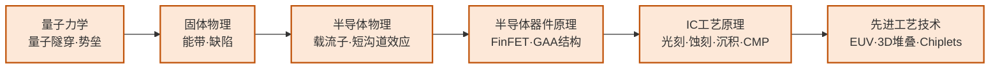

---
---
# 先进制程与异构集成

## 一句话定义

研究如何在一块硅片上塞入更多晶体管（先进制程），以及当单片集成触及物理极限时，如何把多个不同工艺的芯片整合成一个高效系统（异构集成/Chiplets）。

## 这个方向在研究什么

芯片制造的本质是一套极其精密的"印刷术"：把电路图案用光刻的方式转移到硅片上，再通过离子注入、薄膜沉积、化学蚀刻等数百道工序，在硅片上构建出三维的晶体管和金属连线结构。过去五十年，摩尔定律之所以成立，正是因为制程工程师每隔几年就能把光刻分辨率再提高一档，把晶体管尺寸再缩小一半，同等面积里放进两倍的晶体管，性能和能效随之提升。这条路走到今天，已经进入了几乎所有人在二十年前都认为不可能的物理尺度。

今天最先进的量产工艺（台积电 N3、N2）里，晶体管的关键尺寸已经在 2 纳米量级，相当于十几个硅原子排列在一起的宽度。在这个尺度下，量子隧穿效应开始变得不可忽视——电子可以直接穿越本应阻断它的势垒，导致器件漏电。传统的平面 MOSFET 结构在这个尺度已经失效，工业界先后引入了 FinFET（鳍式晶体管）和更新的 GAA（全环绕栅，gate-all-around）结构，把栅极从一侧包裹晶体管延伸到四面包裹，从而更好地控制沟道。如何制造这些更复杂的三维结构，同时保证几十亿个晶体管里没有一个失效，是工艺研究的核心难题。

光刻本身在 EUV（极紫外光刻）时代面临新的挑战。EUV 用 13.5nm 波长的光——比之前的深紫外（193nm）短了十几倍，可以印刷更精细的图案，但光源强度弱、光子数量有限，导致每个曝光区域里光子数量不足，图形边缘随机起伏（stochastic effects）。研究者需要用统计模型量化这种随机性，通过工艺和设计协同优化把它的影响压制在可接受范围内。与此同时，芯片内部的金属互联层已经从最初的几层增加到今天的十几层，层与层之间的小孔（via）尺寸只有几纳米，如何在沉积、蚀刻和平坦化之间维持这些极细结构的完整性，是良率工程的持续战场。

当单片集成越来越难、成本越来越高，另一条思路开始兴起：Chiplet（芯片小芯片）。把一块大芯片分成几个功能模块，分别用最适合的工艺在不同晶圆厂制造，再通过封装技术集成在一起。这样做的优势很直接：一块面积为 A 的芯片，若良率为 Y，那么两块面积各为 A/2 的芯片，良率约为 Y 的平方根，加上两块面积减半的芯片良率本来就更高，整体成本可以显著下降。AMD 的 EPYC 处理器就是把 CPU 核心小芯片（用先进制程做）和 I/O 控制器小芯片（用成熟制程做）分开制造再封装在一起。连接这些小芯片的是高密度的芯片间互联技术，如台积电的 SoIC 和 Intel 的 EMIB，它们能在很短距离内实现极高的数据传输带宽。这个领域的开放问题包括：如何用统一的标准（如 UCIe）让不同厂商的小芯片能互相接口；如何管理多层堆叠芯片的热量（热量无处散发是严峻的物理约束）；以及如何在如此高密度的封装里保证信号完整性。

## 核心研究问题

- **EUV 随机效应**：极紫外光源光子数量有限，导致图形随机变化（stochastic effects），如何通过工艺和设计协同优化？
- **GAA 晶体管**：Gate-All-Around（环绕栅）是 3nm 以下的关键器件结构，如何解决寄生电容和制造难题？
- **3D 堆叠散热**：多层芯片垂直堆叠后，热量无法有效散出，如何设计热管理方案？
- **异构集成标准**：不同厂商的 Chiplet 如何通过统一接口（UCIe）互联，同时保证信号完整性？

## 代表性机构与企业

| | 国际 | 国内 |
|--|------|------|
| **企业** | TSMC、Samsung、Intel、ASML | 中芯国际、华虹、通富微电、长电科技 |
| **高校/研究机构** | IMEC、Stanford、MIT | 复旦、北大、中科院微电子所 |
| **顶会** | IEDM、VLSI Symposium、ISSCC、ECTC | — |

## 知识路径

**本站相关课程：**

- [量子力学（复旦）](../课程资源/物理/量子力学/MICR130015.md)
- [固体物理（复旦）](../课程资源/物理/固体物理/MICR130013.md)
- [半导体物理（复旦）](../课程资源/物理/半导体物理/MICR130005.md)
- [半导体器件原理（复旦）](../课程资源/器件与工艺/半导体器件/半导体器件原理_FDU/MICR130006.md)
- [IC工艺原理（复旦）](../课程资源/器件与工艺/集成电路工艺/集成电路工艺原理_FDU/MICR130007.md)
- [先进集成电路工艺技术（复旦）](../课程资源/器件与工艺/先进集成电路工艺技术_FDU/MICR130018.md)

## 入门三步走

**第一步：了解产业地图**  
阅读 WikiChip 网站（wikichip.org）对 TSMC N3/N2 工艺节点的技术分析，以及 SemiAnalysis 博客对先进制程竞争的深度报道——这两个免费资源是业界最高质量的技术科普。

**第二步：理解器件物理**  
Mark Lundstrom 在 nanoHUB 的课程（nanohub.org/courses/ECE606）从量子力学出发推导现代器件工作原理，是该方向最严格的入门资料。

**第三步：跟进 Chiplet 前沿**  
阅读 UCIe（Universal Chiplet Interconnect Express）联盟的技术规范（免费公开），以及 ECTC 近年关于先进封装的综述论文。

## 相关课题组

### 境内

-   **[马恺声](http://group.iiis.tsinghua.edu.cn/~maks/) & [陈迟晓](https://fics.fudan.edu.cn/4c/e6/c39908a412902/page.htm)** 清华复旦

    Chiplet 异构集成系统 · AI 算法-电路-架构协同 · 感存算一体

-   **[任天令](https://www.sic.tsinghua.edu.cn/info/1033/1545.htm)** 清华

    二维材料器件与工艺 · NEMS 传感器 · 柔性电子集成

-   **[田禾](https://www.sic.tsinghua.edu.cn/info/1035/1553.htm)** 清华

    二维半导体晶体管工艺 · MoS₂/WSe₂ 先进集成

-   **[王喆垚](https://www.ime.tsinghua.edu.cn/info/1038/1598.htm)** 清华

    先进封装与 Chiplet 异构集成 · 3D IC 热管理 · 高密度芯片间互联

-   **[蔡坚](https://www.sic.tsinghua.edu.cn/info/1015/1828.htm)** 清华

    先进半导体封装 · Chiplet/Fan-out · 异构集成可靠性

-   **[黄如](https://ic.pku.edu.cn/szdw/ysfc/hr/index.htm)** 北大

    GAA 器件 · 铁电存储器 · 低功耗 IoT 芯片

-   **[张兴](https://ic.pku.edu.cn/szdw/zzjs/jcwndzx1/zx/index.htm)** 北大

    先进 CMOS 工艺 · FinFET/GAAFET 结构 · 低功耗逻辑器件

-   **[康晋锋](https://ic.pku.edu.cn/szdw/zzjs/K1/kjf/index.htm)** 北大

    半导体工艺可靠性 · 高κ/金属栅器件失效机制

-   **[张卫](https://sme.fudan.edu.cn/60/d4/c31133a352468/page.htm)** 复旦

    半导体器件与工艺研发 · 新型晶体管结构

-   **[孙清清](https://sme.fudan.edu.cn/60/20/c31153a352288/page.htm)** 复旦

    先进 IC 工艺（ALD、Cu 互联） · 二维半导体晶圆级集成

-   **[包文中](https://sme.fudan.edu.cn/60/be/c31153a352510/page.htm)** 复旦

    晶圆级二维半导体生长 · 逻辑/存储/RF 多应用集成

-   **[赵超](https://semi.cas.cn/rcdw/yjyjrc/rc_gtgd/202310/t20231010_6892274.html)** 中科院

    III-V/Si 异质外延 · 高性能 III-V 激光器

<button class="prof-show-all">显示全部 ↓</button>

### 境外

-   **[陈文新（Mansun Chan）](https://ece.hkust.edu.hk/mchan)** 港科大

    先进半导体器件（CFET、2nm 以下） · 2D 材料器件 · BSIM SPICE 模型

-   **[何宗毅（Tsung-Yi Ho）](https://www.cse.cuhk.edu.hk/people/faculty/tsung-yi-ho/)** CUHK

    3D IC 与 Chiplet 异构集成 EDA · 先进封装设计自动化

-   **[Tsu-Jae King Liu](https://people.eecs.berkeley.edu/~tking/)** UC Berkeley

    FinFET 器件 · 新型逻辑/存储器件 · MEMS/NEMS

-   **[Mark Lundstrom](https://engineering.purdue.edu/ECE/People/ptProfile?resource_id=3140)** Purdue

    纳米尺度晶体管物理 · MOSFET 缩放极限 · 计算电子学

-   **[H.-S. Philip Wong](https://web.stanford.edu/~hspwong/)** Stanford

    3D 异构集成 · 单片 3D IC · 新型存储器

<button class="prof-show-all">显示全部 ↓</button>

