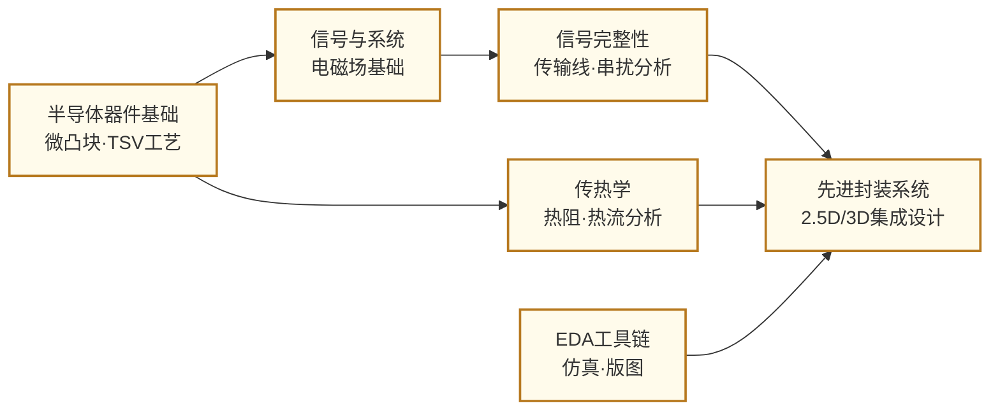

---
hide:
  - navigation
---
把来自不同工厂、不同工艺的多块芯片高密度整合在同一封装内——先进封装是摩尔定律减速后，芯片系统继续提升性能的核心路径。

## 这个方向在研究什么

2022 年，Apple 发布了 M1 Ultra 芯片。这块芯片的诞生方式有些不寻常——它不是一块单一的硅片，而是把两块 M1 Max 通过一条叫 **UltraFusion** 的互联桥接在一起，2500 个连接点，芯片间带宽达 2.5 TB/s，是 Thunderbolt 4 接口的十倍。插入 Mac Studio 的操作系统看不到两块芯片，只看到一块超大的单芯片。这不是魔术，而是**先进封装**——把多块芯片在封装层面融合成一个整体的工程艺术。

把所有功能塞进一块芯片，是 SoC 时代的本能：最先进的制程，最高的集成度。这套逻辑在 28nm 时代运转顺畅，但在 5nm 以下开始失控。芯片越大，晶圆上的缺陷命中概率越高，**良率**随面积近似指数下降——一块大面积 CPU Die 在 5nm 工艺下良率可能只有 30%，七成的制造成本打了水漂。更棘手的是，不同功能模块的最佳制程本来就不一样：逻辑核用 3nm 合适，I/O 控制器用 22nm 已经够，DRAM 有专属工艺、根本无法在 5nm 逻辑线上生产。强行把所有模块塞进同一张晶圆，反而是一种浪费。

**Chiplet（芯粒）**架构提供了出路：把大芯片拆成若干模块，各自用最合适的工艺、在最合适的晶圆厂生产，再通过封装技术高密度整合。AMD 的 **EPYC** 服务器处理器把计算核心（5nm）与 I/O Die（22nm）分开制造再拼接，成本和性能均优于同等规模的单片方案；NVIDIA H100 的 **CoWoS** 封装把 GPU Die 与六块 HBM 内存并排排布在硅转接板上，AI 训练所需的超高带宽由此而来。

连接这些分散的芯片，是先进封装研究的核心命题。互联密度决定了带宽，也决定了延迟——而不同封装方案在这条密度阶梯上站在截然不同的位置：

<svg viewBox="0 0 860 300" style="width:100%;max-width:860px;display:block;margin:1.5em auto;font-family:system-ui,-apple-system,sans-serif">
  <defs>
    <marker id="arrd" markerWidth="8" markerHeight="8" refX="6" refY="3" orient="auto">
      <path d="M0,0 L0,6 L8,3 z" fill="#64748B"/>
    </marker>
  </defs>
  <!-- Background gradient bar (density axis) -->
  <defs>
    <linearGradient id="densityGrad" x1="0" y1="0" x2="1" y2="0">
      <stop offset="0%" stop-color="#E2E8F0"/>
      <stop offset="100%" stop-color="#3B82F6" stop-opacity="0.25"/>
    </linearGradient>
  </defs>
  <rect x="30" y="250" width="800" height="12" rx="6" fill="url(#densityGrad)"/>
  <text x="30" y="278" font-size="10" fill="#64748B">互联密度 低</text>
  <text x="790" y="278" text-anchor="end" font-size="10" fill="#3B82F6">高 →</text>
  <!-- Arrows between columns -->
  <line x1="168" y1="140" x2="198" y2="140" stroke="#94A3B8" stroke-width="1.5" marker-end="url(#arrd)"/>
  <line x1="328" y1="140" x2="358" y2="140" stroke="#94A3B8" stroke-width="1.5" marker-end="url(#arrd)"/>
  <line x1="488" y1="140" x2="518" y2="140" stroke="#94A3B8" stroke-width="1.5" marker-end="url(#arrd)"/>
  <line x1="648" y1="140" x2="678" y2="140" stroke="#94A3B8" stroke-width="1.5" marker-end="url(#arrd)"/>
  <!-- Col 1: 2D -->
  <rect x="30" y="40" width="138" height="200" rx="8" fill="#F8FAFC" stroke="#CBD5E1" stroke-width="1.5"/>
  <text x="99" y="62" text-anchor="middle" font-size="12" font-weight="700" fill="#1E293B">2D</text>
  <rect x="48" y="75" width="102" height="36" rx="4" fill="#BFDBFE" stroke="#3B82F6" stroke-width="1.5"/>
  <rect x="48" y="119" width="102" height="36" rx="4" fill="#DCFCE7" stroke="#16A34A" stroke-width="1.5"/>
  <text x="99" y="98" text-anchor="middle" font-size="10" fill="#1E40AF">Die A</text>
  <text x="99" y="142" text-anchor="middle" font-size="10" fill="#166534">Die B</text>
  <rect x="30" y="160" width="138" height="18" rx="0" fill="#E2E8F0" stroke="none"/>
  <text x="99" y="173" text-anchor="middle" font-size="9" fill="#475569">有机基板</text>
  <text x="99" y="210" text-anchor="middle" font-size="9" fill="#94A3B8">间距 ~100µm</text>
  <text x="99" y="228" text-anchor="middle" font-size="9" fill="#94A3B8">封装基板互联</text>
  <!-- Col 2: 2.5D -->
  <rect x="190" y="40" width="138" height="200" rx="8" fill="#F8FAFC" stroke="#CBD5E1" stroke-width="1.5"/>
  <text x="259" y="62" text-anchor="middle" font-size="12" font-weight="700" fill="#1E293B">2.5D</text>
  <rect x="208" y="75" width="102" height="36" rx="4" fill="#BFDBFE" stroke="#3B82F6" stroke-width="1.5"/>
  <rect x="208" y="119" width="102" height="36" rx="4" fill="#DCFCE7" stroke="#16A34A" stroke-width="1.5"/>
  <text x="259" y="98" text-anchor="middle" font-size="10" fill="#1E40AF">GPU Die</text>
  <text x="259" y="142" text-anchor="middle" font-size="10" fill="#166534">HBM</text>
  <rect x="190" y="160" width="138" height="18" rx="0" fill="#C7D2FE" stroke="none"/>
  <text x="259" y="173" text-anchor="middle" font-size="9" fill="#3730A3">硅转接板 Interposer</text>
  <text x="259" y="210" text-anchor="middle" font-size="9" fill="#94A3B8">间距 ~10µm</text>
  <text x="259" y="228" text-anchor="middle" font-size="9" fill="#94A3B8">CoWoS · 微凸块</text>
  <!-- Col 3: 3.5D -->
  <rect x="350" y="40" width="138" height="200" rx="8" fill="#F8FAFC" stroke="#CBD5E1" stroke-width="1.5"/>
  <text x="419" y="62" text-anchor="middle" font-size="12" font-weight="700" fill="#1E293B">3.5D</text>
  <rect x="368" y="75" width="44" height="36" rx="4" fill="#BFDBFE" stroke="#3B82F6" stroke-width="1.5"/>
  <rect x="420" y="75" width="50" height="36" rx="4" fill="#FEF3C7" stroke="#D97706" stroke-width="1.5"/>
  <text x="390" y="98" text-anchor="middle" font-size="9" fill="#1E40AF">Die A</text>
  <text x="445" y="98" text-anchor="middle" font-size="9" fill="#92400E">Die B</text>
  <!-- EMIB bridge embedded in substrate -->
  <rect x="395" y="111" width="30" height="10" rx="2" fill="#6366F1" stroke="#4338CA" stroke-width="1"/>
  <text x="410" y="120" text-anchor="middle" font-size="7" fill="white">EMIB</text>
  <rect x="350" y="130" width="138" height="30" rx="0" fill="#E2E8F0" stroke="none"/>
  <text x="419" y="150" text-anchor="middle" font-size="9" fill="#475569">有机基板（含嵌入硅桥）</text>
  <text x="419" y="210" text-anchor="middle" font-size="9" fill="#94A3B8">间距 ~10µm（局部）</text>
  <text x="419" y="228" text-anchor="middle" font-size="9" fill="#94A3B8">Intel EMIB · Meteor Lake</text>
  <!-- Col 4: 3D TSV -->
  <rect x="510" y="40" width="138" height="200" rx="8" fill="#F8FAFC" stroke="#CBD5E1" stroke-width="1.5"/>
  <text x="579" y="62" text-anchor="middle" font-size="12" font-weight="700" fill="#1E293B">3D（TSV）</text>
  <!-- Stacked dies -->
  <rect x="528" y="100" width="102" height="30" rx="4" fill="#BFDBFE" stroke="#3B82F6" stroke-width="1.5"/>
  <rect x="528" y="72" width="102" height="30" rx="4" fill="#DCFCE7" stroke="#16A34A" stroke-width="1.5"/>
  <rect x="528" y="130" width="102" height="20" rx="2" fill="#E2E8F0" stroke="#94A3B8" stroke-width="1"/>
  <!-- TSV lines -->
  <line x1="555" y1="100" x2="555" y2="102" stroke="#6366F1" stroke-width="1.5"/>
  <line x1="575" y1="100" x2="575" y2="102" stroke="#6366F1" stroke-width="1.5"/>
  <line x1="595" y1="100" x2="595" y2="102" stroke="#6366F1" stroke-width="1.5"/>
  <line x1="615" y1="100" x2="615" y2="102" stroke="#6366F1" stroke-width="1.5"/>
  <text x="579" y="91" text-anchor="middle" font-size="9" fill="#166534">DRAM层</text>
  <text x="579" y="120" text-anchor="middle" font-size="9" fill="#1E40AF">逻辑层</text>
  <text x="579" y="145" text-anchor="middle" font-size="9" fill="#475569">基板</text>
  <text x="579" y="210" text-anchor="middle" font-size="9" fill="#94A3B8">TSV · 3+ TB/s</text>
  <text x="579" y="228" text-anchor="middle" font-size="9" fill="#94A3B8">HBM · 垂直堆叠</text>
  <!-- Col 5: 3D IC -->
  <rect x="670" y="40" width="160" height="200" rx="8" fill="#FFF7ED" stroke="#F59E0B" stroke-width="1.5"/>
  <text x="750" y="62" text-anchor="middle" font-size="12" font-weight="700" fill="#92400E">3D IC（直接键合）</text>
  <!-- Direct bonded dies -->
  <rect x="688" y="80" width="124" height="28" rx="3" fill="#BFDBFE" stroke="#3B82F6" stroke-width="1.5"/>
  <rect x="688" y="108" width="124" height="28" rx="3" fill="#FEF3C7" stroke="#D97706" stroke-width="1.5"/>
  <!-- Bond interface -->
  <line x1="688" y1="108" x2="812" y2="108" stroke="#EF4444" stroke-width="1.5" stroke-dasharray="3,2"/>
  <text x="750" y="96" text-anchor="middle" font-size="9" fill="#1E40AF">Die A</text>
  <text x="750" y="127" text-anchor="middle" font-size="9" fill="#92400E">Die B</text>
  <text x="750" y="155" text-anchor="middle" font-size="8" fill="#EF4444">← 直接键合界面 →</text>
  <text x="750" y="210" text-anchor="middle" font-size="9" fill="#B45309">间距 &lt;1µm</text>
  <text x="750" y="228" text-anchor="middle" font-size="9" fill="#B45309">SoIC · Foveros · 近单片密度</text>
</svg>

**2.5D** 方案将多块 Die 并排置于同一片硅转接板上，微凸块间距压到 10 微米，NVIDIA H100 的 CoWoS 封装正是如此将 GPU 与六块 HBM 拼接；**3.5D** 是 Intel 的折中路线——不铺整张硅转接板，而是把一小片**硅桥（EMIB）**嵌入有机基板内，仅在两块 Die 的边缘局部提供高密度互联，Meteor Lake 和 Ponte Vecchio 均采用此方案；**3D 堆叠**通过**硅通孔（TSV）**垂直穿透芯片传递信号，HBM 就是把多层 DRAM 垂直叠起，带宽突破 3 TB/s；**3D IC** 则迈向终极形态——台积电 **SoIC**、Intel **Foveros** 将两块 Die 直接键合，铜-铜键合间距不到 1 微米，带宽密度已接近片内互联，与单片芯片的界限正在消弭。

芯片下面的基板，同样是一场静悄悄的材料革命。当前主流的 **ABF 有机基板**（Ajinomoto Build-up Film，味之素膜）在 2020-2021 年芯片短缺期间一度成为全球供应链瓶颈——制程越先进、Die 越小、基板引脚数越多，对 ABF 的需求就越大。而 Intel 正在力推的下一代方案是**玻璃基板**：玻璃的介电损耗更低、热膨胀系数更接近硅（与芯片的**热膨胀系数 CTE 匹配**更好，减少热应力）、线宽可以更细——Intel 宣布 2026 年将玻璃基板引入量产。拦路虎是工艺：玻璃质脆，激光打微孔时容易开裂，如何在不碎片的前提下打出高密度的通孔，是封装工艺研究的重要课题。

**光电共封装（Co-Packaged Optics，CPO）**是另一个快速升温的方向。AI 数据中心里，GPU 集群之间靠光纤互联，传统方案是把光模块插在交换机的 QSFP 接口——光信号在外部模块和交换芯片之间的电接口来回转换，这段路的**插入损耗**白白吃掉大量能量。CPO 把光引擎和交换 ASIC 直接封装在同一个封装体内，电光转换就在芯片旁边完成，传输距离极短、损耗极低。随着 AI 模型训练对跨机柜带宽的需求指数级上升，CPO 已经成为下一代数据中心交换机的核心技术方向。

**异质材料集成**把视野拉得更远。硅擅长逻辑运算，但在射频、功率、光电等领域并非最优解——**GaAs、GaN、InP** 等 III-V 族半导体在高频、高功率、发光方面远超硅。把这些材料与硅 CMOS 集成在同一封装内，就能让系统兼得各方之长。难点在于 III-V 材料与硅的**热膨胀系数严重失配**，温度循环中的应力会导致界面分层；同时 III-V 工艺中的砷、磷等元素对 CMOS 产线是污染源，两者的工艺隔离需要精细设计。

把这些技术拼在一起，系统工程师还要面对三道绕不过去的关卡：**散热**——3D 堆叠后功率密度可超过 1000 W/cm²，远超喷气发动机燃烧室，如何在不拆开封装的前提下把热量导走；**已知良品（KGD）测试**——把一块坏的 Die 集成进去再测出问题，整个封装就报废了，如何在裸片阶段完成精准的全功能测试；**标准化**——多家公司的 Chiplet 要互联，必须有统一的物理接口，**UCIe（Universal Chiplet Interconnect Express）**由 Intel、台积电、AMD 等联合制定，定义了 Die-to-Die 的物理层与协议层，但如何在保证互操作性的同时把接口面积和功耗压到最低，仍是开放的研究问题。

## 适合什么样的人

这个方向横跨封装工艺、电磁仿真、热设计和 EDA 四个维度，是少有的真正多学科交叉方向。如果你的兴趣点在系统级工程——希望既能理解芯片如何制造，又能关心它们组合在一起时的性能瓶颈——这里会让你有大量施展空间。

工艺侧的研究（TSV 制造、微凸块键合、热界面材料）仍然需要在洁净间里动手，但相比器件工艺，这里的工序数量更少，更多时间花在封装结构测量和可靠性测试上。仿真侧的工作（信号完整性、热仿真、EDA 自动化）基本在计算机上完成，熟悉 ANSYS HFSS/SIwave、COMSOL 或 Cadence 封装工具会是竞争力所在。EDA 方向的同学需要有更扎实的编程基础，能够处理大规模图算法和优化问题。

这个方向有一个独特之处：它的产业应用极其明确，AI 加速器和数据中心芯片对先进封装的需求正处于爆发期，TSMC CoWoS 产能持续紧张就是最直观的证明。如果你希望所做的研究与产业前沿直接挂钩，并且不排斥工程性强、系统复杂度高的问题，这个方向值得认真考虑。不太适合的情况：如果你对底层器件物理有强烈兴趣，希望深入钻研单个晶体管的机制，先进封装的研究尺度（微米到毫米量级）和关注点（系统级集成）与那种兴趣并不匹配。

## 核心研究问题

- **芯片间互联**：Chiplet 之间的带宽密度和能效如何随封装技术的演进而提升？UCIe 等标准化接口如何兼顾通用性与极低开销？
- **热管理**：3D 堆叠后的极高热密度如何通过微流道冷却、导热材料优化等手段控制在安全范围？
- **信号/电源完整性**：超高密度互联下的串扰、阻抗匹配和电源分配如何在早期设计阶段精确预测和优化？
- **先进封装 EDA**：多 Die 系统的联合时序、热、信号仿真如何实现高效自动化，支撑量产流程？
- **可靠性与测试**：Chiplet 集成后的系统级故障如何进行有效的已知良品（KGD）测试和系统级诊断？

## 代表性机构

| | 国际 | 国内 |
|--|------|------|
| **企业** | TSMC（CoWoS/SoIC）、Intel（Foveros/EMIB）、AMD、ASE | 长电科技、通富微电、华天科技 |
| **顶会** | ECTC · 3DIC · IEEE CPMT · DAC · ICCAD | — |

## 知识路径

图中节点对应以下知识板块（按需选修）：

- [器件与工艺](../课程资源/器件与工艺/index.md)（器件原理·IC工艺基础）
- [电路](../课程资源/电路/index.md)（模拟电路·高频电路·信号完整性方向）
- [物理基础](../课程资源/物理/index.md)（固体物理·热学基础）

## 入门三步走

**典型研究长什么样**

ECTC 顶会的典型封装论文有两种形态：工艺类论文展示一种新的键合方案（如混合键合间距从 10μm 缩到 3μm），关键图表是截面 SEM 图和电学/热学测试结果，核心指标是键合良率和接触电阻；EDA 类论文提出多 Die 系统的联合仿真或优化方法，关键指标是运行时间与精度的折中。大多数先进封装学术工作不需要流片完整 SoC，而是做工艺模块验证或仿真方法验证；结论格式通常是"方案 X 在指标 Y 上相比基线提升 Z 倍，并在测试载片上通过电测/热测验证"。

**第一步：了解产业背景**  
阅读 SemiAnalysis 关于 CoWoS 产能和 Chiplet 生态的深度报道，以及 UCIe 1.1 规范的技术白皮书（免费公开），建立对先进封装产业格局的基本认知。

**第二步：理解核心技术**  
阅读 Lau, *Recent Advances and New Trends in Flip Chip Technology* (J. Electronic Packaging, 2016) 和 Iyer et al., *Heterogeneous integration insights* (IEEE Micro, 2020)，系统了解封装技术演进脉络和异构集成的工程挑战。

**第三步：跟进前沿**  
浏览 ECTC 2022-2024 的 3D/2.5D Integration 相关 Session，以及 ISSCC 2023-2024 中 HBM + 近存计算的 session，了解从封装器件到系统应用的完整链路。

## 相关课题组

### 境内

-   **[王喆垚](https://www.ime.tsinghua.edu.cn/info/1038/1598.htm)** 清华

    先进封装与 Chiplet 异构集成 · 3D IC 热管理 · 高密度芯片间互联

-   **[蔡坚](https://www.sic.tsinghua.edu.cn/info/1015/1828.htm)** 清华

    先进半导体封装 · Chiplet/Fan-out · 异构集成可靠性

-   **[陈迟晓](https://fics.fudan.edu.cn/4c/e6/c39908a412902/page.htm)** 复旦

    Chiplet 异构集成系统 · AI 算法-电路-架构协同 · 感存算一体

-   **[马恺声](http://group.iiis.tsinghua.edu.cn/~maks/)** 清华

    Chiplet 异构集成系统架构 · Post-Moore 芯片设计

-   **[王玮](https://ic.pku.edu.cn/szdw/zzjs/jcwnxtx1/ww/index.htm)** 北大

    微系统集成技术 · MEMS 封装 · 微系统热管理

-   **[程哲](https://ic.pku.edu.cn/szdw/zzjs/jcwndzx1/cz/index.htm)** 北大

    三维堆叠芯片热管理 · 半导体异构集成界面热阻

<button class="prof-show-all">显示全部 ↓</button>

### 境外

-   **[李世玮（Ricky Shi-Wei Lee）](https://mae.hkust.edu.hk/en/people/faculty/detail/lee-shi-wei-ricky)** 港科大

    晶圆级封装与 3D IC 集成 · TSV 与高密度互连 · 异构集成热管理与可靠性 · IEEE/ASME Fellow

-   **[何宗毅（Tsung-Yi Ho）](https://www.cse.cuhk.edu.hk/people/faculty/tsung-yi-ho/)** 港中大

    3D IC 与 Chiplet 异构集成 EDA · 先进封装设计自动化

-   **[余贝（Bei Yu）](https://www.cse.cuhk.edu.hk/people/faculty/bei-yu/)** 港中大

    EDA for Chiplet 异构集成 · 2.5D/3D IC 物理设计 · ML 辅助布局布线

-   **[Madhavan Swaminathan](https://ece.gatech.edu/directory/madhavan-swaminathan)** Georgia Tech

    信号/电源完整性 · 电磁建模 · Chip-Package 协同设计 · 2.5D/3D 互连

-   **[Muhannad S. Bakir](https://bakirlab.gatech.edu/)** Georgia Tech

    2.5D/3D IC 先进封装设计与制造 · 微尺度冷却 · 共封装光互连（Co-packaged Optics）

-   **[Subramanian S. Iyer](https://www.ee.ucla.edu/subramanian-s-iyer/)** UCLA

    Chiplet 概念先驱 · Fine-Pitch Interconnect · 3D 集成 · 存储子系统异构集成

-   **[Nam Sung Kim](https://ece.illinois.edu/about/directory/faculty/nskim)** UIUC

    Chiplet 集成架构 · 3D 堆叠存储器系统 · 异构计算系统设计

-   **[Eric Pop](https://profiles.stanford.edu/epop)** Stanford

    3D 异构集成热管理 · 高热导绝缘体用于 3D IC · 新材料器件与集成

<button class="prof-show-all">显示全部 ↓</button>
