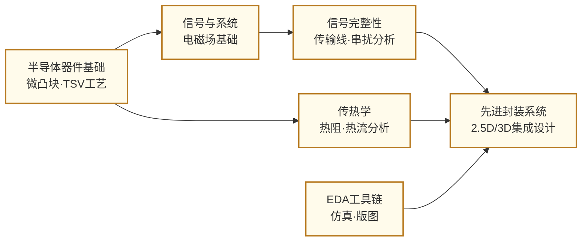

---
hide:
  - navigation
---
把来自不同工厂、不同工艺的多块芯片高密度整合在同一封装内——先进封装是摩尔定律减速后，芯片系统继续提升性能的核心路径。

## 这个方向在研究什么

2022 年，Apple 发布 M1 Ultra：把两块 M1 Max 通过一条叫 **UltraFusion** 的互联桥接在一起，2500 个连接点，芯片间带宽 2.5 TB/s，是 Thunderbolt 4 的十倍。插进 Mac Studio 的操作系统看不到两块硅片，只看到一块超大单芯片。这不是营销话术——这是**先进封装**正在重写的行业规则：与其追求在一块芯片上塞进一切，不如把多块芯片缝合成一个整体。

为什么芯片不能想做多大就做多大？关键是良率。一整片大芯片必须**所有功能区同时合格**才能用——左右两半各自良率 90%，乘下来整片只剩 90% × 90% = 81%；切四份还连成单 Die 就跌到 90%⁴ ≈ 66%，块越多越惨。怎么破解这道难题？工业界给出了两个对立的答案。

一种是**晶圆级集成**：干脆整片不切。Cerebras 的 **WSE-3** 把整片 12 寸晶圆做成一颗芯片——4 万亿晶体管、90 万核不切不分，靠**掩膜拼接（reticle stitching）**让多次曝光的图案在边界对齐成连续电路，靠**片内冗余架构**（坏核绕过、备用核顶替）应对良率问题。代价是 23 千瓦功耗集中在一片硅上，需要专门的液冷和供电系统。这条路很激进，目前主要由 Cerebras 一家在推。

另一种思路完全相反：**Chiplet（芯粒）**——拆得越小越好，每块独立流片、独立测试，坏的当场扔掉就是了，单块自身仍是 90%+ 良率，废品只是几小块的损失。这就是"打扫干净屋子再请客"——只把通过筛选的已知良品（**KGD**）拼进封装。拆开还有意外收获：每块各走最合适的工艺——逻辑核 N3、I/O 控制器 N7、DRAM 自有产线——不再被迫塞进同一种制程。AMD **EPYC** 如此拼接计算核与 I/O Die，NVIDIA H100 如此将 GPU 与六块 HBM 整合在一起。Chiplet 是当前工业主流，本节后续主要展开它。

<svg viewBox="0 0 1145 290" xmlns="http://www.w3.org/2000/svg" style="width:100%;max-width:1145px;display:block;margin:1.5em auto;font-family:system-ui,-apple-system,sans-serif">
  <defs>
    <pattern id="coreGrid3" x="5" y="10" width="16" height="16" patternUnits="userSpaceOnUse">
      <rect x="2" y="2" width="12" height="12" rx="1" fill="#DDD6FE" stroke="#7C3AED" stroke-width="0.5"/>
    </pattern>
  </defs>

  <!-- Panel 1: Monolithic -->
  <rect x="10" y="15" width="355" height="270" rx="10" fill="#FFFBEB" stroke="#FCD34D" stroke-width="1.5"/>
  <text x="187" y="40" text-anchor="middle" font-size="14" font-weight="700" fill="#92400E">整片大芯片</text>
  <rect x="40" y="70" width="295" height="135" rx="6" fill="#FED7AA" stroke="#EA580C" stroke-width="2.5"/>
  <line x1="187" y1="76" x2="187" y2="199" stroke="#EA580C" stroke-width="1.5" stroke-dasharray="5,3"/>
  <text x="113" y="90" text-anchor="middle" font-size="11" fill="#9A3412" font-weight="700">90%</text>
  <text x="261" y="90" text-anchor="middle" font-size="11" fill="#9A3412" font-weight="700">90%</text>
  <text x="187" y="120" text-anchor="middle" font-size="14" fill="#7C2D12" font-weight="600">同一颗大 Die</text>
  <text x="187" y="145" text-anchor="middle" font-size="12" fill="#7C2D12">所有功能模块统一 N3 工艺</text>
  <circle cx="95" cy="100" r="6" fill="#DC2626"/>
  <circle cx="280" cy="178" r="6" fill="#DC2626"/>
  <circle cx="312" cy="92" r="16" fill="#DC2626" opacity="0.92"/>
  <text x="312" y="101" text-anchor="middle" font-size="22" fill="white" font-weight="700">✗</text>
  <text x="187" y="240" text-anchor="middle" font-size="11" fill="#7C2D12">任一处缺陷 → 整块报废</text>
  <text x="187" y="268" text-anchor="middle" font-size="14" font-weight="700" fill="#9A3412">大面积单 Die · 良率低</text>

  <!-- Panel 2: Chiplet -->
  <rect x="395" y="15" width="355" height="270" rx="10" fill="#F0FDF4" stroke="#86EFAC" stroke-width="1.5"/>
  <text x="572" y="40" text-anchor="middle" font-size="14" font-weight="700" fill="#14532D">Chiplet：批量生产 · 择优拼合</text>
  <rect x="430" y="56" width="52" height="40" rx="3" fill="#BFDBFE" stroke="#93C5FD" stroke-width="1" opacity="0.45"/>
  <circle cx="475" cy="64" r="6" fill="#DC2626"/>
  <text x="475" y="68" text-anchor="middle" font-size="9" fill="white" font-weight="700">✗</text>
  <rect x="418" y="68" width="52" height="40" rx="3" fill="#BFDBFE" stroke="#60A5FA" stroke-width="1" opacity="0.6"/>
  <circle cx="463" cy="76" r="6" fill="#DC2626"/>
  <text x="463" y="80" text-anchor="middle" font-size="9" fill="white" font-weight="700">✗</text>
  <rect x="406" y="80" width="52" height="40" rx="3" fill="#BFDBFE" stroke="#2563EB" stroke-width="2"/>
  <text x="432" y="98" text-anchor="middle" font-size="10" fill="#1E40AF" font-weight="600">计算</text>
  <text x="432" y="111" text-anchor="middle" font-size="9" fill="#1E40AF">N3</text>
  <circle cx="450" cy="115" r="8" fill="#16A34A"/>
  <text x="450" y="119" text-anchor="middle" font-size="11" fill="white" font-weight="700">✓</text>
  <rect x="514" y="56" width="52" height="40" rx="3" fill="#FEF3C7" stroke="#FCD34D" stroke-width="1" opacity="0.45"/>
  <circle cx="559" cy="64" r="6" fill="#DC2626"/>
  <text x="559" y="68" text-anchor="middle" font-size="9" fill="white" font-weight="700">✗</text>
  <rect x="502" y="68" width="52" height="40" rx="3" fill="#FEF3C7" stroke="#FBBF24" stroke-width="1" opacity="0.6"/>
  <circle cx="547" cy="76" r="6" fill="#DC2626"/>
  <text x="547" y="80" text-anchor="middle" font-size="9" fill="white" font-weight="700">✗</text>
  <rect x="490" y="80" width="52" height="40" rx="3" fill="#FEF3C7" stroke="#D97706" stroke-width="2"/>
  <text x="516" y="98" text-anchor="middle" font-size="10" fill="#92400E" font-weight="600">I/O</text>
  <text x="516" y="111" text-anchor="middle" font-size="9" fill="#92400E">N7</text>
  <circle cx="534" cy="115" r="8" fill="#16A34A"/>
  <text x="534" y="119" text-anchor="middle" font-size="11" fill="white" font-weight="700">✓</text>
  <rect x="598" y="56" width="52" height="40" rx="3" fill="#E9D5FF" stroke="#C4B5FD" stroke-width="1" opacity="0.45"/>
  <circle cx="643" cy="64" r="6" fill="#DC2626"/>
  <text x="643" y="68" text-anchor="middle" font-size="9" fill="white" font-weight="700">✗</text>
  <rect x="586" y="68" width="52" height="40" rx="3" fill="#E9D5FF" stroke="#A78BFA" stroke-width="1" opacity="0.6"/>
  <circle cx="631" cy="76" r="6" fill="#DC2626"/>
  <text x="631" y="80" text-anchor="middle" font-size="9" fill="white" font-weight="700">✗</text>
  <rect x="574" y="80" width="52" height="40" rx="3" fill="#E9D5FF" stroke="#7C3AED" stroke-width="2"/>
  <text x="600" y="98" text-anchor="middle" font-size="10" fill="#581C87" font-weight="600">SRAM</text>
  <text x="600" y="111" text-anchor="middle" font-size="9" fill="#581C87">N5</text>
  <circle cx="618" cy="115" r="8" fill="#16A34A"/>
  <text x="618" y="119" text-anchor="middle" font-size="11" fill="white" font-weight="700">✓</text>
  <rect x="682" y="56" width="52" height="40" rx="3" fill="#E5E7EB" stroke="#D1D5DB" stroke-width="1" opacity="0.45"/>
  <circle cx="727" cy="64" r="6" fill="#DC2626"/>
  <text x="727" y="68" text-anchor="middle" font-size="9" fill="white" font-weight="700">✗</text>
  <rect x="670" y="68" width="52" height="40" rx="3" fill="#E5E7EB" stroke="#9CA3AF" stroke-width="1" opacity="0.6"/>
  <circle cx="715" cy="76" r="6" fill="#DC2626"/>
  <text x="715" y="80" text-anchor="middle" font-size="9" fill="white" font-weight="700">✗</text>
  <rect x="658" y="80" width="52" height="40" rx="3" fill="#E5E7EB" stroke="#4B5563" stroke-width="2"/>
  <text x="684" y="98" text-anchor="middle" font-size="10" fill="#374151" font-weight="600">模拟</text>
  <text x="684" y="111" text-anchor="middle" font-size="9" fill="#374151">N22</text>
  <circle cx="702" cy="115" r="8" fill="#16A34A"/>
  <text x="702" y="119" text-anchor="middle" font-size="11" fill="white" font-weight="700">✓</text>
  <text x="572" y="148" text-anchor="middle" font-size="11" fill="#14532D" font-weight="600">↓ 各取良品 ↓</text>
  <rect x="395" y="160" width="355" height="78" rx="6" fill="#DCFCE7" stroke="#16A34A" stroke-width="1.5"/>
  <text x="572" y="180" text-anchor="middle" font-size="11" fill="#166534" font-weight="600">封装体（先进封装拼合）</text>
  <rect x="406" y="190" width="52" height="40" rx="3" fill="#BFDBFE" stroke="#2563EB" stroke-width="1.5"/>
  <text x="432" y="208" text-anchor="middle" font-size="10" fill="#1E40AF" font-weight="600">计算</text>
  <text x="432" y="221" text-anchor="middle" font-size="9" fill="#1E40AF">N3</text>
  <rect x="490" y="190" width="52" height="40" rx="3" fill="#FEF3C7" stroke="#D97706" stroke-width="1.5"/>
  <text x="516" y="208" text-anchor="middle" font-size="10" fill="#92400E" font-weight="600">I/O</text>
  <text x="516" y="221" text-anchor="middle" font-size="9" fill="#92400E">N7</text>
  <rect x="574" y="190" width="52" height="40" rx="3" fill="#E9D5FF" stroke="#7C3AED" stroke-width="1.5"/>
  <text x="600" y="208" text-anchor="middle" font-size="10" fill="#581C87" font-weight="600">SRAM</text>
  <text x="600" y="221" text-anchor="middle" font-size="9" fill="#581C87">N5</text>
  <rect x="658" y="190" width="52" height="40" rx="3" fill="#E5E7EB" stroke="#4B5563" stroke-width="1.5"/>
  <text x="684" y="208" text-anchor="middle" font-size="10" fill="#374151" font-weight="600">模拟</text>
  <text x="684" y="221" text-anchor="middle" font-size="9" fill="#374151">N22</text>
  <text x="572" y="260" text-anchor="middle" font-size="11" fill="#14532D">每种小 Die 单独筛选 · 各走最适工艺</text>
  <text x="572" y="278" text-anchor="middle" font-size="13" font-weight="700" fill="#15803D">良率高 · 工艺各取所长</text>

  <!-- Panel 3: Wafer-scale -->
  <rect x="780" y="15" width="355" height="270" rx="10" fill="#FAF5FF" stroke="#A78BFA" stroke-width="1.5"/>
  <text x="957" y="40" text-anchor="middle" font-size="14" font-weight="700" fill="#5B21B6">晶圆级（Wafer-Scale）</text>
  <circle cx="957" cy="130" r="83" fill="url(#coreGrid3)" stroke="#7C3AED" stroke-width="2.5"/>
  <rect x="950" y="208" width="14" height="6" fill="#FAF5FF" stroke="#7C3AED" stroke-width="1"/>
  <rect x="919" y="108" width="12" height="12" rx="1" fill="#FECACA" stroke="#DC2626" stroke-width="0.8"/>
  <text x="925" y="118" text-anchor="middle" font-size="9" fill="#7F1D1D" font-weight="700">✗</text>
  <rect x="967" y="156" width="12" height="12" rx="1" fill="#FECACA" stroke="#DC2626" stroke-width="0.8"/>
  <text x="973" y="166" text-anchor="middle" font-size="9" fill="#7F1D1D" font-weight="700">✗</text>
  <rect x="903" y="140" width="12" height="12" rx="1" fill="#FECACA" stroke="#DC2626" stroke-width="0.8"/>
  <text x="909" y="150" text-anchor="middle" font-size="9" fill="#7F1D1D" font-weight="700">✗</text>
  <text x="957" y="240" text-anchor="middle" font-size="11" fill="#5B21B6">整片晶圆不切不分 · 4 万亿晶体管</text>
  <text x="957" y="260" text-anchor="middle" font-size="13" font-weight="700" fill="#6D28D9">坏核绕过 · 冗余架构吸收</text>
  <text x="957" y="278" text-anchor="middle" font-size="11" fill="#5B21B6">代表：Cerebras WSE-3</text>
</svg>

但拆开就产生了新的代价：**芯片间的通信成本**。信号在片内传输只需几皮秒，能耗极低；越出芯片边界、经过封装基板走线之后，延迟倍增，每比特传输能耗高出一个量级。这个代价让"分开制造"和"合并使用"之间出现了一道鸿沟——而**先进封装**的核心命题，就是想尽办法把这道鸿沟填平：让分离的芯片在物理上靠得更近，近到通信代价可以忽略不计。

沿着"让芯片更近"这条思路，封装技术演化出了一条清晰的路径——从平铺到堆叠，再到两者合体，集成复杂度逐级攀升：

<svg viewBox="0 0 1060 232" style="width:100%;max-width:1060px;display:block;margin:1.5em auto;font-family:system-ui,-apple-system,sans-serif">
  <defs>
    <marker id="arrd" markerWidth="8" markerHeight="8" refX="6" refY="3" orient="auto">
      <path d="M0,0 L0,6 L8,3 z" fill="#64748B"/>
    </marker>
    <linearGradient id="dg" x1="0" y1="0" x2="1" y2="0">
      <stop offset="0%" stop-color="#E2E8F0"/>
      <stop offset="100%" stop-color="#3B82F6" stop-opacity="0.3"/>
    </linearGradient>
  </defs>

  <!-- Complexity bar -->
  <rect x="10" y="200" width="1040" height="8" rx="4" fill="url(#dg)"/>
  <text x="10" y="222" font-size="10" fill="#94A3B8">集成复杂度 低</text>
  <text x="1050" y="222" text-anchor="end" font-size="10" fill="#3B82F6">高 →</text>

  <!-- Arrows -->
  <line x1="200" y1="70" x2="213" y2="70" stroke="#94A3B8" stroke-width="1.5" marker-end="url(#arrd)"/>
  <line x1="405" y1="70" x2="418" y2="70" stroke="#94A3B8" stroke-width="1.5" marker-end="url(#arrd)"/>
  <line x1="610" y1="70" x2="623" y2="70" stroke="#94A3B8" stroke-width="1.5" marker-end="url(#arrd)"/>
  <line x1="830" y1="70" x2="843" y2="70" stroke="#94A3B8" stroke-width="1.5" marker-end="url(#arrd)"/>

  <!-- Col 1: 2D -->
  <rect x="10" y="15" width="190" height="175" rx="8" fill="#F8FAFC" stroke="#CBD5E1" stroke-width="1.5"/>
  <text x="105" y="35" text-anchor="middle" font-size="13" font-weight="700" fill="#1E293B">2D</text>
  <rect x="20" y="50" width="76" height="36" rx="4" fill="#BFDBFE" stroke="#3B82F6" stroke-width="1.5"/>
  <text x="58" y="73" text-anchor="middle" font-size="10" fill="#1E40AF">Die A</text>
  <rect x="108" y="50" width="76" height="36" rx="4" fill="#DCFCE7" stroke="#16A34A" stroke-width="1.5"/>
  <text x="146" y="73" text-anchor="middle" font-size="10" fill="#166534">Die B</text>
  <rect x="10" y="92" width="190" height="22" fill="#E2E8F0"/>
  <text x="105" y="107" text-anchor="middle" font-size="9" fill="#475569">有机封装基板</text>
  <text x="105" y="148" text-anchor="middle" font-size="9" fill="#64748B">间距 ~100 µm</text>
  <text x="105" y="166" text-anchor="middle" font-size="9" fill="#94A3B8">绕基板走线</text>

  <!-- Col 2: 2.5D -->
  <rect x="215" y="15" width="190" height="175" rx="8" fill="#F8FAFC" stroke="#CBD5E1" stroke-width="1.5"/>
  <text x="310" y="35" text-anchor="middle" font-size="13" font-weight="700" fill="#1E293B">2.5D</text>
  <rect x="225" y="50" width="76" height="36" rx="4" fill="#BFDBFE" stroke="#3B82F6" stroke-width="1.5"/>
  <text x="263" y="73" text-anchor="middle" font-size="10" fill="#1E40AF">GPU</text>
  <rect x="313" y="50" width="76" height="36" rx="4" fill="#DCFCE7" stroke="#16A34A" stroke-width="1.5"/>
  <text x="351" y="68" text-anchor="middle" font-size="9" fill="#166534">HBM</text>
  <text x="351" y="80" text-anchor="middle" font-size="8" fill="#15803D">(TSV叠)</text>
  <rect x="215" y="92" width="190" height="20" fill="#C7D2FE"/>
  <text x="310" y="106" text-anchor="middle" font-size="9" fill="#3730A3">硅转接板 Interposer</text>
  <rect x="215" y="116" width="190" height="14" fill="#E2E8F0"/>
  <text x="310" y="127" text-anchor="middle" font-size="8" fill="#475569">有机基板</text>
  <text x="310" y="148" text-anchor="middle" font-size="9" fill="#64748B">间距 ~10 µm</text>
  <text x="310" y="166" text-anchor="middle" font-size="9" fill="#94A3B8">CoWoS · NVIDIA H100</text>

  <!-- Col 3: 3D (TSV) -->
  <rect x="420" y="15" width="190" height="175" rx="8" fill="#FEF7E7" stroke="#FBBF24" stroke-width="1.5"/>
  <text x="515" y="35" text-anchor="middle" font-size="13" font-weight="700" fill="#92400E">3D（TSV）</text>
  <rect x="435" y="48" width="160" height="24" rx="3" fill="#BFDBFE" stroke="#3B82F6" stroke-width="1.5"/>
  <text x="515" y="64" text-anchor="middle" font-size="10" fill="#1E40AF">Die A（上）</text>
  <line x1="455" y1="48" x2="455" y2="108" stroke="#475569" stroke-width="1" stroke-dasharray="2,1"/>
  <line x1="495" y1="48" x2="495" y2="108" stroke="#475569" stroke-width="1" stroke-dasharray="2,1"/>
  <line x1="535" y1="48" x2="535" y2="108" stroke="#475569" stroke-width="1" stroke-dasharray="2,1"/>
  <line x1="575" y1="48" x2="575" y2="108" stroke="#475569" stroke-width="1" stroke-dasharray="2,1"/>
  <circle cx="455" cy="78" r="2.5" fill="#6B7280"/>
  <circle cx="475" cy="78" r="2.5" fill="#6B7280"/>
  <circle cx="495" cy="78" r="2.5" fill="#6B7280"/>
  <circle cx="515" cy="78" r="2.5" fill="#6B7280"/>
  <circle cx="535" cy="78" r="2.5" fill="#6B7280"/>
  <circle cx="555" cy="78" r="2.5" fill="#6B7280"/>
  <circle cx="575" cy="78" r="2.5" fill="#6B7280"/>
  <rect x="435" y="84" width="160" height="24" rx="3" fill="#FEF3C7" stroke="#D97706" stroke-width="1.5"/>
  <text x="515" y="100" text-anchor="middle" font-size="10" fill="#92400E">Die B（下）</text>
  <rect x="420" y="115" width="190" height="18" fill="#E2E8F0"/>
  <text x="515" y="128" text-anchor="middle" font-size="9" fill="#475569">基板</text>
  <text x="515" y="148" text-anchor="middle" font-size="9" fill="#92400E">~10 µm · TSV+微凸点</text>
  <text x="515" y="166" text-anchor="middle" font-size="9" fill="#B45309">HBM 内部 · Foveros (一代)</text>

  <!-- Col 4: 3D IC (direct) -->
  <rect x="625" y="15" width="205" height="175" rx="8" fill="#FFF7ED" stroke="#F59E0B" stroke-width="1.5"/>
  <text x="727" y="35" text-anchor="middle" font-size="13" font-weight="700" fill="#92400E">3D IC（直接键合）</text>
  <rect x="640" y="48" width="175" height="24" rx="3" fill="#BFDBFE" stroke="#3B82F6" stroke-width="1.5"/>
  <text x="727" y="64" text-anchor="middle" font-size="10" fill="#1E40AF">Die A</text>
  <line x1="640" y1="72" x2="815" y2="72" stroke="#EF4444" stroke-width="1.5" stroke-dasharray="3,2"/>
  <rect x="640" y="72" width="175" height="24" rx="3" fill="#FEF3C7" stroke="#D97706" stroke-width="1.5"/>
  <text x="727" y="88" text-anchor="middle" font-size="10" fill="#92400E">Die B</text>
  <text x="727" y="113" text-anchor="middle" font-size="8" fill="#EF4444">← Cu-Cu 直接键合 →</text>
  <rect x="625" y="118" width="205" height="18" fill="#E2E8F0"/>
  <text x="727" y="131" text-anchor="middle" font-size="9" fill="#475569">基板</text>
  <text x="727" y="148" text-anchor="middle" font-size="9" fill="#B45309">&lt;1 µm · 近片内密度</text>
  <text x="727" y="166" text-anchor="middle" font-size="9" fill="#B45309">SoIC · V-Cache · Foveros Direct</text>

  <!-- Col 5: 3.5D -->
  <rect x="845" y="15" width="205" height="175" rx="8" fill="#F0FDF4" stroke="#16A34A" stroke-width="1.5"/>
  <text x="947" y="35" text-anchor="middle" font-size="13" font-weight="700" fill="#14532D">3.5D</text>
  <rect x="855" y="44" width="86" height="22" rx="3" fill="#BFDBFE" stroke="#3B82F6" stroke-width="1.5"/>
  <text x="898" y="59" text-anchor="middle" font-size="8" fill="#1E40AF">计算 Die（上）</text>
  <line x1="855" y1="66" x2="941" y2="66" stroke="#EF4444" stroke-width="1.2" stroke-dasharray="3,2"/>
  <rect x="855" y="66" width="86" height="22" rx="3" fill="#93C5FD" stroke="#3B82F6" stroke-width="1.2"/>
  <text x="898" y="81" text-anchor="middle" font-size="8" fill="#1E40AF">计算 Die（下）</text>
  <rect x="951" y="44" width="86" height="44" rx="3" fill="#DCFCE7" stroke="#16A34A" stroke-width="1.5"/>
  <text x="994" y="64" text-anchor="middle" font-size="9" fill="#166534">HBM</text>
  <text x="994" y="78" text-anchor="middle" font-size="8" fill="#15803D">×12</text>
  <rect x="845" y="94" width="205" height="20" fill="#BBF7D0"/>
  <text x="947" y="108" text-anchor="middle" font-size="9" fill="#14532D">CoWoS-L 大尺寸转接板</text>
  <rect x="845" y="118" width="205" height="14" fill="#E2E8F0"/>
  <text x="947" y="129" text-anchor="middle" font-size="8" fill="#475569">有机基板</text>
  <text x="947" y="148" text-anchor="middle" font-size="9" fill="#64748B">2.5D + 局部 3D · 6000+ mm²</text>
  <text x="947" y="166" text-anchor="middle" font-size="9" fill="#15803D">Broadcom XDSiP</text>
</svg>

**2D** 最朴素：芯片并排放在有机封装基板上，信号绕行走线，典型间距百微米量级。**2.5D** 迈出关键一步：在 Die 下方铺一层高密度**硅转接板（Silicon Interposer）**，数万个微凸块在 10 微米间距内密集排布，NVIDIA H100 的 **CoWoS** 封装正是如此——GPU 与六块 HBM 并排坐在转接板上，HBM 内部通过**硅通孔（TSV）**将多层 DRAM 垂直叠起，带宽突破 3 TB/s；Intel 的 **EMIB**（嵌入式硅桥）是一个成本变体，不铺整张转接板，只在两块 Die 交界处嵌入一小片硅桥提供局部高密度连接。**3D（TSV）** 是 3D 集成的传统形态：在芯片中钻出贯穿硅通孔，让上下两层 Die 通过 TSV + 微凸点垂直堆叠——HBM 内部多层 DRAM 就是这么叠起来的，Intel 第一代 Foveros（用于 Lakefield）也走这条路线，间距仍在十微米量级。**3D IC（直接键合）** 把"近"推到极限：台积电 **SoIC**、AMD **3D V-Cache**、Intel **Foveros Direct** 改用铜-铜直接键合，无需凸点，间距压到不到 1 微米，连接密度已接近片内互联——上下两层芯片之间的边界正在消弭。当水平拼接和垂直堆叠各自成熟之后，自然的下一步就是把两者合体——**3.5D** 正是这一思路的产物：Broadcom 的 **XDSiP** 以 CoWoS-L 大尺寸转接板为水平底座，同时将多块计算 Die **面对面（F2F）垂直键合**叠放，整个封装体可容纳 6000+ mm² 硅片和 12 块 HBM，Die 间接口功耗降低 90%。"3.5D"这个名字因此准确：2.5D 的水平集成 + 3D 的垂直堆叠 = 3.5D。

"让信号少走路"的逻辑，同样决定了芯片脚下**基板**的走向。信号从芯片出发，必须先穿过基板才能抵达另一端，基板的介电性质直接影响传输损耗。当前主流的 **ABF 有机基板**（味之素膜）在 2020-2021 年芯片短缺期间成为全球供应链瓶颈：先进制程的 Chiplet 对基板线宽和过孔密度的要求愈发苛刻，产能跟不上。Intel 力推**玻璃基板**作为下一代方案：介电损耗更低、线宽更细、热膨胀系数更接近硅（减少热循环中的界面应力），计划 2026 年引入量产。拦路虎是工艺：玻璃质脆，激光钻微孔时容易崩裂，如何在不开裂的前提下打出高密度通孔，是当前封装材料研究的核心难题。

同样的"更近"逻辑，延伸到了服务器之间。AI 集群里，GPU 节点通过光纤互联，传统方案把**光模块**插在交换机端口——信号在外部模块和交换 ASIC 之间来回进行光电转换，每次转换都有**插入损耗**，白白烧掉能量。**光电共封装（CPO，Co-Packaged Optics）**把光引擎和交换 ASIC 直接封装在一起，光电转换在芯片旁边完成，传输距离极短、损耗极低——正是"让通信单元尽量近"在数据中心网络层面的体现。随着 AI 训练对跨机柜带宽的需求指数级上升，CPO 已成为下一代数据中心交换机的核心技术方向。

如果说上面的路线都在解决"硅与硅之间"的通信代价，**异质材料集成**则在追问另一个方向：如果最擅长某项功能的材料根本不是硅，能不能把它拉进封装体内？硅擅长逻辑，但在射频放大、大功率开关、激光发射等场景远非最优——**GaAs、GaN、InP** 等 III-V 族半导体在这些领域远超硅。把它们与硅 CMOS 集成在同一封装内，让系统兼得各方之长；代价是复杂的工程约束：III-V 材料与硅**热膨胀系数（CTE）严重失配**，温度循环中的应力会撕裂界面；III-V 工艺中的砷、磷等元素对 CMOS 产线是污染源，工艺隔离需要精细设计。

当"让一切尽量近"被推到极限，三道工程难关横亘不去：**散热**——3D 堆叠后功率密度超过 1000 W/cm²，远超喷气发动机燃烧室，如何在不拆封装的前提下把热量导走；**已知良品（KGD）测试**——坏 Die 混进封装才被发现，整个封装报废，必须在裸片阶段完成全功能筛查；**标准化**——不同公司的 Chiplet 要互联，就需要统一的物理接口。**UCIe（Universal Chiplet Interconnect Express）**由 Intel、台积电、AMD 联合制定，定义了 Die-to-Die 的物理层与协议层。它要解决的终极问题是：让一块封装体里来自 AMD 的计算核、三星的 HBM、台积电代工的 AI 加速器彼此直接通信，像同一块芯片内部一样——这件事今天还没有完全实现，而这正是这个方向最核心的开放研究前沿。

### 核心研究问题

- **填平"出边界"的鸿沟**：信号一旦越出芯片边界，延迟翻倍、每比特能耗高出一个量级——从 2.5D 硅转接板到 Cu-Cu 直接键合（<1 µm 间距），如何把 Die 间互联的密度与能效一路逼近片内水平，让"分开制造"不再付出"合并使用"的代价？
- **垂直堆叠下的散热**：3D 直接键合把芯片叠起来后，功率密度可超 1000 W/cm²、高过喷气发动机燃烧室——上层 Die 把下层的热路彻底堵死，如何在不拆封装的前提下（微流道、TIM、嵌入式冷却）把这些热导走？
- **跨厂 Chiplet 的标准化互通**：UCIe 想让来自 AMD 的计算核、三星的 HBM、台积电代工的加速器在同一封装里像单芯片一样直接对话——物理层与协议层怎样统一，才能在通用性和极低 die-to-die 开销之间不偏废？这件事今天还远未完成。
- **已知良品（KGD）测试**：坏 Die 一旦混进封装才暴露，整个高价值封装体连带报废——如何在裸片阶段就完成全功能筛查，把"打扫干净屋子再请客"真正做到位？
- **基板材料换代**：ABF 有机基板已成供应链瓶颈，玻璃基板介电损耗更低、CTE 更贴近硅——但玻璃质脆，激光钻微孔时如何不崩裂地打出高密度通孔？
- **异质材料的应力与污染**：把 GaN、InP 等 III-V 材料拉进硅封装能各取所长，但 CTE 严重失配会在温度循环中撕裂界面，砷磷元素又会污染 CMOS 产线——共封装的热-机械应力与工艺隔离该如何设计？

### 知识路径

图中节点对应以下知识板块（按需选修）：

- [器件与工艺](../学习地图/器件与工艺/index.md)（器件原理·IC工艺基础）
- [电路](../学习地图/电路/index.md)（模拟电路·高频电路·信号完整性方向）
- [物理基础](../学习地图/物理/index.md)（固体物理·热学基础）

## 适合什么样的人

这个方向真正吸引人的，是它逼你同时在四种语言之间切换：良率经济学、电磁、传热、和 EDA 算法。一块 Chiplet 拆得多碎、走哪种工艺、互联用 2.5D 转接板还是 Cu-Cu 直接键合——每个决定都在良率、带宽、能耗、散热之间做权衡，没有任何一项能单独最优。如果你喜欢的是"把分离的硅缝合成一个整体"这种系统级问题，喜欢在一张白板上同时画热路、信号路和成本账，这个方向会让你有大量施展空间；它也是少有的让物理直觉与工程取舍真正连续打通的领域。

具体到日常，看你落在哪一侧。工艺侧（TSV、微凸块/混合键合、热界面材料）仍要进洁净间动手，但比器件工艺工序更少，更多时间花在键合界面表征、热阻测量和可靠性温循实验上。仿真侧（信号/电源完整性、热仿真）基本在计算机前完成，你会天天和 ANSYS HFSS/SIwave、COMSOL 打交道，靠 S 参数和热场图判断一个堆叠方案能不能成。EDA 侧则更像写代码：多 Die 的联合时序、布图规划、热感知布局都是大规模图算法和优化问题，编程功底和把物理约束翻译成目标函数的能力是硬通货。三条路的共同点是，你必须始终记得脚下那块硅的物理极限，纯算法或纯实验都走不远。

还有一点别的方向给不了：产业景气信号极其直接。AI 加速器把先进封装顶到了风口，TSMC CoWoS 产能常年紧张就是最直白的证明，你今天在论文里调的互联结构，很可能就是明年量产线上的瓶颈。如果你想让研究与产业前沿贴身挂钩，又不怵工程性强、变量耦合多的系统问题，这里值得认真考虑。但如果你更喜欢钻进单个晶体管内部，追问载流子如何输运、界面态如何形成那种器件物理的极致，先进封装的尺度（微米到毫米）和关注点（系统级集成）和这种兴趣并不对路，这个方向可能不适合你。

## 学术界

### 课题组

**境内**

-   **[王喆垚](https://www.ime.tsinghua.edu.cn/info/1038/1598.htm)** 清华

    先进封装与 Chiplet 异构集成 · 3D IC 热管理 · 高密度芯片间互联

-   **[蔡坚](https://www.sic.tsinghua.edu.cn/info/1015/1828.htm)** 清华

    先进半导体封装 · Chiplet/Fan-out · 异构集成可靠性

-   **[陈迟晓](https://fics.fudan.edu.cn/4c/e6/c39908a412902/page.htm)** 复旦

    Chiplet 异构集成系统 · AI 算法-电路-架构协同 · 感存算一体

-   **[马恺声](http://group.iiis.tsinghua.edu.cn/~maks/)** 清华

    Chiplet 异构集成系统架构 · Post-Moore 芯片设计

-   **[王玮](https://ic.pku.edu.cn/szdw/zzjs/jcwnxtx1/ww/index.htm)** 北大

    微系统集成技术 · MEMS 封装 · 微系统热管理

-   **[程哲](https://ic.pku.edu.cn/szdw/zzjs/jcwndzx1/cz/index.htm)** 北大

    三维堆叠芯片热管理 · 半导体异构集成界面热阻

-   **[王郁杰](https://people.ucas.ac.cn/~wangyujie)** 中科院

    Chiplet 自动化设计 · 2.5D/3D 物理 EDA · 架构-封装协同设计（STCO）

-   **[王成](https://me.sjtu.edu.cn/teacher_directory1/wangcheng.html)** 交大

    3DIC 三维异构集成工艺 · TSV/TGV Interposer 与混合键合 · HBM 与 2.5D 先进封装热管理

-   **[吴林晟](https://faculty.sjtu.edu.cn/wulinsheng/zh_CN/index.htm)** 交大

    射频系统级封装（SiP）· 异质异构集成微系统 · 高性能小型化无源元件与微波器件

-   **[朱晓雷](https://person.zju.edu.cn/zhuxl)** 浙大

    Chiplet 芯粒系统集成与仿真 · 3D 集成电路设计 · 数模混合信号芯片

-   **[李尔平](https://person.zju.edu.cn/liep)** 浙大

    高速集成电路与封装系统信号/电源完整性 · 芯片-封装协同电磁建模 · 三维集成电路与系统电磁

-   **[徐奇](https://faculty.ustc.edu.cn/xuqi/zh_CN/index.htm)** 中科大

    3D IC 物理设计自动化（布图规划/布局）· 三维集成可靠性设计 · AI for EDA

-   **[杜源](https://ese.nju.edu.cn/dy/list.htm)** 南大

    Chiplet 芯粒间高速互连（die-to-die）· 光电融合 I/O 与高速光互连 · 异构计算芯片

<button class="prof-show-all">显示全部 ↓</button>

**境外**

-   **[Ricky Shi-Wei Lee（李世瑋）](https://mae.hkust.edu.hk/en/people/faculty/detail/lee-shi-wei-ricky)** 港科大

    晶圆级封装与 3D IC 集成 · TSV 与高密度互连 · 异构集成热管理与可靠性 · IEEE/ASME Fellow

-   **[Tsung-Yi Ho（何宗易）](https://www.cse.cuhk.edu.hk/people/faculty/tsung-yi-ho/)** 港中大

    3D IC 与 Chiplet 异构集成 EDA · 先进封装设计自动化

-   **[Bei Yu（余备）](https://www.cse.cuhk.edu.hk/people/faculty/bei-yu/)** 港中大

    EDA for Chiplet 异构集成 · 2.5D/3D IC 物理设计 · ML 辅助布局布线

-   **[Madhavan Swaminathan](https://ece.gatech.edu/directory/madhavan-swaminathan)** Georgia Tech

    信号/电源完整性 · 电磁建模 · Chip-Package 协同设计 · 2.5D/3D 互连

-   **[Muhannad S. Bakir](https://bakirlab.gatech.edu/)** Georgia Tech

    2.5D/3D IC 先进封装设计与制造 · 微尺度冷却 · 共封装光互连（Co-packaged Optics）

-   **[Subramanian S. Iyer](https://www.ee.ucla.edu/subramanian-s-iyer/)** UCLA

    Chiplet 概念先驱 · Fine-Pitch Interconnect · 3D 集成 · 存储子系统异构集成

-   **[Nam Sung Kim](https://ece.illinois.edu/about/directory/faculty/nskim)** UIUC

    Chiplet 集成架构 · 3D 堆叠存储器系统 · 异构计算系统设计

-   **[Eric Pop](https://profiles.stanford.edu/epop)** Stanford

    3D 异构集成热管理 · 高热导绝缘体用于 3D IC · 新材料器件与集成

<button class="prof-show-all">显示全部 ↓</button>

### 学术会议与期刊

  
顶会
    ECTC
    IEEE 3DIC
    IEDM
    DAC
    ICCAD
  

  
顶刊
    IEEE T-CPMT
    IEEE T-VLSI Systems
    IEEE T-CAD
    IEEE EDL
  

## 业界机构

> 这个方向毕业后主要的业界去向（国内外）。上市公司附实时股价链接，便于了解产业景气度。

### 企业

  
国内
    <a class="dm-chip" href="http://www.bjxx.tech/">北极雄芯 Polar Bear Tech</a>
    <a href="https://www.jcetglobal.com/cn">长电科技 JCET</a>
    <a href="https://www.tfme.com">通富微电 TFME</a>
    <a href="https://www.ht-tech.com">华天科技 HT-Tech</a>
    <a href="https://www.forehope-elec.com">甬矽电子 Forehope</a>
    <a href="https://www.scc.com.cn">深南电路 SCC</a>
    <a href="https://www.chinafastprint.com">兴森科技</a>
    <a href="https://www.empyrean.com.cn">华大九天 Empyrean</a>
  

  
国外
    <a href="https://www.tsmc.com">TSMC 台积电</a>
    <a href="https://www.intel.com">Intel 英特尔</a>
    <a href="https://www.amd.com">AMD</a>
    <a href="https://www.aseglobal.com">ASE 日月光</a>
    <a href="https://www.amkor.com">Amkor</a>
    <a href="https://www.samsung.com">Samsung 三星电子</a>
    <a href="https://www.broadcom.com">Broadcom 博通</a>
    <a href="https://www.marvell.com">Marvell</a>
    <a href="https://www.qualcomm.com">Qualcomm 高通</a>
    <a href="https://www.cerebras.ai">Cerebras</a>
    <a href="https://www.ibiden.com">Ibiden 揖斐电</a>
    <a href="https://ats.net">AT&S</a>
    <a href="https://www.corning.com">Corning 康宁</a>
    <a href="https://www.synopsys.com">Synopsys 新思</a>
    <a href="https://www.cadence.com">Cadence</a>
  

### 科研院所

  
国内
    <a class="dm-chip" href="https://www.ime.cas.cn" title="TSV/晶圆级封装与三维异构集成工艺">中科院微电子研究所</a>
    <a class="dm-chip" href="https://semi.cas.cn" title="光电子与半导体集成技术工程研究中心">中科院半导体研究所</a>
  

  
国外
    <a class="dm-chip" href="https://sites.gatech.edu/ien-prc/" title="2.5D/3D 异构集成与玻璃基板封装">Georgia Tech 3D Systems Packaging Research Center（PRC）</a>
    <a class="dm-chip" href="https://www.izm.fraunhofer.de/en.html" title="电子封装与系统集成、可靠性">Fraunhofer IZM</a>
    <a class="dm-chip" href="https://www.a-star.edu.sg/ime" title="先进封装与异构集成">A*STAR IME（新加坡微电子所）</a>
    <a class="dm-chip" href="https://www.imec-int.com/en" title="3D 集成、混合键合与 chiplet 互连">imec</a>
  

