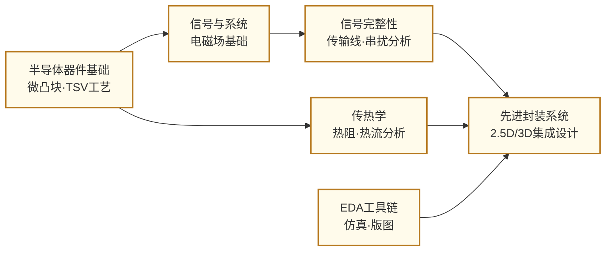

---
hide:
  - navigation
---
# 先进封装与异构集成

## 一句话定义

把来自不同工厂、不同工艺的多块芯片高密度整合在同一封装内——先进封装是摩尔定律减速后，芯片系统继续提升性能的核心路径。

## 这个方向在研究什么

传统 SoC 设计的逻辑是：把所有功能集成在一块用最先进工艺制造的单一芯片上。这个路径在 28nm 以上工艺节点时代运作良好，但进入 7nm、5nm 之后，芯片面积越大、良率越低，制造成本呈超线性增长。一块边长 2cm 的 CPU Die，在 5nm 工艺下的良率可能只有 30%——也就是说 70% 的制造成本全部打了水漂。Chiplet（芯粒）架构提供了一条出路：把一块大芯片拆成若干功能模块，分别用最适合的工艺在不同晶圆厂制造，再通过封装技术整合在一起。CPU 计算核心用最先进的 5nm，I/O 控制器用成熟的 22nm，HBM 存储用专用 DRAM 工艺——不同模块各走最优路径，整体成本和性能均可超越单一芯片方案。AMD 的 EPYC 处理器、Apple M 系列芯片都是这套思路的代表性产品。

连接这些芯片小芯片的互联技术是先进封装研究的核心。2.5D 集成把多个 Die 并排放在同一块高密度的硅转接板（Silicon Interposer）上，通过数以万计的微凸块（microbump）在不到 10 微米间距内实现高带宽互联——台积电的 CoWoS 平台就是这条路线的代表。3D 集成则把多个 Die 垂直堆叠，通过硅通孔（TSV, Through-Silicon Via）传递信号，极大缩短了 Die 间的互联距离，是 HBM（高带宽内存）实现超高存储带宽的核心工艺。更进一步的 3D IC（如台积电 SoIC、Intel Foveros）把 Die 直接键合，键合间距可以缩小到微米甚至亚微米，带宽密度和能效都远超微凸块方案。

这个方向面临的核心工程挑战是散热和信号完整性。多个 Die 紧密堆叠后，芯片的功率密度可以超过 1000 W/cm²——这个热密度远超传统单芯片方案，甚至超过了喷气发动机燃烧室的热流密度。如何把热量从最热的底层 Die 导出，同时不损坏周围的薄膜结构和微凸块，是热管理研究的核心问题。信号完整性则关注高密度互联下的串扰、反射和电源分配问题：当微凸块间距缩小到 10 微米以下，相邻信号线之间的电磁耦合变得不可忽视，同时极短的互联时序对电源分配网络的阻抗提出了苛刻要求。EDA 工具的进步是实现量产的另一个关键——如何对复杂的多 Die 系统做联合时序分析、热仿真、信号完整性分析，是当前设计自动化研究的热点。

开放标准化是产业生态的关键瓶颈。当不同公司的 Chiplet 需要互相连接时，需要统一的物理接口规范和协议。UCIe（Universal Chiplet Interconnect Express）是目前最主要的 Chiplet 互联标准，由 Intel、台积电、AMD、三星等主要玩家联合制定，定义了 Die-to-Die 物理层、协议层和软件层的规范。研究者在研究如何在保证互操作性的同时，把 UCIe 接口的面积和功耗压到最低。

## 核心研究问题

- **芯片间互联**：Chiplet 之间的带宽密度和能效如何随封装技术的演进而提升？UCIe 等标准化接口如何兼顾通用性与极低开销？
- **热管理**：3D 堆叠后的极高热密度如何通过微流道冷却、导热材料优化等手段控制在安全范围？
- **信号/电源完整性**：超高密度互联下的串扰、阻抗匹配和电源分配如何在早期设计阶段精确预测和优化？
- **先进封装 EDA**：多 Die 系统的联合时序、热、信号仿真如何实现高效自动化，支撑量产流程？
- **可靠性与测试**：Chiplet 集成后的系统级故障如何进行有效的已知良品（KGD）测试和系统级诊断？

## 代表性机构与企业

| | 国际 | 国内 |
|--|------|------|
| **企业** | TSMC（CoWoS/SoIC）、Intel（Foveros/EMIB）、AMD、ASE | 长电科技、通富微电、华天科技 |
| **高校/研究机构** | IMEC、Georgia Tech、UCLA、UIUC | 清华、北大、复旦 |
| **顶会** | ECTC · 3DIC · IEEE CPMT · DAC · ICCAD | — |

## 知识路径

**本站相关课程：**

- [固体物理（复旦）](../课程资源/物理/固体物理/MICR130013.md)
- [半导体器件原理（复旦）](../课程资源/器件与工艺/半导体器件/半导体器件原理_FDU/MICR130006.md)
- [高频电子线路 EE613](../课程资源/电路/模拟/高频电子线路/EE613.md)

## 入门三步走

**第一步：了解产业背景**  
阅读 SemiAnalysis 关于 CoWoS 产能和 Chiplet 生态的深度报道，以及 UCIe 1.1 规范的技术白皮书（免费公开），建立对先进封装产业格局的基本认知。

**第二步：理解核心技术**  
阅读 Lau, *Recent Advances and New Trends in Flip Chip Technology* (J. Electronic Packaging, 2016) 和 Iyer et al., *Heterogeneous integration insights* (IEEE Micro, 2020)，系统了解封装技术演进脉络和异构集成的工程挑战。

**第三步：跟进前沿**  
浏览 ECTC 2022-2024 的 3D/2.5D Integration 相关 Session，以及 ISSCC 2023-2024 中 HBM + 近存计算的 session，了解从封装器件到系统应用的完整链路。

## 相关课题组

### 境内

-   **[王喆垚](https://www.ime.tsinghua.edu.cn/info/1038/1598.htm)** 清华

    先进封装与 Chiplet 异构集成 · 3D IC 热管理 · 高密度芯片间互联

-   **[蔡坚](https://www.sic.tsinghua.edu.cn/info/1015/1828.htm)** 清华

    先进半导体封装 · Chiplet/Fan-out · 异构集成可靠性

-   **[陈迟晓](https://fics.fudan.edu.cn/4c/e6/c39908a412902/page.htm)** 复旦

    Chiplet 异构集成系统 · AI 算法-电路-架构协同 · 感存算一体

-   **[马恺声](http://group.iiis.tsinghua.edu.cn/~maks/)** 清华

    Chiplet 异构集成系统架构 · Post-Moore 芯片设计

-   **[王玮](https://ic.pku.edu.cn/szdw/zzjs/jcwnxtx1/ww/index.htm)** 北大

    微系统集成技术 · MEMS 封装 · 微系统热管理

-   **[程哲](https://ic.pku.edu.cn/szdw/zzjs/jcwndzx1/cz/index.htm)** 北大

    三维堆叠芯片热管理 · 半导体异构集成界面热阻

<button class="prof-show-all">显示全部 ↓</button>

### 境外

-   **[李世玮（Ricky Shi-Wei Lee）](https://mae.hkust.edu.hk/en/people/faculty/detail/lee-shi-wei-ricky)** 港科大

    晶圆级封装与 3D IC 集成 · TSV 与高密度互连 · 异构集成热管理与可靠性 · IEEE/ASME Fellow

-   **[何宗毅（Tsung-Yi Ho）](https://www.cse.cuhk.edu.hk/people/faculty/tsung-yi-ho/)** 港中大

    3D IC 与 Chiplet 异构集成 EDA · 先进封装设计自动化

-   **[余贝（Bei Yu）](https://www.cse.cuhk.edu.hk/people/faculty/bei-yu/)** 港中大

    EDA for Chiplet 异构集成 · 2.5D/3D IC 物理设计 · ML 辅助布局布线

-   **[Madhavan Swaminathan](https://ece.gatech.edu/directory/madhavan-swaminathan)** Georgia Tech

    信号/电源完整性 · 电磁建模 · Chip-Package 协同设计 · 2.5D/3D 互连

-   **[Muhannad S. Bakir](https://bakirlab.gatech.edu/)** Georgia Tech

    2.5D/3D IC 先进封装设计与制造 · 微尺度冷却 · 共封装光互连（Co-packaged Optics）

-   **[Subramanian S. Iyer](https://www.ee.ucla.edu/subramanian-s-iyer/)** UCLA

    Chiplet 概念先驱 · Fine-Pitch Interconnect · 3D 集成 · 存储子系统异构集成

-   **[Nam Sung Kim](https://ece.illinois.edu/about/directory/faculty/nskim)** UIUC

    Chiplet 集成架构 · 3D 堆叠存储器系统 · 异构计算系统设计

-   **[Eric Pop](https://profiles.stanford.edu/epop)** Stanford

    3D 异构集成热管理 · 高热导绝缘体用于 3D IC · 新材料器件与集成

<button class="prof-show-all">显示全部 ↓</button>
