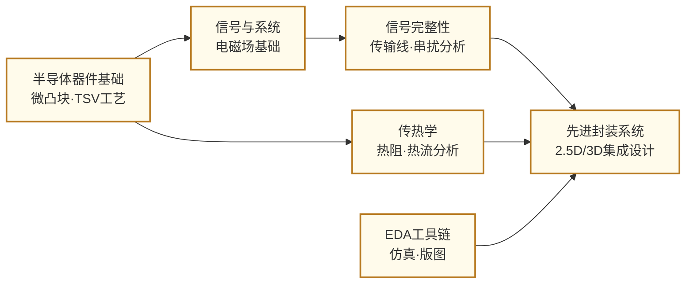

---
hide:
  - navigation
---
把来自不同工厂、不同工艺的多块芯片高密度整合在同一封装内——先进封装是摩尔定律减速后，芯片系统继续提升性能的核心路径。

## 这个方向在研究什么

2022 年，Apple 发布了 M1 Ultra——把两块 M1 Max 通过一条叫 **UltraFusion** 的互联桥接在一起，2500 个连接点，芯片间带宽 2.5 TB/s，是 Thunderbolt 4 接口的十倍。插进 Mac Studio 的操作系统看不到两块芯片，只看到一块超大单片。这不是幻术，而是**先进封装**：把多块分离的芯片，在封装层面缝合成一个整体。

为什么要先切开再拼？答案藏在一张良率曲线里。芯片面积越大，晶圆上的随机缺陷命中它的概率越高，**良率**随面积近似指数下降——一块大面积 CPU Die 在 5nm 工艺下良率可能只有 30%，七成的制造成本打了水漂。更麻烦的是，不同功能模块的最佳制程本来就不一样：逻辑核用 3nm 合适，I/O 控制器 22nm 已经足够，DRAM 有专属工艺、根本无法在逻辑产线上生产。**Chiplet（芯粒）**架构把大芯片按功能拆分，各用最适合的工艺分头制造，再通过封装高密度拼合——AMD **EPYC** 如此拼接计算核与 I/O Die，NVIDIA H100 如此将 GPU 与六块 HBM 整合在一起。

但切开就产生了一个新的代价：**芯片间的通信成本**。片内信号传输一次只需几皮秒，能耗极低；一旦越出芯片边界、经过封装基板走线，延迟倍增，每比特的传输能耗可以高出一个量级。这个代价是先进封装必须解决的核心问题，而解法只有一条：让分离的芯片物理上靠得更近。沿着这条思路，封装技术形成了一条密度阶梯——每向上爬一级，芯片之间的信号路径就缩短一截：

<svg viewBox="0 0 900 300" style="width:100%;max-width:900px;display:block;margin:1.5em auto;font-family:system-ui,-apple-system,sans-serif">
  <defs>
    <marker id="arrd" markerWidth="8" markerHeight="8" refX="6" refY="3" orient="auto">
      <path d="M0,0 L0,6 L8,3 z" fill="#64748B"/>
    </marker>
    <linearGradient id="densityGrad" x1="0" y1="0" x2="1" y2="0">
      <stop offset="0%" stop-color="#E2E8F0"/>
      <stop offset="100%" stop-color="#3B82F6" stop-opacity="0.3"/>
    </linearGradient>
  </defs>
  <!-- Density axis bar -->
  <rect x="20" y="264" width="860" height="10" rx="5" fill="url(#densityGrad)"/>
  <text x="20" y="286" font-size="10" fill="#94A3B8">互联密度 低</text>
  <text x="880" y="286" text-anchor="end" font-size="10" fill="#3B82F6">高 →</text>
  <!-- Arrows -->
  <line x1="212" y1="130" x2="232" y2="130" stroke="#94A3B8" stroke-width="1.5" marker-end="url(#arrd)"/>
  <line x1="428" y1="130" x2="448" y2="130" stroke="#94A3B8" stroke-width="1.5" marker-end="url(#arrd)"/>
  <line x1="644" y1="130" x2="664" y2="130" stroke="#94A3B8" stroke-width="1.5" marker-end="url(#arrd)"/>
  <!-- Col 1: 2D -->
  <rect x="20" y="28" width="192" height="226" rx="8" fill="#F8FAFC" stroke="#CBD5E1" stroke-width="1.5"/>
  <text x="116" y="50" text-anchor="middle" font-size="12" font-weight="700" fill="#1E293B">2D</text>
  <rect x="40" y="64" width="68" height="34" rx="4" fill="#BFDBFE" stroke="#3B82F6" stroke-width="1.5"/>
  <rect x="124" y="64" width="68" height="34" rx="4" fill="#DCFCE7" stroke="#16A34A" stroke-width="1.5"/>
  <text x="74" y="85" text-anchor="middle" font-size="10" fill="#1E40AF">Die A</text>
  <text x="158" y="85" text-anchor="middle" font-size="10" fill="#166534">Die B</text>
  <rect x="20" y="106" width="192" height="18" fill="#E2E8F0"/>
  <text x="116" y="119" text-anchor="middle" font-size="9" fill="#475569">有机封装基板</text>
  <text x="116" y="196" text-anchor="middle" font-size="9" fill="#94A3B8">间距 ~100 µm</text>
  <text x="116" y="214" text-anchor="middle" font-size="9" fill="#94A3B8">基板走线互联</text>
  <!-- Col 2: 2.5D -->
  <rect x="232" y="28" width="196" height="226" rx="8" fill="#F8FAFC" stroke="#CBD5E1" stroke-width="1.5"/>
  <text x="330" y="50" text-anchor="middle" font-size="12" font-weight="700" fill="#1E293B">2.5D</text>
  <rect x="250" y="64" width="72" height="34" rx="4" fill="#BFDBFE" stroke="#3B82F6" stroke-width="1.5"/>
  <rect x="338" y="64" width="72" height="34" rx="4" fill="#DCFCE7" stroke="#16A34A" stroke-width="1.5"/>
  <text x="286" y="85" text-anchor="middle" font-size="10" fill="#1E40AF">GPU Die</text>
  <text x="374" y="85" text-anchor="middle" font-size="10" fill="#166534">HBM</text>
  <rect x="232" y="106" width="196" height="18" fill="#C7D2FE"/>
  <text x="330" y="119" text-anchor="middle" font-size="9" fill="#3730A3">硅转接板 Interposer</text>
  <text x="330" y="155" text-anchor="middle" font-size="8" fill="#6366F1">EMIB 变体：有机基板内</text>
  <text x="330" y="168" text-anchor="middle" font-size="8" fill="#94A3B8">嵌入局部硅桥替代整张转接板</text>
  <text x="330" y="196" text-anchor="middle" font-size="9" fill="#94A3B8">间距 ~10 µm</text>
  <text x="330" y="214" text-anchor="middle" font-size="9" fill="#94A3B8">CoWoS · HBM · EMIB</text>
  <!-- Col 3: 3.5D -->
  <rect x="448" y="28" width="196" height="226" rx="8" fill="#F0FDF4" stroke="#16A34A" stroke-width="1.5"/>
  <text x="546" y="50" text-anchor="middle" font-size="12" font-weight="700" fill="#14532D">3.5D</text>
  <!-- F2F stacked compute dies on interposer -->
  <rect x="466" y="60" width="80" height="22" rx="3" fill="#BFDBFE" stroke="#3B82F6" stroke-width="1.5"/>
  <line x1="466" y1="82" x2="546" y2="82" stroke="#EF4444" stroke-width="1" stroke-dasharray="2,2"/>
  <rect x="466" y="82" width="80" height="22" rx="3" fill="#93C5FD" stroke="#3B82F6" stroke-width="1.2"/>
  <text x="506" y="74" text-anchor="middle" font-size="8" fill="#1E3A8A">计算 Die（上）</text>
  <text x="506" y="93" text-anchor="middle" font-size="8" fill="#1E40AF">计算 Die（下）</text>
  <text x="506" y="116" text-anchor="middle" font-size="7" fill="#EF4444">F2F 键合</text>
  <rect x="558" y="64" width="68" height="40" rx="3" fill="#DCFCE7" stroke="#16A34A" stroke-width="1.5"/>
  <text x="592" y="85" text-anchor="middle" font-size="9" fill="#166534">HBM ×N</text>
  <rect x="448" y="120" width="196" height="18" fill="#BBF7D0"/>
  <text x="546" y="133" text-anchor="middle" font-size="9" fill="#14532D">CoWoS-L 大尺寸转接板</text>
  <text x="546" y="160" text-anchor="middle" font-size="8" fill="#15803D">2.5D 水平集成</text>
  <text x="546" y="173" text-anchor="middle" font-size="8" fill="#15803D">+ 3D F2F 计算 Die 堆叠</text>
  <text x="546" y="196" text-anchor="middle" font-size="9" fill="#94A3B8">6000+ mm² · 12 HBM</text>
  <text x="546" y="214" text-anchor="middle" font-size="9" fill="#15803D">Broadcom XDSiP</text>
  <!-- Col 4: 3D IC -->
  <rect x="664" y="28" width="216" height="226" rx="8" fill="#FFF7ED" stroke="#F59E0B" stroke-width="1.5"/>
  <text x="772" y="50" text-anchor="middle" font-size="12" font-weight="700" fill="#92400E">3D IC（直接键合）</text>
  <rect x="684" y="64" width="156" height="30" rx="3" fill="#BFDBFE" stroke="#3B82F6" stroke-width="1.5"/>
  <line x1="684" y1="94" x2="840" y2="94" stroke="#EF4444" stroke-width="1.5" stroke-dasharray="3,2"/>
  <rect x="684" y="94" width="156" height="30" rx="3" fill="#FEF3C7" stroke="#D97706" stroke-width="1.5"/>
  <text x="762" y="83" text-anchor="middle" font-size="9" fill="#1E40AF">Die A</text>
  <text x="762" y="113" text-anchor="middle" font-size="9" fill="#92400E">Die B</text>
  <text x="762" y="152" text-anchor="middle" font-size="8" fill="#EF4444">← Cu-Cu 直接键合界面 →</text>
  <text x="762" y="196" text-anchor="middle" font-size="9" fill="#B45309">间距 &lt;1 µm · 近片内密度</text>
  <text x="762" y="214" text-anchor="middle" font-size="9" fill="#B45309">SoIC · Foveros</text>
</svg>

**2D** 把芯片并排放在封装基板上，信号绕行基板走线，间距百微米量级。**2.5D** 在 Die 下方铺一层高密度**硅转接板（Interposer）**，微凸块间距压到 10 微米，NVIDIA H100 的 **CoWoS** 封装正是如此把 GPU 和 HBM 并排拼接；Intel 的 **EMIB**（嵌入式硅桥）是 2.5D 的一个成本变体，不铺整张转接板，只在两块 Die 交界处嵌入一小片硅桥局部提供高密度连接，Meteor Lake 采用此方案。**3.5D** 才是真正的混合方案：Broadcom 的 **XDSiP** 以 CoWoS-L 大尺寸转接板为 2.5D 基础，同时把多块计算 Die **面对面（F2F）垂直键合**叠在一起——水平集成和垂直堆叠同时发生，Die 间接口功耗降低 90%，整个封装体最大可塞下 6000+ mm² 硅片和 12 块 HBM；这也是"3.5D"这个名字真正准确的地方：2.5D + 局部 3D = 3.5D。**3D IC** 则走到极限：台积电 **SoIC**、Intel **Foveros** 将所有 Die 铜-铜直接键合，间距不到 1 微米，连接密度已接近片内互联，与单片芯片的边界正在消弭。

这场"缩短距离"的竞赛，不只发生在芯片之间，也发生在芯片脚下的**基板**里。信号从芯片出发，必须先穿过基板才能抵达另一端，基板的材料同样是通信代价的一部分。当前主流的 **ABF 有机基板**（味之素膜）在 2020-2021 年芯片短缺期间成了全球供应链瓶颈——制程越先进，封装越密，对 ABF 的需求越大。Intel 力推的下一代方案是**玻璃基板**：介电损耗更低、线宽更细、热膨胀系数更接近硅（减少热循环中的界面应力），计划 2026 年引入量产。拦路虎是工艺：玻璃质脆，激光钻微孔时容易崩裂，如何在不开裂的前提下打出高密度通孔，是当前封装材料研究的重要课题。

同样的逻辑延伸到服务器之间：AI 集群里，GPU 节点通过光纤互联，传统方案把**光模块**插在交换机端口——光信号要在外部模块和交换 ASIC 之间来回进行光电转换，每次转换都是一次**插入损耗**，白白烧掉能量。**光电共封装（CPO，Co-Packaged Optics）**把光引擎和交换 ASIC 直接封装在一起，光电转换就在芯片旁边完成，传输距离极短、损耗极低——这是"让通信单元尽量近"这一思路在数据中心网络层面的体现。随着 AI 训练对跨机柜带宽的需求指数级增长，CPO 已成为下一代数据中心交换机的核心技术方向。

如果说上面的路线都在解决"硅与硅之间的通信代价"，**异质材料集成**则在追问：如果最擅长某项功能的材料根本不是硅，能不能把它拉进封装体内？硅擅长逻辑，但在射频放大、大功率开关、激光发射等场景远非最优——**GaAs、GaN、InP** 等 III-V 族半导体在这些领域远超硅。把它们与硅 CMOS 集成在同一封装内，系统可以兼得各方之长，代价是复杂的工程问题：III-V 材料与硅的**热膨胀系数（CTE）严重失配**，温度循环中的应力会撕裂界面；III-V 工艺中的砷、磷等元素对 CMOS 产线是污染源，工艺隔离需要精细设计。

当"让一切尽量近"这条思路被推到极限，三道绕不过去的关卡浮出水面：**散热**——3D 堆叠后功率密度超过 1000 W/cm²，远超喷气发动机燃烧室，如何在不拆封装的前提下把热量导走；**已知良品（KGD）测试**——把一块坏 Die 集成进封装后才发现，整个封装就报废了，必须在裸片阶段完成全功能筛查；**标准化**——来自不同公司的 Chiplet 要互联，就需要统一的物理接口规范，**UCIe（Universal Chiplet Interconnect Express）**由 Intel、台积电、AMD 联合制定，定义了 Die-to-Die 的物理层与协议层，如何在保证互操作性的同时把接口面积和功耗压到最低，仍是开放的研究前沿。

## 适合什么样的人

这个方向横跨封装工艺、电磁仿真、热设计和 EDA 四个维度，是少有的真正多学科交叉方向。如果你的兴趣点在系统级工程——希望既能理解芯片如何制造，又能关心它们组合在一起时的性能瓶颈——这里会让你有大量施展空间。

工艺侧的研究（TSV 制造、微凸块键合、热界面材料）仍然需要在洁净间里动手，但相比器件工艺，这里的工序数量更少，更多时间花在封装结构测量和可靠性测试上。仿真侧的工作（信号完整性、热仿真、EDA 自动化）基本在计算机上完成，熟悉 ANSYS HFSS/SIwave、COMSOL 或 Cadence 封装工具会是竞争力所在。EDA 方向的同学需要有更扎实的编程基础，能够处理大规模图算法和优化问题。

这个方向有一个独特之处：它的产业应用极其明确，AI 加速器和数据中心芯片对先进封装的需求正处于爆发期，TSMC CoWoS 产能持续紧张就是最直观的证明。如果你希望所做的研究与产业前沿直接挂钩，并且不排斥工程性强、系统复杂度高的问题，这个方向值得认真考虑。不太适合的情况：如果你对底层器件物理有强烈兴趣，希望深入钻研单个晶体管的机制，先进封装的研究尺度（微米到毫米量级）和关注点（系统级集成）与那种兴趣并不匹配。

## 核心研究问题

- **芯片间互联**：Chiplet 之间的带宽密度和能效如何随封装技术的演进而提升？UCIe 等标准化接口如何兼顾通用性与极低开销？
- **热管理**：3D 堆叠后的极高热密度如何通过微流道冷却、导热材料优化等手段控制在安全范围？
- **信号/电源完整性**：超高密度互联下的串扰、阻抗匹配和电源分配如何在早期设计阶段精确预测和优化？
- **先进封装 EDA**：多 Die 系统的联合时序、热、信号仿真如何实现高效自动化，支撑量产流程？
- **可靠性与测试**：Chiplet 集成后的系统级故障如何进行有效的已知良品（KGD）测试和系统级诊断？

## 代表性机构

| | 国际 | 国内 |
|--|------|------|
| **企业** | TSMC（CoWoS/SoIC）、Intel（Foveros/EMIB）、AMD、ASE | 长电科技、通富微电、华天科技 |
| **顶会** | ECTC · 3DIC · IEEE CPMT · DAC · ICCAD | — |

## 知识路径

图中节点对应以下知识板块（按需选修）：

- [器件与工艺](../课程资源/器件与工艺/index.md)（器件原理·IC工艺基础）
- [电路](../课程资源/电路/index.md)（模拟电路·高频电路·信号完整性方向）
- [物理基础](../课程资源/物理/index.md)（固体物理·热学基础）

## 入门三步走

**典型研究长什么样**

ECTC 顶会的典型封装论文有两种形态：工艺类论文展示一种新的键合方案（如混合键合间距从 10μm 缩到 3μm），关键图表是截面 SEM 图和电学/热学测试结果，核心指标是键合良率和接触电阻；EDA 类论文提出多 Die 系统的联合仿真或优化方法，关键指标是运行时间与精度的折中。大多数先进封装学术工作不需要流片完整 SoC，而是做工艺模块验证或仿真方法验证；结论格式通常是"方案 X 在指标 Y 上相比基线提升 Z 倍，并在测试载片上通过电测/热测验证"。

**第一步：了解产业背景**  
阅读 SemiAnalysis 关于 CoWoS 产能和 Chiplet 生态的深度报道，以及 UCIe 1.1 规范的技术白皮书（免费公开），建立对先进封装产业格局的基本认知。

**第二步：理解核心技术**  
阅读 Lau, *Recent Advances and New Trends in Flip Chip Technology* (J. Electronic Packaging, 2016) 和 Iyer et al., *Heterogeneous integration insights* (IEEE Micro, 2020)，系统了解封装技术演进脉络和异构集成的工程挑战。

**第三步：跟进前沿**  
浏览 ECTC 2022-2024 的 3D/2.5D Integration 相关 Session，以及 ISSCC 2023-2024 中 HBM + 近存计算的 session，了解从封装器件到系统应用的完整链路。

## 相关课题组

### 境内

-   **[王喆垚](https://www.ime.tsinghua.edu.cn/info/1038/1598.htm)** 清华

    先进封装与 Chiplet 异构集成 · 3D IC 热管理 · 高密度芯片间互联

-   **[蔡坚](https://www.sic.tsinghua.edu.cn/info/1015/1828.htm)** 清华

    先进半导体封装 · Chiplet/Fan-out · 异构集成可靠性

-   **[陈迟晓](https://fics.fudan.edu.cn/4c/e6/c39908a412902/page.htm)** 复旦

    Chiplet 异构集成系统 · AI 算法-电路-架构协同 · 感存算一体

-   **[马恺声](http://group.iiis.tsinghua.edu.cn/~maks/)** 清华

    Chiplet 异构集成系统架构 · Post-Moore 芯片设计

-   **[王玮](https://ic.pku.edu.cn/szdw/zzjs/jcwnxtx1/ww/index.htm)** 北大

    微系统集成技术 · MEMS 封装 · 微系统热管理

-   **[程哲](https://ic.pku.edu.cn/szdw/zzjs/jcwndzx1/cz/index.htm)** 北大

    三维堆叠芯片热管理 · 半导体异构集成界面热阻

<button class="prof-show-all">显示全部 ↓</button>

### 境外

-   **[李世玮（Ricky Shi-Wei Lee）](https://mae.hkust.edu.hk/en/people/faculty/detail/lee-shi-wei-ricky)** 港科大

    晶圆级封装与 3D IC 集成 · TSV 与高密度互连 · 异构集成热管理与可靠性 · IEEE/ASME Fellow

-   **[何宗毅（Tsung-Yi Ho）](https://www.cse.cuhk.edu.hk/people/faculty/tsung-yi-ho/)** 港中大

    3D IC 与 Chiplet 异构集成 EDA · 先进封装设计自动化

-   **[余贝（Bei Yu）](https://www.cse.cuhk.edu.hk/people/faculty/bei-yu/)** 港中大

    EDA for Chiplet 异构集成 · 2.5D/3D IC 物理设计 · ML 辅助布局布线

-   **[Madhavan Swaminathan](https://ece.gatech.edu/directory/madhavan-swaminathan)** Georgia Tech

    信号/电源完整性 · 电磁建模 · Chip-Package 协同设计 · 2.5D/3D 互连

-   **[Muhannad S. Bakir](https://bakirlab.gatech.edu/)** Georgia Tech

    2.5D/3D IC 先进封装设计与制造 · 微尺度冷却 · 共封装光互连（Co-packaged Optics）

-   **[Subramanian S. Iyer](https://www.ee.ucla.edu/subramanian-s-iyer/)** UCLA

    Chiplet 概念先驱 · Fine-Pitch Interconnect · 3D 集成 · 存储子系统异构集成

-   **[Nam Sung Kim](https://ece.illinois.edu/about/directory/faculty/nskim)** UIUC

    Chiplet 集成架构 · 3D 堆叠存储器系统 · 异构计算系统设计

-   **[Eric Pop](https://profiles.stanford.edu/epop)** Stanford

    3D 异构集成热管理 · 高热导绝缘体用于 3D IC · 新材料器件与集成

<button class="prof-show-all">显示全部 ↓</button>
