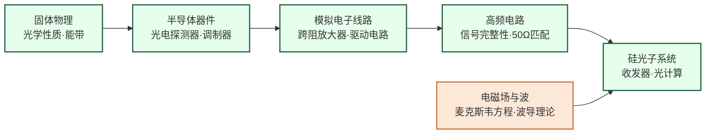

---
hide:
  - navigation
---

在硅芯片上集成光学元件，用光子而非电子传输数据——解决 AI 数据中心互联带宽危机，并向光计算方向演进。

## 这个方向在研究什么

在长距离通信上，光纤早就赢了：一根光纤的传输容量可以达到每秒数十太比特，而铜缆在超过几十米后信号就开始衰减，需要中继放大。但在短距离——比如数据中心机架内部的芯片间互联——电信号仍然主导，因为在几厘米到几米的范围内，铜缆足够便宜和可靠。这个格局在 AI 集群时代开始松动。一个训练 GPT-4 级别模型的集群有数万块 GPU，它们之间的数据吞吐量极为惊人，而铜缆在高速传输时功耗巨大（信号完整性问题导致需要大量均衡和放大电路），并且超过几米就很难做到百 Gbps 的速率。用光代替铜，在带宽、功耗、距离三个维度上都有优势，这是硅光子近年来最迫切的工业需求来源。

<svg viewBox="0 0 860 220" xmlns="http://www.w3.org/2000/svg" style="width:100%;max-width:860px;display:block;margin:1.5rem auto;">
  <defs>
    <marker id="arrowCopper" markerWidth="8" markerHeight="8" refX="6" refY="3" orient="auto">
      <path d="M0,0 L0,6 L8,3 z" fill="#3B82F6"/>
    </marker>
    <marker id="arrowPhoton" markerWidth="8" markerHeight="8" refX="6" refY="3" orient="auto">
      <path d="M0,0 L0,6 L8,3 z" fill="#D97706"/>
    </marker>
    <marker id="arrowPurple" markerWidth="8" markerHeight="8" refX="6" refY="3" orient="auto">
      <path d="M0,0 L0,6 L8,3 z" fill="#7C3AED"/>
    </marker>
  </defs>
  <!-- Background -->
  <rect width="860" height="220" rx="10" fill="#F8FAFC" stroke="#CBD5E1" stroke-width="1.5"/>
  <!-- Panel 1: Copper Interconnect -->
  <rect x="10" y="10" width="260" height="200" rx="8" fill="#DBEAFE" stroke="#3B82F6" stroke-width="1.5"/>
  <text x="140" y="32" text-anchor="middle" font-size="12" font-weight="bold" fill="#1E40AF">① 铜互联（传统）</text>
  <!-- Copper wire (thick) -->
  <rect x="30" y="70" width="220" height="28" rx="4" fill="#93C5FD" stroke="#3B82F6" stroke-width="2"/>
  <text x="140" y="89" text-anchor="middle" font-size="10" font-weight="bold" fill="#1E3A8A">铜导线</text>
  <!-- Jagged loss lines -->
  <polyline points="55,65 65,55 75,65 85,55 95,65 105,55 115,65 125,55 135,65 145,55 155,65 165,55 175,65 185,55 195,65 205,55 215,65 225,55 235,65" stroke="#EF4444" stroke-width="1.5" fill="none"/>
  <text x="140" y="52" text-anchor="middle" font-size="8.5" fill="#DC2626">衰减损耗（需要均衡放大）</text>
  <!-- Labels -->
  <text x="140" y="120" text-anchor="middle" font-size="10" fill="#1D4ED8">高功耗 | 距离受限</text>
  <text x="140" y="136" text-anchor="middle" font-size="10" fill="#1D4ED8">数据中心互联瓶颈</text>
  <text x="140" y="155" text-anchor="middle" font-size="9.5" fill="#374151">超 10m → 信号完整性恶化</text>
  <text x="140" y="170" text-anchor="middle" font-size="9.5" fill="#374151">100 Gbps+ → 功耗激增</text>
  <text x="140" y="188" text-anchor="middle" font-size="9" fill="#6B7280">传统铜电缆 / PCB 走线</text>
  <!-- Panel 2: Silicon Photonics -->
  <rect x="295" y="10" width="270" height="200" rx="8" fill="#FEF3C7" stroke="#D97706" stroke-width="1.5"/>
  <text x="430" y="32" text-anchor="middle" font-size="12" font-weight="bold" fill="#92400E">② 硅光子（SiPh）</text>
  <!-- Silicon die outline -->
  <rect x="315" y="50" width="230" height="100" rx="6" fill="#FDE68A" stroke="#D97706" stroke-width="2"/>
  <text x="430" y="68" text-anchor="middle" font-size="9.5" fill="#78350F">Silicon Die（CMOS 工艺兼容）</text>
  <!-- Photon path inside chip -->
  <!-- Laser -->
  <rect x="325" y="78" width="44" height="30" rx="4" fill="#FBBF24" stroke="#D97706" stroke-width="1.5"/>
  <text x="347" y="97" text-anchor="middle" font-size="9" font-weight="bold" fill="#78350F">激光</text>
  <!-- Arrow laser → modulator -->
  <line x1="369" y1="93" x2="388" y2="93" stroke="#D97706" stroke-width="2" marker-end="url(#arrowPhoton)"/>
  <!-- Modulator -->
  <rect x="390" y="78" width="52" height="30" rx="4" fill="#FBBF24" stroke="#D97706" stroke-width="1.5"/>
  <text x="416" y="97" text-anchor="middle" font-size="9" font-weight="bold" fill="#78350F">调制器</text>
  <!-- Arrow modulator → waveguide -->
  <line x1="442" y1="93" x2="461" y2="93" stroke="#D97706" stroke-width="2" marker-end="url(#arrowPhoton)"/>
  <!-- Waveguide (thin line) -->
  <line x1="463" y1="93" x2="490" y2="93" stroke="#D97706" stroke-width="3"/>
  <text x="477" y="83" text-anchor="middle" font-size="8" fill="#92400E">波导</text>
  <!-- Arrow waveguide → detector -->
  <line x1="490" y1="93" x2="505" y2="93" stroke="#D97706" stroke-width="2" marker-end="url(#arrowPhoton)"/>
  <!-- Detector -->
  <rect x="507" y="78" width="28" height="30" rx="4" fill="#FBBF24" stroke="#D97706" stroke-width="1.5"/>
  <text x="521" y="97" text-anchor="middle" font-size="8.5" font-weight="bold" fill="#78350F">PD</text>
  <text x="430" y="125" text-anchor="middle" font-size="9" fill="#78350F">激光 → 调制器 → 波导 → 探测器</text>
  <!-- Labels -->
  <text x="430" y="170" text-anchor="middle" font-size="10" fill="#92400E">低功耗 | 高带宽 | 长距离</text>
  <text x="430" y="186" text-anchor="middle" font-size="10" fill="#92400E">CMOS 工艺兼容 | 可规模量产</text>
  <text x="430" y="200" text-anchor="middle" font-size="9" fill="#6B7280">Intel / Ayar Labs / 光迅科技</text>
  <!-- Panel 3: Optical Computing -->
  <rect x="590" y="10" width="260" height="200" rx="8" fill="#EDE9FE" stroke="#7C3AED" stroke-width="1.5"/>
  <text x="720" y="32" text-anchor="middle" font-size="12" font-weight="bold" fill="#5B21B6">③ 光计算（前沿）</text>
  <!-- MZI schematic: input split, two arms, recombine -->
  <!-- Input -->
  <line x1="605" y1="95" x2="630" y2="95" stroke="#7C3AED" stroke-width="2" marker-end="url(#arrowPurple)"/>
  <text x="617" y="88" text-anchor="middle" font-size="8.5" fill="#5B21B6">光输入</text>
  <!-- Splitter -->
  <circle cx="635" cy="95" r="5" fill="#7C3AED"/>
  <!-- Top arm -->
  <path d="M 640 95 Q 665 65 700 65 Q 735 65 760 95" stroke="#7C3AED" stroke-width="2" fill="none"/>
  <!-- Phase shifter top arm -->
  <rect x="672" y="57" width="34" height="16" rx="3" fill="#DDD6FE" stroke="#7C3AED" stroke-width="1"/>
  <text x="689" y="69" text-anchor="middle" font-size="8" fill="#4C1D95">φ₁</text>
  <!-- Bottom arm -->
  <path d="M 640 95 Q 665 125 700 125 Q 735 125 760 95" stroke="#7C3AED" stroke-width="2" fill="none"/>
  <!-- Phase shifter bottom arm -->
  <rect x="672" y="117" width="34" height="16" rx="3" fill="#DDD6FE" stroke="#7C3AED" stroke-width="1"/>
  <text x="689" y="129" text-anchor="middle" font-size="8" fill="#4C1D95">φ₂</text>
  <!-- Combiner -->
  <circle cx="762" cy="95" r="5" fill="#7C3AED"/>
  <!-- Output -->
  <line x1="767" y1="95" x2="795" y2="95" stroke="#7C3AED" stroke-width="2" marker-end="url(#arrowPurple)"/>
  <text x="790" y="88" text-anchor="middle" font-size="8.5" fill="#5B21B6">输出</text>
  <text x="720" y="153" text-anchor="middle" font-size="9.5" fill="#5B21B6">光子干涉 = 矩阵乘法</text>
  <text x="720" y="168" text-anchor="middle" font-size="10" fill="#7C3AED">能效潜力极高</text>
  <text x="720" y="183" text-anchor="middle" font-size="10" fill="#7C3AED">精度挑战待解</text>
  <text x="720" y="200" text-anchor="middle" font-size="9" fill="#6B7280">MIT / Lightmatter / 清华太极</text>
</svg>

"硅光子"的核心思路是：用已经高度成熟的 CMOS 半导体工艺，在硅芯片上制造出能操控光的元件——波导（引导光传播的细管道）、调制器（把电信号转成光强或相位的变化）、光电探测器（把光信号还原成电信号）。这样就可以用流片厂成熟的产线来生产光学元件，而不需要专门的光学工厂，成本大幅降低。问题在于，硅是间接带隙材料，无法高效发光，所以硅光子芯片本身无法产生激光，光源必须另外解决——要么外接激光器耦合进芯片，要么在硅上键合 III-V 族材料（砷化镓、磷化铟）来集成激光器。后者极为困难，因为这两种材料的晶格常数不匹配，键合界面的缺陷密度很高，这是硅光子领域长期悬而未决的核心工艺难题之一。

光调制器是另一个关键器件。硅基马赫-曾德调制器（MZM）通过施加电压改变硅的折射率，进而改变光的相位，从而实现对光信号的调制。但硅的电光系数（Pockels 效应）很弱，要达到足够的相移需要几毫米长的相移段，芯片面积大；相比之下，铌酸锂（LiNbO₃）的电光系数强得多，可以在几十微米的长度内完成同样的调制，带宽也更高，这就是为什么"薄膜铌酸锂"（TFLN）近年成为光子集成研究的热点材料，哈佛、MIT、国内浙大等多个团队在追这个方向。

光计算是更远处的前沿，也是争议最多的一个设想。神经网络推理的核心是矩阵乘法，而矩阵乘法可以用光学干涉仪来模拟：把光信号分成若干路，每路经过不同的相移和分束，干涉叠加后的输出就对应矩阵乘法的结果。光子以光速传播，且不同路之间基本不产生热量，理论上能效远超电子计算。MIT 2017 年在 *Nature Photonics* 上展示了用硅光子芯片实现小型神经网络推理的实验，Lightmatter 等公司在 2023 年展示了能跑实际 AI 模型的光子芯片原型。但真正的挑战是精度控制——光路中的温度漂移、制造偏差会引起相位误差，而神经网络对精度的要求并不宽松。这个方向现在究竟是"即将颠覆算力格局"还是"长期只能做演示"，业界还没有定论，但正因为不确定，才有大量研究空间。

## 适合什么样的人

这个方向适合对"光与物质的相互作用"本身有好奇心的人，同时又不排斥工程实现的复杂性。你需要同时熟悉电磁场理论、固体物理（能带结构、折射率调制机制）和电路设计——这种跨度是这个方向最有趣的地方，也是入门成本最高的地方。如果你觉得"光在波导里传播，用电压改变折射率调制光的相位"这个物理图像令你着迷，这里会是一个值得深耕的方向。

日常工作兼有仿真和实验两个维度：仿真侧需要用 Lumerical FDTD 做波导和调制器的电磁仿真，用 Cadence 设计驱动电路；实验侧需要在光学测试台上对准光纤、测量插损和带宽，使用光谱仪、矢量网络分析仪。光子器件的版图设计（PDK）和流片流程与纯电路有所不同，通常要通过 AIM Photonics、IME Singapore 或 CompoundTek 等专用 MPW 平台。测试条件苛刻，温度漂移对光学性能影响大，测试调试周期相当长。

如果你对数学物理兴趣有限，更偏向纯粹的电路设计，这个方向对你来说可能门槛偏高。光计算的研究前沿不确定性较大，如果你需要明确的产业落地方向作为研究动机，硅光子数据中心互联部分比光计算更为稳健。该方向目前国内产业链正快速建立，毕业后可选择的企业（光迅科技、华为光子、中际旭创、新华三光模块等）越来越多。

## 核心研究问题

- **片上光源**：硅是间接带隙材料，无法高效发光，如何在硅平台上集成激光器（III-V 键合、GeSn 激光器）？
- **调制器带宽**：硅基马赫-曾德调制器（MZM）的带宽和插损如何进一步优化？
- **光电探测器**：锗（Ge）基光电探测器如何提高响应度和带宽？
- **光计算**：光子神经网络能否在推理任务上实现比电子芯片更高的能效？

## 代表性机构

| | 国际 | 国内 |
|--|------|------|
| **企业** | Intel（Silicon Photonics）、Ayar Labs、Coherent | 光迅科技、华为光子、中际旭创 |
| **顶会** | OFC、ECOC、CLEO、IEEE Photonics Journal | — |

## 知识路径

图中节点对应以下知识板块（按需选修）：

- [电路（模拟方向）](../课程资源/电路/index.md)
- [器件与工艺](../课程资源/器件与工艺/index.md)（光电子与硅光方向也需要）
- [系统架构（信号与系统）](../课程资源/系统架构/index.md)

## 入门三步走

**典型研究长什么样**　一篇 OFC 或 Nature Photonics 方向的顶级论文通常呈现一个流片的硅光子或薄膜铌酸锂器件，给出实测的调制带宽（GHz）、插入损耗（dB）、消光比（ER），或者光计算芯片上的矩阵乘法精度和能效（TOPS/W）。大多数论文需要实测芯片数据，通过 MPW 平台（如 IME、AIM Photonics）流片是标准路径，读博期间至少会经历 1-2 轮器件设计→流片→光学测试的完整循环。

**第一步：了解光的物理基础**  
阅读 Saleh & Teich《Fundamentals of Photonics》第 1-2 章（光波与光学元件基础），建立光波传播和波导的直觉。

**第二步：了解硅光子平台**  
阅读 Reed et al., *Silicon optical modulators* (Nature Photonics, 2010)，这是硅光子领域被引最高的综述之一，清晰介绍了硅基调制器的物理机制。

**第三步：了解与 AI 的结合**  
阅读 Shen et al., *Deep learning with coherent nanophotonic circuits* (Nature Photonics, 2017)，这篇文章提出用马赫-曾德干涉仪阵列实现神经网络推理，是光计算领域的奠基性工作。

## 相关课题组

### 境内

-   **[戴琼海](https://www.au.tsinghua.edu.cn/en/info/1080/3316.htm) & [方璐](https://www.luvision.net/)** 清华

    光计算芯片设计（太极芯片） · 衍射光子神经网络 · 光电混合处理器

-   **[陈弘威](https://web.ee.tsinghua.edu.cn/chenhongwei/en/index.htm)** 清华

    硅光子 · 光电信号处理 · 微波光子学

-   **[王建伟](https://faculty.pku.edu.cn/wangjianwei/en/index.htm)** 北大

    集成光子量子芯片 · 大规模硅基光子集成 · 量子网络

-   **[林强](https://photonics.pku.edu.cn/en/info/1022/1332.htm)** 北大

    硅光子与铌酸锂平台 · 片上激光器与光频梳 · 量子光子网络

-   **[迟楠](https://emwlab.fudan.edu.cn/e8/47/c37898a452679/page.htm)** 复旦

    光子集成 · 可见光通信（LiFi） · GaN Micro-LED 高速光通信

-   **[程增光](https://sme.fudan.edu.cn/5f/cd/c31134a352205/page.htm)** 复旦

    硅基光电子集成 · 光子存储与计算 · 新型低维光电器件

-   **[余金中](https://semi.cas.cn/rcdw/yjyjrc/)** 中科院

    硅基光电子器件与集成 · 片上光互联 · 光子集成电路

-   **[祝宁华](https://semi.cas.cn/rcdw/yjyjrc/rc_gtgd/)** 中科院

    微波光子学 · 高速光电子器件 · 宽带光信号产生与处理

-   **[邹卫文](http://imlic.sjtu.edu.cn)** 交大

    集成微光电子 · 硅光子收发芯片 · 高速光通信

-   **[蔡鑫伦](https://seit.sysu.edu.cn/teacher/CaiXinlun)** 中山大学

    薄膜铌酸锂（TFLN）光子集成 · 高速低功耗电光调制器

<button class="prof-show-all">显示全部 ↓</button>

### 境外

-   **[刘纪美（Kei May Lau）](https://ece.hkust.edu.hk/eekmlau)** 港科大

    III-V 族半导体硅上异质外延 · GaN LED/激光器 · Micro-LED 微显示

-   **[向超（Chao Xiang）](https://chao-xiang.github.io/)** 港大

    异构光子集成 · 硅基共封装光子 · 片上激光微梳

-   **[曾汉奇（Hon Ki Tsang）](https://www.ee.cuhk.edu.hk/~hktsang/)** CUHK

    硅光子数据中心互连 · 集成量子光子学 · 2D 材料与硅波导混合集成

-   **[Michal Lipson](http://lipson.ee.columbia.edu)** Columbia

    片上纳米光子器件 · 光调制器 · 光频梳

-   **[Vladimir Stojanovic](https://www2.eecs.berkeley.edu/Faculty/Homepages/vlada.html)** UC Berkeley

    光电集成系统设计 · 芯片内光互联 · 处理器-光子协同设计

-   **[Jelena Vuckovic](https://nqp.stanford.edu)** Stanford

    光子晶体纳腔 · 逆向设计光子器件 · 量子光子集成

-   **[David Miller](https://ee.stanford.edu/~dabm/)** Stanford

    硅基光调制器 · 芯片间光通信 · 光计算

-   **[Marin Soljačić](https://www.rle.mit.edu/marin/)** MIT

    光子机器学习 · 逆向设计光子器件 · 深度学习与光子晶体

-   **[Peter McMahon](https://mcmahonlab.com/)** Cornell

    相干光计算 · 光学神经网络 · 量子-经典混合计算

-   **[Shanhui Fan](https://web.stanford.edu/group/fan/)** Stanford

    光子器件逆向设计 · 非互易光子学 · 光子计算与信息处理

<button class="prof-show-all">显示全部 ↓</button>
