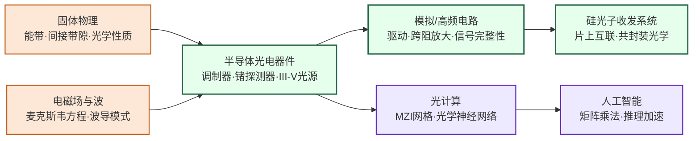

---
hide:
  - navigation
---

在硅芯片上集成光学元件，用光子而非电子传输数据——解决 AI 数据中心互联带宽危机，并向光计算方向演进。

## 这个方向在研究什么

2025 年 A 股最出风头的三只股票，是被股民合称"易中天"的新易盛、中际旭创、天孚通信。前两家做光模块，天孚通信做光器件和光电封装，是光模块的上游。这一年三家股价各涨了 3 到 6 倍，合计市值突破一万亿，单日成交额经常包揽 A 股前三。中际旭创已是全球光模块出货量最大的厂商，大客户是 NVIDIA、Google 这些北美云巨头。把它们送上风口的，是 AI 对光互连的需求。

<svg width="100%" viewBox="0 0 680 300" xmlns="http://www.w3.org/2000/svg" role="img">
<title>铜互连与光互连对比</title>
<text font-family="'Noto Sans SC',sans-serif" font-weight="500" font-size="14" x="340" y="24" text-anchor="middle" fill="#1a1a1a">芯片间互连：铜 vs 光</text>
<rect x="40" y="50" width="100" height="50" rx="4" fill="#F1EFE8" stroke="#888" stroke-width="0.5"/>
<text font-family="'Noto Sans SC',sans-serif" font-weight="500" font-size="13" x="90" y="80" text-anchor="middle" fill="#444">芯片 A</text>
<rect x="540" y="50" width="100" height="50" rx="4" fill="#F1EFE8" stroke="#888" stroke-width="0.5"/>
<text font-family="'Noto Sans SC',sans-serif" font-weight="500" font-size="13" x="590" y="80" text-anchor="middle" fill="#444">芯片 B</text>
<rect x="170" y="62" width="340" height="26" rx="4" fill="#BA7517" opacity="0.15"/>
<ellipse cx="185" cy="75" rx="12" ry="12" fill="#BA7517" opacity="0.35" stroke="#854F0B" stroke-width="0.5"/>
<ellipse cx="185" cy="75" rx="5" ry="5" fill="#BA7517" opacity="0.08" stroke="#854F0B" stroke-width="0.5" stroke-dasharray="2 2"/>
<rect x="205" y="69" width="295" height="12" rx="2" fill="#BA7517" opacity="0.4"/>
<path d="M240,64 Q244,56 248,64" stroke="#E24B4A" stroke-width="0.7" fill="none" opacity="0.5"/>
<path d="M300,64 Q304,54 308,64" stroke="#E24B4A" stroke-width="0.7" fill="none" opacity="0.5"/>
<path d="M360,64 Q364,56 368,64" stroke="#E24B4A" stroke-width="0.7" fill="none" opacity="0.5"/>
<path d="M420,64 Q424,54 428,64" stroke="#E24B4A" stroke-width="0.7" fill="none" opacity="0.5"/>
<path d="M470,64 Q474,56 478,64" stroke="#E24B4A" stroke-width="0.7" fill="none" opacity="0.5"/>
<text font-family="'Noto Sans SC',sans-serif" font-size="12" x="350" y="56" text-anchor="middle" fill="#A32D2D">Q = I²Rt 发热</text>
<line x1="148" y1="75" x2="170" y2="75" stroke="#854F0B" stroke-width="1.5"/>
<line x1="508" y1="75" x2="540" y2="75" stroke="#854F0B" stroke-width="1.5"/>
<text font-family="'Noto Sans SC',sans-serif" font-weight="500" font-size="13" x="90" y="120" fill="#A32D2D">铜线</text>
<text font-family="'Noto Sans SC',sans-serif" font-size="12" x="170" y="120" fill="#A32D2D">有电阻 · 趋肤效应 · 发热 · 串扰</text>
<rect x="40" y="170" width="100" height="50" rx="4" fill="#F1EFE8" stroke="#888" stroke-width="0.5"/>
<text font-family="'Noto Sans SC',sans-serif" font-weight="500" font-size="13" x="90" y="200" text-anchor="middle" fill="#444">芯片 A</text>
<rect x="540" y="170" width="100" height="50" rx="4" fill="#F1EFE8" stroke="#888" stroke-width="0.5"/>
<text font-family="'Noto Sans SC',sans-serif" font-weight="500" font-size="13" x="590" y="200" text-anchor="middle" fill="#444">芯片 B</text>
<rect x="170" y="186" width="340" height="18" rx="9" fill="#185FA5" opacity="0.06" stroke="#185FA5" stroke-width="0.5"/>
<line x1="180" y1="195" x2="500" y2="195" stroke="#378ADD" stroke-width="1.5" stroke-dasharray="8 6" opacity="0.4"/>
<circle cx="220" cy="195" r="2" fill="#378ADD" opacity="0.5"/>
<circle cx="270" cy="195" r="2" fill="#378ADD" opacity="0.5"/>
<circle cx="320" cy="195" r="2" fill="#378ADD" opacity="0.5"/>
<circle cx="370" cy="195" r="2" fill="#378ADD" opacity="0.5"/>
<circle cx="420" cy="195" r="2" fill="#378ADD" opacity="0.5"/>
<circle cx="470" cy="195" r="2" fill="#378ADD" opacity="0.5"/>
<line x1="148" y1="195" x2="170" y2="195" stroke="#185FA5" stroke-width="1.5"/>
<line x1="510" y1="195" x2="540" y2="195" stroke="#185FA5" stroke-width="1.5"/>
<text font-family="'Noto Sans SC',sans-serif" font-weight="500" font-size="13" x="90" y="240" fill="#185FA5">光波导</text>
<text font-family="'Noto Sans SC',sans-serif" font-size="12" x="170" y="240" fill="#185FA5">无电阻 · 不发热 · 不串扰 · 带宽大</text>
<text font-family="'Noto Sans SC',sans-serif" font-size="12" x="340" y="280" text-anchor="middle" fill="#888">光子不带电荷，没有 I²R 损耗</text>
</svg>

光互连的道理，要从中学就学过的焦耳定律说起。导线有电阻，电流通过就要发热，P = I²R，能量直接以热的形式耗散掉。传输距离越长、信号速率越高，铜线上被白白烧成热的能量就越多，超过一定距离铜就扛不住了。光子没有这个负担。它在光纤里几乎不互相干扰，每公里只损耗 0.2 分贝，跨大洋几千公里靠光放大器中继就够，1980 年代起电信骨干就被光纤全面接管。但在几厘米的近距离上，优势又回到铜这边。铜便宜、紧凑、和硅 CMOS 工艺天生兼容，光那一整套激光器、调制器、探测器又大又贵，塞到芯片旁边反而划不来。这几十年下来分工就这么定了，长距离归光，短距离归电。

但 AI 打破了这种分工。一个 GPT-4 量级的模型分布在数万块 GPU 上训练，每完成一步迭代，全集群的参数和梯度都要在芯片之间走一遍，单步通信的数据量是 TB 级。带宽要求每翻一倍，铜导线烧成热的能量也成倍增加。大规模 AI 训练集群里，GPU 之间通信消耗的电力已经能和 GPU 自身做计算的电力相提并论。短距离归铜的稳定局面，开始撑不住了。

自然的解法是把光下到芯片之间，但光有个几十年没解的老问题。传输几乎零损耗，但两端的电光转换却不便宜。一段光链路的能耗分两块，一块是两端固定的转换代价，激光器、调制器、探测器、放大电路整套器件都算在内，另一块是随距离缓慢增长的传输代价。铜链路相反，能耗几乎全堆在距离上。链路够长，光在传输上省下的能量足以摊平两端的固定代价；链路够短，转换代价占主导，电反而划算。芯片之间的几厘米光始终拿不下，不是物理上不行，是电光转换的固定代价让其变得很不划算。

硅光子（Silicon Photonics）要解决的就是这个问题。思路是把激光器、调制器、探测器、波导都做到硅芯片上，借用 CMOS 工艺几十年积累的产线，让光器件像晶体管一样被批量、低成本、紧凑地制造。光器件塞进 GPU 封装、和电子电路集成在同一颗硅片上之后，电学走线急剧缩短，单个转换器件的成本随工艺缩小而下降，几十年来挡在光面前的距离临界值开始向短距离移动。"易中天"三家接住的，就是这波正在逼近芯片的需求。

<svg viewBox="0 0 860 220" xmlns="http://www.w3.org/2000/svg" style="width:100%;max-width:860px;display:block;margin:1.5rem auto;">
  <defs>
    <marker id="arrowCopper" markerWidth="8" markerHeight="8" refX="6" refY="3" orient="auto">
      <path d="M0,0 L0,6 L8,3 z" fill="#3B82F6"/>
    </marker>
    <marker id="arrowPhoton" markerWidth="8" markerHeight="8" refX="6" refY="3" orient="auto">
      <path d="M0,0 L0,6 L8,3 z" fill="#D97706"/>
    </marker>
    <marker id="arrowPurple" markerWidth="8" markerHeight="8" refX="6" refY="3" orient="auto">
      <path d="M0,0 L0,6 L8,3 z" fill="#7C3AED"/>
    </marker>
  </defs>
  <!-- Background -->
  <rect width="860" height="220" rx="10" fill="#F8FAFC" stroke="#CBD5E1" stroke-width="1.5"/>
  <!-- Panel 1: Copper Interconnect -->
  <rect x="10" y="10" width="260" height="200" rx="8" fill="#DBEAFE" stroke="#3B82F6" stroke-width="1.5"/>
  <text x="140" y="32" text-anchor="middle" font-size="14" font-weight="bold" fill="#1E40AF">① 铜互联（传统）</text>
  <!-- Copper wire (thick) -->
  <rect x="30" y="70" width="220" height="28" rx="4" fill="#93C5FD" stroke="#3B82F6" stroke-width="2"/>
  <text x="140" y="89" text-anchor="middle" font-size="11.5" font-weight="bold" fill="#1E3A8A">铜导线</text>
  <!-- Jagged loss lines -->
  <polyline points="55,65 65,55 75,65 85,55 95,65 105,55 115,65 125,55 135,65 145,55 155,65 165,55 175,65 185,55 195,65 205,55 215,65 225,55 235,65" stroke="#EF4444" stroke-width="1.5" fill="none"/>
  <text x="140" y="52" text-anchor="middle" font-size="10" fill="#DC2626">衰减损耗（需要均衡放大）</text>
  <!-- Labels -->
  <text x="140" y="120" text-anchor="middle" font-size="12" fill="#1D4ED8">高功耗 | 距离受限</text>
  <text x="140" y="136" text-anchor="middle" font-size="12" fill="#1D4ED8">数据中心互联瓶颈</text>
  <text x="140" y="155" text-anchor="middle" font-size="11" fill="#374151">超 10m → 信号完整性恶化</text>
  <text x="140" y="170" text-anchor="middle" font-size="11" fill="#374151">100 Gbps+ → 功耗激增</text>
  <text x="140" y="188" text-anchor="middle" font-size="10.5" fill="#6B7280">传统铜电缆 / PCB 走线</text>
  <!-- Panel 2: Silicon Photonics -->
  <rect x="295" y="10" width="270" height="200" rx="8" fill="#FEF3C7" stroke="#D97706" stroke-width="1.5"/>
  <text x="430" y="32" text-anchor="middle" font-size="14" font-weight="bold" fill="#92400E">② 硅光子（SiPh）</text>
  <!-- Silicon die outline -->
  <rect x="315" y="50" width="230" height="100" rx="6" fill="#FDE68A" stroke="#D97706" stroke-width="2"/>
  <text x="430" y="68" text-anchor="middle" font-size="11" fill="#78350F">Silicon Die（CMOS 工艺兼容）</text>
  <!-- Photon path inside chip -->
  <!-- Laser -->
  <rect x="325" y="78" width="44" height="30" rx="4" fill="#FBBF24" stroke="#D97706" stroke-width="1.5"/>
  <text x="347" y="97" text-anchor="middle" font-size="11" font-weight="bold" fill="#78350F">激光</text>
  <!-- Arrow laser → modulator -->
  <line x1="369" y1="93" x2="388" y2="93" stroke="#D97706" stroke-width="2" marker-end="url(#arrowPhoton)"/>
  <!-- Modulator -->
  <rect x="390" y="78" width="52" height="30" rx="4" fill="#FBBF24" stroke="#D97706" stroke-width="1.5"/>
  <text x="416" y="97" text-anchor="middle" font-size="11" font-weight="bold" fill="#78350F">调制器</text>
  <!-- Arrow modulator → waveguide -->
  <line x1="442" y1="93" x2="461" y2="93" stroke="#D97706" stroke-width="2" marker-end="url(#arrowPhoton)"/>
  <!-- Waveguide (thin line) -->
  <line x1="463" y1="93" x2="490" y2="93" stroke="#D97706" stroke-width="3"/>
  <text x="477" y="83" text-anchor="middle" font-size="9.5" fill="#92400E">波导</text>
  <!-- Arrow waveguide → detector -->
  <line x1="490" y1="93" x2="505" y2="93" stroke="#D97706" stroke-width="2" marker-end="url(#arrowPhoton)"/>
  <!-- Detector -->
  <rect x="507" y="78" width="28" height="30" rx="4" fill="#FBBF24" stroke="#D97706" stroke-width="1.5"/>
  <text x="521" y="97" text-anchor="middle" font-size="10" font-weight="bold" fill="#78350F">PD</text>
  <text x="430" y="125" text-anchor="middle" font-size="10.5" fill="#78350F">激光 → 调制器 → 波导 → 探测器</text>
  <!-- Labels -->
  <text x="430" y="170" text-anchor="middle" font-size="12" fill="#92400E">低功耗 | 高带宽 | 长距离</text>
  <text x="430" y="186" text-anchor="middle" font-size="12" fill="#92400E">CMOS 工艺兼容 | 可规模量产</text>
  <text x="430" y="200" text-anchor="middle" font-size="10.5" fill="#6B7280">Intel / Ayar Labs / 光迅科技</text>
  <!-- Panel 3: Optical Computing -->
  <rect x="590" y="10" width="260" height="200" rx="8" fill="#EDE9FE" stroke="#7C3AED" stroke-width="1.5"/>
  <text x="720" y="32" text-anchor="middle" font-size="14" font-weight="bold" fill="#5B21B6">③ 光计算（前沿）</text>
  <!-- MZI schematic: input split, two arms, recombine -->
  <!-- Input -->
  <line x1="605" y1="95" x2="630" y2="95" stroke="#7C3AED" stroke-width="2" marker-end="url(#arrowPurple)"/>
  <text x="617" y="88" text-anchor="middle" font-size="10" fill="#5B21B6">光输入</text>
  <!-- Splitter -->
  <circle cx="635" cy="95" r="5" fill="#7C3AED"/>
  <!-- Top arm -->
  <path d="M 640 95 Q 665 65 700 65 Q 735 65 760 95" stroke="#7C3AED" stroke-width="2" fill="none"/>
  <!-- Phase shifter top arm -->
  <rect x="672" y="57" width="34" height="16" rx="3" fill="#DDD6FE" stroke="#7C3AED" stroke-width="1"/>
  <text x="689" y="69" text-anchor="middle" font-size="9.5" fill="#4C1D95">φ₁</text>
  <!-- Bottom arm -->
  <path d="M 640 95 Q 665 125 700 125 Q 735 125 760 95" stroke="#7C3AED" stroke-width="2" fill="none"/>
  <!-- Phase shifter bottom arm -->
  <rect x="672" y="117" width="34" height="16" rx="3" fill="#DDD6FE" stroke="#7C3AED" stroke-width="1"/>
  <text x="689" y="129" text-anchor="middle" font-size="9.5" fill="#4C1D95">φ₂</text>
  <!-- Combiner -->
  <circle cx="762" cy="95" r="5" fill="#7C3AED"/>
  <!-- Output -->
  <line x1="767" y1="95" x2="795" y2="95" stroke="#7C3AED" stroke-width="2" marker-end="url(#arrowPurple)"/>
  <text x="790" y="88" text-anchor="middle" font-size="10" fill="#5B21B6">输出</text>
  <text x="720" y="153" text-anchor="middle" font-size="11" fill="#5B21B6">光子干涉 = 矩阵乘法</text>
  <text x="720" y="168" text-anchor="middle" font-size="12" fill="#7C3AED">能效潜力极高</text>
  <text x="720" y="183" text-anchor="middle" font-size="12" fill="#7C3AED">精度挑战待解</text>
  <text x="720" y="200" text-anchor="middle" font-size="10.5" fill="#6B7280">MIT / Lightmatter / 清华太极</text>
</svg>

但把光器件搬上硅，一开始就磕磕绊绊，因为硅对光极不友好。它是**间接带隙半导体**，无法高效发光。它是**中心对称晶体**，没有 Pockels 线性电光效应，调相只能靠自由载流子的等离子体色散这种低效机制。它对常用通信波长（1310 nm 和 1550 nm）几乎透明，光直接穿过而不被吸收，做不了探测器。发射、调制、探测，光链路里最关键的三个环节硅全不擅长。解决方案是请外援。**硅做不好的事就不让硅做，把擅长的材料从外部引进来，集成到硅平台上。**

<svg viewBox="0 0 860 290" xmlns="http://www.w3.org/2000/svg" style="width:100%;max-width:860px;display:block;margin:1.5em auto;font-family:system-ui,-apple-system,sans-serif">
  <defs>
    <marker id="ea" markerWidth="6" markerHeight="6" refX="4" refY="3" orient="auto">
      <path d="M0,0 L0,6 L6,3 z" fill="#1E293B"/>
    </marker>
  </defs>
  <text x="430" y="32" text-anchor="middle" font-size="16" font-weight="700" fill="#1E293B">硅光子芯片：每个关键部件都不是硅</text>
  <text x="430" y="54" text-anchor="middle" font-size="13" fill="#64748B">硅只提供平台和波导，发光 / 调制 / 探测全靠外援</text>
  <rect x="60" y="90" width="740" height="130" rx="6" fill="#E0F2FE" stroke="#0EA5E9" stroke-width="2"/>
  <text x="70" y="210" font-size="12" fill="#0369A1" font-style="italic">硅衬底（CMOS 工艺平台）</text>
  <line x1="180" y1="154" x2="340" y2="154" stroke="#94A3B8" stroke-width="5"/>
  <line x1="430" y1="154" x2="660" y2="154" stroke="#94A3B8" stroke-width="5"/>
  <text x="545" y="144" text-anchor="middle" font-size="12" fill="#475569" font-weight="600">硅波导</text>
  <path d="M255,150 L265,154 L255,158 Z" fill="#FBBF24"/>
  <path d="M501,150 L511,154 L501,158 Z" fill="#FBBF24"/>
  <path d="M578,150 L588,154 L578,158 Z" fill="#FBBF24"/>
  <rect x="90" y="122" width="90" height="65" rx="6" fill="#DC2626" stroke="#7F1D1D" stroke-width="1.5"/>
  <text x="135" y="144" text-anchor="middle" font-size="14" fill="white" font-weight="700">激光器</text>
  <text x="135" y="162" text-anchor="middle" font-size="11.5" fill="white">III-V 键合</text>
  <text x="135" y="177" text-anchor="middle" font-size="11" fill="white" opacity="0.9">GaAs / InP</text>
  <rect x="340" y="122" width="90" height="65" rx="6" fill="#0891B2" stroke="#164E63" stroke-width="1.5"/>
  <text x="385" y="144" text-anchor="middle" font-size="14" fill="white" font-weight="700">调制器</text>
  <text x="385" y="162" text-anchor="middle" font-size="11.5" fill="white">TFLN 集成</text>
  <text x="385" y="177" text-anchor="middle" font-size="11" fill="white" opacity="0.9">薄膜铌酸锂</text>
  <rect x="660" y="122" width="90" height="65" rx="6" fill="#7C3AED" stroke="#3B0764" stroke-width="1.5"/>
  <text x="705" y="144" text-anchor="middle" font-size="14" fill="white" font-weight="700">探测器</text>
  <text x="705" y="162" text-anchor="middle" font-size="11.5" fill="white">Ge 外延</text>
  <text x="705" y="177" text-anchor="middle" font-size="11" fill="white" opacity="0.9">锗</text>
  <line x1="385" y1="96" x2="385" y2="120" stroke="#1E293B" stroke-width="1.5" marker-end="url(#ea)"/>
  <text x="385" y="90" text-anchor="middle" font-size="11" fill="#475569">电信号输入</text>
  <line x1="705" y1="189" x2="705" y2="213" stroke="#1E293B" stroke-width="1.5" marker-end="url(#ea)"/>
  <text x="705" y="227" text-anchor="middle" font-size="11" fill="#475569">电信号输出</text>
  <text x="135" y="258" text-anchor="middle" font-size="11.5" fill="#7F1D1D">硅是间接带隙</text>
  <text x="135" y="272" text-anchor="middle" font-size="11.5" fill="#7F1D1D">→ 不能发光</text>
  <text x="385" y="258" text-anchor="middle" font-size="11.5" fill="#0E7490">硅电光系数弱</text>
  <text x="385" y="272" text-anchor="middle" font-size="11.5" fill="#0E7490">→ 难以高效调制</text>
  <text x="705" y="258" text-anchor="middle" font-size="11.5" fill="#5B21B6">硅在 1310/1550nm 透明</text>
  <text x="705" y="272" text-anchor="middle" font-size="11.5" fill="#5B21B6">→ 吸收不了</text>
</svg>

沿光信号在芯片上走一遍，就能看清这套外援逻辑。起点是**光源**。硅自己发不出激光，主流方案是把砷化镓（GaAs）或磷化铟（InP）这类 III-V 族激光器键合到硅片上，让外部产生的光从耦合区注入硅光子电路。键合界面至今是工艺难点，两种材料晶格常数不匹配，接合面缺陷密度比同质材料高出多个量级，直接影响激光器寿命和良率。光接着进入**调制器**。硅基的**马赫-曾德调制器（MZM）**靠电压改变波导折射率来调相位，但硅的电光系数太弱，相移段往往要几毫米才够；铌酸锂（LiNbO₃）的电光效应强一个数量级以上，几十微米就能完成同样的调制，**薄膜铌酸锂（TFLN）**因此成为过去几年光子集成研究中最活跃的材料之一。中间的**波导**是硅唯一的主场，红外光在硅波导里以极低损耗传播。到了终点的**探测器**又得请外援，硅对通信波长透明吸收不了，主流做法是在硅上外延生长一层**锗（Ge）**，锗对红外吸收强，把光高效转回电信号。

硅上既然搭起了一整套操控光的能力，能不能用它直接做计算？神经网络推理的核心是矩阵乘法 y = Wx，把输入向量乘以权重矩阵得到输出。光学干涉天然就能完成这件事。把输入向量的各个分量编码成不同光路上的光强或相位，让光路穿过一个由分束器和相移器构成的网格，光在内部干涉叠加，输出端口每一路光强正好对应矩阵乘法的一个分量。一个 N×N 矩阵可以拆成 O(N²) 个**马赫-曾德干涉仪（MZI）**单元组成的网格，把权重矩阵 W "刻"进每个单元的相移器配置里，光走过去自动完成乘法和累加。

光计算的吸引力来自三个物理优势。光在波导里传播几乎不发热，没有焦耳耗散，功耗天生低。光的载波频率在 THz 量级，比电子电路 GHz 级的工作频率高几个数量级。不同波长的光还能同时在同一根波导里跑（波分复用），相当于天然的并行通道。MIT 在 2017 年的 *Nature Photonics* 上首次展示了用硅光子芯片跑小型神经网络推理，Lightmatter 等创业公司在 2023 年前后拿出了能跑实际 AI 模型的原型芯片。

但光计算面前还横着四座大山。**第一是非线性**。神经网络要靠 ReLU、sigmoid 这类非线性激活函数才能逼近复杂函数，纯线性光学的干涉、分束、相移只能做线性变换。目前要么把光转回电做完非线性再转回光，要么用饱和吸收这类非线性光学材料，后者还停在小规模研究阶段。**第二是光电转换**。输入往往来自电域存储器，输出也要回电域使用，每一层非线性再绕回电域一次，电光转换的固定代价就会吃掉计算上省下的能耗。**第三是精度**。温度漂移和制造偏差都会引起相位误差，有效精度通常只剩 4 到 6 位，AI 模型即使 INT8 也比这宽。**第四是集成度**。一个 MZI 单元几十到上百微米，比晶体管大好几个数量级，一个 1024×1024 矩阵就要上百万个 MZI，现有工艺单芯片装不下。

此外，目前主流的光计算范式可以说是摸着“**模拟存算一体**”过河。两者都把运算交给物理过程自然完成，前者靠光的干涉，后者靠欧姆定律和基尔霍夫定律，也因此共享精度、集成度、噪声漂移这些模拟计算的同源问题。但光计算多背两座山。模拟存算始终待在电域里，非线性用晶体管直接解决，输入输出也都是电信号不用跨域，这两样光计算都躲不开，产业落地也就比模拟存算更晚一步。这条路究竟能走多远，业界至今没有定论。

### 核心研究问题

- **薄膜铌酸锂电光调制器**：硅没有 Pockels 效应，靠等离子体色散调相，相移段动辄几毫米；铌酸锂几十微米就够，难在做出高带宽、低插损、又能量产的器件。
- **片上光源的异质集成**：硅是间接带隙发不出激光，主流做法是把 III-V 激光器键合或外延到硅上，但晶格不匹配让接合面缺陷密度比同质材料高出多个量级，激光器的寿命和良率都受它拖累。
- **硅光收发与片上光互连**：把激光器、调制器、锗探测器、波导连成一条能塞进 GPU 封装的收发链路，单器件的成本和功耗都要同时压低。
- **可重构与多模硅光**：开关矩阵、多模波导、相变材料混合让一块硅光芯片能动态改变光路，偏振和波长的串扰、损耗、控制精度都还压不到位。
- **集成光量子芯片**：把光源、波导、干涉网络做成可编程的量子光子回路，在硅或铌酸锂平台上产生、操控、探测单光子。
- **光学计算**：MZI 网格能做矩阵乘法，却做不出 ReLU 这样的非线性，绕回电域又把省下的能耗还给光电转换；加上温漂和工艺偏差把有效精度压到 4 到 6 位，离实用还隔着几道硬关。

### 知识路径

图中节点对应以下知识板块（按需选修）：

- [物理 · 固体物理](../学习地图/物理/固体物理/index.md)（能带、间接带隙、硅为何发不出光）
- [物理 · 光学](../学习地图/物理/光学/index.md)（波导、干涉、麦克斯韦方程与模式损耗）
- [器件与工艺 · 半导体器件](../学习地图/器件与工艺/半导体器件/index.md)（调制器、锗探测器、III-V 异质集成）
- [电路 · 模拟方向](../学习地图/电路/模拟/index.md)（驱动电路、跨阻放大器、高速信号完整性）
- [系统架构](../学习地图/系统架构/index.md)（收发链路、片上/封装内互联）
- [人工智能](../学习地图/人工智能/index.md)（光计算延伸线：矩阵乘法与推理加速）

## 这个方向适合谁

适合物理直觉和动手功夫都在线的人。这个方向干活要换好几套语言，电磁场算波导，固体物理看材料，模拟电路做驱动和放大，其中电磁场与波是第一道门槛。日常一半在仿真里扫波导和调制器，一半在光学平台上对光纤、测插损、跟温漂较劲，对准是亚微米级的细活，手稳心细很要紧。流片走专门的光子平台，一轮几个月，急性子要掂量。

## 学术界

### 课题组

**境内**

-   **[戴琼海](https://www.au.tsinghua.edu.cn/en/info/1080/3316.htm) & [方璐](https://www.luvision.net/)** 清华 

    光计算芯片设计（太极芯片） · 衍射光子神经网络 · 光电混合处理器

-   **[王剑威](https://faculty.pku.edu.cn/wangjianwei/en/index.htm)** 北大

    集成光子量子芯片 · 大规模硅基光子集成 · 量子网络

-   **[常林](https://photonics.pku.edu.cn/en/info/1022/1332.htm)** 北大

    硅光子与铌酸锂平台 · 片上激光器与光频梳 · 量子光子网络

-   **[迟楠](https://emwlab.fudan.edu.cn/e8/47/c37898a452679/page.htm)** 复旦 

    光子集成 · 可见光通信（LiFi） · GaN Micro-LED 高速光通信

-   **[程增光](https://icmne.fudan.edu.cn/2c/ac/c48925a732332/page.htm)** 复旦

    硅基光电子集成 · 光子存储与计算 · 新型低维光电器件

-   **[祝宁华](https://semi.cas.cn/rcdw/yjyjrc/rc_gtgd/)** 中科院

    微波光子学 · 高速光电子器件 · 宽带光信号产生与处理

-   **[邹卫文](http://imlic.sjtu.edu.cn)** 交大

    集成微光电子 · 硅光子收发芯片 · 高速光通信

-   **[苏翼凯](https://faculty.sjtu.edu.cn/suyikai/zh_CN/index.htm)** 交大

    硅基光电子器件及集成 · 传输与交换光子学 · 片上高速光信号处理

-   **[周林杰](https://faculty.sjtu.edu.cn/zhoulinjie/zh_CN/index.htm)** 交大

    集成硅基光电子器件 · 硅基电光开关矩阵与调制器 · 硅-相变材料混合集成

-   **[谢卫强](https://icisee.sjtu.edu.cn/jiaoshiml/xieweiqiang.html)** 交大

    硅/氮化硅/铌酸锂异质集成 · AlGaAs 非线性集成光子 · 超低损耗高Q微腔与异质集成激光器

-   **[吴侃](https://faculty.sjtu.edu.cn/wukan/zh_CN/index.htm)** 交大

    集成光子芯片 · 片上增益与脉冲产生 · 片上光束操控

-   **[蔡鑫伦](https://seit.sysu.edu.cn/teacher/CaiXinlun)** 中山大学

    薄膜铌酸锂（TFLN）光子集成 · 高速低功耗电光调制器

-   **[陈宏伟](https://web.ee.tsinghua.edu.cn/chenhongwei/zh_CN/index.htm)** 清华

    集成硅基光子器件与系统 · 光子智能感知 · 光电混合计算

-   **[戴道锌](https://person.zju.edu.cn/dxdai)** 浙大

    多模硅光子学 · 可重构硅光子 · 偏振/波长处理硅光集成

-   **[储涛](https://person.zju.edu.cn/chutao)** 浙大

    硅基光电子集成芯片 · TFLN 光电子集成 · 光通信/光互连/光计算

-   **[杨建义](https://person.zju.edu.cn/yjy)** 浙大

    硅基光子集成 · 集成光电子器件 · 光信息传输/感知/计算

-   **[林宏焘](https://person.zju.edu.cn/hometown)** 浙大

    硅基光子异质集成 · 硫基集成光电子 · 中红外集成与片上光场调控

-   **[任希锋](https://faculty.ustc.edu.cn/QuantumNanoPhotonics/zh_CN/index.htm)** 中科大

    硅基光量子集成芯片 · 可编程光子集成回路 · 集成量子光源

-   **[江伟](https://jianglab.nju.edu.cn/)** 南大

    硅基光子学 · 光子晶体高速电光调制器 · 光互连/高密度波导集成

-   **[胡小鹏](https://eng.nju.edu.cn/hxp/main.htm)** 南大

    薄膜铌酸锂集成光子芯片 · 高速电光调制器 · 非线性光子器件

-   **[谢臻达](https://ese.nju.edu.cn/xzd/list.htm)** 南大

    铌酸锂光子芯片 · 微腔光频梳（克尔孤子梳） · 中红外微腔激光器

<button class="prof-show-all">显示全部 ↓</button>

**境外**

-   **[Kei May Lau（劉紀美）](https://ece.hkust.edu.hk/eekmlau)** 港科大 

    III-V 族半导体硅上异质外延 · GaN LED/激光器 · Micro-LED 微显示

-   **[Chao Xiang（向超）](https://chao-xiang.github.io/)** 港大

    异构光子集成 · 硅基共封装光子 · 片上激光微梳

-   **[Hon Ki Tsang（曾漢奇）](https://www.ee.cuhk.edu.hk/~hktsang/)** 港中大

    硅光子数据中心互连 · 集成量子光子学 · 2D 材料与硅波导混合集成

-   **[Michal Lipson](http://lipson.ee.columbia.edu)** Columbia 

    片上纳米光子器件 · 光调制器 · 光频梳

-   **[Vladimir Stojanovic](https://www2.eecs.berkeley.edu/Faculty/Homepages/vlada.html)** UC Berkeley

    光电集成系统设计 · 芯片内光互联 · 处理器-光子协同设计

-   **[Jelena Vuckovic](https://nqp.stanford.edu)** Stanford 

    光子晶体纳腔 · 逆向设计光子器件 · 量子光子集成

-   **[David Miller](https://ee.stanford.edu/~dabm/)** Stanford

    硅基光调制器 · 芯片间光通信 · 光计算

-   **[Marin Soljačić](https://www.rle.mit.edu/marin/)** MIT

    光子机器学习 · 逆向设计光子器件 · 深度学习与光子晶体

-   **[Peter McMahon](https://mcmahon.aep.cornell.edu/)** Cornell

    相干光计算 · 光学神经网络 · 量子-经典混合计算

-   **[Shanhui Fan（范汕洄）](https://web.stanford.edu/group/fan/)** Stanford

    光子器件逆向设计 · 非互易光子学 · 光子计算与信息处理

-   **[Marko Lončar](https://nano-optics.seas.harvard.edu/)** Harvard

    薄膜铌酸锂电光调制器 · 集成激光器与频率梳 · 量子光子学

-   **[John Bowers](https://optoelectronics.ece.ucsb.edu/)** UCSB

    III-V/Si 异质集成激光器 · 硅基光子集成电路 · 量子点片上光源

-   **[Cheng Wang（王骋）](https://www.ee.cityu.edu.hk/~cwang/)** 港城大

    低损耗薄膜铌酸锂 PIC · 超快电光调制器 · 集成微波光子学

<button class="prof-show-all">显示全部 ↓</button>

### 学术会议与期刊

  
会议
    OFC
    ECOC
    CLEO
    ISSCC
  

  
期刊
    Nature Photonics
    Optica
    JLT
    Laser & Photonics Reviews
    IEEE Photonics Journal
  

## 毕业去向

### 企业

  
国内
    <a href="https://www.innolight.com/">中际旭创（InnoLight）</a>
    <a href="https://www.eoptolink.com/">新易盛（Eoptolink）</a>
    <a href="https://www.tfcsz.com/">天孚通信（TFC）</a>
    <a href="https://www.accelink.com/">光迅科技（Accelink）</a>
    <a class="dm-chip" href="https://www.lightstandard.co/">光本位科技（LightStandard）</a>
    <a class="dm-chip" href="https://www.huawei.com/">华为光产品线</a>
  

  
国外
    <a href="https://www.intel.com/">Intel（硅光子）</a>
    <a href="https://www.coherent.com/">Coherent</a>
    <a href="https://www.lumentum.com/">Lumentum</a>
    <a href="https://www.marvell.com/">Marvell（电光协同 / 硅光）</a>
    <a class="dm-chip" href="https://ayarlabs.com/">Ayar Labs</a>
    <a class="dm-chip" href="https://lightmatter.co/">Lightmatter（光计算 / 光子神经网络）</a>
    <a class="dm-chip" href="https://www.lightelligence.co/">Lightelligence 曦智科技（光计算）</a>
    <a class="dm-chip" href="https://www.celestial.ai/">Celestial AI（光互连 Photonic Fabric）</a>
  

### 科研院所

  
国内
    <a class="dm-chip" href="https://www.semi.cas.cn/" title="光电子器件、光芯片与光电集成">中科院半导体所</a>
    <a class="dm-chip" href="https://www.zhejianglab.org/" title="智能光计算与光电混合处理芯片">之江实验室</a>
    <a class="dm-chip" href="https://www.pcl.ac.cn/" title="光电子芯片、器件、模块与宽带通信网络">鹏城实验室·光电信息与光纤通信研究部</a>
  

  
国外
    <a class="dm-chip" href="https://www.aimphotonics.com/" title="硅光 MPW 流片、测试与封装平台">AIM Photonics（美国集成光子制造研究院）</a>
    <a class="dm-chip" href="https://www.mtl.mit.edu/" title="硅基光子器件与光子神经网络">MIT 微系统技术实验室（MTL）</a>
    <a class="dm-chip" href="https://iee.ucsb.edu/" title="III-V/Si 异质集成激光器与硅基光子集成电路">UCSB 能效研究所</a>
    <a class="dm-chip" href="https://www.imec-int.com/en" title="硅光子工艺平台与光收发器集成">imec（比利时微电子研究中心）</a>
  

