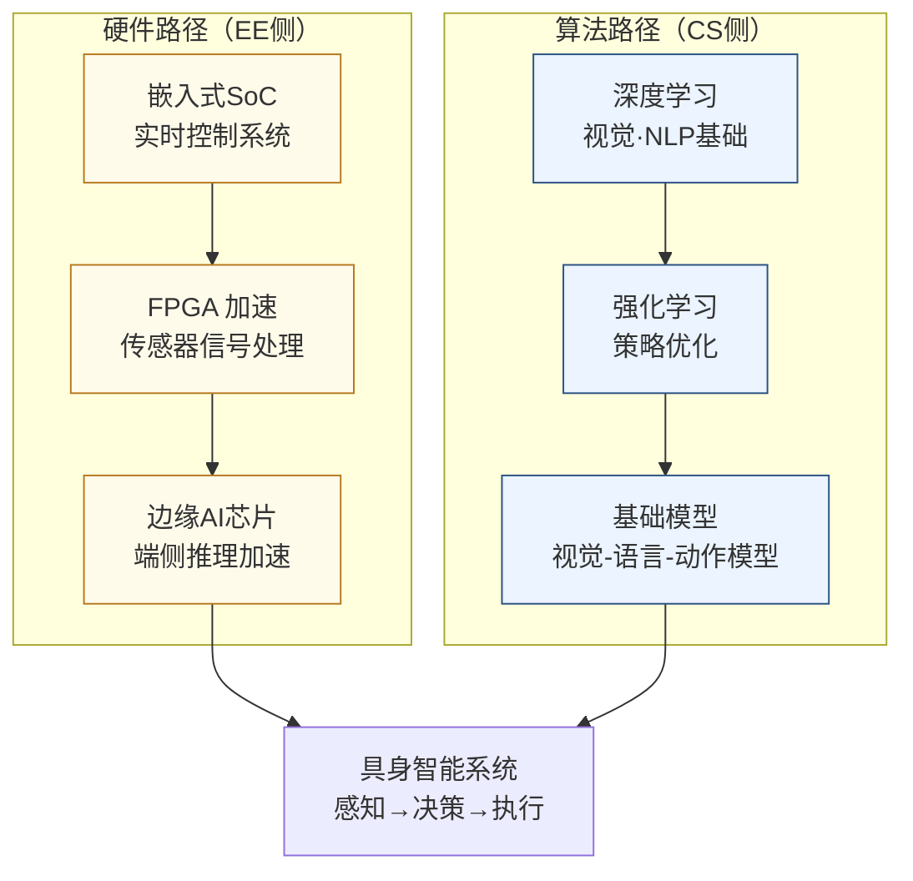

# 具身智能

## 一句话定义

让机器拥有物理身体，在真实世界中像人一样感知、决策、行动——这是 AI 从"会说话"走向"会做事"的关键跨越。

## 你身边的产品

扫地机器人是目前最普及的具身智能产品。石头、科沃斯的旗舰机型已经能用视觉识别地毯、识别宠物粪便、区分不同房间并规划路径——这些功能背后是一个完整的"感知→建图→决策→执行"闭环，只是任务被限定在地面清洁这一个高度结构化的场景里。一旦任务变成"帮我把桌上的杯子放到厨房"，现有的机器人就基本束手无策，因为泛化到任意物体、任意空间、任意指令的能力，正是具身智能研究的核心难题。

Figure 01 机器人 2024 年 3 月发布了与 OpenAI 合作的演示视频：工程师口头问它"我能吃什么？"，机器人扫视桌面后拿起一个苹果递过去，同时流畅地用语言解释了自己的决策过程。这个视频传播极广，因为它第一次让人感受到"大模型 + 机械身体"的组合真的可以产生类人的交互体验。但视频背后是精心布置的场景，换一个环境、换一类物体，成功率会断崖式下降。宇树 H1 和智元机器人则更多展示了运动能力：跑步、跳跃、跌倒后起身，这些动作控制背后的强化学习训练和实时控制芯片，是国内 EE 方向参与最深的部分。

## 为什么重要

大语言模型解决了"理解和生成语言"的问题，但它不能拧螺丝、叠衣服、搬箱子。具身智能（Embodied Intelligence）的核心问题是：如何让 AI 在物理世界中自主完成真实任务？

2024-2025 年是人形机器人的爆发元年：Figure、1X、波士顿动力、Tesla Optimus、宇树、智元、傅利叶的产品接连发布，资本大量涌入。这个方向不再只是学术议题——它正在成为下一个万亿级产业。

具身智能是本指南中最跨学科的方向：它同时需要机器学习算法、机械结构、控制理论、边缘计算芯片和传感器系统。对 EE 背景的学生来说，它是软硬件结合最深的方向之一。

## 当前最前沿（2024-2025）

Google DeepMind 的 RT-2 模型（2023）把视觉-语言大模型直接用作机器人策略网络，展示了网络知识可以直接迁移到物理操作：模型从未见过"把可乐罐放到跟这个徽标同色的方块上"这类指令，却能正确执行，因为它在互联网文本里学到了颜色-物体的关联。2024 年 Google 的 π0（pi-zero）模型进一步展示了单一策略网络控制多种机器人执行折叠衣服、装填洗碗机等灵巧操作任务。

硬件端，Tesla Optimus Gen 2 展示了 11 自由度灵巧手，能抓鸡蛋而不打碎，手指的力控精度和传感融合是核心难题。整个具身智能产业链中，EE 学生最直接的切入点是边缘推理芯片（机器人关节处的实时控制需要毫秒级响应）、力矩传感器的信号处理、以及无线通信和功耗管理系统。目前这个方向的 EE 人才极度短缺，因为大多数 AI 研究者不懂电路，而大多数电路工程师不懂控制和机器学习。

## 核心研究问题

- **灵巧操作（Dexterous Manipulation）**：机器手如何抓取、旋转、组装形状各异的物体？人类靠触觉反馈完成此类任务，机器人如何复现？
- **Sim-to-Real 迁移**：在仿真器中训练的策略如何不经大量真实数据就能迁移到现实世界？
- **长程任务规划**：完成"准备一顿饭"这样的任务需要数十步操作序列，如何让模型进行长程规划和错误恢复？
- **高效端侧推理**：机器人的推理必须实时（10-100ms 延迟），如何在车载级功耗下跑通视觉-语言-动作模型？

## 代表性机构与企业

| | 国际 | 国内 |
|--|------|------|
| **企业** | Figure、1X Technologies、Tesla Optimus、Boston Dynamics | 宇树科技、智元机器人、傅利叶、优必选 |
| **高校** | Stanford（Savarese/Fei-Fei Li）、UCB、MIT、CMU | 北大、清华、浙大、上海交大 |
| **顶会** | RSS、ICRA、IROS、CoRL、NeurIPS | — |

## 知识路径

这个方向有**两条并行路径**，EE 学生从硬件侧切入，CS 学生从算法侧切入，最终在系统层汇合：

**本站相关课程：**

硬件侧：
- [FPGA 数字系统设计（复旦）](../课程资源/电路/数字/FPGA/MICR130024.md)
- [嵌入式处理器与芯片系统设计](../课程资源/电路/嵌入式SoC/junhan.md)
- [计算机组成原理（复旦）](../课程资源/系统架构/速通/MICR130038.md)

算法侧：
- [机器学习（CS229）](../课程资源/人工智能/机器学习/CS229.md)
- [深度学习（CS231n）](../课程资源/人工智能/深度学习/CS231.md)

## 入门三步走

**第一步：感受这个方向的震撼**  
观看 Figure 01 与 OpenAI 合作的演示视频（2024 年 3 月），以及 Boston Dynamics Atlas 的最新展示，直观感受当前水平和距离"真正有用"还有多远的差距。

**第二步：理解核心算法**  
阅读 Brohan et al., *RT-2: Vision-Language-Action Models Transfer Web Knowledge to Robotic Control* (2023)，Google DeepMind 的工作，展示了大模型知识如何迁移到机器人操作。

**第三步：动手跑仿真**  
搭建 MuJoCo 或 IsaacGym 仿真环境，跟随 Gymnasium（OpenAI Gym 的继任者）的官方教程，训练一个简单的机械臂抓取策略——这是进入这个方向最直接的动手起点。
