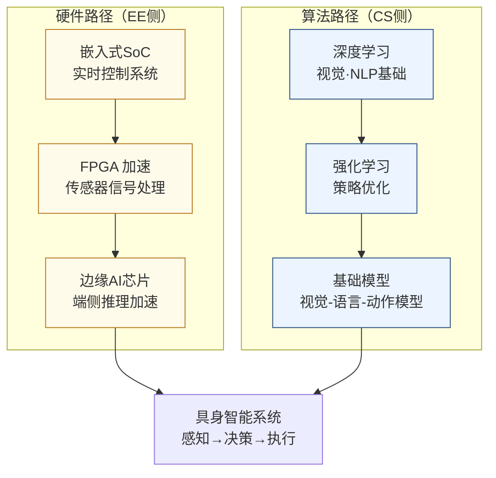

# 具身智能

## 一句话定义

让机器拥有物理身体，在真实世界中像人一样感知、决策、行动——这是 AI 从"会说话"走向"会做事"的关键跨越。

## 这个方向在研究什么

大语言模型的能力给人留下深刻印象，但有一件它无法完成的事：拿起桌上的杯子。这不只是"缺少身体"的问题，而是揭示了智能的一个更深层的缺口——在数字世界里表现出色的 AI，在物理世界里几乎一无所用。具身智能（Embodied Intelligence）研究的就是这个缺口：如何让机器在真实的三维物理环境里，自主地感知、决策、行动，完成有意义的任务。

这个问题为什么这么难？一个直观的例子：让机器人把一个没见过的杯子拿起来放进洗碗机。人类几乎不加思考就能做到，但机器人需要解决的问题包括：识别出杯子（视觉感知，物体可能是任意形状、颜色、遮挡程度）；估计杯子的三维位姿（6DoF 估计，而不只是 2D 边框）；规划手的运动轨迹，避开桌面上的其他物品（运动规划）；控制每根手指施加恰好合适的力——太轻松手，太重捏碎（力控和触觉感知）；把杯子搬到洗碗机里时还要应对开门、搁架高度变化等新问题（长程任务规划）。任何一个环节出问题，任务就失败。而人类执行这些步骤是并行的、无缝的、几乎不需要意识参与的，这正是当前 AI 和人类智能最大的结构性差距。

研究者用来追赶这个差距的核心路径，是把大语言模型和视觉模型的"世界知识"移植到机器人的决策上。Google DeepMind 的 RT-2 模型（2023）把视觉-语言大模型直接作为策略网络：模型输入是摄像头图像和语言指令，输出是机器人关节的动作序列。由于大模型在互联网数据上学到了大量常识，它能理解从未在机器人训练集里出现过的指令——比如"把可乐罐放到跟可口可乐 logo 同颜色的方块上"，模型能推断出这是红色方块，然后正确执行。这种迁移泛化能力是之前任何机器人系统都不具备的。π0（2024）进一步展示了单一策略网络控制多种机器人完成折叠衣服、装填洗碗机等灵巧操作，但每项任务都需要大量人类示范数据，距离真正开放世界的泛化还有很长的路。

Sim-to-Real（仿真到现实的迁移）是另一个核心难题。在仿真器（MuJoCo、IsaacGym）里训练策略速度快、成本低，可以并行跑成千上万个机器人环境；但仿真里的物理和真实世界总有差异（"仿真差距"），机器人在仿真里学到的技能往往在现实中失效。为了缩小这个差距，研究者用"域随机化"（domain randomization）——在训练时随机化物体摩擦力、外观、关节阻尼等参数，让策略学会对这些变量鲁棒——但这只是部分解决方案。波士顿动力 Atlas 机器人展示的跑酷动作，背后是数以百万次的仿真训练加上大量真实机器人试错数据。

对 EE 背景的学生来说，具身智能里最直接的切入点在硬件层：关节处的无刷电机驱动和力矩控制需要微秒级响应的嵌入式控制器；触觉传感器需要高密度压阻阵列和信号处理电路；机器人的实时推理要在十几瓦的功耗预算内完成复杂视觉模型的边缘推理，这对芯片架构和功耗管理提出了严苛要求；多自由度机械臂的精确控制是经典控制理论和现代强化学习的交汇点。整个具身智能产业链目前最短缺的，恰好是同时懂控制、电路和机器学习的交叉背景人才。

## 核心研究问题

- **灵巧操作（Dexterous Manipulation）**：机器手如何抓取、旋转、组装形状各异的物体？人类靠触觉反馈完成此类任务，机器人如何复现？
- **Sim-to-Real 迁移**：在仿真器中训练的策略如何不经大量真实数据就能迁移到现实世界？
- **长程任务规划**：完成"准备一顿饭"这样的任务需要数十步操作序列，如何让模型进行长程规划和错误恢复？
- **高效端侧推理**：机器人的推理必须实时（10-100ms 延迟），如何在车载级功耗下跑通视觉-语言-动作模型？

## 代表性机构与企业

| | 国际 | 国内 |
|--|------|------|
| **企业** | Figure、1X Technologies、Tesla Optimus、Boston Dynamics | 宇树科技、智元机器人、傅利叶、优必选 |
| **高校** | Stanford（Savarese/Fei-Fei Li）、UCB、MIT、CMU | 北大、清华、浙大、上海交大 |
| **顶会** | RSS、ICRA、IROS、CoRL、NeurIPS | — |

## 值得关注的课题组

**国内**

| 姓名 | 单位 | 主页 | 研究方向 |
|------|------|------|----------|
| [朱毅鑫](https://pku.ai/) | 北京大学 | CoRe Lab | 认知与具身 AI，物理推理、触觉感知、灵巧操作 |
| [刘华平](https://sites.google.com/site/thuliuhuaping/home) | 清华大学计算机系 | 个人主页 | 多模态机器人感知、跨模态持续学习、交互式机器人控制 |
| [陈涛](https://faculty.fudan.edu.cn/chentao1/zh_CN/) | 复旦大学信息科学与工程学院 | 复旦教师页 | 多模态具身大模型、嵌入式 AI（面向机器人的高能效推理）、2D/3D 具身环境感知，全球 2000 位最具影响力 AI 学者 |
| [甘中学](https://faet.fudan.edu.cn/e4/72/c23898a255090/page.htm) | 复旦大学工程与应用技术研究院（智能机器人研究院院长） | 复旦教师页 | 自主智能机器人与柔性自动化、"光华一号"人形机器人主导者（复旦 2024 年度十大科技进展） |

**国际**

| 姓名 | 单位 | 主页 | 研究方向 |
|------|------|------|----------|
| [Pieter Abbeel](https://rll.berkeley.edu/) | UC Berkeley | Robot Learning Lab | 深度强化学习、模仿学习、元学习，机器人通用技能习得 |
| [Sergey Levine](https://rail.eecs.berkeley.edu/) | UC Berkeley | RAIL Lab | 离线强化学习、大规模机器人数据、自适应机器人行为 |
| [Chelsea Finn](https://ai.stanford.edu/~cbfinn/) | Stanford CS | IRIS Lab | 元学习、模仿学习、视觉感知驱动的机器人操作 |
| [Russ Tedrake](https://locomotion.csail.mit.edu/) | MIT CSAIL | Robot Locomotion Group | 动力学感知机器人控制，控制理论 + ML 结合，灵巧操作（Drake 工具链） |

## 知识路径

这个方向有**两条并行路径**，EE 学生从硬件侧切入，CS 学生从算法侧切入，最终在系统层汇合：

**本站相关课程：**

硬件侧：
- [FPGA 数字系统设计（复旦）](../课程资源/电路/数字/FPGA/MICR130024.md)
- [嵌入式处理器与芯片系统设计](../课程资源/电路/嵌入式SoC/junhan.md)
- [计算机组成原理（复旦）](../课程资源/系统架构/速通/MICR130038.md)

算法侧：
- [机器学习（CS229）](../课程资源/人工智能/机器学习/CS229.md)
- [深度学习（CS231n）](../课程资源/人工智能/深度学习/CS231.md)

## 入门三步走

**第一步：感受这个方向的震撼**  
观看 Figure 01 与 OpenAI 合作的演示视频（2024 年 3 月），以及 Boston Dynamics Atlas 的最新展示，直观感受当前水平和距离"真正有用"还有多远的差距。

**第二步：理解核心算法**  
阅读 Brohan et al., *RT-2: Vision-Language-Action Models Transfer Web Knowledge to Robotic Control* (2023)，Google DeepMind 的工作，展示了大模型知识如何迁移到机器人操作。

**第三步：动手跑仿真**  
搭建 MuJoCo 或 IsaacGym 仿真环境，跟随 Gymnasium（OpenAI Gym 的继任者）的官方教程，训练一个简单的机械臂抓取策略——这是进入这个方向最直接的动手起点。
