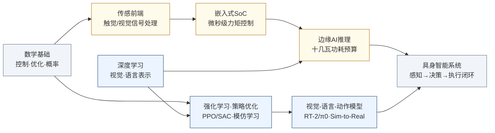

---
hide:
  - navigation
---
让机器拥有物理身体，在真实世界中像人一样感知、决策、行动——这是 AI 从"会说话"走向"会做事"的关键跨越。

## 这个方向在研究什么

大语言模型的能力给人留下深刻印象，但有一件它无法完成的事：拿起桌上的杯子。这不只是"缺少身体"的问题，而是揭示了智能的一个更深层的缺口——在数字世界里表现出色的 AI，在物理世界里几乎一无所用。具身智能（Embodied Intelligence）研究的就是这个缺口：如何让机器在真实的三维物理环境里，自主地感知、决策、行动，完成有意义的任务。

这个问题为什么这么难？一个直观的例子：让机器人把一个没见过的杯子拿起来放进洗碗机。人类几乎不加思考就能做到，但机器人需要解决的问题包括：识别出杯子（视觉感知，物体可能是任意形状、颜色、遮挡程度）；估计杯子的三维位姿（6DoF 估计，而不只是 2D 边框）；规划手的运动轨迹，避开桌面上的其他物品（运动规划）；控制每根手指施加恰好合适的力——太轻松手，太重捏碎（力控和触觉感知）；把杯子搬到洗碗机里时还要应对开门、搁架高度变化等新问题（长程任务规划）。任何一个环节出问题，任务就失败。而人类执行这些步骤是并行的、无缝的、几乎不需要意识参与的，这正是当前 AI 和人类智能最大的结构性差距。

<svg viewBox="0 0 860 220" xmlns="http://www.w3.org/2000/svg" style="width:100%;max-width:860px;display:block;margin:1.5rem auto;font-family:system-ui,sans-serif;">
  <defs>
    <marker id="emb-arrow" markerWidth="9" markerHeight="9" refX="7" refY="4" orient="auto">
      <path d="M0,1 L0,7 L8,4 z" fill="#475569"/>
    </marker>
  </defs>
  <!-- Center label -->
  <circle cx="430" cy="110" r="38" fill="#F1F5F9" stroke="#94A3B8" stroke-width="1.5"/>
  <text x="430" y="106" text-anchor="middle" font-size="12" font-weight="700" fill="#334155">机器人</text>
  <text x="430" y="122" text-anchor="middle" font-size="10" fill="#64748B">感知→决策→执行</text>
  <!-- Segment 1: 感知 (top-left, blue) -->
  <path d="M430,110 L230,30 L430,30 Z" fill="#DBEAFE" stroke="#3B82F6" stroke-width="1.5" opacity="0.85"/>
  <text x="345" y="58" text-anchor="middle" font-size="13" font-weight="700" fill="#1D4ED8">感知</text>
  <text x="345" y="74" text-anchor="middle" font-size="9" fill="#1E40AF">摄像头 · LiDAR</text>
  <text x="345" y="87" text-anchor="middle" font-size="9" fill="#1E40AF">触觉传感器</text>
  <!-- Segment 2: 决策 (top-right, purple) -->
  <path d="M430,110 L430,30 L630,30 Z" fill="#EDE9FE" stroke="#7C3AED" stroke-width="1.5" opacity="0.85"/>
  <text x="515" y="58" text-anchor="middle" font-size="13" font-weight="700" fill="#6D28D9">决策</text>
  <text x="515" y="74" text-anchor="middle" font-size="9" fill="#5B21B6">视觉-语言模型</text>
  <text x="515" y="87" text-anchor="middle" font-size="9" fill="#5B21B6">策略网络 · RL</text>
  <!-- Segment 3: 执行 (bottom, green) -->
  <path d="M430,110 L230,30 L430,195 Z" fill="#DCFCE7" stroke="#16A34A" stroke-width="1.5" opacity="0.7"/>
  <path d="M430,110 L630,30 L430,195 Z" fill="#DCFCE7" stroke="#16A34A" stroke-width="1.5" opacity="0.7"/>
  <text x="430" y="168" text-anchor="middle" font-size="13" font-weight="700" fill="#15803D">执行</text>
  <text x="340" y="155" text-anchor="middle" font-size="9" fill="#166534">电机控制</text>
  <text x="520" y="155" text-anchor="middle" font-size="9" fill="#166534">力反馈</text>
  <!-- Clockwise arrows on the perimeter -->
  <!-- 感知→决策 -->
  <path d="M 390,32 Q 430,18 470,32" fill="none" stroke="#475569" stroke-width="1.8" marker-end="url(#emb-arrow)"/>
  <!-- 决策→执行 -->
  <path d="M 590,80 Q 620,130 550,178" fill="none" stroke="#475569" stroke-width="1.8" marker-end="url(#emb-arrow)"/>
  <!-- 执行→感知 -->
  <path d="M 310,178 Q 240,130 270,80" fill="none" stroke="#475569" stroke-width="1.8" marker-end="url(#emb-arrow)"/>
  <!-- Warning note -->
  <rect x="660" y="70" width="190" height="80" rx="6" fill="#FEF9C3" stroke="#CA8A04" stroke-width="1.2"/>
  <text x="755" y="92" text-anchor="middle" font-size="11" font-weight="600" fill="#92400E">⚠ 每个环节都是</text>
  <text x="755" y="108" text-anchor="middle" font-size="11" font-weight="600" fill="#92400E">开放问题</text>
  <text x="755" y="126" text-anchor="middle" font-size="9" fill="#A16207">感知泛化 · 决策规划</text>
  <text x="755" y="140" text-anchor="middle" font-size="9" fill="#A16207">Sim-to-Real · 灵巧操作</text>
</svg>

研究者用来追赶这个差距的核心路径，是把大语言模型和视觉模型的"世界知识"移植到机器人的决策上。Google DeepMind 的 RT-2 模型（2023）把视觉-语言大模型直接作为策略网络：模型输入是摄像头图像和语言指令，输出是机器人关节的动作序列。由于大模型在互联网数据上学到了大量常识，它能理解从未在机器人训练集里出现过的指令——比如"把可乐罐放到跟可口可乐 logo 同颜色的方块上"，模型能推断出这是红色方块，然后正确执行。这种迁移泛化能力是之前任何机器人系统都不具备的。π0（2024）进一步展示了单一策略网络控制多种机器人完成折叠衣服、装填洗碗机等灵巧操作，但每项任务都需要大量人类示范数据，距离真正开放世界的泛化还有很长的路。

Sim-to-Real（仿真到现实的迁移）是另一个核心难题。在仿真器（MuJoCo、IsaacGym）里训练策略速度快、成本低，可以并行跑成千上万个机器人环境；但仿真里的物理和真实世界总有差异（"仿真差距"），机器人在仿真里学到的技能往往在现实中失效。为了缩小这个差距，研究者用"域随机化"（domain randomization）——在训练时随机化物体摩擦力、外观、关节阻尼等参数，让策略学会对这些变量鲁棒——但这只是部分解决方案。波士顿动力 Atlas 机器人展示的跑酷动作，背后是数以百万次的仿真训练加上大量真实机器人试错数据。

对 EE 背景的学生来说，具身智能里最直接的切入点在硬件层：关节处的无刷电机驱动和力矩控制需要微秒级响应的嵌入式控制器；触觉传感器需要高密度压阻阵列和信号处理电路；机器人的实时推理要在十几瓦的功耗预算内完成复杂视觉模型的边缘推理，这对芯片架构和功耗管理提出了严苛要求；多自由度机械臂的精确控制是经典控制理论和现代强化学习的交汇点。整个具身智能产业链目前最短缺的，恰好是同时懂控制、电路和机器学习的交叉背景人才。

### 核心研究问题

- **泛化 vs. 示范数据**：VLA 模型（RT-2、π0）把大模型的世界知识迁移到动作上，但每项灵巧操作仍要大量人类示范才学得会——开放世界的泛化到底卡在数据量、模型结构，还是身体本身？
- **灵巧操作与触觉闭环**：抓取、旋转、装配形状各异的物体，人靠的是几乎无意识的触觉反馈和力控；机器人如何在"太轻松手、太重捏碎"之间复现这套连续的力闭环？
- **Sim-to-Real 仿真差距**：在 MuJoCo / IsaacGym 里并行训练成千上万个环境很便宜，但仿真物理和真实世界总有差距；域随机化只是部分解药，怎样让策略真正跨过这道沟而不依赖海量真机试错？
- **长程任务与错误恢复**：把杯子搬进洗碗机这类任务是数十步的序列，中间还会遇到开门、搁架高度变化等新状况——如何让模型做长程规划，并在某一步出错后自己纠回来？
- **端侧实时推理的功耗墙**：机器人决策必须实时（10–100ms），却要在十几瓦的功耗预算里跑通复杂的视觉-语言-动作模型——这把芯片架构、边缘推理加速和功耗管理直接推到了瓶颈位置。

### 知识路径

具身智能是个真正的交叉出口：IC 背景的人通常从**感知硬件**和**边缘计算**切入，与从算法侧切入的人在"系统"这一层汇合，共同支撑起感知→决策→执行的闭环。下图是这条知识依赖链：

图中节点对应以下知识板块（按需选修）：

- [数学 → 数学基础](../学习地图/数学/数学基础/index.md)：控制、优化与概率，是力控、运动规划和强化学习共同的地基
- [电路 → 信号处理](../学习地图/电路/信号处理/index.md)：触觉/视觉传感前端的采样与信号链
- [电路 → 嵌入式SoC](../学习地图/电路/嵌入式SoC/index.md)：电机驱动与力矩控制的微秒级实时控制器
- [人工智能 → 深度学习](../学习地图/人工智能/深度学习/index.md)：视觉/语言表示、强化学习与模仿学习（VLA 的算法底座）
- [人工智能 → AI系统](../学习地图/人工智能/AI系统/index.md)：把视觉-语言-动作模型压进十几瓦功耗预算的端侧推理与部署

> 想做硬件视角(边缘 AI 芯片、机器人 SoC、传感器 IC、TinyML/SNN)与完整全栈学习(VLA / SLAM / 控制 / 仿真),请见 [专题社区](../专题社区/index.md) 中收录的 Embodied-AI-Guide。

## 这个方向适合谁

先说清楚一件事：具身智能的核心学术社区是机器人和机器学习，主舞台是 ICRA、RSS、CoRL、IROS 这些机器人顶会，外加 NeurIPS / ICML / CVPR，以及 RA-L、T-RO、IJRR、Science Robotics 这些期刊。这意味着如果你想真正进到这个领域的核心圈，迟早要补上机器人学和强化学习的功课，而不是只守在芯片那一侧。坦白讲完这点，再谈 IC 背景的人能站在哪。

适合这个方向的，是那种**不满足于"在屏幕里聪明"、想让算法落到真实物理世界里去**的人。你得能忍受脏活：仿真和现实总有差距，策略在 MuJoCo 里跑得漂亮、搬到真机上就翻车，调一周可能只为了让机械手少捏碎一个杯子。如果你享受这种"感知—决策—执行闭环里任何一环出错整件事就崩"的工程张力，而不是只想要一个干净的 benchmark 数字，那这里很对你的胃口。

IC 背景的人在这里有一条别人难以替代的差异化路径，就藏在**感知硬件**和**边缘计算**里。整条产业链当下最缺的，恰恰是同时懂控制、电路和机器学习的交叉人才：电机驱动与力矩控制要微秒级响应的嵌入式控制器，触觉传感要高密度压阻阵列加信号链，而把视觉-语言-动作模型压进十几瓦功耗预算做端侧实时推理，更是直接把芯片架构和功耗管理推到瓶颈位置。你不必、也很难一上来就和纯 ML 背景的人拼 VLA 训练；从传感前端、机器人 SoC、边缘推理加速这些硬件切口进去，再逐步往上摸到策略和模型，是 IC 学生更稳、也更有护城河的打法。

最后是节奏的现实：这是个仍在剧烈变形的早期方向。VLA 模型会收敛成什么形态、灵巧操作卡在数据还是结构，现在都没有定论——发表范式没有传统 IC 设计那样成熟稳定，不确定性更高。但反过来说，正因为还没定型，真正的开放问题特别多，进来得早的人有机会去定义这个领域的一部分。如果你对未来几年机器人智能的走向有按捺不住的好奇，又愿意接受这种模糊，这里的上行空间大概是所有方向里最可观的。

## 学术界

### 课题组

**境内**

-   **[苏昊 (Hao Su)](https://www.haosu.ai/publications)** 复旦

    3D 视觉感知 · 具身仿真 ManiSkill · 机器人操作

-   **[陈涛](https://faculty.fudan.edu.cn/chentao1/zh_CN/)** 复旦

    多模态具身大模型 · 嵌入式 AI · 3D 具身感知

-   **[甘中学](https://faet.fudan.edu.cn/e4/72/c23898a255090/page.htm)** 复旦

    自主智能机器人 · 柔性自动化 · 人形机器人

-   **[徐鉴](https://faet.fudan.edu.cn/e4/70/c23830a255088/page.htm)** 复旦

    软体机器人 · 仿生机器人 · 非线性动力学控制

-   **[张文强](https://faet.fudan.edu.cn/e4/28/c23898a255016/page.htm)** 复旦

    认知发育机器人 · 计算机视觉 · 知识图谱

-   **[张立华](https://faet.fudan.edu.cn/3f/9e/c23898a671646/page.htm)** 复旦

    机器直觉 · 智能计算芯片 · 自主无人系统

-   **[刘华平 (Huaping Liu)](https://sites.google.com/site/thuliuhuaping/home)** 清华

    多模态机器人感知 · 跨模态持续学习 · 交互式控制

-   **[孙富春 (Fuchun Sun)](https://www.cs.tsinghua.edu.cn/info/1121/3555.htm)** 清华

    机器人灵巧操作 · 主动感知 · 虚实迁移强化学习

-   **[高阳 (Yang Gao)](https://iiis.tsinghua.edu.cn/rydw/qzjs/gaoyang.htm)** 清华

    视觉-机器人交叉学习 · 灵巧操作数据扩展 · CoRL 最佳论文

-   **[许华哲 (Huazhe Xu)](https://github.com/TEA-Lab)** 清华

    强化学习 · 感觉运动控制 · 触觉感知

-   **[陈建宇 (Jianyu Chen)](http://people.iiis.tsinghua.edu.cn/~jychen/)** 清华

    强化学习 · 足式机器人控制 · 安全约束优化

-   **[李响 (Xiang Li)](https://thu-irml.com/)** 清华

    灵巧操作 · 手内操作 · 人机协作外骨骼

-   **[朱毅鑫](https://pku.ai/)** 北大

    认知与具身 AI · 物理推理 · 触觉感知

-   **[董浩 (Hao Dong)](https://zsdonghao.github.io/)** 北大

    具身 AI 缩放律 · 大模型 + 强化学习 · 操作与导航

-   **[王鹤 (He Wang)](https://cfcs.pku.edu.cn/english/people/faculty/hewang/index.htm)** 北大

    6DoF 位姿估计 · 通用操作技能 · 具身多模态大模型

-   **[Zongqing Lu](https://z0ngqing.github.io/)** 北大

    基础模型驱动具身智能 · 人形机器人全身控制 · 多智能体

-   **[卢策吾 (Cewu Lu)](http://www.qingyuan.sjtu.edu.cn/a/Cewu-Lu.html)** 交大

    通用机器人具身智能 · 从视频学习机器人行为 · ICRA 最佳论文

-   **[穆尧 (Yao Mu)](https://www.cs.sjtu.edu.cn/jiaoshiml/muyao.html)** 交大

    多模态具身认知 · 视觉-语言-动作模型 VLA · 机器人操作与具身世界模型

-   **[王越 (Yue Wang)](https://ywang-zju.github.io/)** 浙大

    学习驱动机器人系统 · 真实世界强化学习 · 具身 AI 模型

-   **[熊蓉 (Rong Xiong)](https://person.zju.edu.cn/rongxiong)** 浙大 

    机器人操作感知与规划 · 仿人机器人动态运动与平衡控制 · 机器人学习

-   **[杨子江 (Zijiang Yang)](https://faculty.ustc.edu.cn/zijiang/zh_CN/index.htm)** 中科大

    具身智能与机器人技术 · 复杂操作与视觉导航 · 非结构环境机器人学习

-   **[高阳 (Yang Gao)](https://is.nju.edu.cn/d3/56/c58208a643926/page.htm)** 南大

    具身智能与 AI 智能体 · 大模型引导导航与操作 · 视觉-语言-动作模型 · 强化学习

-   **[赵行（Hang Zhao）](https://hangzhaomit.github.io/)** 清华

    多模态机器学习 · 机器人/人形跑酷学习 · 自动驾驶视觉

<button class="prof-show-all">显示全部 ↓</button>

**境外**

-   **[Ping Tan（谭平）](https://ece.hkust.edu.hk/pingtan)** 港科大

    计算机视觉与三维重建 · 具身智能端到端规划 · 多模态大模型

-   **[Shaojie Shen（沈劭劼）](https://ece.hkust.edu.hk/eeshaojie)** 港科大

    无人机自主导航 · SLAM 与传感器融合 · 状态估计

-   **[Yunhui Liu（刘云辉）](https://www.cse.cuhk.edu.hk/people/faculty/yunhui-liu/)** 港中大

    视觉机器人 · 医疗机器人 · 具身 AI 系统

-   **[Ping Luo（罗平）](https://www.ai.hku.hk/people/academic-staff/pluo)** 港大

    深度学习基础 · 自动驾驶感知 · 具身 AI 基础模型

-   **[Hongsheng Li（李鸿升）](https://www.ee.cuhk.edu.hk/~hsli/)** 港中大

    具身 AI 与灵巧操作 · VLM 驱动机器人感知 · 多模态大模型

-   **[Wanli Ouyang（欧阳万里）](https://www.ie.cuhk.edu.hk/faculty-staff/ouyang-wanli/)** 港中大

    3D 感知 · 自动驾驶 · 视觉语言模型具身应用

-   **[Jiaya Jia（贾佳亚）](https://cse.hkust.edu.hk/admin/people/faculty/profile/jia)** 港科大

    计算机视觉 · 3D 场景重建 · 语义分割

-   **[Pieter Abbeel](https://rll.berkeley.edu/)** UC Berkeley

    深度强化学习 · 模仿学习 · 元学习

-   **[Sergey Levine](https://rail.eecs.berkeley.edu/)** UC Berkeley

    离线强化学习 · 大规模机器人数据 · 自适应机器人行为

-   **[Chelsea Finn](https://ai.stanford.edu/~cbfinn/)** Stanford 

    元学习 · 模仿学习 · 视觉感知驱动机器人操作

-   **[Russ Tedrake](https://locomotion.csail.mit.edu/)** MIT

    动力学感知机器人控制 · 控制理论 + ML · 灵巧操作

-   **[Deepak Pathak](https://www.cs.cmu.edu/~dpathak/)** CMU

    好奇心驱动探索 · 自监督学习 · Sim-to-Real 迁移

-   **[Xiaolong Wang（王小龙）](https://xiaolonw.github.io/)** UCSD

    视频表示学习 · 触觉感知 · 人形机器人全身控制

-   **[Shuran Song（宋舒然）](https://shurans.github.io/)** Stanford 

    机器人操作 · Diffusion Policy · 可形变物体操作 · 跨载体灵巧抓取

-   **[Pulkit Agrawal](https://people.csail.mit.edu/pulkitag/)** MIT

    计算感觉运动学习 · 机器人 RL · 灵巧操作与足式控制

<button class="prof-show-all">显示全部 ↓</button>

### 学术会议与期刊

  
会议
    RSS
    ICRA
    IROS
    CoRL
    NeurIPS
    ICML
    CVPR
  

  
期刊
    Science Robotics
    IEEE T-RO
    IJRR
    IEEE RA-L
  

## 毕业去向

### 企业

  
国内
    <a class="dm-chip" href="https://www.unitree.com/cn/">宇树科技 Unitree</a>
    <a class="dm-chip" href="http://www.agibot.com.cn/">智元机器人 AgiBot</a>
    <a class="dm-chip" href="https://www.fftai.com/">傅利叶 Fourier</a>
    <a href="https://www.ubtrobot.com/">优必选 UBTech</a>
    <a class="dm-chip" href="https://www.x-humanoid.com/">北京人形机器人创新中心 X-Humanoid</a>
    <a class="dm-chip" href="https://www.inspire-robots.com/">因时机器人 Inspire-Robots</a>
    <a class="dm-chip" href="https://linkerbot.cn/">灵心巧手 LinkerBot</a>
    <a class="dm-chip" href="https://paxini.com/cn/">帕西尼 PaXini</a>
    <a href="https://hanwei.cn/">汉威科技 Hanwei</a>
    <a href="http://www.leaderdrive.cn/home">绿的谐波 Leaderdrive</a>
  

  
国外
    <a class="dm-chip" href="https://www.figure.ai/">Figure AI</a>
    <a class="dm-chip" href="https://www.1x.tech/">1X Technologies</a>
    <a href="https://www.tesla.com/AI">Tesla Optimus</a>
    <a href="https://bostondynamics.com/">Boston Dynamics</a>
    <a class="dm-chip" href="https://www.agilityrobotics.com/">Agility Robotics</a>
    <a class="dm-chip" href="https://www.pi.website/">Physical Intelligence (π)</a>
    <a class="dm-chip" href="https://www.skild.ai/">Skild AI</a>
    <a class="dm-chip" href="https://www.shadowrobot.com/">Shadow Robot</a>
    <a class="dm-chip" href="https://www.gelsight.com/">GelSight</a>
  

### 科研院所

  
国内
    <a class="dm-chip" href="https://www.shlab.org.cn/" title="具身智能大模型与开源平台（书生系列）">上海人工智能实验室</a>
    <a class="dm-chip" href="https://www.baai.ac.cn/" title="具身智能基础模型与数据集">北京智源人工智能研究院 BAAI</a>
    <a class="dm-chip" href="https://www.x-humanoid.com/" title="通用机器人本体与运动控制">国地共建具身智能机器人创新中心 / 北京人形机器人创新中心</a>
    <a class="dm-chip" href="https://www.zhejianglab.org/" title="智能机器人与类脑智能交叉研究">之江实验室</a>
  

  
国外
    <a class="dm-chip" href="https://research.nvidia.com/labs/gear/" title="通用具身智能基础模型（GR00T）">NVIDIA GEAR Lab</a>
    <a class="dm-chip" href="https://deepmind.google/" title="Gemini Robotics 视觉-语言-动作模型">Google DeepMind Robotics</a>
    <a class="dm-chip" href="https://www.tri.global/" title="大行为模型（LBM）与灵巧操作">Toyota Research Institute (TRI)</a>
    <a class="dm-chip" href="https://www.csail.mit.edu/" title="机器人控制理论与操作学习">MIT CSAIL</a>
  

