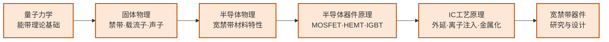

---
hide:
  - navigation
---
研究能承受高压大电流的"电力开关"芯片——以碳化硅（SiC）和氮化镓（GaN）为代表的宽禁带材料器件，是新能源革命的核心硬件。

## 这个方向在研究什么

电能转换是现代能源系统的基础操作：太阳能板发的直流电要变成交流电才能并网，电动车电池的高压直流要变成频率可变的交流才能驱动电机，家用电器的市电要降压整流才能给手机充电。每一次"变换"都伴随着损耗——转换效率每提高一个百分点，对大规模系统来说就是数以亿计度电的节省。功率半导体器件就是执行这些转换的"电力开关"：在导通和关断之间高速切换，控制电流流向。研究这类器件的物理、材料、结构和制造工艺，就是这个方向的核心。

<svg viewBox="0 0 880 220" style="width:100%;max-width:860px;display:block;margin:1.5em auto;font-family:system-ui,-apple-system,sans-serif">
  <!-- Title row -->
  <text x="440" y="22" text-anchor="middle" font-size="13" font-weight="700" fill="#1E293B">禁带宽度对比（eV）</text>
  <!-- Panel 1: Si -->
  <rect x="10" y="30" width="275" height="180" rx="8" fill="#F8FAFC" stroke="#CBD5E1" stroke-width="1.5"/>
  <text x="147" y="52" text-anchor="middle" font-size="13" font-weight="700" fill="#1E293B">Si（硅）</text>
  <!-- Bar base line -->
  <line x1="60" y1="155" x2="235" y2="155" stroke="#CBD5E1" stroke-width="1"/>
  <!-- Short bar for Si (1.1 eV) -->
  <rect x="100" y="115" width="95" height="40" rx="4" fill="#DBEAFE" stroke="#3B82F6" stroke-width="2"/>
  <text x="147" y="139" text-anchor="middle" font-size="13" font-weight="700" fill="#1E40AF">1.1 eV</text>
  <!-- Stats -->
  <text x="147" y="172" text-anchor="middle" font-size="10" fill="#475569">击穿场强: 0.3 MV/cm</text>
  <text x="147" y="187" text-anchor="middle" font-size="10" fill="#475569">应用: 消费电子 · 低压逆变</text>
  <text x="147" y="202" text-anchor="middle" font-size="10" fill="#94A3B8">耐压上限 ≈ 1200 V</text>
  <!-- Panel 2: SiC -->
  <rect x="302" y="30" width="275" height="180" rx="8" fill="#F8FAFC" stroke="#CBD5E1" stroke-width="1.5"/>
  <text x="439" y="52" text-anchor="middle" font-size="13" font-weight="700" fill="#1E293B">SiC（碳化硅）</text>
  <!-- Medium-tall bar for SiC (3.3 eV) -->
  <rect x="392" y="65" width="95" height="90" rx="4" fill="#FEF3C7" stroke="#D97706" stroke-width="2"/>
  <text x="439" y="115" text-anchor="middle" font-size="13" font-weight="700" fill="#92400E">3.3 eV</text>
  <line x1="352" y1="155" x2="527" y2="155" stroke="#CBD5E1" stroke-width="1"/>
  <!-- Stats -->
  <text x="439" y="172" text-anchor="middle" font-size="10" fill="#475569">击穿场强: 3.5 MV/cm</text>
  <text x="439" y="187" text-anchor="middle" font-size="10" fill="#475569">应用: 电动车逆变器 · 充电桩</text>
  <text x="439" y="202" text-anchor="middle" font-size="10" fill="#92400E">特斯拉 Model 3 主驱采用 SiC</text>
  <!-- Panel 3: GaN -->
  <rect x="594" y="30" width="275" height="180" rx="8" fill="#F8FAFC" stroke="#CBD5E1" stroke-width="1.5"/>
  <text x="731" y="52" text-anchor="middle" font-size="13" font-weight="700" fill="#1E293B">GaN（氮化镓）</text>
  <!-- Tall bar for GaN (3.4 eV) -->
  <rect x="684" y="62" width="95" height="93" rx="4" fill="#DCFCE7" stroke="#16A34A" stroke-width="2"/>
  <text x="731" y="112" text-anchor="middle" font-size="13" font-weight="700" fill="#166534">3.4 eV</text>
  <line x1="644" y1="155" x2="819" y2="155" stroke="#CBD5E1" stroke-width="1"/>
  <!-- Stats -->
  <text x="731" y="172" text-anchor="middle" font-size="10" fill="#475569">击穿场强: 3.3 MV/cm</text>
  <text x="731" y="187" text-anchor="middle" font-size="10" fill="#475569">应用: 快充适配器 · 射频</text>
  <text x="731" y="202" text-anchor="middle" font-size="10" fill="#166534">65W GaN 充电头体积减半</text>
</svg>

传统功率器件用硅做衬底，而硅有一个物理层面的天花板：禁带宽度只有 1.1 eV，决定了它对高电压的承受能力有限（击穿场强低），在高温下漏电严重，高频开关时损耗大。碳化硅（SiC）和氮化镓（GaN）的禁带宽度分别是 3.3 eV 和 3.4 eV，约是硅的三倍，这带来了三方面本质性的提升：更高的击穿电压（可以承受数千伏而硅只能到约 1200V）、更好的高温特性（200°C 以上仍能稳定工作）、更低的导通电阻（同等耐压下比硅薄很多，导通损耗小）。理解这些优势背后的物理，需要从能带理论和载流子传输开始，这也是为什么这个方向的知识路径要从量子力学和固体物理出发。

以一辆电动车为例，其驱动系统的核心是逆变器——把电池的直流电变换成驱动电机的三相交流电。逆变器里的开关器件要承受几百伏的电压、数百安的电流，同时以十几 kHz 的频率高速开关。用硅基 IGBT 时，系统效率约 95%；换成 SiC MOSFET，效率可以到 97-98%，这两个百分点体现在续航里就是几十公里的差距，体现在逆变器体积里就是更小的散热器和更轻的重量。特斯拉 Model 3 是率先大规模使用 SiC MOSFET 的量产车型，此后比亚迪、蔚来等也相继跟进。GaN 则在更高频率、较低电压的场景占优——你的 65W 快充充电头之所以比传统充电器小一半，就是因为 GaN 允许在更高开关频率（几 MHz 甚至更高，而硅基方案通常只有几十到几百 kHz）下工作，频率越高、储能电感和电容尺寸就越小，整个电路就可以做得更紧凑。

研究这类器件的人，日常工作往往在材料、器件、电路三个层面之间横跳。材料层：SiC 单晶生长中的位错和微管缺陷直接决定器件良率，如何降低外延层缺陷密度是长期未解的工艺难题。器件层：GaN 高电子迁移率晶体管（HEMT）中缓冲层的陷阱效应导致在高压开关时电流比预期低（电流崩塌），研究者需要用各种表征手段找到陷阱的来源并调整外延结构来抑制它。电路层：这些器件的开关速度极快（纳秒级），寄生电感即便是几纳亨也会在开关瞬间产生上百伏的过电压，门极驱动电路必须配合器件特性精心设计。从材料到最终封装模块，一个功率器件产品的研发链条很长，每个环节都是独立的研究方向。

### 核心研究问题

- **材料缺陷**：SiC 单晶中的位错和微管缺陷显著影响器件良率和可靠性，如何降低缺陷密度？
- **高压击穿**：GaN-on-Silicon 衬底的缓冲层陷阱效应导致电流崩塌，如何抑制？
- **封装热管理**：高功率密度器件在封装层面面临极端热应力，如何散热？
- **驱动电路协同**：功率器件的开关速度极快（纳秒级），门极驱动电路如何配合设计？

### 知识路径

图中节点对应以下知识板块（按需选修）：

- [物理基础](../学习地图/物理/index.md)（量子力学·固体物理·半导体物理）
- [器件与工艺](../学习地图/器件与工艺/index.md)（器件原理·IC工艺原理）
- [电路](../学习地图/电路/index.md)（模拟电路·功率电路方向）

## 适合什么样的人

这个方向的实验性很强，尤其是器件制备和材料表征部分。超净间工作不可避免——外延生长、离子注入、金属化等工艺步骤都要在洁净室完成。此外，器件的电学表征（I-V 曲线、动态测试、可靠性老化）需要使用高压测试台（有时数千伏），需要严格遵守实验室安全规程。如果你对把材料理论和器件性能联系起来有兴趣，并且不排斥花相当多时间在实验室，这个方向的实验环境会给你很强的真实感。

另一类研究者走仿真路线：用 Silvaco TCAD 或 Sentaurus 仿真 SiC/GaN 器件的内部载流子分布，用 SPICE 建立功率电路模型，优化门极驱动电路。这条路要求对器件物理有深刻理解，能将仿真参数与实验测量结果对应起来。

固体物理和半导体物理是硬性基础——GaN 的二维电子气、SiC 的多型体（polytypes）和能带结构，如果这些概念陌生，入门会比较吃力。功率电路的背景也很有用：功率方向的顶会（如 ISPSD、APEC）里电路仿真和驱动设计的论文占了相当比例，纯粹不愿接触电路的同学可能会发现覆盖面受限。不太适合的情况：如果你的兴趣在逻辑芯片或数字设计，对"电力电子"领域的问题感到陌生，这个方向需要较大的心理转换成本，建议先读几篇 IEDM 功率器件的论文感受一下研究的具体内容。

## 学术界

### 课题组

**境内**

-   **[刘效森](https://www.sic.tsinghua.edu.cn/en/info/1072/1426.htm)** 清华

    GaN 基功率管理 IC · p-GaN Gate HEMT · 宽禁带 FET 能量收集

-   **[王彦](https://www.sic.tsinghua.edu.cn/en/info/1094/1421.htm)** 清华 

    SiC/GaN/金刚石器件精确建模 · 电路-器件协同仿真 EDA

-   **[魏进](https://ic.pku.edu.cn/szdw/zzjs/jcwndzx1/wj/index.htm)** 北大

    垂直 GaN 功率器件 · p-GaN HEMT

-   **[沈波](https://faculty.pku.edu.cn/shenbo/zh_CN/index.htm)** 北大

    III 族氮化物外延生长 · 缺陷物理 · 深紫外光电器件

-   **[王茂俊](https://ic.pku.edu.cn/szdw/zzjs/jcwndzx1/wmj/index.htm)** 北大

    GaN 高频功率器件 · 射频前端电路

-   **[黄伟](https://sme.fudan.edu.cn/5e/f3/c31168a351987/page.htm)** 复旦

    GaN 基射频功率器件 · GaN 功率 IC 设计

-   **[方志来](https://sme.fudan.edu.cn/60/af/c31153a352495/page.htm)** 复旦

    氧化镓（Ga₂O₃）超宽禁带器件 · 深紫外探测器

-   **[张清纯](http://sicpower.fudan.edu.cn/27778/list.htm)** 复旦

    SiC 器件物理、设计与制造 · 全链路产业化

-   **[朱颢](https://sme.fudan.edu.cn/60/6e/c31158a352366/page.htm)** 复旦

    宽禁带功率器件设计 · 低功耗半导体器件 · 智能传感器

-   **[樊嘉杰](https://sicpower.fudan.edu.cn/27780/list.htm)** 复旦

    SiC 功率器件封装可靠性 · 多物理场仿真与数字孪生

-   **[刘新宇](https://people.ucas.ac.cn/~0001716)** 中科院

    GaN/AlGaN HEMT 功率与射频器件 · RF/微波电路集成

-   **[张进成](https://web.xidian.edu.cn/jchzhang/)** 西电

    超宽禁带（Ga₂O₃、AlN）器件 · GaN 功率/射频器件

-   **[郑雪峰](https://web.xidian.edu.cn/xfzheng/)** 西电

    GaN 器件缺陷表征 · 新型宽禁带器件结构与可靠性

-   **[盛况](https://hic.zju.edu.cn/2021/0407/c57258a2276651/page.htm)** 浙大

    SiC 功率芯片与模块 · 超级结 SiC 二极管 · 全 SiC 高压电力电子变压器

-   **[任娜](https://hic.zju.edu.cn/2024/0919/c85891a3017887/page.htm)** 浙大 

    SiC 功率器件结构与工艺 · 沟槽型 SiC MOSFET · 抗辐射可靠性加固

-   **[杨树](https://faculty.ustc.edu.cn/yangshu/zh_CN/index.htm)** 中科大 

    垂直 GaN 功率器件 · 宽禁带器件微纳制造与可靠性 · 无电流崩塌新结构

-   **[孙海定](https://faculty.ustc.edu.cn/sunhaiding/zh_CN/index.htm)** 中科大

    III 族氮化物半导体材料与器件 · GaN HEMT · 光电集成与紫外器件

-   **[龙世兵](https://sme.ustc.edu.cn/2022/0601/c30996a556910/page.htm)** 中科大

    超宽禁带（Ga₂O₃）功率器件与探测器 · 垂直 GaN PiN 二极管 · 微纳加工

-   **[陆海](https://ese.nju.edu.cn/lh/list.htm)** 南大

    GaN 基高功率电子器件与电路 · GaN-on-SiC 抗辐照功率集成 · 宽禁带紫外探测器

-   **[修向前](https://ese.nju.edu.cn/xxq/list.htm)** 南大

    III 族氮化物宽禁带衬底材料生长与器件 · 超宽禁带半导体材料与器件 · 氢化物气相外延（HVPE）装备

-   **[郝跃](https://faculty.xidian.edu.cn/HY2/zh_CN/index.htm)** 西电

    宽禁带与超宽禁带半导体器件 · GaN/SiC 微波毫米波器件 · 微纳半导体可靠性

<button class="prof-show-all">显示全部 ↓</button>

**境外**

-   **[Johnny K.O. Sin（單建安）](https://ece.hkust.edu.hk/eesin)** 港科大

    新型功率半导体器件与 IC · GaN/SiC HyFET 混合器件

-   **[Yuhao Zhang（张宇昊）](https://ece.hku.hk/people/y-zhang/)** 港大

    宽禁带/超宽禁带功率器件 · 异构集成功率电子 · ML 辅助器件设计

-   **[Umesh Mishra](http://my.ece.ucsb.edu/Mishra/)** UCSB

    AlGaN/GaN HEMT 功率/射频器件 · III 族氮化物材料

-   **[Srabanti Chowdhury](https://wbglab.stanford.edu/)** Stanford 

    垂直结构 GaN 功率晶体管 · 超宽禁带半导体（Ga₂O₃、金刚石）

-   **[T. Paul Chow（周達成）](https://ecse.rpi.edu/people/faculty/paul-chow)** RPI

    SiC 高压功率器件 · 宽禁带功率 IC · 化合物半导体工艺

-   **[Tomás Palacios](https://www.tpalacios.mit.edu/)** MIT

    高频 GaN 电子器件 · 二维材料晶体管（石墨烯、MoS₂）

<button class="prof-show-all">显示全部 ↓</button>

### 学术会议与期刊

  
顶会
    IEDM
    ISPSD
    APEC
    ECCE
    EPE
  

  
顶刊
    IEEE T-ED
    IEEE EDL
    IEEE T-Power Electronics
    IEEE T-Industrial Electronics
  

## 业界机构

> 这个方向毕业后主要的业界去向（国内外）。上市公司附实时股价链接，便于了解产业景气度。

### 企业

  
国内
    <a href="https://www.powersemi.com">斯达半导</a>
    <a href="http://www.tec.crrczic.cc/">时代电气（中车）</a> 
    <a href="https://www.silan.com.cn">士兰微</a>
    <a href="https://www.crmicro.com">华润微</a>
    <a href="https://www.sanan-e.com">三安光电</a>
    <a href="https://www.innoscience.com">英诺赛科 Innoscience</a>
    <a href="https://www.byd.com">比亚迪半导体</a> 
    <a class="dm-chip" href="https://www.basicsemi.com">基本半导体 BASiC</a>
    <a class="dm-chip" href="http://www.dynax-semi.com">苏州能讯 Dynax</a>
  

  
国外
    <a href="https://www.infineon.com">英飞凌 Infineon</a>
    <a href="https://www.onsemi.com">安森美 onsemi</a>
    <a href="https://www.st.com">意法半导体 ST</a>
    <a href="https://www.wolfspeed.com">Wolfspeed</a>
    <a href="https://www.ti.com">Texas Instruments 德州仪器</a>
    <a href="https://www.navitassemi.com">Navitas</a>
    <a href="https://www.power.com">Power Integrations</a>
    <a href="https://www.qorvo.com">Qorvo</a>
  

### 科研院所

  
国内
    <a class="dm-chip" href="https://nercwbs.xidian.edu.cn/" title="SiC/GaN 器件，GaN 专利全球第一">宽禁带半导体国家工程研究中心（西安电子科技大学）</a>
    <a class="dm-chip" href="https://semi.cas.cn" title="宽禁带半导体材料与器件研发">中科院半导体研究所</a>
    <a class="dm-chip" href="https://www.cetc13.cn" title="化合物半导体器件与功率/射频器件">中国电科 13 所（产业基础研究院）</a>
    <a class="dm-chip" href="http://www.cetc55.com" title="固态功率/射频器件与第三代半导体">中国电科 55 所</a>
  

  
国外
    <a class="dm-chip" href="https://www.iisb.fraunhofer.de/" title="欧洲领先的宽禁带功率电子研究机构">Fraunhofer IISB</a>
    <a class="dm-chip" href="https://www.imec-int.com/en" title="GaN-on-Si 功率器件与工艺">imec</a>
    <a class="dm-chip" href="https://www.a-star.edu.sg/ime" title="SiC 与 mmWave GaN 研发">A*STAR IME（新加坡微电子所）</a>
  

