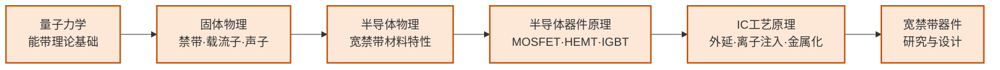

---
hide:
  - navigation
---
# 功率半导体与宽禁带器件

## 一句话定义

研究能承受高压大电流的"电力开关"芯片——以碳化硅（SiC）和氮化镓（GaN）为代表的宽禁带材料器件，是新能源革命的核心硬件。

## 这个方向在研究什么

电能转换是现代能源系统的基础操作：太阳能板发的直流电要变成交流电才能并网，电动车电池的高压直流要变成频率可变的交流才能驱动电机，家用电器的市电要降压整流才能给手机充电。每一次"变换"都伴随着损耗——转换效率每提高一个百分点，对大规模系统来说就是数以亿计度电的节省。功率半导体器件就是执行这些转换的"电力开关"：在导通和关断之间高速切换，控制电流流向。研究这类器件的物理、材料、结构和制造工艺，就是这个方向的核心。

传统功率器件用硅做衬底，而硅有一个物理层面的天花板：禁带宽度只有 1.1 eV，决定了它对高电压的承受能力有限（击穿场强低），在高温下漏电严重，高频开关时损耗大。碳化硅（SiC）和氮化镓（GaN）的禁带宽度分别是 3.3 eV 和 3.4 eV，约是硅的三倍，这带来了三方面本质性的提升：更高的击穿电压（可以承受数千伏而硅只能到约 1200V）、更好的高温特性（200°C 以上仍能稳定工作）、更低的导通电阻（同等耐压下比硅薄很多，导通损耗小）。理解这些优势背后的物理，需要从能带理论和载流子传输开始，这也是为什么这个方向的知识路径要从量子力学和固体物理出发。

以一辆电动车为例，其驱动系统的核心是逆变器——把电池的直流电变换成驱动电机的三相交流电。逆变器里的开关器件要承受几百伏的电压、数百安的电流，同时以十几 kHz 的频率高速开关。用硅基 IGBT 时，系统效率约 95%；换成 SiC MOSFET，效率可以到 97-98%，这两个百分点体现在续航里就是几十公里的差距，体现在逆变器体积里就是更小的散热器和更轻的重量。特斯拉 Model 3 是率先大规模使用 SiC MOSFET 的量产车型，此后比亚迪、蔚来等也相继跟进。GaN 则在更高频率、较低电压的场景占优——你的 65W 快充充电头之所以比传统充电器小一半，就是因为 GaN 允许在更高开关频率（几 MHz 甚至更高，而硅基方案通常只有几十到几百 kHz）下工作，频率越高、储能电感和电容尺寸就越小，整个电路就可以做得更紧凑。

研究这类器件的人，日常工作往往在材料、器件、电路三个层面之间横跳。材料层：SiC 单晶生长中的位错和微管缺陷直接决定器件良率，如何降低外延层缺陷密度是长期未解的工艺难题。器件层：GaN 高电子迁移率晶体管（HEMT）中缓冲层的陷阱效应导致在高压开关时电流比预期低（电流崩塌），研究者需要用各种表征手段找到陷阱的来源并调整外延结构来抑制它。电路层：这些器件的开关速度极快（纳秒级），寄生电感即便是几纳亨也会在开关瞬间产生上百伏的过电压，门极驱动电路必须配合器件特性精心设计。从材料到最终封装模块，一个功率器件产品的研发链条很长，每个环节都是独立的研究方向。

## 核心研究问题

- **材料缺陷**：SiC 单晶中的位错和微管缺陷显著影响器件良率和可靠性，如何降低缺陷密度？
- **高压击穿**：GaN-on-Silicon 衬底的缓冲层陷阱效应导致电流崩塌，如何抑制？
- **封装热管理**：高功率密度器件在封装层面面临极端热应力，如何散热？
- **驱动电路协同**：功率器件的开关速度极快（纳秒级），门极驱动电路如何配合设计？

## 代表性机构与企业

| | 国际 | 国内 |
|--|------|------|
| **企业** | 英飞凌、安森美、Wolfspeed、TI | 比亚迪半导体、华虹、基本半导体、三安光电 |
| **高校** | UCSB（GaN）、NC State（SiC）、MIT | 西安电子科大、浙大、南京大学 |
| **顶会** | IEDM、ISPSD、APEC、EPE | — |

## 知识路径

**本站相关课程：**

- [量子力学（复旦）](../课程资源/物理/量子力学/MICR130015.md)
- [固体物理（复旦）](../课程资源/物理/固体物理/MICR130013.md)
- [半导体物理（复旦）](../课程资源/物理/半导体物理/MICR130005.md)
- [半导体器件原理（复旦）](../课程资源/器件与工艺/半导体器件/半导体器件原理_FDU/MICR130006.md)
- [IC工艺原理（复旦）](../课程资源/器件与工艺/集成电路工艺/集成电路工艺原理_FDU/MICR130007.md)

## 入门三步走

**第一步：理解为什么是宽禁带**  
阅读 Baliga, *Gallium Nitride and Silicon Carbide Power Devices* 第 1 章，或搜索"SiC vs Si vs GaN Baliga figure of merit"，理解为什么宽禁带材料在功率应用上有本质优势。

**第二步：了解器件结构**  
查阅 Infineon 等公司的技术白皮书（免费公开），对比 SiC MOSFET 和 GaN HEMT 的结构差异。

**第三步：跟进研究前沿**  
浏览 IEDM 和 ISPSD 近年论文列表，重点关注"vertical GaN"和"4H-SiC"相关工作。

## 相关课题组

### 境内

-   **[刘效森](https://www.sic.tsinghua.edu.cn/en/info/1072/1426.htm)** 清华

    GaN 基功率管理 IC · p-GaN Gate HEMT · 宽禁带 FET 能量收集

-   **[王彦](https://www.sic.tsinghua.edu.cn/en/info/1094/1421.htm)** 清华

    SiC/GaN/金刚石器件精确建模 · 电路-器件协同仿真 EDA

-   **[魏进](https://ic.pku.edu.cn/szdw/zzjs/jcwndzx1/wj/index.htm)** 北大

    垂直 GaN 功率器件 · p-GaN HEMT

-   **[沈波](https://faculty.pku.edu.cn/shenbo/zh_CN/index.htm)** 北大

    III 族氮化物外延生长 · 缺陷物理 · 深紫外光电器件

-   **[王茂俊](https://ic.pku.edu.cn/szdw/zzjs/jcwndzx1/wmj/index.htm)** 北大

    GaN 高频功率器件 · 射频前端电路

-   **[黄伟](https://sme.fudan.edu.cn/60/93/c31133a352467/page.htm)** 复旦

    GaN 基射频功率器件 · GaN 功率 IC 设计

-   **[方志来](https://sme.fudan.edu.cn/60/af/c31153a352495/page.htm)** 复旦

    氧化镓（Ga₂O₃）超宽禁带器件 · 深紫外探测器

-   **[张清纯](http://sicpower.fudan.edu.cn/27778/list.htm)** 复旦

    SiC 器件物理、设计与制造 · 全链路产业化

-   **[朱颢](https://sme.fudan.edu.cn/60/6e/c31158a352366/page.htm)** 复旦

    宽禁带功率器件设计 · 低功耗半导体器件 · 智能传感器

-   **[樊嘉杰](https://sicpower.fudan.edu.cn/27780/list.htm)** 复旦

    SiC 功率器件封装可靠性 · 多物理场仿真与数字孪生

-   **[刘新宇](https://people.ucas.ac.cn/~0001716)** 中科院

    GaN/AlGaN HEMT 功率与射频器件 · RF/微波电路集成

-   **[张进成](https://web.xidian.edu.cn/jchzhang/)** 西电

    超宽禁带（Ga₂O₃、AlN）器件 · GaN 功率/射频器件

-   **[郑雪峰](https://web.xidian.edu.cn/xfzheng/)** 西电

    GaN 器件缺陷表征 · 新型宽禁带器件结构与可靠性

<button class="prof-show-all">显示全部 ↓</button>

### 境外

-   **[单建安（Johnny K.O. Sin）](https://ece.hkust.edu.hk/eesin)** 港科大

    新型功率半导体器件与 IC · GaN/SiC HyFET 混合器件

-   **[张宇昊（Yuhao Zhang）](https://ece.hku.hk/people/y-zhang/)** 港大

    宽禁带/超宽禁带功率器件 · 异构集成功率电子 · ML 辅助器件设计

-   **[Umesh Mishra](http://my.ece.ucsb.edu/Mishra/)** UCSB

    AlGaN/GaN HEMT 功率/射频器件 · III 族氮化物材料

-   **[Srabanti Chowdhury](https://wbglab.stanford.edu/)** Stanford

    垂直结构 GaN 功率晶体管 · 超宽禁带半导体（Ga₂O₃、金刚石）

-   **[T. Paul Chow](https://ecse.rpi.edu/people/faculty/paul-chow)** RPI

    SiC 高压功率器件 · 宽禁带功率 IC · 化合物半导体工艺

-   **[Tomás Palacios](https://www.tpalacios.mit.edu/)** MIT

    高频 GaN 电子器件 · 二维材料晶体管（石墨烯、MoS₂）

<button class="prof-show-all">显示全部 ↓</button>

