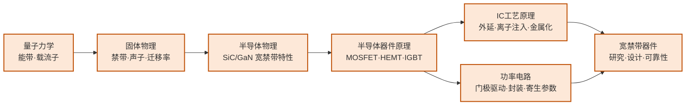

---
hide:
  - navigation
---
研究能承受高压大电流的"电力开关"芯片——以碳化硅（SiC）和氮化镓（GaN）为代表的宽禁带材料器件，是新能源革命的核心硬件。

## 这个方向在研究什么

我们手机上那个比老式充电器小一半的氮化镓快充头，和特斯拉能跑出更长的续航，背后是同一样东西在起作用，功率半导体。它是电力世界里的开关，在导通和关断之间高速切换，把电压、电流、频率变成下游需要的样子。太阳能板的直流要变交流才能并网，电池的高压直流要变频交流才能驱动电机，市电要降压整流才能给手机充电，每一次变换都靠它，也都伴着损耗。对动辄几百上千瓦的系统，效率每提高一个百分点，省下的就是数以亿计度电。所以这个方向的核心问题其实很朴素。怎么让这个开关开得更快、扛得住更高的电压和电流、还尽量少发热？

麻烦在于，这三件事硅同时做不到。硅能当几十年的主角，靠的是便宜、好加工，可一旦把电压拉到几百上千伏、开关频率往上提，它就力不从心了。根子在一个叫禁带宽度的材料参数上。禁带是电子从不导电跳到导电要跨过的一道能量台阶，硅这道台阶只有 1.1 电子伏特，太矮了。台阶一矮，电压稍高电子就容易被强行拽过去，开关关不严、跟着漏电。温度升高也漏。频率一快，每次开关的损耗累起来就是一堆热。

<svg viewBox="0 0 860 300" xmlns="http://www.w3.org/2000/svg" style="width:100%;max-width:860px;display:block;margin:1.5em auto;font-family:system-ui,-apple-system,sans-serif">
  <text x="430" y="24" text-anchor="middle" font-size="13" font-weight="700" fill="#1E293B">禁带越宽，越能扛高压、耐高温、少损耗（禁带宽度 / eV）</text>
  <line x1="50" y1="240" x2="810" y2="240" stroke="#CBD5E1" stroke-width="1.2"/>
  <!-- Si -->
  <rect x="82" y="206" width="56" height="34" rx="3" fill="#DBEAFE" stroke="#93C5FD" stroke-width="1.5"/>
  <text x="110" y="199" text-anchor="middle" font-size="12" font-weight="700" fill="#1E40AF">1.1</text>
  <text x="110" y="258" text-anchor="middle" font-size="11" font-weight="600" fill="#334155">硅 Si</text>
  <text x="110" y="274" text-anchor="middle" font-size="9" fill="#64748B">工频/工业 · 可达 6.5kV</text>
  <!-- SiC -->
  <rect x="234" y="138" width="56" height="102" rx="3" fill="#93C5FD" stroke="#3B82F6" stroke-width="1.5"/>
  <text x="262" y="131" text-anchor="middle" font-size="12" font-weight="700" fill="#1E40AF">3.3</text>
  <text x="262" y="258" text-anchor="middle" font-size="11" font-weight="600" fill="#334155">碳化硅 SiC</text>
  <text x="262" y="274" text-anchor="middle" font-size="9" fill="#64748B">电动车逆变器</text>
  <!-- GaN -->
  <rect x="386" y="135" width="56" height="105" rx="3" fill="#60A5FA" stroke="#2563EB" stroke-width="1.5"/>
  <text x="414" y="128" text-anchor="middle" font-size="12" font-weight="700" fill="#1E40AF">3.4</text>
  <text x="414" y="258" text-anchor="middle" font-size="11" font-weight="600" fill="#334155">氮化镓 GaN</text>
  <text x="414" y="274" text-anchor="middle" font-size="9" fill="#64748B">快充 · 中低压高频</text>
  <!-- Ga2O3 -->
  <rect x="538" y="91" width="56" height="149" rx="3" fill="#3B82F6" stroke="#1D4ED8" stroke-width="1.5"/>
  <text x="566" y="84" text-anchor="middle" font-size="12" font-weight="700" fill="#1E40AF">4.8</text>
  <text x="566" y="258" text-anchor="middle" font-size="11" font-weight="600" fill="#334155">氧化镓 Ga₂O₃</text>
  <text x="566" y="274" text-anchor="middle" font-size="9" fill="#64748B">超宽禁带 · 可熔体长晶</text>
  <!-- 金刚石 -->
  <rect x="690" y="70" width="56" height="170" rx="3" fill="#1E40AF" stroke="#1E3A8A" stroke-width="1.5"/>
  <text x="718" y="63" text-anchor="middle" font-size="12" font-weight="700" fill="#1E40AF">5.5</text>
  <text x="718" y="258" text-anchor="middle" font-size="11" font-weight="600" fill="#334155">金刚石 C</text>
  <text x="718" y="274" text-anchor="middle" font-size="9" fill="#64748B">超宽禁带 · 导热最强</text>
  <!-- 分组 -->
  <text x="110" y="291" text-anchor="middle" font-size="9" fill="#94A3B8">硅基</text>
  <text x="338" y="291" text-anchor="middle" font-size="9" fill="#94A3B8">宽禁带（第三代）</text>
  <text x="642" y="291" text-anchor="middle" font-size="9" fill="#94A3B8">超宽禁带（前沿）</text>
</svg>

出路是把这道台阶垫高，换一种禁带更宽的材料。碳化硅和氮化镓的禁带都在 3.3 电子伏特上下，差不多是硅的三倍。台阶高了，同样的耐压下材料能做得比硅薄得多、导通时更省电，单管就能扛到硅器件够不着的上千伏，还能在两百度高温下照常工作。这就是它们被合称为宽禁带半导体的来由。

这两种材料很快各自找到了主场。电动车的主驱逆变器认准了碳化硅，它要把电池几百伏的直流变成驱动电机的交流，用老的硅方案效率约 95%，换上碳化硅能提到 97% 到 98%。别小看这两三个百分点，落到续航上就是几十公里，落到车上就是更小的散热器和更轻的车身，特斯拉 Model 3 率先大规模用了它，比亚迪、蔚来跟着上。氮化镓走的是另一条路，它在更高频率、较低电压下更出彩。我们用的 65 瓦快充能比老充电器小一半，靠的就是氮化镓能在高得多的开关频率下工作，频率一高，里面储能的电感电容跟着缩小，整个充电器就袖珍了。

换材料并不是免费的午餐。这些新材料性能虽好，伺候起来却比硅难得多，研究真正较劲的地方就在这儿。碳化硅头一道坎是把晶体长出来。它的单晶比硅难长太多，长晶里留下的位错和微管缺陷会直接吃掉一整片晶圆能用的器件数量，怎么把缺陷压下去、还压得便宜，是啃了很多年仍没啃透的硬骨头。氮化镓的麻烦换了一副面孔。快充和射频里的氮化镓是横向器件，电流贴着表面那薄薄一层走，耐压做到六百多伏就开始吃力，所以它只能守在中低压的高频场。想让氮化镓也进电动车那种几百上千伏、几百安的场合，就得把器件竖过来，让电流在材料里纵向穿过、靠厚度扛电压，高电场被推进体内，背面还能直接当散热的出口。这条垂直路线性能很诱人，卡的是衬底，又大又便宜、缺陷又少的体氮化镓晶圆至今难得。

<svg viewBox="0 0 860 320" xmlns="http://www.w3.org/2000/svg" style="width:100%;max-width:860px;display:block;margin:1.5em auto;font-family:system-ui,-apple-system,sans-serif">
  <defs>
    <marker id="gan-cur" markerWidth="9" markerHeight="9" refX="6.5" refY="3" orient="auto"><path d="M0,0 L0,6 L8,3 z" fill="#DC2626"/></marker>
  </defs>
  <text x="230" y="30" text-anchor="middle" font-size="13" font-weight="700" fill="#1E293B">横向 GaN（HEMT）</text>
  <text x="630" y="30" text-anchor="middle" font-size="13" font-weight="700" fill="#1E293B">垂直 GaN</text>
  <line x1="430" y1="48" x2="430" y2="262" stroke="#E2E8F0" stroke-width="1" stroke-dasharray="4 4"/>
  <!-- 左：横向 -->
  <rect x="110" y="116" width="46" height="24" rx="2" fill="#64748B"/>
  <text x="133" y="133" text-anchor="middle" font-size="11" font-weight="700" fill="#FFFFFF">S</text>
  <rect x="212" y="116" width="46" height="24" rx="2" fill="#1E293B"/>
  <text x="235" y="133" text-anchor="middle" font-size="11" font-weight="700" fill="#FFFFFF">G</text>
  <rect x="314" y="116" width="46" height="24" rx="2" fill="#64748B"/>
  <text x="337" y="133" text-anchor="middle" font-size="11" font-weight="700" fill="#FFFFFF">D</text>
  <rect x="70" y="140" width="320" height="66" fill="#DCFCE7" stroke="#16A34A" stroke-width="1.5"/>
  <text x="86" y="176" font-size="10" fill="#15803D">GaN</text>
  <line x1="158" y1="152" x2="312" y2="152" stroke="#DC2626" stroke-width="2" marker-end="url(#gan-cur)"/>
  <text x="240" y="172" text-anchor="middle" font-size="9" fill="#B91C1C">电流沿 2DEG 横向流</text>
  <rect x="70" y="206" width="320" height="38" fill="#E2E8F0" stroke="#94A3B8" stroke-width="1.5"/>
  <text x="230" y="230" text-anchor="middle" font-size="10" fill="#475569">Si / SiC 衬底</text>
  <text x="230" y="270" text-anchor="middle" font-size="10" fill="#475569">耐压靠拉开 S–D 间距，商用 ~650V</text>
  <text x="230" y="288" text-anchor="middle" font-size="9" fill="#94A3B8">主场：快充 · 数据中心电源</text>
  <!-- 右：垂直 -->
  <rect x="556" y="100" width="70" height="22" rx="2" fill="#64748B"/>
  <text x="591" y="116" text-anchor="middle" font-size="11" font-weight="700" fill="#FFFFFF">S</text>
  <rect x="632" y="100" width="46" height="22" rx="2" fill="#1E293B"/>
  <text x="655" y="116" text-anchor="middle" font-size="11" font-weight="700" fill="#FFFFFF">G</text>
  <rect x="470" y="122" width="320" height="92" fill="#DCFCE7" stroke="#16A34A" stroke-width="1.5"/>
  <text x="612" y="162" text-anchor="middle" font-size="10" fill="#15803D">GaN 漂移层</text>
  <text x="612" y="178" text-anchor="middle" font-size="9" fill="#15803D">（耐压靠厚度）</text>
  <rect x="470" y="214" width="320" height="30" fill="#BBF7D0" stroke="#16A34A" stroke-width="1.5"/>
  <text x="630" y="234" text-anchor="middle" font-size="10" fill="#15803D">体 GaN 衬底</text>
  <rect x="470" y="244" width="320" height="16" fill="#475569"/>
  <text x="630" y="256" text-anchor="middle" font-size="9" fill="#FFFFFF">漏极 Drain（背面，兼散热）</text>
  <line x1="712" y1="124" x2="712" y2="242" stroke="#DC2626" stroke-width="2" marker-end="url(#gan-cur)"/>
  <text x="744" y="186" text-anchor="middle" font-size="9" fill="#B91C1C">纵向</text>
  <text x="630" y="280" text-anchor="middle" font-size="10" fill="#475569">耐压靠漂移层厚度，目标 &gt;1.2kV</text>
  <text x="630" y="298" text-anchor="middle" font-size="9" fill="#94A3B8">卡点：缺又大又便宜的体 GaN 衬底</text>
</svg>

研究这类器件的人，日常往往在材料、器件、电路三个层面之间来回横跳。材料这头，SiC 单晶生长里的位错和微管缺陷直接决定一整片晶圆能出多少颗好器件，怎么把外延层缺陷压下去是长期啃不动的工艺难题。到了器件这头，GaN 高电子迁移率晶体管（HEMT）有两块难啃的骨头。一是电流崩塌，缓冲层里的陷阱会让它在高压开关时电流比直流测量值低一截，得靠各种表征手段揪出陷阱来源、再改外延结构去压制。二是散热，GaN 器件功率密度极高、沟道局部温度蹿得飞快，而它的热导率又不如 SiC，所以常把 GaN 长在导热好的 SiC 衬底上、甚至转移到金刚石上散热，否则结温一高，可靠性和电流崩塌会一起恶化。再到电路这头，器件开关快到纳秒级，几纳亨的寄生电感就能在开关瞬间激起上百伏过电压，门极驱动和封装版图必须贴着器件特性精心设计。横向 GaN 在这里还多一条出路，它能把开关管和驱动、保护单片集成成一颗功率 IC，把分立器件之间那段寄生电感直接省掉。而贯穿这三层始终绷着的一根弦是可靠性，器件长年泡在高压、高温、大电流和高速开关的应力里，怎么扛住长期退化、过得了车规、甚至在辐射环境里不失效，本身就是一门独立的学问。

结构之外，氮化镓器件还有两块绕不过的硬伤。一是电流崩塌，材料缓冲层里的陷阱会让它在高压开关时电流莫名其妙比平时低一截，得靠各种手段把陷阱揪出来、再改材料结构去压。二是散热，就算垂直结构能让热从背面走，氮化镓本身的导热还是不如碳化硅，功率密度一高沟道就发烫，所以人们常把它长在导热好的碳化硅上、甚至搬到金刚石上去散热，否则结温一升，可靠性和电流崩塌会一起恶化。到了电路这头，器件开关快到纳秒级，几纳亨的寄生电感就能在开关瞬间激起上百伏过电压，门极驱动和封装版图都得贴着器件特性来设计。横向氮化镓在这儿还多一条出路，它平铺在表面，能把开关管、驱动和保护做进同一块芯片，集成成一颗功率 IC，顺手省掉分立器件之间那段最惹麻烦的寄生电感。

垫高台阶这么管用，自然有人会问，能不能再宽一点？沿着这个念头往前，就是氧化镓和金刚石这类超宽禁带材料，禁带宽到 4.8 甚至 5.5 电子伏特，扛电压的本事比碳化硅、氮化镓还要高一截。氧化镓尤其诱人，因为它能像拉硅锭那样从熔体里直接长出大块单晶，成本和尺寸上比靠高温高压才长得出来的碳化硅、氮化镓都占便宜。可它的软肋也更极端，几乎不导热，热量全憋在器件里出不来，而且至今做不出像样的 p 型。于是散热这件事，从氮化镓一路追到超宽禁带，越往前越成了决定材料能不能落地的命门。

说到底，这个方向要的从来不是实验室里一颗好看的器件，而是能在电动车、充电桩、电网上连着跑十年不出岔子的东西。材料、器件、电路、封装一环扣一环，最后都收束到可靠性这一关。器件长年泡在高压、高温、大电流和高速开关里，还得过得了车规、扛得住辐射，单这一项就够成一门独立的学问。

把这些材料按各自的本事铺开，就能看清它们各占哪块地盘。硅守着低压低频的消费电子和工频电源，碳化硅扛起电动车主驱、充电桩和电网这些高压大功率的活，氮化镓凭高频拿下快充、数据中心电源和车载充电机。再往更高压、更前沿走，是还在攻关的垂直氮化镓和超宽禁带的氧化镓。

<svg viewBox="0 0 860 400" xmlns="http://www.w3.org/2000/svg" style="width:100%;max-width:860px;display:block;margin:1.5em auto;font-family:system-ui,-apple-system,sans-serif">
  <defs>
    <marker id="pw-ax" markerWidth="9" markerHeight="9" refX="4" refY="3" orient="auto"><path d="M0,0 L8,3 L0,6 z" fill="#64748B"/></marker>
  </defs>
  <!-- 轴 -->
  <line x1="70" y1="360" x2="70" y2="48" stroke="#64748B" stroke-width="1.4" marker-end="url(#pw-ax)"/>
  <line x1="70" y1="360" x2="815" y2="360" stroke="#64748B" stroke-width="1.4" marker-end="url(#pw-ax)"/>
  <text x="78" y="44" font-size="10" fill="#475569">耐压 · 功率 高</text>
  <text x="812" y="380" text-anchor="end" font-size="10" fill="#475569">开关频率 高 →</text>
  <!-- Si -->
  <rect x="100" y="272" width="142" height="74" rx="6" fill="#DBEAFE" stroke="#93C5FD" stroke-width="1.5"/>
  <text x="171" y="298" text-anchor="middle" font-size="12" font-weight="700" fill="#1E40AF">硅 Si</text>
  <text x="171" y="316" text-anchor="middle" font-size="9" fill="#475569">消费电子 · 工频</text>
  <text x="171" y="332" text-anchor="middle" font-size="9" fill="#94A3B8">&lt;1200V · 低频</text>
  <!-- SiC -->
  <rect x="100" y="92" width="186" height="110" rx="6" fill="#93C5FD" stroke="#2563EB" stroke-width="1.5"/>
  <text x="193" y="124" text-anchor="middle" font-size="12" font-weight="700" fill="#1E3A8A">碳化硅 SiC</text>
  <text x="193" y="144" text-anchor="middle" font-size="9" fill="#1E3A8A">电动车主驱 · 充电桩 · 电网</text>
  <text x="193" y="162" text-anchor="middle" font-size="9" fill="#1E40AF">≥1200V · 中频 · 大功率</text>
  <!-- 横向GaN -->
  <rect x="558" y="268" width="235" height="78" rx="6" fill="#BFDBFE" stroke="#3B82F6" stroke-width="1.5"/>
  <text x="675" y="294" text-anchor="middle" font-size="12" font-weight="700" fill="#1E40AF">横向 GaN</text>
  <text x="675" y="312" text-anchor="middle" font-size="9" fill="#475569">快充 · 数据中心 · 车载 OBC</text>
  <text x="675" y="328" text-anchor="middle" font-size="9" fill="#94A3B8">80–650V · 高频</text>
  <!-- 垂直GaN -->
  <rect x="330" y="186" width="200" height="70" rx="6" fill="#FFFFFF" stroke="#2563EB" stroke-width="1.5" stroke-dasharray="5 4"/>
  <text x="430" y="216" text-anchor="middle" font-size="11" font-weight="700" fill="#1E40AF">垂直 GaN（研发）</text>
  <text x="430" y="235" text-anchor="middle" font-size="9" fill="#475569">突破 650V，目标 &gt;1.2kV</text>
  <!-- Ga2O3 -->
  <rect x="330" y="88" width="200" height="70" rx="6" fill="#FFFFFF" stroke="#1D4ED8" stroke-width="1.5" stroke-dasharray="5 4"/>
  <text x="430" y="118" text-anchor="middle" font-size="11" font-weight="700" fill="#1E3A8A">氧化镓 Ga₂O₃（前沿）</text>
  <text x="430" y="137" text-anchor="middle" font-size="9" fill="#475569">超高压潜力 · 散热待解</text>
</svg>

### 核心研究问题

- **SiC 单晶缺陷与良率**：衬底生长里的位错、微管和外延层缺陷密度直接卡住整片晶圆能出多少好器件，把缺陷压到多低、压得多便宜是长期没被根治的工艺难题。
- **GaN HEMT 的电流崩塌**：缓冲层里的陷阱会让 GaN HEMT 在高压开关时电流远低于直流测量值，陷阱来自哪里、该用怎样的外延结构去抑制至今各执一词。
- **把禁带优势兑现成器件性能**：SiC/GaN 三倍于硅的禁带理论上给出更高击穿场强和更低导通电阻，但实测器件离材料的物理上限总有距离，器件结构怎么设计才能真正逼近。
- **纳秒开关与寄生电感的博弈**：宽禁带器件开关快到纳秒级，可几纳亨寄生电感就能在开关瞬间激起上百伏过电压，门极驱动和封装版图必须贴着器件特性协同。
- **以频率换体积的边界**：GaN 把开关频率从几十几百 kHz 推到几 MHz、储能电感电容随之缩小，可频率越高损耗与 EMI 越难压，物理边界尚不清楚。
- **散热是绕不开的坎**：GaN 自加热严重、热导率不如 SiC，得靠 GaN-on-SiC 甚至 GaN-on-diamond 抽热，到了几乎不导热又做不出 p 型的 Ga₂O₃ 更极端，散热与掺杂一起成了超宽禁带落地的命门。
- **垂直化上高压 vs 集成化提密度（IC 切口）**：横向 GaN 耐压受表面限制，垂直结构能在小面积扛高压却卡在缺好的体 GaN 衬底，横向则适合把驱动、保护与开关单片集成成功率 IC。

### 知识路径

图中节点对应以下知识板块（按需选修）：

- [物理基础](../学习地图/物理/index.md)（量子力学·固体物理·半导体物理——理解能带、载流子传输与宽禁带材料的根基）
- [器件与工艺](../学习地图/器件与工艺/index.md)（半导体器件原理·IC 工艺原理——MOSFET/HEMT 结构与外延、离子注入、金属化）
- [电路](../学习地图/电路/index.md)（模拟电路·功率电路方向——门极驱动、封装版图与寄生参数协同设计）

## 这个方向适合谁

这个方向适合那种看到一条 I-V 曲线异常就想知道背后是哪一层物理出了问题、愿意在材料、器件、电路之间反复横跳的人。微电子本科有两个对口的硬件切口。一个在器件这侧，把固体物理、半导体物理学扎实，能从能带和载流子传输去理解 GaN 的二维电子气、SiC 的多型体，再用 TCAD 把仿真和高压台实测一项项对上。另一个在电路这侧，器件开关快到纳秒级、几纳亨寄生电感就能激起上百伏过电压，门极驱动和封装版图必须贴着器件特性协同设计，这正是产业急缺的活。诚实地说固体物理和功率电路都是硬门槛，节奏也慢，一颗器件常以季度甚至年计，最有代表性的舞台是 IEDM 和 ISPSD，更想做数字后端或纯算法的人多半不适合。

## 学术界

### 课题组

**境内**

-   **[刘效森](https://www.sic.tsinghua.edu.cn/en/info/1072/1426.htm)** 清华

    GaN 基功率管理 IC · p-GaN Gate HEMT · 宽禁带 FET 能量收集

-   **[王彦](https://www.sic.tsinghua.edu.cn/en/info/1094/1421.htm)** 清华 

    SiC/GaN/金刚石器件精确建模 · 电路-器件协同仿真 EDA

-   **[魏进](https://ic.pku.edu.cn/szdw/zzjs/jcwndzx1/wj/index.htm)** 北大

    垂直 GaN 功率器件 · p-GaN HEMT

-   **[沈波](https://faculty.pku.edu.cn/shenbo/zh_CN/index.htm)** 北大

    III 族氮化物外延生长 · 缺陷物理 · 深紫外光电器件

-   **[王茂俊](https://ic.pku.edu.cn/szdw/zzjs/jcwndzx1/wmj/index.htm)** 北大

    GaN 高频功率器件 · 射频前端电路

-   **[黄伟](https://sme.fudan.edu.cn/5e/f3/c31168a351987/page.htm)** 复旦

    GaN 基射频功率器件 · GaN 功率 IC 设计

-   **[方志来](https://sme.fudan.edu.cn/60/af/c31153a352495/page.htm)** 复旦

    氧化镓（Ga₂O₃）超宽禁带器件 · 深紫外探测器

-   **[张清纯](http://sicpower.fudan.edu.cn/27778/list.htm)** 复旦

    SiC 器件物理、设计与制造 · 全链路产业化

-   **[朱颢](https://sme.fudan.edu.cn/60/6e/c31158a352366/page.htm)** 复旦

    宽禁带功率器件设计 · 低功耗半导体器件 · 智能传感器

-   **[樊嘉杰](https://sicpower.fudan.edu.cn/27780/list.htm)** 复旦

    SiC 功率器件封装可靠性 · 多物理场仿真与数字孪生

-   **[刘新宇](https://people.ucas.ac.cn/~0001716)** 中科院

    GaN/AlGaN HEMT 功率与射频器件 · RF/微波电路集成

-   **[张进成](https://web.xidian.edu.cn/jchzhang/)** 西电

    超宽禁带（Ga₂O₃、AlN）器件 · GaN 功率/射频器件

-   **[郑雪峰](https://web.xidian.edu.cn/xfzheng/)** 西电

    GaN 器件缺陷表征 · 新型宽禁带器件结构与可靠性

-   **[盛况](https://hic.zju.edu.cn/2021/0407/c57258a2276651/page.htm)** 浙大

    SiC 功率芯片与模块 · 超级结 SiC 二极管 · 全 SiC 高压电力电子变压器

-   **[任娜](https://hic.zju.edu.cn/2024/0919/c85891a3017887/page.htm)** 浙大 

    SiC 功率器件结构与工艺 · 沟槽型 SiC MOSFET · 抗辐射可靠性加固

-   **[杨树](https://faculty.ustc.edu.cn/yangshu/zh_CN/index.htm)** 中科大 

    垂直 GaN 功率器件 · 宽禁带器件微纳制造与可靠性 · 无电流崩塌新结构

-   **[孙海定](https://faculty.ustc.edu.cn/sunhaiding/zh_CN/index.htm)** 中科大

    III 族氮化物半导体材料与器件 · GaN HEMT · 光电集成与紫外器件

-   **[龙世兵](https://sme.ustc.edu.cn/2022/0601/c30996a556910/page.htm)** 中科大

    超宽禁带（Ga₂O₃）功率器件与探测器 · 垂直 GaN PiN 二极管 · 微纳加工

-   **[陆海](https://ese.nju.edu.cn/lh/list.htm)** 南大

    GaN 基高功率电子器件与电路 · GaN-on-SiC 抗辐照功率集成 · 宽禁带紫外探测器

-   **[修向前](https://ese.nju.edu.cn/xxq/list.htm)** 南大

    III 族氮化物宽禁带衬底材料生长与器件 · 超宽禁带半导体材料与器件 · 氢化物气相外延（HVPE）装备

-   **[郝跃](https://faculty.xidian.edu.cn/HY2/zh_CN/index.htm)** 西电

    宽禁带与超宽禁带半导体器件 · GaN/SiC 微波毫米波器件 · 微纳半导体可靠性

<button class="prof-show-all">显示全部 ↓</button>

**境外**

-   **[Johnny K.O. Sin（單建安）](https://ece.hkust.edu.hk/eesin)** 港科大

    新型功率半导体器件与 IC · GaN/SiC HyFET 混合器件

-   **[Yuhao Zhang（张宇昊）](https://ece.hku.hk/people/y-zhang/)** 港大

    宽禁带/超宽禁带功率器件 · 异构集成功率电子 · ML 辅助器件设计

-   **[Umesh Mishra](http://my.ece.ucsb.edu/Mishra/)** UCSB

    AlGaN/GaN HEMT 功率/射频器件 · III 族氮化物材料

-   **[Srabanti Chowdhury](https://wbglab.stanford.edu/)** Stanford 

    垂直结构 GaN 功率晶体管 · 超宽禁带半导体（Ga₂O₃、金刚石）

-   **[T. Paul Chow（周達成）](https://ecse.rpi.edu/people/faculty/paul-chow)** RPI

    SiC 高压功率器件 · 宽禁带功率 IC · 化合物半导体工艺

-   **[Tomás Palacios](https://www.tpalacios.mit.edu/)** MIT

    高频 GaN 电子器件 · 二维材料晶体管（石墨烯、MoS₂）

<button class="prof-show-all">显示全部 ↓</button>

### 学术会议与期刊

  
会议
    IEDM
    ISPSD
    APEC
    ECCE
    EPE
  

  
期刊
    IEEE T-ED
    IEEE EDL
    IEEE T-Power Electronics
    IEEE T-Industrial Electronics
  

## 毕业去向

### 企业

  
国内
    <a href="https://www.powersemi.com">斯达半导</a>
    <a href="http://www.tec.crrczic.cc/">时代电气（中车）</a> 
    <a href="https://www.silan.com.cn">士兰微</a>
    <a href="https://www.crmicro.com">华润微</a>
    <a href="https://www.sanan-e.com">三安光电</a>
    <a href="https://www.innoscience.com">英诺赛科 Innoscience</a>
    <a href="https://www.byd.com">比亚迪半导体</a> 
    <a class="dm-chip" href="https://www.basicsemi.com">基本半导体 BASiC</a>
    <a class="dm-chip" href="http://www.dynax-semi.com">苏州能讯 Dynax</a>
  

  
国外
    <a href="https://www.infineon.com">英飞凌 Infineon</a>
    <a href="https://www.onsemi.com">安森美 onsemi</a>
    <a href="https://www.st.com">意法半导体 ST</a>
    <a href="https://www.wolfspeed.com">Wolfspeed</a>
    <a href="https://www.ti.com">Texas Instruments 德州仪器</a>
    <a href="https://www.navitassemi.com">Navitas</a>
    <a href="https://www.power.com">Power Integrations</a>
  

### 科研院所

  
国内
    <a class="dm-chip" href="https://nercwbs.xidian.edu.cn/" title="SiC/GaN 器件，GaN 专利全球第一">宽禁带半导体国家工程研究中心（西安电子科技大学）</a>
    <a class="dm-chip" href="https://semi.cas.cn" title="宽禁带半导体材料与器件研发">中科院半导体研究所</a>
    <a class="dm-chip" href="https://www.cetc13.cn" title="化合物半导体器件与功率/射频器件">中国电科 13 所（产业基础研究院）</a>
    <a class="dm-chip" href="http://www.cetc55.com" title="固态功率/射频器件与第三代半导体">中国电科 55 所</a>
  

  
国外
    <a class="dm-chip" href="https://www.iisb.fraunhofer.de/" title="欧洲领先的宽禁带功率电子研究机构">Fraunhofer IISB</a>
    <a class="dm-chip" href="https://www.imec-int.com/en" title="GaN-on-Si 功率器件与工艺">imec</a>
    <a class="dm-chip" href="https://www.a-star.edu.sg/ime" title="SiC 与 mmWave GaN 研发">A*STAR IME（新加坡微电子所）</a>
  

