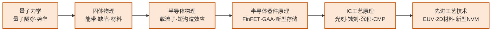

---
hide:
  - navigation
---
# 半导体器件与先进工艺

## 一句话定义

研究硅基半导体从材料到器件再到工艺的完整链条——从 FinFET、GAA 等先进晶体管结构，到 RRAM、PCM、FeRAM 等新型非易失存储器件，再到 EUV 光刻等量产工艺的物理极限挑战。

## 这个方向在研究什么

芯片制造的本质是一套极其精密的"印刷术"：把电路图案用光刻的方式转移到硅片上，再通过离子注入、薄膜沉积、化学蚀刻等数百道工序，在硅片上构建出三维的晶体管和金属连线结构。过去五十年，摩尔定律之所以成立，正是因为制程工程师每隔几年就能把光刻分辨率再提高一档，把晶体管尺寸再缩小一半。这条路走到今天，已经进入了几乎所有人在二十年前都认为不可能的物理尺度。

今天最先进的量产工艺（台积电 N3、N2）里，晶体管的关键尺寸已经在 2 纳米量级，相当于十几个硅原子排列在一起的宽度。在这个尺度下，量子隧穿效应开始变得不可忽视——电子可以直接穿越本应阻断它的势垒，导致器件漏电。传统的平面 MOSFET 结构在这个尺度已经失效，工业界先后引入了 FinFET（鳍式晶体管）和更新的 GAA（全环绕栅，gate-all-around）结构，把栅极从一侧包裹晶体管延伸到四面包裹，从而更好地控制沟道。如何制造这些更复杂的三维结构，同时保证几十亿个晶体管里没有一个失效，是工艺研究的核心难题。EUV（极紫外光刻）用 13.5nm 波长的光——比之前的深紫外（193nm）短了十几倍，可以印刷更精细的图案，但光子数量有限，导致图形边缘随机起伏（stochastic effects）。研究者需要用统计模型量化这种随机性，通过工艺和设计协同优化把它的影响压制在可接受范围内。

新型存储器件是这个方向的另一核心主题，也是当前器件物理研究的最活跃领域之一。传统 DRAM 用一个晶体管和一个电容存储一位数据，随着尺寸缩小，电容越来越难制造、漏电越来越难抑制。新型非易失存储器试图从材料机制上绕开这些限制：相变存储器（PCM）利用材料在结晶态和非晶态之间的电阻差存储信息，非易失且读写速度接近 DRAM；磁阻存储器（MRAM）用磁化方向编码数据，写操作不依赖电荷积累，耐久性远超 Flash；阻变存储器（RRAM/ReRAM）的电阻值可以在连续范围内调节，天然适合模拟突触权重，是存算一体芯片的重要器件基础；铁电存储器（FeRAM/FeFET）利用铁电薄膜的极化翻转存储信息，具有非易失、高速、低功耗等优点。研究者在超净间里制备这些器件，测量其 I-V 特性、耐久性（反复读写后的退化）和保持性（数据能存多久不丢失），并用这些数据反过来指导材料优化和电路设计。

二维材料与后硅器件是更远期的研究前沿。以 MoS₂ 和 WSe₂ 为代表的过渡金属硫化物（TMD）拥有天然的原子级薄度（单层约 0.6nm），理论上可以彻底压制短沟道效应；石墨烯的载流子迁移率远超硅，但零带隙的缺陷限制了逻辑器件应用。如何在晶圆尺度上均匀生长这些材料，如何与 CMOS 工艺兼容集成，是学术界当前最活跃的攻关方向之一。复旦、清华的多个课题组已在实验室展示了基于 MoS₂ 的环绕栅晶体管和铁电存储器，进入了接近工业验证的阶段。

## 核心研究问题

- **EUV 随机效应**：极紫外光源光子数量有限，导致图形边缘随机变化，如何通过工艺和设计协同优化来控制？
- **GAA/CFET 结构**：环绕栅晶体管是 3nm 以下主流方案，CFET（N/P 垂直堆叠）是下一步，如何解决寄生电容和制造难题？
- **新型存储器件**：RRAM/PCM/FeRAM 如何在速度、功耗、耐久性、保持性之间取得最优平衡？器件变异性如何在材料层面改善？
- **二维材料集成**：MoS₂ 等 TMD 材料如何实现晶圆级均匀生长并与 CMOS 后端工艺兼容集成？

## 代表性机构与企业

| | 国际 | 国内 |
|--|------|------|
| **企业** | TSMC、Samsung、Intel、ASML、Micron | 中芯国际、华虹、长江存储、长鑫存储 |
| **高校/研究机构** | IMEC、Stanford、MIT、Purdue | 复旦、北大、中科院微电子所 |
| **顶会** | IEDM · VLSI Symposium · TED · EDL · IMW | — |

## 知识路径

**本站相关课程：**

- [量子力学（复旦）](../课程资源/物理/量子力学/MICR130015.md)
- [固体物理（复旦）](../课程资源/物理/固体物理/MICR130013.md)
- [半导体物理（复旦）](../课程资源/物理/半导体物理/MICR130005.md)
- [半导体器件原理（复旦）](../课程资源/器件与工艺/半导体器件/半导体器件原理_FDU/MICR130006.md)
- [IC工艺原理（复旦）](../课程资源/器件与工艺/集成电路工艺/集成电路工艺原理_FDU/MICR130007.md)
- [先进集成电路工艺技术（复旦）](../课程资源/器件与工艺/先进集成电路工艺技术_FDU/MICR130018.md)

## 入门三步走

**第一步：了解产业地图**  
阅读 WikiChip 网站（wikichip.org）对 TSMC N3/N2 工艺节点的技术分析，以及 SemiAnalysis 博客对先进制程竞争的深度报道——这两个免费资源是业界最高质量的技术科普。

**第二步：理解器件物理**  
Mark Lundstrom 在 nanoHUB 的课程（nanohub.org/courses/ECE606）从量子力学出发推导现代器件工作原理，是该方向最严格的入门资料。

**第三步：了解新型存储器**  
阅读综述 Wong & Salahuddin, *Memory leads the way to better computing* (Nature Nanotechnology, 2015)，梳理各类新型存储器的对比，再结合 IEDM 近年关于新型 NVM 器件的最新进展。

## 相关课题组

### 境内

-   **[黄如](https://ic.pku.edu.cn/szdw/ysfc/hr/index.htm)** 北大

    GAA 器件 · 铁电存储器 · 低功耗逻辑/存储器件

-   **[张兴](https://ic.pku.edu.cn/szdw/zzjs/jcwndzx1/zx/index.htm)** 北大

    先进 CMOS 工艺 · FinFET/GAAFET 结构 · 低功耗逻辑器件

-   **[康晋锋](https://ic.pku.edu.cn/szdw/zzjs/K1/kjf/index.htm)** 北大

    半导体工艺可靠性 · 高κ/金属栅器件失效机制

-   **[张卫](https://sme.fudan.edu.cn/60/d4/c31133a352468/page.htm)** 复旦

    半导体器件与工艺研发 · 新型晶体管结构

-   **[孙清清](https://sme.fudan.edu.cn/60/20/c31153a352288/page.htm)** 复旦

    先进 IC 工艺（ALD、Cu 互联） · 二维半导体晶圆级集成

-   **[包文中](https://sme.fudan.edu.cn/60/be/c31153a352510/page.htm)** 复旦

    晶圆级二维半导体生长 · 逻辑/存储/RF 多应用集成

-   **[刘明](https://fics.fudan.edu.cn/36/80/c22618a276096/page.htm)** 复旦

    新型非易失存储器 · 存储器件物理 · 高密度集成

-   **[刘春森](https://fics.fudan.edu.cn/b3/35/c22620a242485/page.htm)** 复旦

    超快 NVM 器件 · 二维闪存 · 新型存储材料

-   **[王水源](https://sme.fudan.edu.cn/60/b6/c31153a352502/page.htm)** 复旦

    高性能二维晶体管 · 铁电存储器件 · 新型半导体器件

-   **[任天令](https://www.sic.tsinghua.edu.cn/info/1033/1545.htm)** 清华

    二维材料器件与工艺 · NEMS 传感器 · 柔性电子集成

-   **[田禾](https://www.sic.tsinghua.edu.cn/info/1035/1553.htm)** 清华

    二维半导体晶体管工艺 · MoS₂/WSe₂ 先进集成

-   **[赵超](https://semi.cas.cn/rcdw/yjyjrc/rc_gtgd/202310/t20231010_6892274.html)** 中科院

    III-V/Si 异质外延 · 高性能 III-V 激光器 · 新型半导体

<button class="prof-show-all">显示全部 ↓</button>

### 境外

-   **[陈文新（Mansun Chan）](https://ece.hkust.edu.hk/mchan)** 港科大

    先进半导体器件（CFET、2nm 以下） · 2D 材料器件 · BSIM SPICE 模型

-   **[Tsu-Jae King Liu](https://people.eecs.berkeley.edu/~tking/)** UC Berkeley

    FinFET 器件 · 新型逻辑/存储器件 · MEMS/NEMS

-   **[Mark Lundstrom](https://engineering.purdue.edu/ECE/People/ptProfile?resource_id=3140)** Purdue

    纳米尺度晶体管物理 · MOSFET 缩放极限 · 计算电子学

-   **[H.-S. Philip Wong](https://web.stanford.edu/~hspwong/)** Stanford

    新型非易失存储器（PCM/RRAM） · 2D 材料器件 · 单片 3D IC

-   **[Shimeng Yu](https://shimeng.ece.gatech.edu)** Georgia Tech

    RRAM/FeFET 新型存储器件 · 器件物理与可靠性建模

<button class="prof-show-all">显示全部 ↓</button>
