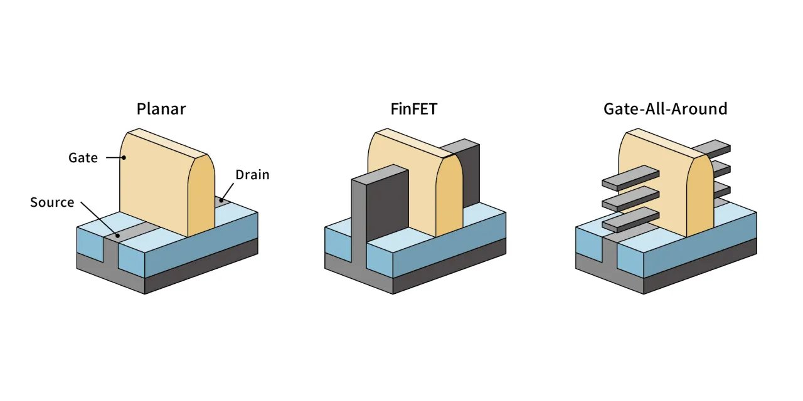

---
hide:
  - navigation
---
研究硅基半导体从材料到器件再到工艺的完整链条——从 FinFET、GAA 等先进晶体管结构，到 RRAM、PCM、FeRAM 等新型非易失存储器件，再到 EUV 光刻等量产工艺的物理极限挑战。

## 这个方向在研究什么

芯片制造的本质是一套极其精密的"印刷术"——把电路图案用光刻方式转移到硅片上，再经过离子注入、薄膜沉积、化学蚀刻等数百道工序，在硅片上构建出三维的晶体管和金属连线。过去五十年摩尔定律的延续，靠的是制程工程师每隔几年把光刻分辨率推高一档、把晶体管尺寸再缩一半。走到 2025 年第四季度，台积电 N2 节点开始量产，关键尺寸进入 2 纳米量级——大致是十几个硅原子排成一列的宽度。代价同步上去：ASML 单台 high-NA EUV 光刻机约 3.5 亿美元，全球只有这一家供应商。但钱能买到机器，买不到物理：很多原本支撑摩尔定律的物理机制，在这个尺度上已经不灵了。这个方向的研究都在面对同一个问题——**当原本的物理用法走到尽头，能不能换一种物理顶上去?** 下面三条战线就是这个问题的三种回答。

<!-- TODO: 此处插入图片 planar_finfet_gaa.png(平面 MOSFET / FinFET / GAA 三器件 3D 对比图)。
     SVG 立体图无法达到所需视觉质量,改用外部图片资源。
     图片已放在 /mnt/user-data/outputs/planar_finfet_gaa.png。
     正式发布时项目方需将图片放到对应资源路径,并按下面 markdown 语法引用。 -->

第一条战线在晶体管本身的形状上。MOSFET 的工作原理是**栅极用电场控住源极和漏极之间硅沟道里的电子流动**——电压打开就是 1，关闭就是 0。但沟道里其实有两股电场在拉锯：栅极从顶部往下压的**纵向电场**把电子按住，源极到漏极之间的**水平电场**把电子拉过去。沟道足够长时，栅极占主导，能从源到漏整段守住；一旦沟道缩短、源漏挨得更近，漏极的水平电场就侵入栅极的管控区域，**把源极一侧的能量势垒提前拉低**——栅极还说"关"的时候，电子已经被漏极拉过去了(这就是 **DIBL**，漏致势垒降低，短沟道效应里最致命的一种)。栅极只贴一面，控制力本来就有限，沟道一短就守不住。**FinFET**(鳍式晶体管)的解法是把沟道立起来变成一片"鳍"，栅极三面包，撑住了从台积电 16/14 到 5 纳米的几代节点；**GAA**(全环绕栅，Gate-All-Around)再进一步，把沟道做成水平的纳米片，栅极四面环绕——这是 N2 这一代的新结构。下一步是 **CFET**(Complementary FET)，N 型和 P 型晶体管垂直堆叠到同一根栅极上，让单位面积密度再翻倍。这条线上的工具是 EUV 光刻：13.5 纳米波长的光，光子数稀少到要"数着用"，每条线的边缘都有不可避免的随机起伏(stochastic effects)，版图阶段就得把这种统计量考虑进去；最新的 high-NA EUV 把数值孔径从 0.33 推到 0.55，分辨率提升约 1.7 倍、晶体管密度因此约 2.9 倍，代价就是单台机器 3.5 亿美元。但栅极的几何救不了所有问题——除了"沟道太短"，还有一件事在物理上等着：**沟道本身的厚度也得继续降**。

第二条战线在沟道的材料上。沟道为什么也要薄?栅极的电场只能渗进沟道很薄一层，沟道再厚下面的电子还是会从源极漏到漏极——所以晶体管做小，不光栅极几何在变，沟道厚度也得跟着降。问题是**硅做不薄**：硅是 3D 体相晶体，每个原子四个共价键四面体伸出，做到 1-2 纳米时表面那层硅原子的键找不到对象，形成大量**悬挂键**(dangling bonds)，缺陷成主导，迁移率塌掉。**二维半导体**就是为这条边界准备的远期答案。"二维"不是说几何上没有厚度——单层仍有 0.6 纳米——而是**晶体结构本身就只有一层平面厚度**：一片单层从化学键角度自洽闭合，不是从 3D 体相切下来的薄片，所以没有悬挂键。以 MoS₂、WSe₂ 为代表的过渡金属硫化物(TMD)就是典型——天然层状，层内强共价键、层间弱范德华力，可以像剥石墨一样一层层剥下来，每一层都是完整稳定的晶体，迁移率不会因为薄而崩。这是它最本质的物理优势：**天生就薄，性能还在**。但离量产还远——晶圆级均匀生长难、生长温度高难和 CMOS 后端兼容、欧姆接触阻抗大，每一项都是开放问题。石墨烯迁移率漂亮但零带隙——做逻辑器件没有"关"的那一档。这是一片活跃的实验室前沿，距离量产至少还需 5-10 年。

<svg viewBox="0 0 860 280" xmlns="http://www.w3.org/2000/svg" style="width:100%;max-width:860px;display:block;margin:1.5rem auto;font-family:system-ui,-apple-system,sans-serif">
  <rect x="14" y="14" width="409" height="220" rx="8" fill="#F8FAFC" stroke="#94A3B8" stroke-width="1.3"/>
  <text x="218" y="36" text-anchor="middle" font-size="13" font-weight="600" fill="#334155">① 硅: 3D 体相,切薄到 1–2 nm</text>
  <line x1="70" y1="74" x2="96" y2="74" stroke="#475569" stroke-width="1"/>
  <line x1="64" y1="80" x2="64" y2="92" stroke="#475569" stroke-width="1"/>
  <line x1="108" y1="74" x2="134" y2="74" stroke="#475569" stroke-width="1"/>
  <line x1="102" y1="80" x2="102" y2="92" stroke="#475569" stroke-width="1"/>
  <line x1="146" y1="74" x2="172" y2="74" stroke="#475569" stroke-width="1"/>
  <line x1="140" y1="80" x2="140" y2="92" stroke="#475569" stroke-width="1"/>
  <line x1="184" y1="74" x2="210" y2="74" stroke="#475569" stroke-width="1"/>
  <line x1="178" y1="80" x2="178" y2="92" stroke="#475569" stroke-width="1"/>
  <line x1="222" y1="74" x2="248" y2="74" stroke="#475569" stroke-width="1"/>
  <line x1="216" y1="80" x2="216" y2="92" stroke="#475569" stroke-width="1"/>
  <line x1="254" y1="80" x2="254" y2="92" stroke="#475569" stroke-width="1"/>
  <line x1="70" y1="98" x2="96" y2="98" stroke="#475569" stroke-width="1"/>
  <line x1="64" y1="104" x2="64" y2="116" stroke="#475569" stroke-width="1"/>
  <line x1="108" y1="98" x2="134" y2="98" stroke="#475569" stroke-width="1"/>
  <line x1="102" y1="104" x2="102" y2="116" stroke="#475569" stroke-width="1"/>
  <line x1="146" y1="98" x2="172" y2="98" stroke="#475569" stroke-width="1"/>
  <line x1="140" y1="104" x2="140" y2="116" stroke="#475569" stroke-width="1"/>
  <line x1="184" y1="98" x2="210" y2="98" stroke="#475569" stroke-width="1"/>
  <line x1="178" y1="104" x2="178" y2="116" stroke="#475569" stroke-width="1"/>
  <line x1="222" y1="98" x2="248" y2="98" stroke="#475569" stroke-width="1"/>
  <line x1="216" y1="104" x2="216" y2="116" stroke="#475569" stroke-width="1"/>
  <line x1="254" y1="104" x2="254" y2="116" stroke="#475569" stroke-width="1"/>
  <line x1="70" y1="122" x2="96" y2="122" stroke="#475569" stroke-width="1"/>
  <line x1="64" y1="128" x2="64" y2="140" stroke="#475569" stroke-width="1"/>
  <line x1="108" y1="122" x2="134" y2="122" stroke="#475569" stroke-width="1"/>
  <line x1="102" y1="128" x2="102" y2="140" stroke="#475569" stroke-width="1"/>
  <line x1="146" y1="122" x2="172" y2="122" stroke="#475569" stroke-width="1"/>
  <line x1="140" y1="128" x2="140" y2="140" stroke="#475569" stroke-width="1"/>
  <line x1="184" y1="122" x2="210" y2="122" stroke="#475569" stroke-width="1"/>
  <line x1="178" y1="128" x2="178" y2="140" stroke="#475569" stroke-width="1"/>
  <line x1="222" y1="122" x2="248" y2="122" stroke="#475569" stroke-width="1"/>
  <line x1="216" y1="128" x2="216" y2="140" stroke="#475569" stroke-width="1"/>
  <line x1="254" y1="128" x2="254" y2="140" stroke="#475569" stroke-width="1"/>
  <line x1="70" y1="146" x2="96" y2="146" stroke="#475569" stroke-width="1"/>
  <line x1="64" y1="152" x2="64" y2="164" stroke="#475569" stroke-width="1"/>
  <line x1="108" y1="146" x2="134" y2="146" stroke="#475569" stroke-width="1"/>
  <line x1="102" y1="152" x2="102" y2="164" stroke="#475569" stroke-width="1"/>
  <line x1="146" y1="146" x2="172" y2="146" stroke="#475569" stroke-width="1"/>
  <line x1="140" y1="152" x2="140" y2="164" stroke="#475569" stroke-width="1"/>
  <line x1="184" y1="146" x2="210" y2="146" stroke="#475569" stroke-width="1"/>
  <line x1="178" y1="152" x2="178" y2="164" stroke="#475569" stroke-width="1"/>
  <line x1="222" y1="146" x2="248" y2="146" stroke="#475569" stroke-width="1"/>
  <line x1="216" y1="152" x2="216" y2="164" stroke="#475569" stroke-width="1"/>
  <line x1="254" y1="152" x2="254" y2="164" stroke="#475569" stroke-width="1"/>
  <line x1="70" y1="170" x2="96" y2="170" stroke="#475569" stroke-width="1"/>
  <line x1="108" y1="170" x2="134" y2="170" stroke="#475569" stroke-width="1"/>
  <line x1="146" y1="170" x2="172" y2="170" stroke="#475569" stroke-width="1"/>
  <line x1="184" y1="170" x2="210" y2="170" stroke="#475569" stroke-width="1"/>
  <line x1="222" y1="170" x2="248" y2="170" stroke="#475569" stroke-width="1"/>
  <line x1="64" y1="68" x2="64" y2="60" stroke="#DC2626" stroke-width="1.6"/>
  <line x1="61" y1="62" x2="67" y2="60" stroke="#DC2626" stroke-width="1.4"/>
  <line x1="102" y1="68" x2="102" y2="60" stroke="#DC2626" stroke-width="1.6"/>
  <line x1="99" y1="62" x2="105" y2="60" stroke="#DC2626" stroke-width="1.4"/>
  <line x1="140" y1="68" x2="140" y2="60" stroke="#DC2626" stroke-width="1.6"/>
  <line x1="137" y1="62" x2="143" y2="60" stroke="#DC2626" stroke-width="1.4"/>
  <line x1="178" y1="68" x2="178" y2="60" stroke="#DC2626" stroke-width="1.6"/>
  <line x1="175" y1="62" x2="181" y2="60" stroke="#DC2626" stroke-width="1.4"/>
  <line x1="216" y1="68" x2="216" y2="60" stroke="#DC2626" stroke-width="1.6"/>
  <line x1="213" y1="62" x2="219" y2="60" stroke="#DC2626" stroke-width="1.4"/>
  <line x1="254" y1="68" x2="254" y2="60" stroke="#DC2626" stroke-width="1.6"/>
  <line x1="251" y1="62" x2="257" y2="60" stroke="#DC2626" stroke-width="1.4"/>
  <line x1="64" y1="104" x2="64" y2="112" stroke="#DC2626" stroke-width="1.6"/>
  <line x1="102" y1="104" x2="102" y2="112" stroke="#DC2626" stroke-width="1.6"/>
  <line x1="140" y1="104" x2="140" y2="112" stroke="#DC2626" stroke-width="1.6"/>
  <line x1="178" y1="104" x2="178" y2="112" stroke="#DC2626" stroke-width="1.6"/>
  <line x1="216" y1="104" x2="216" y2="112" stroke="#DC2626" stroke-width="1.6"/>
  <line x1="254" y1="104" x2="254" y2="112" stroke="#DC2626" stroke-width="1.6"/>
  <circle cx="64" cy="74" r="6" fill="#94A3B8" stroke="#475569" stroke-width="0.8"/>
  <circle cx="102" cy="74" r="6" fill="#94A3B8" stroke="#475569" stroke-width="0.8"/>
  <circle cx="140" cy="74" r="6" fill="#94A3B8" stroke="#475569" stroke-width="0.8"/>
  <circle cx="178" cy="74" r="6" fill="#94A3B8" stroke="#475569" stroke-width="0.8"/>
  <circle cx="216" cy="74" r="6" fill="#94A3B8" stroke="#475569" stroke-width="0.8"/>
  <circle cx="254" cy="74" r="6" fill="#94A3B8" stroke="#475569" stroke-width="0.8"/>
  <circle cx="64" cy="98" r="6" fill="#94A3B8" stroke="#475569" stroke-width="0.8"/>
  <circle cx="102" cy="98" r="6" fill="#94A3B8" stroke="#475569" stroke-width="0.8"/>
  <circle cx="140" cy="98" r="6" fill="#94A3B8" stroke="#475569" stroke-width="0.8"/>
  <circle cx="178" cy="98" r="6" fill="#94A3B8" stroke="#475569" stroke-width="0.8"/>
  <circle cx="216" cy="98" r="6" fill="#94A3B8" stroke="#475569" stroke-width="0.8"/>
  <circle cx="254" cy="98" r="6" fill="#94A3B8" stroke="#475569" stroke-width="0.8"/>
  <circle cx="64" cy="122" r="6" fill="#94A3B8" stroke="#475569" stroke-width="0.8"/>
  <circle cx="102" cy="122" r="6" fill="#94A3B8" stroke="#475569" stroke-width="0.8"/>
  <circle cx="140" cy="122" r="6" fill="#94A3B8" stroke="#475569" stroke-width="0.8"/>
  <circle cx="178" cy="122" r="6" fill="#94A3B8" stroke="#475569" stroke-width="0.8"/>
  <circle cx="216" cy="122" r="6" fill="#94A3B8" stroke="#475569" stroke-width="0.8"/>
  <circle cx="254" cy="122" r="6" fill="#94A3B8" stroke="#475569" stroke-width="0.8"/>
  <circle cx="64" cy="146" r="6" fill="#94A3B8" stroke="#475569" stroke-width="0.8"/>
  <circle cx="102" cy="146" r="6" fill="#94A3B8" stroke="#475569" stroke-width="0.8"/>
  <circle cx="140" cy="146" r="6" fill="#94A3B8" stroke="#475569" stroke-width="0.8"/>
  <circle cx="178" cy="146" r="6" fill="#94A3B8" stroke="#475569" stroke-width="0.8"/>
  <circle cx="216" cy="146" r="6" fill="#94A3B8" stroke="#475569" stroke-width="0.8"/>
  <circle cx="254" cy="146" r="6" fill="#94A3B8" stroke="#475569" stroke-width="0.8"/>
  <circle cx="64" cy="170" r="6" fill="#94A3B8" stroke="#475569" stroke-width="0.8"/>
  <circle cx="102" cy="170" r="6" fill="#94A3B8" stroke="#475569" stroke-width="0.8"/>
  <circle cx="140" cy="170" r="6" fill="#94A3B8" stroke="#475569" stroke-width="0.8"/>
  <circle cx="178" cy="170" r="6" fill="#94A3B8" stroke="#475569" stroke-width="0.8"/>
  <circle cx="216" cy="170" r="6" fill="#94A3B8" stroke="#475569" stroke-width="0.8"/>
  <circle cx="254" cy="170" r="6" fill="#94A3B8" stroke="#475569" stroke-width="0.8"/>
  <line x1="44" y1="110" x2="274" y2="110" stroke="#DC2626" stroke-width="1.5" stroke-dasharray="6,3"/>
  <text x="280" y="114" font-size="9" fill="#DC2626" font-weight="600">切薄</text>
  <text x="32" y="90" font-size="9" fill="#DC2626" font-style="italic" text-anchor="middle">2 nm 薄层</text>
  <line x1="333" y1="184" x2="343" y2="184" stroke="#DC2626" stroke-width="1.6"/>
  <text x="347" y="187" font-size="9" fill="#DC2626">悬挂键</text>
  <text x="218" y="214" text-anchor="middle" font-size="10" fill="#334155">表面缺陷成主导 → 迁移率塌</text>
  <rect x="437" y="14" width="409" height="220" rx="8" fill="#FAF5FF" stroke="#7C3AED" stroke-width="1.3"/>
  <text x="641" y="36" text-anchor="middle" font-size="13" font-weight="600" fill="#334155">② MoS₂: 天然层状,单层 0.6 nm 完整</text>
  <line x1="537" y1="92" x2="537" y2="100" stroke="#5B21B6" stroke-width="1.4" opacity="1.0"/>
  <line x1="537" y1="100" x2="537" y2="108" stroke="#5B21B6" stroke-width="1.4" opacity="1.0"/>
  <line x1="541" y1="92" x2="565" y2="92" stroke="#5B21B6" stroke-width="1.0" opacity="0.7"/>
  <line x1="543" y1="100" x2="563" y2="100" stroke="#5B21B6" stroke-width="1.0" opacity="0.7"/>
  <line x1="541" y1="108" x2="565" y2="108" stroke="#5B21B6" stroke-width="1.0" opacity="0.7"/>
  <line x1="569" y1="92" x2="569" y2="100" stroke="#5B21B6" stroke-width="1.4" opacity="1.0"/>
  <line x1="569" y1="100" x2="569" y2="108" stroke="#5B21B6" stroke-width="1.4" opacity="1.0"/>
  <line x1="573" y1="92" x2="597" y2="92" stroke="#5B21B6" stroke-width="1.0" opacity="0.7"/>
  <line x1="575" y1="100" x2="595" y2="100" stroke="#5B21B6" stroke-width="1.0" opacity="0.7"/>
  <line x1="573" y1="108" x2="597" y2="108" stroke="#5B21B6" stroke-width="1.0" opacity="0.7"/>
  <line x1="601" y1="92" x2="601" y2="100" stroke="#5B21B6" stroke-width="1.4" opacity="1.0"/>
  <line x1="601" y1="100" x2="601" y2="108" stroke="#5B21B6" stroke-width="1.4" opacity="1.0"/>
  <line x1="605" y1="92" x2="629" y2="92" stroke="#5B21B6" stroke-width="1.0" opacity="0.7"/>
  <line x1="607" y1="100" x2="627" y2="100" stroke="#5B21B6" stroke-width="1.0" opacity="0.7"/>
  <line x1="605" y1="108" x2="629" y2="108" stroke="#5B21B6" stroke-width="1.0" opacity="0.7"/>
  <line x1="633" y1="92" x2="633" y2="100" stroke="#5B21B6" stroke-width="1.4" opacity="1.0"/>
  <line x1="633" y1="100" x2="633" y2="108" stroke="#5B21B6" stroke-width="1.4" opacity="1.0"/>
  <line x1="637" y1="92" x2="661" y2="92" stroke="#5B21B6" stroke-width="1.0" opacity="0.7"/>
  <line x1="639" y1="100" x2="659" y2="100" stroke="#5B21B6" stroke-width="1.0" opacity="0.7"/>
  <line x1="637" y1="108" x2="661" y2="108" stroke="#5B21B6" stroke-width="1.0" opacity="0.7"/>
  <line x1="665" y1="92" x2="665" y2="100" stroke="#5B21B6" stroke-width="1.4" opacity="1.0"/>
  <line x1="665" y1="100" x2="665" y2="108" stroke="#5B21B6" stroke-width="1.4" opacity="1.0"/>
  <circle cx="537" cy="92" r="4" fill="#F59E0B" stroke="#92400E" stroke-width="0.7" opacity="1.0"/>
  <circle cx="537" cy="100" r="6" fill="#7C3AED" stroke="#3B0764" stroke-width="0.7" opacity="1.0"/>
  <circle cx="537" cy="108" r="4" fill="#F59E0B" stroke="#92400E" stroke-width="0.7" opacity="1.0"/>
  <circle cx="569" cy="92" r="4" fill="#F59E0B" stroke="#92400E" stroke-width="0.7" opacity="1.0"/>
  <circle cx="569" cy="100" r="6" fill="#7C3AED" stroke="#3B0764" stroke-width="0.7" opacity="1.0"/>
  <circle cx="569" cy="108" r="4" fill="#F59E0B" stroke="#92400E" stroke-width="0.7" opacity="1.0"/>
  <circle cx="601" cy="92" r="4" fill="#F59E0B" stroke="#92400E" stroke-width="0.7" opacity="1.0"/>
  <circle cx="601" cy="100" r="6" fill="#7C3AED" stroke="#3B0764" stroke-width="0.7" opacity="1.0"/>
  <circle cx="601" cy="108" r="4" fill="#F59E0B" stroke="#92400E" stroke-width="0.7" opacity="1.0"/>
  <circle cx="633" cy="92" r="4" fill="#F59E0B" stroke="#92400E" stroke-width="0.7" opacity="1.0"/>
  <circle cx="633" cy="100" r="6" fill="#7C3AED" stroke="#3B0764" stroke-width="0.7" opacity="1.0"/>
  <circle cx="633" cy="108" r="4" fill="#F59E0B" stroke="#92400E" stroke-width="0.7" opacity="1.0"/>
  <circle cx="665" cy="92" r="4" fill="#F59E0B" stroke="#92400E" stroke-width="0.7" opacity="1.0"/>
  <circle cx="665" cy="100" r="6" fill="#7C3AED" stroke="#3B0764" stroke-width="0.7" opacity="1.0"/>
  <circle cx="665" cy="108" r="4" fill="#F59E0B" stroke="#92400E" stroke-width="0.7" opacity="1.0"/>
  <line x1="537" y1="112" x2="537" y2="115" stroke="#A78BFA" stroke-width="1" stroke-dasharray="2,2"/>
  <line x1="569" y1="112" x2="569" y2="115" stroke="#A78BFA" stroke-width="1" stroke-dasharray="2,2"/>
  <line x1="601" y1="112" x2="601" y2="115" stroke="#A78BFA" stroke-width="1" stroke-dasharray="2,2"/>
  <line x1="633" y1="112" x2="633" y2="115" stroke="#A78BFA" stroke-width="1" stroke-dasharray="2,2"/>
  <line x1="665" y1="112" x2="665" y2="115" stroke="#A78BFA" stroke-width="1" stroke-dasharray="2,2"/>
  <line x1="537" y1="119" x2="537" y2="127" stroke="#5B21B6" stroke-width="1.4" opacity="1.0"/>
  <line x1="537" y1="127" x2="537" y2="135" stroke="#5B21B6" stroke-width="1.4" opacity="1.0"/>
  <line x1="541" y1="119" x2="565" y2="119" stroke="#5B21B6" stroke-width="1.0" opacity="0.7"/>
  <line x1="543" y1="127" x2="563" y2="127" stroke="#5B21B6" stroke-width="1.0" opacity="0.7"/>
  <line x1="541" y1="135" x2="565" y2="135" stroke="#5B21B6" stroke-width="1.0" opacity="0.7"/>
  <line x1="569" y1="119" x2="569" y2="127" stroke="#5B21B6" stroke-width="1.4" opacity="1.0"/>
  <line x1="569" y1="127" x2="569" y2="135" stroke="#5B21B6" stroke-width="1.4" opacity="1.0"/>
  <line x1="573" y1="119" x2="597" y2="119" stroke="#5B21B6" stroke-width="1.0" opacity="0.7"/>
  <line x1="575" y1="127" x2="595" y2="127" stroke="#5B21B6" stroke-width="1.0" opacity="0.7"/>
  <line x1="573" y1="135" x2="597" y2="135" stroke="#5B21B6" stroke-width="1.0" opacity="0.7"/>
  <line x1="601" y1="119" x2="601" y2="127" stroke="#5B21B6" stroke-width="1.4" opacity="1.0"/>
  <line x1="601" y1="127" x2="601" y2="135" stroke="#5B21B6" stroke-width="1.4" opacity="1.0"/>
  <line x1="605" y1="119" x2="629" y2="119" stroke="#5B21B6" stroke-width="1.0" opacity="0.7"/>
  <line x1="607" y1="127" x2="627" y2="127" stroke="#5B21B6" stroke-width="1.0" opacity="0.7"/>
  <line x1="605" y1="135" x2="629" y2="135" stroke="#5B21B6" stroke-width="1.0" opacity="0.7"/>
  <line x1="633" y1="119" x2="633" y2="127" stroke="#5B21B6" stroke-width="1.4" opacity="1.0"/>
  <line x1="633" y1="127" x2="633" y2="135" stroke="#5B21B6" stroke-width="1.4" opacity="1.0"/>
  <line x1="637" y1="119" x2="661" y2="119" stroke="#5B21B6" stroke-width="1.0" opacity="0.7"/>
  <line x1="639" y1="127" x2="659" y2="127" stroke="#5B21B6" stroke-width="1.0" opacity="0.7"/>
  <line x1="637" y1="135" x2="661" y2="135" stroke="#5B21B6" stroke-width="1.0" opacity="0.7"/>
  <line x1="665" y1="119" x2="665" y2="127" stroke="#5B21B6" stroke-width="1.4" opacity="1.0"/>
  <line x1="665" y1="127" x2="665" y2="135" stroke="#5B21B6" stroke-width="1.4" opacity="1.0"/>
  <circle cx="537" cy="119" r="4" fill="#F59E0B" stroke="#92400E" stroke-width="0.7" opacity="1.0"/>
  <circle cx="537" cy="127" r="6" fill="#7C3AED" stroke="#3B0764" stroke-width="0.7" opacity="1.0"/>
  <circle cx="537" cy="135" r="4" fill="#F59E0B" stroke="#92400E" stroke-width="0.7" opacity="1.0"/>
  <circle cx="569" cy="119" r="4" fill="#F59E0B" stroke="#92400E" stroke-width="0.7" opacity="1.0"/>
  <circle cx="569" cy="127" r="6" fill="#7C3AED" stroke="#3B0764" stroke-width="0.7" opacity="1.0"/>
  <circle cx="569" cy="135" r="4" fill="#F59E0B" stroke="#92400E" stroke-width="0.7" opacity="1.0"/>
  <circle cx="601" cy="119" r="4" fill="#F59E0B" stroke="#92400E" stroke-width="0.7" opacity="1.0"/>
  <circle cx="601" cy="127" r="6" fill="#7C3AED" stroke="#3B0764" stroke-width="0.7" opacity="1.0"/>
  <circle cx="601" cy="135" r="4" fill="#F59E0B" stroke="#92400E" stroke-width="0.7" opacity="1.0"/>
  <circle cx="633" cy="119" r="4" fill="#F59E0B" stroke="#92400E" stroke-width="0.7" opacity="1.0"/>
  <circle cx="633" cy="127" r="6" fill="#7C3AED" stroke="#3B0764" stroke-width="0.7" opacity="1.0"/>
  <circle cx="633" cy="135" r="4" fill="#F59E0B" stroke="#92400E" stroke-width="0.7" opacity="1.0"/>
  <circle cx="665" cy="119" r="4" fill="#F59E0B" stroke="#92400E" stroke-width="0.7" opacity="1.0"/>
  <circle cx="665" cy="127" r="6" fill="#7C3AED" stroke="#3B0764" stroke-width="0.7" opacity="1.0"/>
  <circle cx="665" cy="135" r="4" fill="#F59E0B" stroke="#92400E" stroke-width="0.7" opacity="1.0"/>
  <line x1="537" y1="139" x2="537" y2="142" stroke="#A78BFA" stroke-width="1" stroke-dasharray="2,2"/>
  <line x1="569" y1="139" x2="569" y2="142" stroke="#A78BFA" stroke-width="1" stroke-dasharray="2,2"/>
  <line x1="601" y1="139" x2="601" y2="142" stroke="#A78BFA" stroke-width="1" stroke-dasharray="2,2"/>
  <line x1="633" y1="139" x2="633" y2="142" stroke="#A78BFA" stroke-width="1" stroke-dasharray="2,2"/>
  <line x1="665" y1="139" x2="665" y2="142" stroke="#A78BFA" stroke-width="1" stroke-dasharray="2,2"/>
  <line x1="537" y1="146" x2="537" y2="154" stroke="#5B21B6" stroke-width="1.4" opacity="1.0"/>
  <line x1="537" y1="154" x2="537" y2="162" stroke="#5B21B6" stroke-width="1.4" opacity="1.0"/>
  <line x1="541" y1="146" x2="565" y2="146" stroke="#5B21B6" stroke-width="1.0" opacity="0.7"/>
  <line x1="543" y1="154" x2="563" y2="154" stroke="#5B21B6" stroke-width="1.0" opacity="0.7"/>
  <line x1="541" y1="162" x2="565" y2="162" stroke="#5B21B6" stroke-width="1.0" opacity="0.7"/>
  <line x1="569" y1="146" x2="569" y2="154" stroke="#5B21B6" stroke-width="1.4" opacity="1.0"/>
  <line x1="569" y1="154" x2="569" y2="162" stroke="#5B21B6" stroke-width="1.4" opacity="1.0"/>
  <line x1="573" y1="146" x2="597" y2="146" stroke="#5B21B6" stroke-width="1.0" opacity="0.7"/>
  <line x1="575" y1="154" x2="595" y2="154" stroke="#5B21B6" stroke-width="1.0" opacity="0.7"/>
  <line x1="573" y1="162" x2="597" y2="162" stroke="#5B21B6" stroke-width="1.0" opacity="0.7"/>
  <line x1="601" y1="146" x2="601" y2="154" stroke="#5B21B6" stroke-width="1.4" opacity="1.0"/>
  <line x1="601" y1="154" x2="601" y2="162" stroke="#5B21B6" stroke-width="1.4" opacity="1.0"/>
  <line x1="605" y1="146" x2="629" y2="146" stroke="#5B21B6" stroke-width="1.0" opacity="0.7"/>
  <line x1="607" y1="154" x2="627" y2="154" stroke="#5B21B6" stroke-width="1.0" opacity="0.7"/>
  <line x1="605" y1="162" x2="629" y2="162" stroke="#5B21B6" stroke-width="1.0" opacity="0.7"/>
  <line x1="633" y1="146" x2="633" y2="154" stroke="#5B21B6" stroke-width="1.4" opacity="1.0"/>
  <line x1="633" y1="154" x2="633" y2="162" stroke="#5B21B6" stroke-width="1.4" opacity="1.0"/>
  <line x1="637" y1="146" x2="661" y2="146" stroke="#5B21B6" stroke-width="1.0" opacity="0.7"/>
  <line x1="639" y1="154" x2="659" y2="154" stroke="#5B21B6" stroke-width="1.0" opacity="0.7"/>
  <line x1="637" y1="162" x2="661" y2="162" stroke="#5B21B6" stroke-width="1.0" opacity="0.7"/>
  <line x1="665" y1="146" x2="665" y2="154" stroke="#5B21B6" stroke-width="1.4" opacity="1.0"/>
  <line x1="665" y1="154" x2="665" y2="162" stroke="#5B21B6" stroke-width="1.4" opacity="1.0"/>
  <circle cx="537" cy="146" r="4" fill="#F59E0B" stroke="#92400E" stroke-width="0.7" opacity="1.0"/>
  <circle cx="537" cy="154" r="6" fill="#7C3AED" stroke="#3B0764" stroke-width="0.7" opacity="1.0"/>
  <circle cx="537" cy="162" r="4" fill="#F59E0B" stroke="#92400E" stroke-width="0.7" opacity="1.0"/>
  <circle cx="569" cy="146" r="4" fill="#F59E0B" stroke="#92400E" stroke-width="0.7" opacity="1.0"/>
  <circle cx="569" cy="154" r="6" fill="#7C3AED" stroke="#3B0764" stroke-width="0.7" opacity="1.0"/>
  <circle cx="569" cy="162" r="4" fill="#F59E0B" stroke="#92400E" stroke-width="0.7" opacity="1.0"/>
  <circle cx="601" cy="146" r="4" fill="#F59E0B" stroke="#92400E" stroke-width="0.7" opacity="1.0"/>
  <circle cx="601" cy="154" r="6" fill="#7C3AED" stroke="#3B0764" stroke-width="0.7" opacity="1.0"/>
  <circle cx="601" cy="162" r="4" fill="#F59E0B" stroke="#92400E" stroke-width="0.7" opacity="1.0"/>
  <circle cx="633" cy="146" r="4" fill="#F59E0B" stroke="#92400E" stroke-width="0.7" opacity="1.0"/>
  <circle cx="633" cy="154" r="6" fill="#7C3AED" stroke="#3B0764" stroke-width="0.7" opacity="1.0"/>
  <circle cx="633" cy="162" r="4" fill="#F59E0B" stroke="#92400E" stroke-width="0.7" opacity="1.0"/>
  <circle cx="665" cy="146" r="4" fill="#F59E0B" stroke="#92400E" stroke-width="0.7" opacity="1.0"/>
  <circle cx="665" cy="154" r="6" fill="#7C3AED" stroke="#3B0764" stroke-width="0.7" opacity="1.0"/>
  <circle cx="665" cy="162" r="4" fill="#F59E0B" stroke="#92400E" stroke-width="0.7" opacity="1.0"/>
  <text x="677" y="116" font-size="9" fill="#A78BFA" font-weight="600">范德华力</text>
  <text x="677" y="127" font-size="8" fill="#A78BFA">(弱,可剥)</text>
  <defs><marker id="peel-arrow" markerWidth="6" markerHeight="6" refX="5" refY="3" orient="auto"><path d="M0,0 L0,6 L6,3 z" fill="#16A34A"/></marker></defs>
  <line x1="449" y1="62" x2="449" y2="70" stroke="#5B21B6" stroke-width="1.4" opacity="1.0"/>
  <line x1="449" y1="70" x2="449" y2="78" stroke="#5B21B6" stroke-width="1.4" opacity="1.0"/>
  <line x1="453" y1="62" x2="477" y2="62" stroke="#5B21B6" stroke-width="1.0" opacity="0.7"/>
  <line x1="455" y1="70" x2="475" y2="70" stroke="#5B21B6" stroke-width="1.0" opacity="0.7"/>
  <line x1="453" y1="78" x2="477" y2="78" stroke="#5B21B6" stroke-width="1.0" opacity="0.7"/>
  <line x1="481" y1="62" x2="481" y2="70" stroke="#5B21B6" stroke-width="1.4" opacity="1.0"/>
  <line x1="481" y1="70" x2="481" y2="78" stroke="#5B21B6" stroke-width="1.4" opacity="1.0"/>
  <circle cx="449" cy="62" r="4" fill="#F59E0B" stroke="#92400E" stroke-width="0.7" opacity="1.0"/>
  <circle cx="449" cy="70" r="6" fill="#7C3AED" stroke="#3B0764" stroke-width="0.7" opacity="1.0"/>
  <circle cx="449" cy="78" r="4" fill="#F59E0B" stroke="#92400E" stroke-width="0.7" opacity="1.0"/>
  <circle cx="481" cy="62" r="4" fill="#F59E0B" stroke="#92400E" stroke-width="0.7" opacity="1.0"/>
  <circle cx="481" cy="70" r="6" fill="#7C3AED" stroke="#3B0764" stroke-width="0.7" opacity="1.0"/>
  <circle cx="481" cy="78" r="4" fill="#F59E0B" stroke="#92400E" stroke-width="0.7" opacity="1.0"/>
  <text x="481" y="54" text-anchor="middle" font-size="9" fill="#15803D" font-weight="600">剥下来的单层</text>
  <text x="481" y="90" text-anchor="middle" font-size="9" fill="#64748B">0.6 nm 完整</text>
  <circle cx="449" cy="184" r="4" fill="#F59E0B" stroke="#92400E" stroke-width="0.7"/>
  <text x="457" y="187" font-size="9" fill="#334155">S</text>
  <circle cx="477" cy="184" r="6" fill="#7C3AED" stroke="#3B0764" stroke-width="0.7"/>
  <text x="487" y="187" font-size="9" fill="#334155">Mo</text>
  <text x="509" y="187" font-size="9" fill="#5B21B6" font-weight="600">─ 共价键(强)</text>
  <text x="641" y="214" text-anchor="middle" font-size="10" fill="#334155">每一层都是完整晶体 → 迁移率不塌</text>
  <text x="430" y="262" text-anchor="middle" font-size="11" fill="#334155">硅的 3D 体相做不到原子级薄度 · MoS₂ 之类二维半导体天生薄,这是它进入"1 nm 以下沟道"的物理入场券</text>
</svg>

第三条战线切到另一个战场——主角不是晶体管，是存储器件。DRAM 的支柱是"用一颗电容里的电荷量代表 0 或 1"，电容做小到一定程度，漏电和扰动让电荷再也存不住；Flash 靠 3D NAND 一层一层堆维持密度，堆到 200+ 层之后键合应力压不住，继续堆要付出指数级的工艺代价。两根传统支柱在物理上同时撞墙。整个新型存储器件的研究在做的就是一件事——**绕开"用电荷数存信息"这条路，找一种全新的物理机制顶上去**。挑 RRAM(阻变存储器)讲透：它不存电荷，存的是一段几纳米厚氧化物薄膜的电阻状态——施加正向电压时，薄膜里的氧空位会沿电场方向排列形成一根**导电细丝**，电阻陡降到低阻态(读作 1)；反向电压把细丝打散，电阻回到高阻态(读作 0)。结构简单到极致——两层电极夹一层介质——可以堆三维高密度阵列，而且电阻还能在中间连续调，这一点让它天然衔接到存算一体(同一颗器件既是存储单元也是模拟乘法器)。最大的难点是**变异性**：每颗器件里细丝具体在哪里成形带有随机性，阵列里就出现一个良率分布问题，工业界和学术界都在做"怎么把这个分布压窄"。其他三条新型存储路线在做的是类似的事，只是物理量不同——PCM(相变存储器)用材料的结晶/非晶相态、MRAM(磁阻存储器)用磁化方向、FeRAM(铁电存储器)用铁电极化的翻转。共同点都是用别的物理量代替"数电荷"。三条战线做的是同一件事：当原本的物理用法走到尽头，找一种新的物理顶上去——这是这个方向的精神底色，也是它最有研究魅力的地方。

### 核心研究问题

- **栅极几何还能救几代**：沟道一短，漏极水平电场侵入栅极管控区、把源极侧势垒提前拉低（DIBL），FinFET 三面包、GAA 四面环绕、CFET 再垂直堆叠，靠几何把电子管住的路到底还能续几代。
- **硅退场后谁顶上**：器件做小连沟道厚度也得降，可硅切到 1-2 nm 表面就长满悬挂键、迁移率塌掉，MoS₂、WSe₂ 这类二维半导体天生薄，但晶圆级生长、CMOS 后端兼容、欧姆接触都还是开放问题，离量产还差 5-10 年。
- **EUV 的光子要数着用**：13.5 nm 波长下光子稀少，每条线边缘都有随机起伏，版图阶段就得把统计量算进去，high-NA 分辨率再提一档后随机缺陷的良率账怎么算平。
- **存信息能不能绕开数电荷**：DRAM 电容存不住电荷、3D NAND 堆过 200 层压不住应力，RRAM 用电阻态、PCM 用相态、MRAM 用磁化、FeRAM 用极化翻转，哪一种能在速度、功耗、耐久、保持之间真正打平。
- **器件随机性该消掉还是该利用**：RRAM 导电细丝在哪成形带着随机性，放进阵列就是良率分布问题，可那种连续可调的电阻态又恰好天然衔接存算一体，变异性到底是缺陷还是特性。

### 知识路径

图中节点对应以下知识板块（按需选修）：

- [物理基础](../学习地图/物理/index.md)（量子力学的隧穿/势垒、固体物理的能带与缺陷、半导体物理的载流子与短沟道效应——DIBL、二维材料、细丝导电都落在这一层）
- [器件与工艺](../学习地图/器件与工艺/index.md)（器件原理讲 FinFET/GAA/新型存储，IC 工艺讲光刻/沉积/蚀刻，先进工艺技术讲 EUV、二维材料集成与新型 NVM）

## 这个方向适合谁

适合对物理图像本身有执念的人。看到 DIBL 脑子里浮现的是漏极电场怎么把势垒一点点拉低，看到 RRAM 跳变会一路追到氧空位排成细丝那一层才肯罢休。微电子本科正是这条线的主力，半导体物理、固体物理底子扎实就能直接上手。日常两头跑，一头在超净间制备器件、操作 EUV 或 ALD、在探针台量 I-V 和耐久性，另一头用 Sentaurus TCAD 跑器件、写统计模型啃 RRAM 的变异性分布。诚实地说，一轮工艺动辄数周、失败重来是常态，二维材料离量产还有 5-10 年（IEDM 是主场），它奖励的是对单个物理机制的耐心深挖而非迭代速度。

## 学术界

### 课题组

**境内**

-   **[黄如](https://ic.pku.edu.cn/szdw/ysfc/hr/index.htm)** 北大 

    GAA 器件 · 铁电存储器 · 低功耗逻辑/存储器件

-   **[张兴](https://ic.pku.edu.cn/szdw/zzjs/jcwndzx1/zx/index.htm)** 北大

    先进 CMOS 工艺 · FinFET/GAAFET 结构 · 低功耗逻辑器件

-   **[康晋锋](https://ic.pku.edu.cn/szdw/zzjs/K1/kjf/index.htm)** 北大

    半导体工艺可靠性 · 高κ/金属栅器件失效机制

-   **[张卫](https://sme.fudan.edu.cn/60/d4/c31133a352468/page.htm)** 复旦

    半导体器件与工艺研发 · 新型晶体管结构

-   **[孙清清](https://sme.fudan.edu.cn/60/20/c31153a352288/page.htm)** 复旦

    先进 IC 工艺（ALD、Cu 互联） · 二维半导体晶圆级集成

-   **[包文中](https://sme.fudan.edu.cn/60/be/c31153a352510/page.htm)** 复旦

    晶圆级二维半导体生长 · 逻辑/存储/RF 多应用集成

-   **[刘明](https://fics.fudan.edu.cn/36/80/c22618a276096/page.htm)** 复旦 

    新型非易失存储器 · 存储器件物理 · 高密度集成

-   **[刘春森](https://fics.fudan.edu.cn/b3/35/c22620a242485/page.htm)** 复旦

    超快 NVM 器件 · 二维闪存 · 新型存储材料

-   **[王水源](https://sme.fudan.edu.cn/60/b6/c31153a352502/page.htm)** 复旦

    高性能二维晶体管 · 铁电存储器件 · 新型半导体器件

-   **[任天令](https://www.sic.tsinghua.edu.cn/info/1033/1545.htm)** 清华

    二维材料器件与工艺 · NEMS 传感器 · 柔性电子集成

-   **[田禾](https://www.sic.tsinghua.edu.cn/info/1035/1553.htm)** 清华

    二维半导体晶体管工艺 · MoS₂/WSe₂ 先进集成

-   **[赵超](https://semi.cas.cn/rcdw/yjyjrc/rc_gtgd/202310/t20231010_6892274.html)** 中科院

    III-V/Si 异质外延 · 高性能 III-V 激光器 · 新型半导体

-   **[吴华强](https://www.sic.tsinghua.edu.cn/info/1015/1787.htm)** 清华

    忆阻器存算一体 · 新型存储器件 · 神经形态芯片

-   **[唐建石](https://www.ime.tsinghua.edu.cn/info/1035/1595.htm)** 清华

    新型存储器与类脑计算 · 单片三维异质集成 · 碳基电子学

-   **[蔡一茂](https://ic.pku.edu.cn/szdw/zzjs/jcwndzx1/cym/index.htm)** 北大

    高密度高可靠 RRAM · 存算一体智能芯片 · 神经形态器件

-   **[周鹏](https://sme.fudan.edu.cn/60/68/c31158a352360/page.htm)** 复旦

    二维半导体器件 · CMOS 兼容非易失存储 · 二维-硅异构集成

-   **[陈琳](https://sme.fudan.edu.cn/5f/c3/c31133a352195/page.htm)** 复旦

    新型存储器与存算一体 · 集成电路新原理器件 · 三维集成互连

-   **[蒋玉龙](https://icmne.fudan.edu.cn/2d/1f/c48925a732447/page.htm)** 复旦

    集成电路先进工艺与器件 · MOS 源漏栅接触技术 · 先进铜互连

-   **[纪志罡](https://icisee.sjtu.edu.cn/jiaoshiml/jizhigang.html)** 交大

    铁电存储器/新兴存储器件 · 器件可靠性物理 · 工艺-电路协同优化

-   **[赵昱达](https://person.zju.edu.cn/yudazhao)** 浙大

    高性能二维材料晶体管 · 低功耗阻变存储器 · 感存算一体器件

-   **[龙世兵](https://sme.ustc.edu.cn/2022/0601/c30996a556910/page.htm)** 中科大

    阻变存储器（RRAM） · 超宽禁带半导体器件 · 存储器电路与微纳加工

-   **[石媛媛](https://sme.ustc.edu.cn/2022/0718/c30996a562795/page.htm)** 中科大 

    晶圆级二维半导体器件 · 新型薄膜晶体管 · 器件物理与神经形态器件

-   **[缪峰](https://physics.nju.edu.cn/szdw/qbmd/20240321/i261985.html)** 南大

    二维材料忆阻器/阻变器件 · 范德华异质结集成 · 类脑计算器件

-   **[王欣然](https://ic.nju.edu.cn/af/8a/c56672a634762/page.htm)** 南大

    晶圆级二维半导体单晶外延 · 二维半导体晶体管与集成电路 · DTCO 工艺协同

-   **[马忠元](https://ese.nju.edu.cn/mzy/list.htm)** 南大

    硅基阻变存储器/浮栅存储器 · 低维硅基半导体器件 · 三维神经形态器件

-   **[施毅](https://ese.nju.edu.cn/sy/list.htm)** 南大

    二维半导体材料与晶体管 · 二维接触/栅介质 · 二维 IC 与新型显示器件

-   **[程然](https://person.zju.edu.cn/chengran)** 浙大

    铁电（FeFET）器件工艺与可靠性 · 新型存储器件 · 低温高性能计算

<button class="prof-show-all">显示全部 ↓</button>

**境外**

-   **[Mansun Chan（陳文新）](https://ece.hkust.edu.hk/mchan)** 港科大

    先进半导体器件（CFET、2nm 以下） · 2D 材料器件 · BSIM SPICE 模型

-   **[Tsu-Jae King Liu（劉金智潔）](https://people.eecs.berkeley.edu/~tking/)** UC Berkeley 

    FinFET 器件 · 新型逻辑/存储器件 · MEMS/NEMS

-   **[Mark Lundstrom](https://engineering.purdue.edu/ECE/People/ptProfile?resource_id=3140)** Purdue

    纳米尺度晶体管物理 · MOSFET 缩放极限 · 计算电子学

-   **[H.-S. Philip Wong（黃漢森）](https://web.stanford.edu/~hspwong/)** Stanford

    新型非易失存储器（PCM/RRAM） · 2D 材料器件 · 单片 3D IC

-   **[Shimeng Yu（余诗孟）](https://shimeng.ece.gatech.edu)** Georgia Tech

    RRAM/FeFET 新型存储器件 · 器件物理与可靠性建模

<button class="prof-show-all">显示全部 ↓</button>

### 学术会议与期刊

  
会议
    IEDM
    VLSI Symposium
    IMW
    DRC
  

  
期刊
    IEEE T-ED
    IEEE EDL
    Nature Electronics
    Nature Nanotechnology
    IEEE T-Semiconductor Manufacturing
  

## 毕业去向

### 企业

  
国内
    <a href="https://www.smics.com">中芯国际</a> 
    <a href="https://www.huahonggrace.com">华虹半导体</a> 
    <a class="dm-chip" href="https://www.ymtc.com">长江存储 YMTC</a>
    <a class="dm-chip" href="https://www.cxmt.com">长鑫存储 CXMT</a>
    <a href="https://www.naura.com">北方华创</a>
    <a href="https://www.amec-inc.com">中微公司 AMEC</a>
  

  
国外
    <a href="https://www.tsmc.com">TSMC 台积电</a>
    <a href="https://www.samsung.com">Samsung 三星电子</a>
    <a href="https://www.intel.com">Intel 英特尔</a>
    <a href="https://www.micron.com">Micron 美光</a>
    <a href="https://www.asml.com">ASML</a>
    <a href="https://www.appliedmaterials.com">Applied Materials 应用材料</a>
    <a href="https://www.weebit-nano.com">Weebit Nano</a>
    <a class="dm-chip" href="https://www.tetramem.com">TetraMem</a>
    <a class="dm-chip" href="https://www.cdimension.com">CDimension</a>
  

### 科研院所

  
国内
    <a class="dm-chip" href="https://www.ime.cas.cn" title="先导工艺、新型器件与集成电路制造技术国家队">中科院微电子研究所</a>
    <a class="dm-chip" href="https://semi.cas.cn" title="半导体材料、器件与宽禁带半导体研发">中科院半导体研究所</a>
    <a class="dm-chip" href="https://www.zhejianglab.org" title="新型存储与存算一体智能计算器件">之江实验室</a>
  

  
国外
    <a class="dm-chip" href="https://www.imec-int.com/en" title="全球最大独立纳电子研发中心，先进 CMOS/2D 器件">imec</a>
    <a class="dm-chip" href="https://www.iisb.fraunhofer.de/" title="半导体材料与器件工艺">Fraunhofer IISB</a>
    <a class="dm-chip" href="https://www.a-star.edu.sg/ime" title="先进器件、SiC 与 2D 半导体">A*STAR IME（新加坡微电子所）</a>
  

