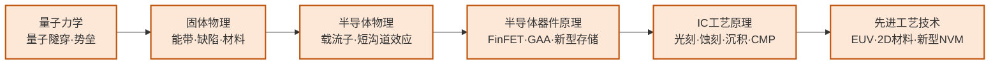

---
hide:
  - navigation
---
研究硅基半导体从材料到器件再到工艺的完整链条——从 FinFET、GAA 等先进晶体管结构，到 RRAM、PCM、FeRAM 等新型非易失存储器件，再到 EUV 光刻等量产工艺的物理极限挑战。

## 这个方向在研究什么

芯片制造的本质是一套极其精密的"印刷术"：把电路图案用光刻的方式转移到硅片上，再通过离子注入、薄膜沉积、化学蚀刻等数百道工序，在硅片上构建出三维的晶体管和金属连线结构。过去五十年，摩尔定律之所以成立，正是因为制程工程师每隔几年就能把光刻分辨率再提高一档，把晶体管尺寸再缩小一半。这条路走到今天，已经进入了几乎所有人在二十年前都认为不可能的物理尺度。

<svg viewBox="0 0 880 220" style="width:100%;max-width:860px;display:block;margin:1.5em auto;font-family:system-ui,-apple-system,sans-serif">
  <defs>
    <marker id="arr1" markerWidth="8" markerHeight="8" refX="6" refY="3" orient="auto">
      <path d="M0,0 L0,6 L8,3 z" fill="#64748B"/>
    </marker>
  </defs>
  <!-- Panel 1: 平面 MOSFET -->
  <rect x="10" y="10" width="270" height="200" rx="8" fill="#F8FAFC" stroke="#CBD5E1" stroke-width="1.5"/>
  <text x="145" y="32" text-anchor="middle" font-size="13" font-weight="700" fill="#1E293B">平面 MOSFET</text>
  <!-- Silicon body -->
  <rect x="40" y="100" width="200" height="60" rx="4" fill="#CBD5E1" stroke="#94A3B8" stroke-width="1.5"/>
  <text x="140" y="135" text-anchor="middle" font-size="11" fill="#475569">硅衬底</text>
  <!-- Gate oxide -->
  <rect x="80" y="84" width="120" height="16" rx="2" fill="#FED7AA" stroke="#D97706" stroke-width="1.5"/>
  <text x="140" y="96" text-anchor="middle" font-size="9" fill="#92400E">栅氧化层</text>
  <!-- Gate -->
  <rect x="80" y="60" width="120" height="24" rx="3" fill="#BFDBFE" stroke="#3B82F6" stroke-width="1.5"/>
  <text x="140" y="76" text-anchor="middle" font-size="11" font-weight="600" fill="#1E40AF">栅极</text>
  <!-- Era label -->
  <rect x="95" y="172" width="90" height="22" rx="4" fill="#FEE2E2" stroke="#EF4444" stroke-width="1"/>
  <text x="140" y="186" text-anchor="middle" font-size="11" font-weight="600" fill="#B91C1C">≥ 20 nm</text>
  <text x="145" y="207" text-anchor="middle" font-size="10" fill="#64748B">栅极只接触一面 → 漏电难控</text>
  <!-- Panel 2: FinFET -->
  <rect x="305" y="10" width="270" height="200" rx="8" fill="#F8FAFC" stroke="#CBD5E1" stroke-width="1.5"/>
  <text x="440" y="32" text-anchor="middle" font-size="13" font-weight="700" fill="#1E293B">FinFET（鳍式晶体管）</text>
  <!-- Fin -->
  <rect x="410" y="70" width="60" height="100" rx="3" fill="#CBD5E1" stroke="#94A3B8" stroke-width="1.5"/>
  <text x="440" y="128" text-anchor="middle" font-size="10" fill="#475569">硅鳍</text>
  <!-- Gate wrapping 3 sides -->
  <rect x="395" y="65" width="90" height="15" rx="2" fill="#BFDBFE" stroke="#3B82F6" stroke-width="1.5"/>
  <rect x="390" y="65" width="20" height="70" rx="2" fill="#BFDBFE" stroke="#3B82F6" stroke-width="1.5"/>
  <rect x="470" y="65" width="20" height="70" rx="2" fill="#BFDBFE" stroke="#3B82F6" stroke-width="1.5"/>
  <text x="440" y="76" text-anchor="middle" font-size="9" font-weight="600" fill="#1E40AF">栅极（三面包裹）</text>
  <!-- Substrate -->
  <rect x="360" y="170" width="160" height="25" rx="3" fill="#E2E8F0" stroke="#94A3B8" stroke-width="1"/>
  <text x="440" y="186" text-anchor="middle" font-size="10" fill="#475569">硅衬底</text>
  <!-- Era label -->
  <rect x="390" y="148" width="100" height="20" rx="4" fill="#FEF3C7" stroke="#D97706" stroke-width="1"/>
  <text x="440" y="161" text-anchor="middle" font-size="11" font-weight="600" fill="#92400E">7 – 3 nm</text>
  <text x="440" y="207" text-anchor="middle" font-size="10" fill="#64748B">三面包裹 → 更好控制</text>
  <!-- Panel 3: GAA -->
  <rect x="600" y="10" width="270" height="200" rx="8" fill="#F8FAFC" stroke="#CBD5E1" stroke-width="1.5"/>
  <text x="735" y="32" text-anchor="middle" font-size="13" font-weight="700" fill="#1E293B">GAA（全环绕栅）</text>
  <!-- Nanowire (horizontal) -->
  <rect x="660" y="102" width="150" height="26" rx="13" fill="#CBD5E1" stroke="#94A3B8" stroke-width="1.5"/>
  <text x="735" y="119" text-anchor="middle" font-size="10" fill="#475569">纳米线沟道</text>
  <!-- Gate surrounding nanowire (top, bottom, left, right) -->
  <rect x="650" y="92" width="170" height="10" rx="4" fill="#DCFCE7" stroke="#16A34A" stroke-width="1.5"/>
  <rect x="650" y="128" width="170" height="10" rx="4" fill="#DCFCE7" stroke="#16A34A" stroke-width="1.5"/>
  <rect x="645" y="88" width="15" height="54" rx="4" fill="#DCFCE7" stroke="#16A34A" stroke-width="1.5"/>
  <rect x="810" y="88" width="15" height="54" rx="4" fill="#DCFCE7" stroke="#16A34A" stroke-width="1.5"/>
  <text x="735" y="84" text-anchor="middle" font-size="9" font-weight="600" fill="#166534">栅极（四面全环绕）</text>
  <!-- Era label -->
  <rect x="685" y="155" width="100" height="20" rx="4" fill="#DCFCE7" stroke="#16A34A" stroke-width="1"/>
  <text x="735" y="168" text-anchor="middle" font-size="11" font-weight="600" fill="#166534">&lt; 2 nm</text>
  <text x="735" y="207" text-anchor="middle" font-size="10" fill="#64748B">四面全包 → 最优控制</text>
</svg>

今天最先进的量产工艺（台积电 N3、N2）里，晶体管的关键尺寸已经在 2 纳米量级，相当于十几个硅原子排列在一起的宽度。在这个尺度下，量子隧穿效应开始变得不可忽视——电子可以直接穿越本应阻断它的势垒，导致器件漏电。传统的平面 MOSFET 结构在这个尺度已经失效，工业界先后引入了 FinFET（鳍式晶体管）和更新的 GAA（全环绕栅，gate-all-around）结构，把栅极从一侧包裹晶体管延伸到四面包裹，从而更好地控制沟道。如何制造这些更复杂的三维结构，同时保证几十亿个晶体管里没有一个失效，是工艺研究的核心难题。EUV（极紫外光刻）用 13.5nm 波长的光——比之前的深紫外（193nm）短了十几倍，可以印刷更精细的图案，但光子数量有限，导致图形边缘随机起伏（stochastic effects）。研究者需要用统计模型量化这种随机性，通过工艺和设计协同优化把它的影响压制在可接受范围内。

新型存储器件是这个方向的另一核心主题，也是当前器件物理研究的最活跃领域之一。传统 DRAM 用一个晶体管和一个电容存储一位数据，随着尺寸缩小，电容越来越难制造、漏电越来越难抑制。新型非易失存储器试图从材料机制上绕开这些限制：相变存储器（PCM）利用材料在结晶态和非晶态之间的电阻差存储信息，非易失且读写速度接近 DRAM；磁阻存储器（MRAM）用磁化方向编码数据，写操作不依赖电荷积累，耐久性远超 Flash；阻变存储器（RRAM/ReRAM）的电阻值可以在连续范围内调节，天然适合模拟突触权重，是存算一体芯片的重要器件基础；铁电存储器（FeRAM/FeFET）利用铁电薄膜的极化翻转存储信息，具有非易失、高速、低功耗等优点。研究者在超净间里制备这些器件，测量其 I-V 特性、耐久性（反复读写后的退化）和保持性（数据能存多久不丢失），并用这些数据反过来指导材料优化和电路设计。

二维材料与后硅器件是更远期的研究前沿。以 MoS₂ 和 WSe₂ 为代表的过渡金属硫化物（TMD）拥有天然的原子级薄度（单层约 0.6nm），理论上可以彻底压制短沟道效应；石墨烯的载流子迁移率远超硅，但零带隙的缺陷限制了逻辑器件应用。如何在晶圆尺度上均匀生长这些材料，如何与 CMOS 工艺兼容集成，是学术界当前最活跃的攻关方向之一。复旦、清华的多个课题组已在实验室展示了基于 MoS₂ 的环绕栅晶体管和铁电存储器，进入了接近工业验证的阶段。

## 适合什么样的人

这个方向的日常工作有相当大一部分在超净间里完成：穿着洁净服在无尘环境下制备器件、操作电子束曝光机或 ALD 设备、用探针台测量 I-V 曲线和耐久性。如果你对亲手"造"出一个几十纳米尺度的器件并在显微镜下看到它工作有发自内心的兴奋感，这个方向的实验部分会让你享受其中。另一类研究者则更多停留在仿真端：用 Sentaurus TCAD 做器件仿真，用 MATLAB 写统计模型处理大量测试数据，这部分工作对编程能力有一定要求但不需要大量实验操作。

本科阶段修过半导体物理和固体物理是基本门槛——需要真正理解能带、载流子输运、PN 结这些概念，而不只是知道名词。量子力学不需要很深，但隧穿效应和势垒的物理图像需要清楚。器件物理课（MOSFET 的电流方程推导、短沟道效应的来源）是核心先修，如果没修过，研究生第一学期建议补上。

这个方向不太适合完全不愿意接触实验的同学。即便走仿真路线，论文评审者通常也期待有实验验证数据来支撑仿真结论。此外，器件研究的迭代周期比软件长得多——一轮工艺流程跑下来可能需要数周，实验失败后从头重来是常态，需要有耐心和系统性的实验规划能力。对"快速出结果"有强烈需求的同学可能会在这个节奏下感到沮丧。

## 核心研究问题

- **EUV 随机效应**：极紫外光源光子数量有限，导致图形边缘随机变化，如何通过工艺和设计协同优化来控制？
- **GAA/CFET 结构**：环绕栅晶体管是 3nm 以下主流方案，CFET（N/P 垂直堆叠）是下一步，如何解决寄生电容和制造难题？
- **新型存储器件**：RRAM/PCM/FeRAM 如何在速度、功耗、耐久性、保持性之间取得最优平衡？器件变异性如何在材料层面改善？
- **二维材料集成**：MoS₂ 等 TMD 材料如何实现晶圆级均匀生长并与 CMOS 后端工艺兼容集成？

## 代表性机构

| | 国际 | 国内 |
|--|------|------|
| **企业** | TSMC、Samsung、Intel、ASML、Micron | 中芯国际、华虹、长江存储、长鑫存储 |
| **顶会** | IEDM · VLSI Symposium · TED · EDL · IMW | — |

## 知识路径

图中节点对应以下知识板块（按需选修）：

- [物理基础](../课程资源/物理/index.md)（量子力学·固体物理·半导体物理）
- [器件与工艺](../课程资源/器件与工艺/index.md)（器件原理·IC工艺·先进工艺技术）

## 入门三步走

**典型研究长什么样**

IEDM 顶会论文的典型范式是：在超净间里制备出一批新型器件（例如 GAA 纳米片晶体管或新型 RRAM），测量 I-V 特性、耐久性（endurance）和数据保持时间（retention），关键图表是器件参数分布和阵列良率统计。核心判断指标因器件类型而异——逻辑器件看亚阈值摆幅（SS）和 DIBL，存储器件看循环次数（10⁵～10¹⁰次）和保持时间（通常外推到 10 年）。大多数学术工作不需要完整流片，做的是关键工艺模块验证；结论格式通常是"展示了创新结构 X 在指标 Y 上相比基准提升 Z%，物理机制由 TCAD 仿真和 TEM 表征共同确认"。

**第一步：了解产业地图**  
阅读 WikiChip 网站（wikichip.org）对 TSMC N3/N2 工艺节点的技术分析，以及 SemiAnalysis 博客对先进制程竞争的深度报道——这两个免费资源是业界最高质量的技术科普。

**第二步：理解器件物理**  
Mark Lundstrom 在 nanoHUB 的课程（nanohub.org/courses/ECE606）从量子力学出发推导现代器件工作原理，是该方向最严格的入门资料。

**第三步：了解新型存储器**  
阅读综述 Wong & Salahuddin, *Memory leads the way to better computing* (Nature Nanotechnology, 2015)，梳理各类新型存储器的对比，再结合 IEDM 近年关于新型 NVM 器件的最新进展。

## 相关课题组

### 境内

-   **[黄如](https://ic.pku.edu.cn/szdw/ysfc/hr/index.htm)** 北大 

    GAA 器件 · 铁电存储器 · 低功耗逻辑/存储器件

-   **[张兴](https://ic.pku.edu.cn/szdw/zzjs/jcwndzx1/zx/index.htm)** 北大

    先进 CMOS 工艺 · FinFET/GAAFET 结构 · 低功耗逻辑器件

-   **[康晋锋](https://ic.pku.edu.cn/szdw/zzjs/K1/kjf/index.htm)** 北大

    半导体工艺可靠性 · 高κ/金属栅器件失效机制

-   **[张卫](https://sme.fudan.edu.cn/60/d4/c31133a352468/page.htm)** 复旦

    半导体器件与工艺研发 · 新型晶体管结构

-   **[孙清清](https://sme.fudan.edu.cn/60/20/c31153a352288/page.htm)** 复旦

    先进 IC 工艺（ALD、Cu 互联） · 二维半导体晶圆级集成

-   **[包文中](https://sme.fudan.edu.cn/60/be/c31153a352510/page.htm)** 复旦

    晶圆级二维半导体生长 · 逻辑/存储/RF 多应用集成

-   **[刘明](https://fics.fudan.edu.cn/36/80/c22618a276096/page.htm)** 复旦 

    新型非易失存储器 · 存储器件物理 · 高密度集成

-   **[刘春森](https://fics.fudan.edu.cn/b3/35/c22620a242485/page.htm)** 复旦

    超快 NVM 器件 · 二维闪存 · 新型存储材料

-   **[王水源](https://sme.fudan.edu.cn/60/b6/c31153a352502/page.htm)** 复旦

    高性能二维晶体管 · 铁电存储器件 · 新型半导体器件

-   **[任天令](https://www.sic.tsinghua.edu.cn/info/1033/1545.htm)** 清华

    二维材料器件与工艺 · NEMS 传感器 · 柔性电子集成

-   **[田禾](https://www.sic.tsinghua.edu.cn/info/1035/1553.htm)** 清华

    二维半导体晶体管工艺 · MoS₂/WSe₂ 先进集成

-   **[赵超](https://semi.cas.cn/rcdw/yjyjrc/rc_gtgd/202310/t20231010_6892274.html)** 中科院

    III-V/Si 异质外延 · 高性能 III-V 激光器 · 新型半导体

-   **[吴华强](https://www.sic.tsinghua.edu.cn/info/1015/1787.htm)** 清华

    忆阻器存算一体 · 新型存储器件 · 神经形态芯片

-   **[唐建石](https://www.ime.tsinghua.edu.cn/info/1035/1595.htm)** 清华

    新型存储器与类脑计算 · 单片三维异质集成 · 碳基电子学

-   **[蔡一茂](https://ic.pku.edu.cn/szdw/zzjs/jcwndzx1/cym/index.htm)** 北大

    高密度高可靠 RRAM · 存算一体智能芯片 · 神经形态器件

-   **[周鹏](https://sme.fudan.edu.cn/60/68/c31158a352360/page.htm)** 复旦

    二维半导体器件 · CMOS 兼容非易失存储 · 二维-硅异构集成

-   **[陈琳](https://sme.fudan.edu.cn/5f/c3/c31133a352195/page.htm)** 复旦

    新型存储器与存算一体 · 集成电路新原理器件 · 三维集成互连

-   **[蒋玉龙](https://icmne.fudan.edu.cn/2d/1f/c48925a732447/page.htm)** 复旦

    集成电路先进工艺与器件 · MOS 源漏栅接触技术 · 先进铜互连

<button class="prof-show-all">显示全部 ↓</button>

### 境外

-   **[Mansun Chan（陈文新）](https://ece.hkust.edu.hk/mchan)** 港科大

    先进半导体器件（CFET、2nm 以下） · 2D 材料器件 · BSIM SPICE 模型

-   **[Tsu-Jae King Liu](https://people.eecs.berkeley.edu/~tking/)** UC Berkeley 

    FinFET 器件 · 新型逻辑/存储器件 · MEMS/NEMS

-   **[Mark Lundstrom](https://engineering.purdue.edu/ECE/People/ptProfile?resource_id=3140)** Purdue

    纳米尺度晶体管物理 · MOSFET 缩放极限 · 计算电子学

-   **[H.-S. Philip Wong](https://web.stanford.edu/~hspwong/)** Stanford

    新型非易失存储器（PCM/RRAM） · 2D 材料器件 · 单片 3D IC

-   **[Shimeng Yu](https://shimeng.ece.gatech.edu)** Georgia Tech

    RRAM/FeFET 新型存储器件 · 器件物理与可靠性建模

<button class="prof-show-all">显示全部 ↓</button>
