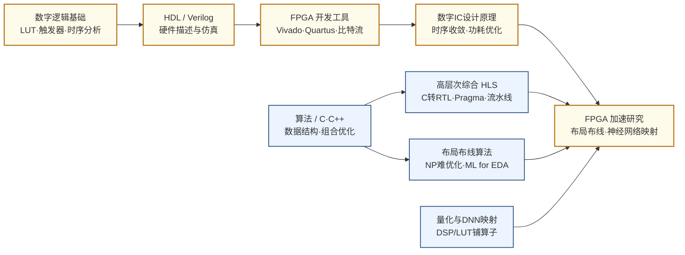

---
hide:
  - navigation
---
在软件的灵活性和专用硬件的性能之间寻找最优平衡——FPGA 既是芯片设计的验证平台，也是数据中心和边缘计算的可编程加速器，而可重构计算研究的是如何让这套机制更高效、更智能。

## 这个方向在研究什么

芯片世界里有一个持续存在的矛盾：通用处理器（CPU/GPU）可以运行任意代码，但对特定任务来说效率低下；专用芯片（ASIC）能在该任务上达到极致性能，但流片一次需要数月和数百万美元，而且功能固定、无法修改。FPGA（Field-Programmable Gate Array，现场可编程门阵列）是这两者之间的选项——它是一块出厂后可以反复"重新编程"的硬件，通过配置内部的逻辑单元和连线，让同一块芯片今天跑图像处理、明天跑加密算法、后天跑神经网络推理。

<svg viewBox="0 0 860 220" xmlns="http://www.w3.org/2000/svg" style="width:100%;max-width:860px;display:block;margin:1.2em auto;">
  <!-- Background panel -->
  <rect x="10" y="10" width="840" height="200" rx="10" fill="#F8FAFC" stroke="#CBD5E1" stroke-width="1.5"/>
  <!-- Triangle vertices (centered around x=430):
       CPU: top-left  (200, 50)
       ASIC: top-right (660, 50)
       FPGA: bottom   (430, 185) -->
  <!-- Triangle edges (dotted) -->
  <line x1="200" y1="55" x2="660" y2="55" stroke="#94A3B8" stroke-width="1.8" stroke-dasharray="8,5"/>
  <line x1="200" y1="55" x2="430" y2="180" stroke="#94A3B8" stroke-width="1.8" stroke-dasharray="8,5"/>
  <line x1="660" y1="55" x2="430" y2="180" stroke="#94A3B8" stroke-width="1.8" stroke-dasharray="8,5"/>
  <!-- CPU corner (blue) -->
  <rect x="100" y="26" width="130" height="56" rx="8" fill="#DBEAFE" stroke="#3B82F6" stroke-width="2"/>
  <text x="165" y="48" text-anchor="middle" font-size="13" font-weight="bold" fill="#1D4ED8" font-family="sans-serif">CPU</text>
  <text x="165" y="64" text-anchor="middle" font-size="10.5" fill="#3B82F6" font-family="sans-serif">最灵活 / 最低效</text>
  <!-- ASIC corner (green) -->
  <rect x="630" y="26" width="130" height="56" rx="8" fill="#DCFCE7" stroke="#16A34A" stroke-width="2"/>
  <text x="695" y="48" text-anchor="middle" font-size="13" font-weight="bold" fill="#166534" font-family="sans-serif">ASIC</text>
  <text x="695" y="64" text-anchor="middle" font-size="10.5" fill="#16A34A" font-family="sans-serif">最高效 / 不可修改</text>
  <!-- FPGA corner (amber) -->
  <rect x="348" y="158" width="164" height="50" rx="8" fill="#FEF3C7" stroke="#D97706" stroke-width="2"/>
  <text x="430" y="178" text-anchor="middle" font-size="13" font-weight="bold" fill="#92400E" font-family="sans-serif">FPGA</text>
  <text x="430" y="196" text-anchor="middle" font-size="10.5" fill="#D97706" font-family="sans-serif">可重构 / 中间地带</text>
  <!-- Center label: FPGA 研究空间 -->
  <text x="430" y="100" text-anchor="middle" font-size="12" fill="#64748B" font-family="sans-serif" font-style="italic">FPGA 研究空间</text>
  <!-- Sub-labels below -->
  <text x="430" y="118" text-anchor="middle" font-size="10.5" fill="#94A3B8" font-family="sans-serif">数据中心加速 · AI推理 · 原型验证</text>
</svg>

FPGA 的内部结构是一张由可编程逻辑单元（CLB/LUT）和可编程连线（routing fabric）织成的网格。一个典型的高端 FPGA（如 Xilinx Ultrascale+）有数百万个查找表（LUT），加上硬化的 DSP 模块、BRAM、串行收发器和 HBM 内存接口，整个芯片就像一张等待配置的空白画布。配置这张画布的过程和芯片设计很像——工程师用 Verilog/VHDL 描述电路，经过综合、布局、布线生成比特流文件，下载进 FPGA 即可运行。这让 FPGA 成为新芯片架构研究的首选原型平台：一个在仿真器里验证了三个月的处理器设计，可以在两周内在 FPGA 上跑起来，以接近真实芯片的速度做端到端系统测试。

FPGA 最大的性能瓶颈不在逻辑，而在连线。一块 FPGA 上，面积的 70-80% 是可编程路由资源，而这些资源的使用效率远低于 ASIC——信号要经过多个多路选择器和缓冲才能到达目的地。布局布线（Place-and-Route, P&R）算法决定哪个逻辑单元放在哪里、连线走哪条路，这是 FPGA CAD 的核心问题，也是 NP 难的组合优化问题。工业界用的 P&R 工具（Vivado、Quartus Prime）背后是数十年积累的启发式算法，但随着设计规模扩大，时序收敛越来越困难——一个大型设计可能需要跑几十小时的 P&R 才能满足时序，而且结果还受随机种子影响。学术界的标杆开源工具是多伦多大学开发的 VTR（Verilog to Routing），提供了完整的 FPGA 编译流程，是研究新算法的实验平台。

高层次综合（High-Level Synthesis, HLS）是这个方向近年最活跃的研究分支。HLS 的目标是让设计者用 C/C++/Python 描述算法，由工具自动生成对应的 RTL 代码，从而大幅缩短硬件开发周期。Xilinx（现 AMD）的 Vitis HLS 和开源的 LLHD/Calyx 是代表性工具。然而 HLS 生成的 RTL 质量与手写 RTL 之间仍有显著差距——典型情况下，HLS 生成代码的时钟频率比手写低 20-50%，面积也更大，因为工具在做循环展开、流水线插入、存储器划分等决策时需要大量人工 pragma 指导，而这些决策的设计空间是指数级的。机器学习驱动的 HLS 优化（预测最优 pragma 配置、自动插入流水线）是当前热点，多伦多大学、UCLA 的团队在这个方向上非常活跃。

在应用层面，数据中心是 FPGA 最重要的新战场。Microsoft 的 Project Catapult 把 FPGA 部署在服务器机架内，用于加速 Bing 搜索的网页排名算法，后来扩展到 Azure 的网络功能加速（SmartNIC）。AWS EC2 F1 实例让用户可以租用云端 FPGA 资源。Intel 收购 Altera 后，把 FPGA 和 Xeon CPU 集成在同一封装里（FPGA as co-processor）。AI 推理是另一个重要场景：相比 GPU，FPGA 的优势在于低延迟（毫秒以下）、低功耗和灵活的精度支持（4-bit 甚至 2-bit 量化），这让它在边缘推理场景——自动驾驶、工业视觉、无线基站处理——占据独特地位。研究者面临的核心问题是：如何让神经网络的各层算子高效映射到 FPGA 的 DSP 和 LUT 上，同时最大化数据局部性、最小化片外内存访问。

### 核心研究问题

- **灵活性 vs 效率**：FPGA 卡在 CPU 的可编程性与 ASIC 的极致性能之间，可重构带来的路由开销让面积的 70-80% 都耗在连线上——如何在保留可重构能力的同时把这部分效率损失压到最小？
- **布局布线（Place-and-Route）**：把逻辑摆到哪个单元、信号走哪条线，是一个 NP 难的组合优化问题，大型设计动辄要跑几十小时还受随机种子影响，如何用新启发式或机器学习同时加速时序收敛、降低结果方差？
- **HLS 质量差距**：用 C/C++ 描述算法自动生成 RTL，能大幅缩短开发周期，但生成代码的时钟频率比手写低 20-50%、面积更大——循环展开、流水线插入、存储划分的 pragma 设计空间是指数级的，如何让工具（而非人工堆 pragma）自动逼近手写质量？
- **神经网络映射**：把量化后（4-bit 甚至 2-bit）的 DNN 各层算子高效铺到 FPGA 的 DSP/LUT/BRAM 上，最大化数据局部性、最小化片外内存访问，是低延迟边缘推理能否打过 GPU 的关键。
- **数据中心与运行时可重构**：从 Catapult、Azure SmartNIC 到 AWS F1，FPGA 进了机架就要面对多租户与动态负载——部分重构（Partial Reconfiguration）如何在运行时调度多个加速器，把"可重构"从编译期能力变成真正的运行时灵活性？

### 知识路径

图中节点对应以下知识板块（按需选修）：

- [电路 · 数字方向（数字逻辑·数字IC设计·FPGA）](../学习地图/电路/数字/index.md)（节点 A·C·D）
- [硬件描述语言 HDL（Verilog·HLS）](../学习地图/电路/硬件描述语言(HDL)/index.md)（节点 B·G）
- [算法编程 · 数据结构与算法（组合优化）](../学习地图/算法编程/数据结构与算法/index.md)（节点 F·H，布局布线的优化底座）
- [系统架构 · 编译原理](../学习地图/系统架构/编译原理/index.md)（HLS / 比特流生成的编译视角）
- [人工智能](../学习地图/人工智能/index.md)（节点 I：DNN 量化与 FPGA 映射）

## 这个方向适合谁

这个方向最适合那种"写完就想下板"的人——比起停在仿真波形里反复看时序图，你更想把比特流灌进真实硬件、按真实时钟跑端到端系统。FPGA 的魅力正在于此：一块出厂后能反复重配的空白画布，一个架构改动几小时就能在硬件上看到结果，研究成本远低于动辄数月、数百万美元的 ASIC 流片。如果你在数字电路或计组课上做过 FPGA 实验，跑通之后还忍不住想"再抠一抠时序"，那这个方向几乎是为你量身定制的。

本科背景上，数字电路、Verilog/VHDL 是硬性门槛，因为无论做加速器还是改 CAD 流程，你都得读得懂、写得出 RTL。在此之上，方向其实分叉成几条很不一样的路：偏软的人可以从 C/C++ 直接切进 HLS，研究怎么让工具自动逼近手写 RTL 的质量，这一支和编译、机器学习走得很近；喜欢算法的人会爱上布局布线——P&R 是一个工程约束极其明确、又货真价实的 NP 难组合优化问题，组合优化、强化学习、ML for EDA 在这里都有用武之地；而想做系统的人则可以钻数据中心 FPGA 与神经网络映射，把量化后的 DNN 算子高效铺到 DSP/LUT 上。换句话说，这个方向能同时容纳硬件、算法和系统三种口味的人。

发表节奏上，这个方向的现实相当友好。它有自己成建制的社区——FPGA、FCCM、FPL、FPT 是大本营，DAC/ICCAD 也常收 FPGA CAD 与 HLS 的工作。相比体系结构顶会动辄一年磨一篇的节奏，FPGA 系顶会的周期更紧凑，加上有 VTR、Vitis HLS、AWS F1 这些成熟的开源/云上平台兜底，一个想法往往能在一年内走完从原型到投稿的完整循环，对刚入门、需要正反馈的同学非常重要。

还有一点国内学生该认真考虑：FPGA 是少数学术研究与本土产业紧密咬合的方向。复旦微电子、安路科技、高云半导体都在做自主 FPGA 芯片，清华、复旦、上交、浙大的课题组也常与产业直接合作。这意味着你的研究不只是论文，往往有相对清晰的落地出口——无论是想读博深耕，还是想毕业进工业界做芯片或编译工具链，这个方向都给你留了门。

## 学术界

### 课题组

**境内**

-   **[尹首一](https://www.sic.tsinghua.edu.cn/info/1040/1567.htm) & [魏少军](https://www.sic.tsinghua.edu.cn/en/info/1083/1444.htm)** 清华

    软件定义芯片 · 可重构计算架构 · 神经网络加速器（Thinker）· VLSI 设计方法学

-   **[刘雷波](https://www.sic.tsinghua.edu.cn/info/1014/1807.htm)** 清华

    软件定义芯片架构 · 密码处理器 · 可重构计算系统

-   **[梁云（Eric Liang）](https://ericlyun.me/)** 北大

    FPGA HLS 编译优化 · 硬件软件协同设计 · 神经网络加速

-   **[王伶俐](https://sme.fudan.edu.cn/60/3c/c31133a352316/page.htm)** 复旦

    FPGA 结构研究 · 抗辐射 FPGA · 安全可编程计算

-   **[王堃](https://sme.fudan.edu.cn/60/2f/c31155a352303/page.htm)** 复旦

    FPGA 编译器设计 · 电路 EDA · 硬件-软件协同设计

-   **[曾璇](https://asic-skl.fudan.edu.cn/d2/0c/c29516a315916/page.htm)** 复旦 

    模拟电路 EDA · ML 辅助 IC 设计自动化 · FPGA 流程

-   **[戴国浩](https://nicsefc.ee.tsinghua.edu.cn/people/GuohaoDai)** 交大

    稀疏计算软硬件协同 · LLM 推理加速器（FlightLLM） · FPGA/GPU 异构

-   **[张宸](https://chenzhangsjtu.github.io/)** 交大

    FPGA 深度学习加速器 · AI 处理器架构 · FPGA 可重构计算名人堂

-   **[赵杰茹](https://zjru.github.io/)** 交大 

    高层次综合 HLS（COMBA） · 可重构计算与 EDA · 软硬件协同 AI 加速

-   **[王则可（Zeke Wang）](https://wangzeke.github.io/)** 浙大

    FPGA 加速器 · FPGA SmartNIC（FpgaNIC） · 超异构计算平台

-   **[卢丽强（Liqiang Lu）](https://person.zju.edu.cn/liqianglu)** 浙大

    FPGA 稀疏神经网络加速器（SpWA/Speedy） · 张量加速与软硬件协同 · 体系结构与 EDA

-   **[周学海](https://cs.ustc.edu.cn/2020/0827/c23235a460092/page.htm)** 中科大

    可重构系统 · 面向特定应用的硬件加速 · 异构多核体系结构

-   **[王超](https://faculty.ustc.edu.cn/cswang/zh_CN/index.htm)** 中科大

    FPGA 可重构计算 · 智能处理器 · 深度学习加速系统

-   **[李丽](https://ese.nju.edu.cn/74/10/c22629a357392/page.psp)** 南大 

    可重构计算 · 多/众核处理芯片体系结构 · 三维片上网络（3D NoC）

-   **[娄鑫](https://sist.shanghaitech.edu.cn/louxin/main.htm)** 上科大

    数字 VLSI 设计 · 可重构滤波器与 DSP · 三维视觉/渲染芯片

<button class="prof-show-all">显示全部 ↓</button>

**境外**

-   **[Wei Zhang（张薇）](https://ece.hkust.edu.hk/eeweiz)** 港科大 

    FPGA 敏捷设计 · 硬件-软件协同设计 · DNN FPGA 加速

-   **[Hayden Kwok-Hay So（蘇國曦）](https://www.eee.hku.hk/~hso/)** 港大

    异构可重构计算 · FPGA Overlay · 事件驱动视觉处理

-   **[Vaughn Betz](https://www.eecg.utoronto.ca/~vaughn/)** U Toronto

    FPGA 架构与 CAD · VPR/VTR 开源工具 · 布局布线算法

-   **[Jason Anderson](https://www.ece.utoronto.ca/people/anderson-j-h/)** U Toronto

    FPGA 架构设计 · HLS · FPGA 物理设计自动化

-   **[Deming Chen（陈德铭）](https://dchen.ece.illinois.edu/)** UIUC

    FPGA HLS · ML for EDA · 神经网络 FPGA 加速

-   **[Jason Cong（丛京生）](https://vast.cs.ucla.edu/people/faculty/jason-cong)** UCLA

    FPGA 设计自动化 · HLS · 领域专用计算

-   **[Zhiru Zhang（张志汝）](https://zhang.ece.cornell.edu/)** Cornell

    高层次综合 HLS · FPGA 加速器自动生成 · 硬件-算法协同优化

-   **[Mohamed Abdelfattah](https://www.abdelfattah-lab.com/)** Cornell

    FPGA 架构与 LLM 加速 · 神经网络 FPGA 映射 · HLS 自动化

-   **[Cong Hao（郝聪）](https://haocong.ece.gatech.edu/)** Georgia Tech 

    FPGA 神经网络加速 · ML for EDA · 高效 DNN 硬件映射

-   **[Peipei Zhou（周佩佩）](https://peipeizhou-eecs.github.io/)** Brown 

    定制化体系结构 · HLS 与 FPGA · AMD Versal ACAP 异构加速

-   **[Lana Josipović](https://dynamo.ethz.ch/)** ETH Zürich 

    动态调度 HLS（Dynamatic） · 数据流电路综合 · 编译器-硬件协同

-   **[Andre DeHon](https://www.seas.upenn.edu/faculty-directory/andre-dehon/)** U Penn

    空间计算与可重构架构 · FPGA 互连 · 硬件安全

<button class="prof-show-all">显示全部 ↓</button>

### 学术会议与期刊

  
会议
    FPGA
    FCCM
    FPL
    DAC
    ICCAD
    MICRO
    ASPLOS
  

  
期刊
    IEEE TCAD
    IEEE TVLSI
    ACM TRETS
    IEEE TC
  

## 毕业去向

### 企业

  
国内
    <a href="https://www.fmsh.com/">复旦微电子（FMSH）</a>
    <a href="https://www.anlogic.com/">安路科技 Anlogic</a>
    <a class="dm-chip" href="https://www.gowinsemi.com/">高云半导体 Gowin</a>
    <a class="dm-chip" href="https://hercules-micro.com/">京微齐力 Hercules</a>
    <a class="dm-chip" href="https://www.pangomicro.com/">紫光同创 Pango</a>
  

  
国外
    <a href="https://www.amd.com/">AMD（原 Xilinx）</a>
    <a class="dm-chip" href="https://www.altera.com/">Altera</a>
    <a href="https://www.latticesemi.com/">Lattice Semiconductor</a>
    <a class="dm-chip" href="https://www.achronix.com/">Achronix</a>
    <a href="https://www.quicklogic.com/">QuickLogic</a>
    <a href="https://www.microsoft.com/">Microsoft</a>
    <a href="https://aws.amazon.com/ec2/instance-types/f1/">AWS（Amazon）</a>
  

### 科研院所

  
国内
    <a class="dm-chip" href="http://www.ict.ac.cn/" title="可重构计算与领域专用加速器">中科院计算所</a>
    <a class="dm-chip" href="https://www.zhejianglab.org/" title="智能计算与可重构异构加速平台">之江实验室</a>
    <a class="dm-chip" href="https://www.pcl.ac.cn/" title="大规模算力与可重构加速基础设施">鹏城实验室</a>
  

  
国外
    <a class="dm-chip" href="https://verilogtorouting.org/" title="开源 FPGA 架构与 CAD 研究平台（VPR 布局布线）">Verilog-to-Routing（VTR，多伦多大学主导）</a>
    <a class="dm-chip" href="https://www.microsoft.com/en-us/research/project/project-catapult/" title="数据中心 FPGA 加速架构">Microsoft Research（Project Catapult）</a>
    <a class="dm-chip" href="https://vast.cs.ucla.edu/" title="HLS 与 FPGA 设计自动化">UCLA VAST 实验室</a>
  

