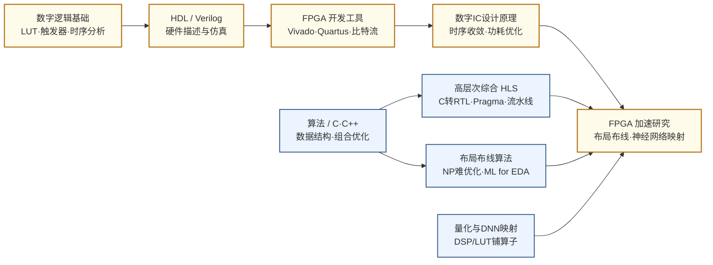

---
hide:
  - navigation
---
在软件的灵活性和专用硬件的性能之间寻找最优平衡——FPGA 既是芯片设计的验证平台，也是数据中心和边缘计算的可编程加速器，而可重构计算研究的是如何让这套机制更高效、更易用。

## 这个方向在研究什么

一支芯片团队设计出一种新的处理器架构，在仿真器里跑了三个月，确信逻辑没错，可要真正验证它在硬件上的表现，按常规就得流片——等上几个月，花掉几百万元，一旦做错还得全部推倒重来。但他们还有另一条路：把这套设计灌进一块 FPGA，不过两周，新架构就以接近真实芯片的速度在板子上跑了起来。

<svg viewBox="0 0 680 500" xmlns="http://www.w3.org/2000/svg" role="img" style="width:100%;max-width:680px;display:block;margin:1.5rem auto;" font-family="'Noto Sans CJK SC','PingFang SC','Microsoft YaHei',-apple-system,sans-serif">
  <title>灵活性（硬件可重构）vs 性能/能效</title>
  <desc>二维散点：横轴性能/能效，纵轴硬件可重构灵活性。CPU、DSP、FPGA、ASIC 各为一点；FPGA 灵活性最高，ASIC 性能最高、灵活性最低。</desc>
  <defs>
    <marker id="ah" markerWidth="9" markerHeight="9" refX="7" refY="3" orient="auto"><path d="M0,0 L7,3 L0,6 Z" fill="#9c9a92"/></marker>
  </defs>
  <rect x="0" y="0" width="680" height="500" rx="14" fill="#ffffff"/>
  <text x="40" y="40" font-size="17" font-weight="500" fill="#1f1f1d">灵活性（按硬件可重构）⇄ 性能 / 能效</text>
  <!-- axes -->
  <line x1="120" y1="400" x2="120" y2="80" stroke="#9c9a92" stroke-width="1" marker-end="url(#ah)"/>
  <line x1="120" y1="400" x2="640" y2="400" stroke="#9c9a92" stroke-width="1" marker-end="url(#ah)"/>
  <text transform="translate(70,250) rotate(-90)" font-size="13" fill="#3d3d3a" text-anchor="middle">灵活性 / 硬件可重构性 →</text>
  <text x="640" y="425" font-size="13" fill="#3d3d3a" text-anchor="end">性能 / 能效 →</text>
  <text x="112" y="95" font-size="11" fill="#9c9a92" text-anchor="end">高</text>
  <text x="112" y="398" font-size="11" fill="#9c9a92" text-anchor="end">低</text>
  <!-- classic inverse trend (excludes FPGA) -->
  <path d="M165 150 C 300 205, 390 255, 560 350" fill="none" stroke="#c8c6bf" stroke-width="1.6" stroke-dasharray="5 5"/>
  <text x="455" y="300" font-size="11.5" fill="#a7a59d" transform="rotate(20 455 300)">传统反相关趋势</text>
  <!-- points -->
  <circle cx="165" cy="150" r="6" fill="#378ADD"/>
  <text x="178" y="146" font-size="14" font-weight="500" fill="#1f1f1d">CPU / GPP</text>
  <text x="178" y="163" font-size="11" fill="#73726c">软件最通用、能效最低</text>
  <circle cx="275" cy="208" r="6" fill="#1D9E75"/>
  <text x="288" y="204" font-size="14" font-weight="500" fill="#1f1f1d">DSP</text>
  <text x="288" y="221" font-size="11" fill="#73726c">可编程、面向信号处理</text>
  <circle cx="372" cy="116" r="7.5" fill="#D85A30"/>
  <circle cx="372" cy="116" r="12" fill="none" stroke="#D85A30" stroke-width="1.2" opacity="0.5"/>
  <text x="388" y="112" font-size="14" font-weight="600" fill="#1f1f1d">FPGA</text>
  <text x="388" y="129" font-size="11" fill="#73726c">可重构硬件，灵活性最高</text>
  <circle cx="565" cy="350" r="6" fill="#7F77DD"/>
  <text x="555" y="345" font-size="14" font-weight="500" fill="#1f1f1d" text-anchor="end">ASIC</text>
  <text x="555" y="362" font-size="11" fill="#73726c" text-anchor="end">定制固定，性能/能效最高</text>
  <!-- annotation for FPGA off-trend -->
  <text x="120" y="455" font-size="12" fill="#3d3d3a">注：FPGA 位于趋势线上方——在不大幅牺牲性能的前提下保留高可重构性，</text>
  <text x="120" y="473" font-size="12" fill="#3d3d3a">这正是它作为"可重构硬件"的价值所在。纵轴为定性相对值，无绝对刻度。</text>
</svg>

这块芯片之所以能做到，是因为它出厂时本是一张空白的画布。通用处理器（CPU、GPU）什么代码都能跑，可为了通用，效率注定上不去；专用芯片（ASIC）把电路为某个任务焊死，性能做到极致，代价却是功能再难改动，重新流片一次又动辄数月，耗费数百万元。FPGA，也就是现场可编程门阵列，正卡在这两极中间：它是一块出厂后还能反复重画的硬件，重新配置内部的逻辑单元和连线，同一块芯片就能今天跑图像处理、明天跑加密、后天跑神经网络推理。这份"还能改"的自由极其诱人，却从来不是免费的。

这份自由的代价，写在 FPGA 的骨子里。要让一块芯片能实现任意逻辑、把任意两点连起来，它就得把大量硅片面积留给"可配置"本身。FPGA 的内部是一张网格，密密麻麻铺着可编程的查找表（LUT）和可编程的连线。查找表是个有意思的东西。它不像加法器、乘法器那样真去做运算，而是预先把每种输入对应的结果填进一张小表，用时直接查表取数，说白了是"背答案"，不是"算答案"。改写表里存的内容，同一块硬件就能算出任意逻辑。可这份"什么都能配"的自由不是白来的：真正干活的逻辑只占一小块，**面积和延迟的一半以上都耗在那些可编程的连线和开关上**——信号从一个逻辑单元走到另一个，要穿过一长串多路选择器和缓冲器。代价有多大？只用查找表去拼，同一个电路在 FPGA 上平均比 ASIC **大三十多倍、慢四倍**；用上后面会讲到的那些专用硬块，差距能收窄到十倍上下，但终究矮一截。

<svg viewBox="0 0 820 330" xmlns="http://www.w3.org/2000/svg" style="width:100%;max-width:820px;display:block;margin:1.5rem auto;">
  <defs>
    <marker id="lutArr" markerWidth="8" markerHeight="8" refX="6" refY="3" orient="auto"><path d="M0,0 L0,6 L8,3 z" fill="#475569"/></marker>
  </defs>
  <rect width="820" height="330" rx="10" fill="#F8FAFC" stroke="#CBD5E1" stroke-width="1.5"/>
  <text x="410" y="28" text-anchor="middle" font-size="13" font-weight="bold" fill="#1E293B">查找表（LUT）：一块「能查任意真值表」的硬件</text>
  <text x="120" y="64" text-anchor="middle" font-size="10.5" fill="#9A3412">配置 SRAM（开机写入）</text>
  <text x="74" y="84" text-anchor="end" font-size="9" fill="#64748B">地址 ab</text>
  <rect x="92" y="76" width="56" height="30" rx="4" fill="#FEF3C7" stroke="#D97706" stroke-width="1.4"/>
  <text x="120" y="96" text-anchor="middle" font-size="13" font-weight="bold" fill="#92400E">0</text>
  <text x="84" y="96" text-anchor="end" font-size="9.5" fill="#64748B">00</text>
  <rect x="92" y="112" width="56" height="30" rx="4" fill="#FEF3C7" stroke="#D97706" stroke-width="1.4"/>
  <text x="120" y="132" text-anchor="middle" font-size="13" font-weight="bold" fill="#92400E">1</text>
  <text x="84" y="132" text-anchor="end" font-size="9.5" fill="#64748B">01</text>
  <rect x="92" y="148" width="56" height="30" rx="4" fill="#DBEAFE" stroke="#1D4ED8" stroke-width="2"/>
  <text x="120" y="168" text-anchor="middle" font-size="13" font-weight="bold" fill="#1E40AF">1</text>
  <text x="84" y="168" text-anchor="end" font-size="9.5" fill="#1E40AF">10</text>
  <rect x="92" y="184" width="56" height="30" rx="4" fill="#FEF3C7" stroke="#D97706" stroke-width="1.4"/>
  <text x="120" y="204" text-anchor="middle" font-size="13" font-weight="bold" fill="#92400E">0</text>
  <text x="84" y="204" text-anchor="end" font-size="9.5" fill="#64748B">11</text>
  <line x1="148" y1="91" x2="300" y2="96" stroke="#475569" stroke-width="1.3"/>
  <line x1="148" y1="127" x2="300" y2="120" stroke="#475569" stroke-width="1.3"/>
  <line x1="148" y1="163" x2="300" y2="150" stroke="#1D4ED8" stroke-width="2"/>
  <line x1="148" y1="199" x2="300" y2="174" stroke="#475569" stroke-width="1.3"/>
  <polygon points="300,80 300,190 360,160 360,110" fill="#E2E8F0" stroke="#475569" stroke-width="1.6"/>
  <text x="326" y="139" text-anchor="middle" font-size="11" font-weight="bold" fill="#334155">MUX</text>
  <line x1="318" y1="208" x2="318" y2="178" stroke="#475569" stroke-width="1.3" marker-end="url(#lutArr)"/>
  <line x1="342" y1="208" x2="342" y2="166" stroke="#475569" stroke-width="1.3" marker-end="url(#lutArr)"/>
  <text x="330" y="224" text-anchor="middle" font-size="10" fill="#334155">输入 a、b（当地址）</text>
  <line x1="360" y1="135" x2="424" y2="135" stroke="#1D4ED8" stroke-width="2" marker-end="url(#lutArr)"/>
  <rect x="426" y="120" width="34" height="30" rx="4" fill="#DBEAFE" stroke="#1D4ED8" stroke-width="1.6"/>
  <text x="443" y="140" text-anchor="middle" font-size="12" font-weight="bold" fill="#1E40AF">O</text>
  <text x="392" y="124" text-anchor="middle" font-size="9" fill="#1E40AF">读出 SRAM[ab]</text>
  <text x="620" y="64" text-anchor="middle" font-size="10.5" fill="#334155">此刻这张表 = XOR</text>
  <rect x="540" y="74" width="160" height="132" rx="5" fill="#FFFFFF" stroke="#CBD5E1" stroke-width="1.2"/>
  <line x1="540" y1="100" x2="700" y2="100" stroke="#CBD5E1" stroke-width="1"/>
  <line x1="593" y1="74" x2="593" y2="206" stroke="#CBD5E1" stroke-width="1"/>
  <line x1="647" y1="74" x2="647" y2="206" stroke="#CBD5E1" stroke-width="1"/>
  <text x="566" y="93" text-anchor="middle" font-size="10" font-weight="bold" fill="#475569">a</text>
  <text x="620" y="93" text-anchor="middle" font-size="10" font-weight="bold" fill="#475569">b</text>
  <text x="673" y="93" text-anchor="middle" font-size="10" font-weight="bold" fill="#475569">O</text>
  <text x="566" y="119" text-anchor="middle" font-size="10.5" fill="#334155">0</text><text x="620" y="119" text-anchor="middle" font-size="10.5" fill="#334155">0</text><text x="673" y="119" text-anchor="middle" font-size="10.5" fill="#334155">0</text>
  <text x="566" y="144" text-anchor="middle" font-size="10.5" fill="#334155">0</text><text x="620" y="144" text-anchor="middle" font-size="10.5" fill="#334155">1</text><text x="673" y="144" text-anchor="middle" font-size="10.5" fill="#334155">1</text>
  <text x="566" y="169" text-anchor="middle" font-size="10.5" fill="#1E40AF" font-weight="bold">1</text><text x="620" y="169" text-anchor="middle" font-size="10.5" fill="#1E40AF" font-weight="bold">0</text><text x="673" y="169" text-anchor="middle" font-size="10.5" fill="#1E40AF" font-weight="bold">1</text>
  <text x="566" y="194" text-anchor="middle" font-size="10.5" fill="#334155">1</text><text x="620" y="194" text-anchor="middle" font-size="10.5" fill="#334155">1</text><text x="673" y="194" text-anchor="middle" font-size="10.5" fill="#334155">0</text>
  <text x="410" y="262" text-anchor="middle" font-size="10.5" fill="#475569">改写这 4 个 SRAM 位 = 换一张真值表，同一块硬件立刻能变成 AND、OR 或任意 2 输入逻辑。</text>
  <text x="410" y="286" text-anchor="middle" font-size="10.5" fill="#9A3412">代价：每个 LUT 都背着一串配置 SRAM —— 灵活，是用硅面积换来的。</text>
</svg>

既然面积的大头花在连线上，怎么把逻辑摆放到位、让信号走最短的路，就成了 FPGA 头一道硬功夫。把设计灌进芯片，要先用 Verilog 描述电路，再经工具综合、布局、布线，生成一份比特流烧进去。其中**布局布线（Place-and-Route，简称 P&R）**最难：哪个逻辑该落在哪个单元、哪根线该走哪条通道，是一个货真价实的 NP 难问题。设计一大，时序就越来越难收敛，一个大型设计的 P&R 跑上几十个小时是常事，跑完还得看随机种子的运气。工业界的 Vivado、Quartus 背后是几十年攒下的启发式算法，学术界则把多伦多大学的开源工具 VTR 当作试验新算法的公共平台。这几年用机器学习替工具做布局决策的 **ML for EDA**，正是想从这块最硬的骨头上啃下时间和方差。

P&R 是替专家省时间，HLS 则想把门槛本身拆掉。写 RTL 是个力气活，得一个时钟周期一个时钟周期地抠；**高层次综合（HLS）**许诺的是另一幅图景：你用 C 或 C++ 把算法写出来，工具自动替你变成电路。听上去像免费的午餐，可惜没那么香。同一段算法，HLS 生成的电路时钟频率常常比手写低 20% 到 50%，面积也更大，因为工具在决定循环怎么展开、流水线怎么插、数据怎么摆进片上存储时，仍要靠工程师手工写一大堆 pragma 去指点，而这些选择的组合空间是指数级的。于是怎么让工具自己做出接近老手的判断，不再靠人堆 pragma，就成了近年最热闹的分支。

代价压下去，FPGA 才能在它真正擅长的地方赢。它从不跟 GPU 比峰值算力，拼的是**低延迟和可改**。微软把 FPGA 插进数据中心的每一台服务器，先用来加速 Bing 搜索的网页排序，后来又接管了网络数据包的处理，让流量绕开 CPU 直接在硬件上转发。边缘侧的 AI 推理是另一个主场。这里看重的不是高吞吐，而是每一帧都准时出结果——自动驾驶、机器人、工业质检都得逐帧实时响应。GPU 为了喂满算力，习惯把一批样本攒在一起算，单帧延迟因此偏高又不稳定；FPGA 却能把整个网络铺成一条定制流水线，数据流过即出结果，单帧延迟低到毫秒以下还很确定。再加上模型量化到 int8、int4 时，FPGA 能照着这个精度量身搭电路，每个查找表和 DSP 都用在刀刃上，在紧巴巴的功耗预算里把能效做得比 GPU 更高。于是怎么把神经网络的算子高效铺到 DSP 和 LUT 上，就成了一个专门的研究方向。

FPGA 一旦进了机架，要同时服务多个租户、应付多变的负载，**部分重构**就成了关键——在不停机的前提下，只把芯片的一块区域换成另一个加速器。这才把"可重构"从一次性的编译能力，变成了运行时随需应变的真本事。

软件再聪明，也只能在既定的硅片上榨，可那一半以上的连线浪费是 fabric 本身定死的。要再往下压，只剩一条路：回头改硬件。FPGA 架构师最核心的问题就一句话——**哪些功能该硬化成专用电路，硬到什么程度，占多少芯片面积？** 这是一场赌博：把一个功能焊进硅里，用得上它的应用立刻更小更快更省电；可一旦某块芯片碰上的应用根本用不到它，这块硅就白占了本该留给通用逻辑的地盘。

FPGA 这三十年的演化，就是一连串赌赢了的硬化。最早的芯片只有查找表和连线，之后才一样样往里加硬块。人们发现几乎每个设计都在做加法，就把进位链硬化进逻辑块；信号处理和 AI 离不开乘累加，于是有了专门的 **DSP 块**；数据总要在片上缓存，**BRAM** 也嵌了进来。到了深度学习时代，DSP 又长出按 int8、int4 拆分的张量模式。连最难啃的连线本身都在被硬化——长线延迟既然不随工艺改善，新一代器件干脆把一张**硬核片上网络（NoC）**做进芯片，比用可编程逻辑搭出来的软 NoC 省 23 倍面积、快 6 倍；单块芯片大到良率扛不住，就用 **interposer** 把好几块裸片拼进一个封装。今天的高端器件（如 AMD Versal）已经是「可编程逻辑 + AI 引擎 + ARM 处理器 + 硬核 NoC」的异构平台，纯查找表只剩其中一小块。

<svg viewBox="0 0 900 360" xmlns="http://www.w3.org/2000/svg" style="width:100%;max-width:900px;display:block;margin:1.5rem auto;">
  <rect width="900" height="360" rx="10" fill="#F8FAFC" stroke="#CBD5E1" stroke-width="1.5"/>
  <text x="450" y="28" text-anchor="middle" font-size="13" font-weight="bold" fill="#1E293B">FPGA 的进化：从清一色查找表，到异构平台</text>
  <line x1="450" y1="46" x2="450" y2="320" stroke="#CBD5E1" stroke-width="1.2" stroke-dasharray="4,4"/>
  <text x="225" y="64" text-anchor="middle" font-size="11.5" font-weight="bold" fill="#1E40AF">早期 FPGA（1990 年代）</text>
  <rect x="95" y="86" width="260" height="180" rx="4" fill="#EFF6FF" stroke="#93C5FD" stroke-width="1.4"/>
  <line x1="138" y1="86" x2="138" y2="266" stroke="#BFDBFE" stroke-width="1"/>
  <line x1="181" y1="86" x2="181" y2="266" stroke="#BFDBFE" stroke-width="1"/>
  <line x1="224" y1="86" x2="224" y2="266" stroke="#BFDBFE" stroke-width="1"/>
  <line x1="267" y1="86" x2="267" y2="266" stroke="#BFDBFE" stroke-width="1"/>
  <line x1="310" y1="86" x2="310" y2="266" stroke="#BFDBFE" stroke-width="1"/>
  <line x1="95" y1="126" x2="355" y2="126" stroke="#BFDBFE" stroke-width="1"/>
  <line x1="95" y1="166" x2="355" y2="166" stroke="#BFDBFE" stroke-width="1"/>
  <line x1="95" y1="206" x2="355" y2="206" stroke="#BFDBFE" stroke-width="1"/>
  <line x1="95" y1="246" x2="355" y2="246" stroke="#BFDBFE" stroke-width="1"/>
  <rect x="106" y="96" width="20" height="20" rx="3" fill="#DBEAFE" stroke="#3B82F6" stroke-width="1.2"/>
  <rect x="192" y="176" width="20" height="20" rx="3" fill="#DBEAFE" stroke="#3B82F6" stroke-width="1.2"/>
  <rect x="278" y="216" width="20" height="20" rx="3" fill="#DBEAFE" stroke="#3B82F6" stroke-width="1.2"/>
  <text x="225" y="150" text-anchor="middle" font-size="9.5" fill="#3B82F6" opacity="0.75">逻辑块（LUT）阵列</text>
  <rect x="130" y="74" width="16" height="8" rx="2" fill="#94A3B8"/>
  <rect x="190" y="74" width="16" height="8" rx="2" fill="#94A3B8"/>
  <rect x="250" y="74" width="16" height="8" rx="2" fill="#94A3B8"/>
  <rect x="83" y="120" width="8" height="16" rx="2" fill="#94A3B8"/>
  <rect x="83" y="170" width="8" height="16" rx="2" fill="#94A3B8"/>
  <rect x="83" y="220" width="8" height="16" rx="2" fill="#94A3B8"/>
  <text x="70" y="100" text-anchor="end" font-size="9" fill="#64748B">IO</text>
  <text x="225" y="292" text-anchor="middle" font-size="10" fill="#475569">清一色逻辑块（LUT）+ IO + 可编程连线</text>
  <text x="675" y="64" text-anchor="middle" font-size="11.5" font-weight="bold" fill="#9A3412">今天的 FPGA（异构平台）</text>
  <rect x="525" y="86" width="290" height="180" rx="4" fill="#EFF6FF" stroke="#93C5FD" stroke-width="1.4"/>
  <line x1="525" y1="126" x2="815" y2="126" stroke="#BFDBFE" stroke-width="1"/>
  <line x1="525" y1="206" x2="815" y2="206" stroke="#BFDBFE" stroke-width="1"/>
  <rect x="565" y="92" width="22" height="168" rx="3" fill="#DCFCE7" stroke="#16A34A" stroke-width="1.3"/>
  <text x="576" y="178" text-anchor="middle" font-size="9" fill="#166534" transform="rotate(-90 576 178)">BRAM</text>
  <rect x="645" y="92" width="22" height="168" rx="3" fill="#FEF3C7" stroke="#D97706" stroke-width="1.3"/>
  <text x="656" y="178" text-anchor="middle" font-size="9" fill="#92400E" transform="rotate(-90 656 178)">DSP</text>
  <rect x="602" y="98" width="18" height="18" rx="3" fill="#DBEAFE" stroke="#3B82F6" stroke-width="1.1"/>
  <rect x="730" y="100" width="18" height="18" rx="3" fill="#DBEAFE" stroke="#3B82F6" stroke-width="1.1"/>
  <rect x="690" y="214" width="118" height="44" rx="4" fill="#E2E8F0" stroke="#475569" stroke-width="1.4"/>
  <text x="749" y="240" text-anchor="middle" font-size="9.5" fill="#334155">ARM 处理器子系统</text>
  <line x1="525" y1="166" x2="815" y2="166" stroke="#B91C1C" stroke-width="2.4"/>
  <line x1="708" y1="86" x2="708" y2="214" stroke="#B91C1C" stroke-width="2.4"/>
  <circle cx="708" cy="166" r="3.2" fill="#B91C1C"/>
  <text x="812" y="160" text-anchor="end" font-size="9" fill="#B91C1C">硬核 NoC</text>
  <rect x="560" y="74" width="18" height="8" rx="2" fill="#64748B"/>
  <rect x="600" y="74" width="18" height="8" rx="2" fill="#64748B"/>
  <rect x="640" y="74" width="18" height="8" rx="2" fill="#64748B"/>
  <text x="688" y="81" text-anchor="start" font-size="9" fill="#475569">← 高速收发器</text>
  <text x="675" y="292" text-anchor="middle" font-size="10" fill="#9A3412">逻辑 + DSP + BRAM + 硬核 NoC + ARM…每种硬块都是一次赌赢的硬化</text>
</svg>

可即便如此，FPGA 还不是可重构的终点。它的灵活来自 **bit 级**的细粒度可配置，每一个查找表、每一段连线都能单独设定，灵活到了极致，连线的代价也大到了极致。再往前一步是**粗粒度**的思路：与其让人摆弄每一根线，不如把可重构的颗粒做大，让一个个完整的运算单元按需连成数据通路，这就是 CGRA 与"**软件定义芯片**"。粒度一粗，配置开销骤降，效率随之向 ASIC 靠拢，代价是不再像 FPGA 那样什么都能配。从 FPGA 到软件定义芯片，争的始终是同一件事：既要流片之后还能改的自由，又要逼近专用芯片的效率，而不必在两者之间二选一。

<svg viewBox="0 0 820 300" xmlns="http://www.w3.org/2000/svg" style="width:100%;max-width:820px;display:block;margin:1.5rem auto;">
  <rect width="820" height="300" rx="10" fill="#F8FAFC" stroke="#CBD5E1" stroke-width="1.5"/>
  <text x="410" y="28" text-anchor="middle" font-size="13" font-weight="bold" fill="#1E293B">可重构的颗粒：bit 级 vs word 级</text>
  <line x1="410" y1="46" x2="410" y2="258" stroke="#CBD5E1" stroke-width="1.2" stroke-dasharray="4,4"/>
  <text x="205" y="64" text-anchor="middle" font-size="11.5" font-weight="bold" fill="#1E40AF">FPGA · bit 级（细粒度）</text>
  <line x1="120" y1="92" x2="120" y2="218" stroke="#94A3B8" stroke-width="1"/>
  <line x1="160" y1="92" x2="160" y2="218" stroke="#94A3B8" stroke-width="1"/>
  <line x1="200" y1="92" x2="200" y2="218" stroke="#94A3B8" stroke-width="1"/>
  <line x1="240" y1="92" x2="240" y2="218" stroke="#94A3B8" stroke-width="1"/>
  <line x1="280" y1="92" x2="280" y2="218" stroke="#94A3B8" stroke-width="1"/>
  <line x1="100" y1="110" x2="300" y2="110" stroke="#94A3B8" stroke-width="1"/>
  <line x1="100" y1="150" x2="300" y2="150" stroke="#94A3B8" stroke-width="1"/>
  <line x1="100" y1="190" x2="300" y2="190" stroke="#94A3B8" stroke-width="1"/>
  <rect x="125" y="115" width="12" height="12" rx="2" fill="#DBEAFE" stroke="#3B82F6" stroke-width="1"/>
  <rect x="205" y="115" width="12" height="12" rx="2" fill="#DBEAFE" stroke="#3B82F6" stroke-width="1"/>
  <rect x="165" y="155" width="12" height="12" rx="2" fill="#DBEAFE" stroke="#3B82F6" stroke-width="1"/>
  <rect x="245" y="155" width="12" height="12" rx="2" fill="#DBEAFE" stroke="#3B82F6" stroke-width="1"/>
  <rect x="125" y="195" width="12" height="12" rx="2" fill="#DBEAFE" stroke="#3B82F6" stroke-width="1"/>
  <rect x="285" y="195" width="12" height="12" rx="2" fill="#DBEAFE" stroke="#3B82F6" stroke-width="1"/>
  <circle cx="160" cy="110" r="2.4" fill="#D97706"/><circle cx="200" cy="110" r="2.4" fill="#D97706"/><circle cx="240" cy="110" r="2.4" fill="#D97706"/>
  <circle cx="120" cy="150" r="2.4" fill="#D97706"/><circle cx="200" cy="150" r="2.4" fill="#D97706"/><circle cx="280" cy="150" r="2.4" fill="#D97706"/>
  <circle cx="160" cy="190" r="2.4" fill="#D97706"/><circle cx="240" cy="190" r="2.4" fill="#D97706"/>
  <text x="205" y="244" text-anchor="middle" font-size="9.5" fill="#475569">每根线、每个查找表都能单独配 → 最灵活，连线开销最大</text>
  <text x="615" y="64" text-anchor="middle" font-size="11.5" font-weight="bold" fill="#9A3412">CGRA · word 级（粗粒度）</text>
  <line x1="510" y1="135" x2="720" y2="135" stroke="#475569" stroke-width="4"/>
  <line x1="510" y1="185" x2="720" y2="185" stroke="#475569" stroke-width="4"/>
  <line x1="560" y1="115" x2="560" y2="205" stroke="#475569" stroke-width="4"/>
  <line x1="670" y1="115" x2="670" y2="205" stroke="#475569" stroke-width="4"/>
  <rect x="500" y="112" width="60" height="44" rx="5" fill="#FEF3C7" stroke="#D97706" stroke-width="1.6"/>
  <text x="530" y="139" text-anchor="middle" font-size="12" font-weight="bold" fill="#92400E">ALU</text>
  <rect x="640" y="112" width="60" height="44" rx="5" fill="#FEF3C7" stroke="#D97706" stroke-width="1.6"/>
  <text x="670" y="139" text-anchor="middle" font-size="13" font-weight="bold" fill="#92400E">×</text>
  <rect x="500" y="166" width="60" height="44" rx="5" fill="#FEF3C7" stroke="#D97706" stroke-width="1.6"/>
  <text x="530" y="193" text-anchor="middle" font-size="13" font-weight="bold" fill="#92400E">+</text>
  <rect x="640" y="166" width="60" height="44" rx="5" fill="#FEF3C7" stroke="#D97706" stroke-width="1.6"/>
  <text x="670" y="193" text-anchor="middle" font-size="12" font-weight="bold" fill="#92400E">ALU</text>
  <circle cx="560" cy="135" r="3.6" fill="#1D4ED8"/><circle cx="670" cy="135" r="3.6" fill="#1D4ED8"/>
  <circle cx="560" cy="185" r="3.6" fill="#1D4ED8"/><circle cx="670" cy="185" r="3.6" fill="#1D4ED8"/>
  <text x="615" y="244" text-anchor="middle" font-size="9.5" fill="#9A3412">以运算单元为颗粒、整字总线相连 → 配置开销骤降，效率逼近 ASIC</text>
  <text x="410" y="280" text-anchor="middle" font-size="10.5" fill="#334155">颗粒做粗，可配的东西变少，省下大量连线，代价是不再什么都能配。</text>
</svg>

### 核心研究问题

- **灵活性 vs 效率**：FPGA 卡在 CPU 的可编程性与 ASIC 的极致性能之间，可重构带来的路由开销让面积的 70-80% 都耗在连线上——如何在保留可重构能力的同时把这部分效率损失压到最小？
- **布局布线（Place-and-Route）**：把逻辑摆到哪个单元、信号走哪条线，是一个 NP 难的组合优化问题，大型设计动辄要跑几十小时还受随机种子影响，如何用新启发式或机器学习同时加速时序收敛、降低结果方差？
- **HLS 质量差距**：用 C/C++ 描述算法自动生成 RTL，能大幅缩短开发周期，但生成代码的时钟频率比手写低 20-50%、面积更大——循环展开、流水线插入、存储划分的 pragma 设计空间是指数级的，如何让工具（而非人工堆 pragma）自动逼近手写质量？
- **神经网络映射**：把量化后（4-bit 甚至 2-bit）的 DNN 各层算子高效铺到 FPGA 的 DSP/LUT/BRAM 上，最大化数据局部性、最小化片外内存访问，是低延迟边缘推理能否打过 GPU 的关键。
- **数据中心与运行时可重构**：从 Catapult、Azure SmartNIC 到 AWS F1，FPGA 进了机架就要面对多租户与动态负载——部分重构（Partial Reconfiguration）如何在运行时调度多个加速器，把"可重构"从编译期能力变成真正的运行时灵活性？
- **FPGA 该长什么样（硬化与异构）**：哪些功能该硬化成专用电路（DSP、BRAM、高速 IO，如今还有硬核 NoC、AI 引擎、ARM 子系统）、硬到什么程度、占多大面积？硬化省了效率却赌应用用得上，用不上就是白占地盘——加之长线延迟不随工艺改善，又逼着把片上网络硬化、用 interposer 拼多裸片。这套异构资源怎么切分、怎么协同？
- **粗粒度可重构（CGRA / 软件定义芯片）**：FPGA 的 bit 级灵活到极致，连线代价也大到极致；把可重构的颗粒做粗、让完整运算单元按需连成数据通路，配置开销骤降、效率向 ASIC 靠拢，代价是不再什么都能配。颗粒该粗到哪一档、编译器怎么把算法映射上去，是国内（软件定义芯片）主攻的方向之一。
- **可信与可靠**：比特流是芯片的全部知识产权，不加密就能被原样复制——怎样做比特流加密与防篡改？数据中心里多个租户共用一块 FPGA，又如何隔离、防侧信道？航天等场景还要抗辐射加固。

### 知识路径

图中节点对应以下知识板块（按需选修）：

- [电路 · 数字方向（数字逻辑·数字IC设计·FPGA）](../学习地图/电路/数字/index.md)（节点 A·C·D）
- [硬件描述语言 HDL（Verilog·HLS）](../学习地图/电路/硬件描述语言(HDL)/index.md)（节点 B·G）
- [算法编程 · 数据结构与算法（组合优化）](../学习地图/算法编程/数据结构与算法/index.md)（节点 F·H，布局布线的优化底座）
- [系统架构 · 编译原理](../学习地图/系统架构/编译原理/index.md)（HLS / 比特流生成的编译视角）
- [人工智能](../学习地图/人工智能/index.md)（节点 I：DNN 量化与 FPGA 映射）

## 这个方向适合谁

这个方向最适合那种"写完就想下板"的人——比起停在仿真波形里反复看时序图，你更想把比特流灌进真实硬件、按真实时钟跑端到端系统。FPGA 的魅力正在于此：一块出厂后能反复重配的空白画布，一个架构改动几小时就能在硬件上看到结果，研究成本远低于动辄数月、数百万元的 ASIC 流片。如果你在数字电路或计组课上做过 FPGA 实验，跑通之后还忍不住想"再抠一抠时序"，那这个方向几乎是为你量身定制的。

本科背景上，数字电路、Verilog/VHDL 是硬性门槛，因为无论做加速器还是改 CAD 流程，你都得读得懂、写得出 RTL。在此之上，方向其实分叉成几条很不一样的路：偏软的人可以从 C/C++ 直接切进 HLS，研究怎么让工具自动逼近手写 RTL 的质量，这一支和编译、机器学习走得很近；喜欢算法的人会爱上布局布线——P&R 是一个工程约束极其明确、又货真价实的 NP 难组合优化问题，组合优化、强化学习、ML for EDA 在这里都有用武之地；而想做系统的人则可以钻数据中心 FPGA 与神经网络映射，把量化后的 DNN 算子高效铺到 DSP/LUT 上。换句话说，这个方向能同时容纳硬件、算法和系统三种口味的人。

发表节奏上，这个方向的现实相当友好。它有自己成建制的社区——FPGA、FCCM、FPL、FPT 是大本营，DAC/ICCAD 也常收 FPGA CAD 与 HLS 的工作。相比体系结构顶会动辄一年磨一篇的节奏，FPGA 系顶会的周期更紧凑，加上有 VTR、Vitis HLS、AWS F1 这些成熟的开源/云上平台兜底，一个想法往往能在一年内走完从原型到投稿的完整循环，对刚入门、需要正反馈的同学非常重要。

还有一点国内学生该认真考虑：FPGA 是少数学术研究与本土产业紧密咬合的方向。复旦微电子、安路科技、高云半导体都在做自主 FPGA 芯片，清华、复旦、上交、浙大的课题组也常与产业直接合作。这意味着你的研究不只是论文，往往有相对清晰的落地出口——无论是想读博深耕，还是想毕业进工业界做芯片或编译工具链，这个方向都给你留了门。

## 学术界

### 课题组

**境内**

-   **[尹首一](https://www.sic.tsinghua.edu.cn/info/1040/1567.htm) & [魏少军](https://www.sic.tsinghua.edu.cn/en/info/1083/1444.htm)** 清华

    软件定义芯片 · 可重构计算架构 · 神经网络加速器（Thinker）· VLSI 设计方法学

-   **[刘雷波](https://www.sic.tsinghua.edu.cn/info/1014/1807.htm)** 清华

    软件定义芯片架构 · 密码处理器 · 可重构计算系统

-   **[梁云（Eric Liang）](https://ericlyun.me/)** 北大

    FPGA HLS 编译优化 · 硬件软件协同设计 · 神经网络加速

-   **[王伶俐](https://sme.fudan.edu.cn/60/3c/c31133a352316/page.htm)** 复旦

    FPGA 结构研究 · 抗辐射 FPGA · 安全可编程计算

-   **[王堃](https://sme.fudan.edu.cn/60/2f/c31155a352303/page.htm)** 复旦

    FPGA 编译器设计 · 电路 EDA · 硬件-软件协同设计

-   **[曾璇](https://asic-skl.fudan.edu.cn/d2/0c/c29516a315916/page.htm)** 复旦 

    模拟电路 EDA · ML 辅助 IC 设计自动化 · FPGA 流程

-   **[戴国浩](https://nicsefc.ee.tsinghua.edu.cn/people/GuohaoDai)** 交大

    稀疏计算软硬件协同 · LLM 推理加速器（FlightLLM） · FPGA/GPU 异构

-   **[张宸](https://chenzhangsjtu.github.io/)** 交大

    FPGA 深度学习加速器 · AI 处理器架构 · FPGA 可重构计算名人堂

-   **[赵杰茹](https://zjru.github.io/)** 交大 

    高层次综合 HLS（COMBA） · 可重构计算与 EDA · 软硬件协同 AI 加速

-   **[王则可（Zeke Wang）](https://wangzeke.github.io/)** 浙大

    FPGA 加速器 · FPGA SmartNIC（FpgaNIC） · 超异构计算平台

-   **[卢丽强（Liqiang Lu）](https://person.zju.edu.cn/liqianglu)** 浙大

    FPGA 稀疏神经网络加速器（SpWA/Speedy） · 张量加速与软硬件协同 · 体系结构与 EDA

-   **[周学海](https://cs.ustc.edu.cn/2020/0827/c23235a460092/page.htm)** 中科大

    可重构系统 · 面向特定应用的硬件加速 · 异构多核体系结构

-   **[王超](https://faculty.ustc.edu.cn/cswang/zh_CN/index.htm)** 中科大

    FPGA 可重构计算 · 智能处理器 · 深度学习加速系统

-   **[李丽](https://ese.nju.edu.cn/74/10/c22629a357392/page.psp)** 南大 

    可重构计算 · 多/众核处理芯片体系结构 · 三维片上网络（3D NoC）

-   **[娄鑫](https://sist.shanghaitech.edu.cn/louxin/main.htm)** 上科大

    数字 VLSI 设计 · 可重构滤波器与 DSP · 三维视觉/渲染芯片

<button class="prof-show-all">显示全部 ↓</button>

**境外**

-   **[Wei Zhang（张薇）](https://ece.hkust.edu.hk/eeweiz)** 港科大 

    FPGA 敏捷设计 · 硬件-软件协同设计 · DNN FPGA 加速

-   **[Hayden Kwok-Hay So（蘇國曦）](https://www.eee.hku.hk/~hso/)** 港大

    异构可重构计算 · FPGA Overlay · 事件驱动视觉处理

-   **[Vaughn Betz](https://www.eecg.utoronto.ca/~vaughn/)** U Toronto

    FPGA 架构与 CAD · VPR/VTR 开源工具 · 布局布线算法

-   **[Jason Anderson](https://www.ece.utoronto.ca/people/anderson-j-h/)** U Toronto

    FPGA 架构设计 · HLS · FPGA 物理设计自动化

-   **[Deming Chen（陈德铭）](https://dchen.ece.illinois.edu/)** UIUC

    FPGA HLS · ML for EDA · 神经网络 FPGA 加速

-   **[Jason Cong（丛京生）](https://vast.cs.ucla.edu/people/faculty/jason-cong)** UCLA

    FPGA 设计自动化 · HLS · 领域专用计算

-   **[Zhiru Zhang（张志汝）](https://zhang.ece.cornell.edu/)** Cornell

    高层次综合 HLS · FPGA 加速器自动生成 · 硬件-算法协同优化

-   **[Mohamed Abdelfattah](https://www.abdelfattah-lab.com/)** Cornell

    FPGA 架构与 LLM 加速 · 神经网络 FPGA 映射 · HLS 自动化

-   **[Cong Hao（郝聪）](https://haocong.ece.gatech.edu/)** Georgia Tech 

    FPGA 神经网络加速 · ML for EDA · 高效 DNN 硬件映射

-   **[Peipei Zhou（周佩佩）](https://peipeizhou-eecs.github.io/)** Brown 

    定制化体系结构 · HLS 与 FPGA · AMD Versal ACAP 异构加速

-   **[Lana Josipović](https://dynamo.ethz.ch/)** ETH Zürich 

    动态调度 HLS（Dynamatic） · 数据流电路综合 · 编译器-硬件协同

-   **[Andre DeHon](https://www.seas.upenn.edu/faculty-directory/andre-dehon/)** U Penn

    空间计算与可重构架构 · FPGA 互连 · 硬件安全

<button class="prof-show-all">显示全部 ↓</button>

### 学术会议与期刊

  
会议
    FPGA
    FCCM
    FPL
    DAC
    ICCAD
    MICRO
    ASPLOS
  

  
期刊
    IEEE TCAD
    IEEE TVLSI
    ACM TRETS
    IEEE TC
  

## 毕业去向

### 企业

  
国内
    <a href="https://www.fmsh.com/">复旦微电子（FMSH）</a>
    <a href="https://www.anlogic.com/">安路科技 Anlogic</a>
    <a class="dm-chip" href="https://www.gowinsemi.com/">高云半导体 Gowin</a>
    <a class="dm-chip" href="https://hercules-micro.com/">京微齐力 Hercules</a>
    <a class="dm-chip" href="https://www.pangomicro.com/">紫光同创 Pango</a>
  

  
国外
    <a href="https://www.amd.com/">AMD（原 Xilinx）</a>
    <a class="dm-chip" href="https://www.altera.com/">Altera</a>
    <a href="https://www.latticesemi.com/">Lattice Semiconductor</a>
    <a class="dm-chip" href="https://www.achronix.com/">Achronix</a>
    <a href="https://www.quicklogic.com/">QuickLogic</a>
    <a href="https://www.microsoft.com/">Microsoft</a>
    <a href="https://aws.amazon.com/ec2/instance-types/f1/">AWS（Amazon）</a>
  

### 科研院所

  
国内
    <a class="dm-chip" href="http://www.ict.ac.cn/" title="可重构计算与领域专用加速器">中科院计算所</a>
    <a class="dm-chip" href="https://www.zhejianglab.org/" title="智能计算与可重构异构加速平台">之江实验室</a>
    <a class="dm-chip" href="https://www.pcl.ac.cn/" title="大规模算力与可重构加速基础设施">鹏城实验室</a>
  

  
国外
    <a class="dm-chip" href="https://verilogtorouting.org/" title="开源 FPGA 架构与 CAD 研究平台（VPR 布局布线）">Verilog-to-Routing（VTR，多伦多大学主导）</a>
    <a class="dm-chip" href="https://www.microsoft.com/en-us/research/project/project-catapult/" title="数据中心 FPGA 加速架构">Microsoft Research（Project Catapult）</a>
    <a class="dm-chip" href="https://vast.cs.ucla.edu/" title="HLS 与 FPGA 设计自动化">UCLA VAST 实验室</a>
  

