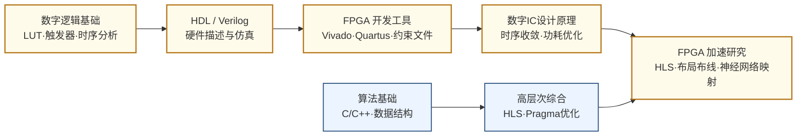

# 可重构计算与 FPGA

## 一句话定义

在软件的灵活性和专用硬件的性能之间寻找最优平衡——FPGA 既是芯片设计的验证平台，也是数据中心和边缘计算的可编程加速器，而可重构计算研究的是如何让这套机制更高效、更智能。

## 这个方向在研究什么

芯片世界里有一个持续存在的矛盾：通用处理器（CPU/GPU）可以运行任意代码，但对特定任务来说效率低下；专用芯片（ASIC）能在该任务上达到极致性能，但流片一次需要数月和数百万美元，而且功能固定、无法修改。FPGA（Field-Programmable Gate Array，现场可编程门阵列）是这两者之间的选项——它是一块出厂后可以反复"重新编程"的硬件，通过配置内部的逻辑单元和连线，让同一块芯片今天跑图像处理、明天跑加密算法、后天跑神经网络推理。

FPGA 的内部结构是一张由可编程逻辑单元（CLB/LUT）和可编程连线（routing fabric）织成的网格。一个典型的高端 FPGA（如 Xilinx Ultrascale+）有数百万个查找表（LUT），加上硬化的 DSP 模块、BRAM、串行收发器和 HBM 内存接口，整个芯片就像一张等待配置的空白画布。配置这张画布的过程和芯片设计很像——工程师用 Verilog/VHDL 描述电路，经过综合、布局、布线生成比特流文件，下载进 FPGA 即可运行。这让 FPGA 成为新芯片架构研究的首选原型平台：一个在仿真器里验证了三个月的处理器设计，可以在两周内在 FPGA 上跑起来，以接近真实芯片的速度做端到端系统测试。

FPGA 最大的性能瓶颈不在逻辑，而在连线。一块 FPGA 上，面积的 70-80% 是可编程路由资源，而这些资源的使用效率远低于 ASIC——信号要经过多个多路选择器和缓冲才能到达目的地。布局布线（Place-and-Route, P&R）算法决定哪个逻辑单元放在哪里、连线走哪条路，这是 FPGA CAD 的核心问题，也是 NP 难的组合优化问题。工业界用的 P&R 工具（Vivado、Quartus Prime）背后是数十年积累的启发式算法，但随着设计规模扩大，时序收敛越来越困难——一个大型设计可能需要跑几十小时的 P&R 才能满足时序，而且结果还受随机种子影响。学术界的标杆开源工具是多伦多大学开发的 VTR（Verilog to Routing），提供了完整的 FPGA 编译流程，是研究新算法的实验平台。

高层次综合（High-Level Synthesis, HLS）是这个方向近年最活跃的研究分支。HLS 的目标是让设计者用 C/C++/Python 描述算法，由工具自动生成对应的 RTL 代码，从而大幅缩短硬件开发周期。Xilinx（现 AMD）的 Vitis HLS 和开源的 LLHD/Calyx 是代表性工具。然而 HLS 生成的 RTL 质量与手写 RTL 之间仍有显著差距——典型情况下，HLS 生成代码的时钟频率比手写低 20-50%，面积也更大，因为工具在做循环展开、流水线插入、存储器划分等决策时需要大量人工 pragma 指导，而这些决策的设计空间是指数级的。机器学习驱动的 HLS 优化（预测最优 pragma 配置、自动插入流水线）是当前热点，多伦多大学、UCLA 的团队在这个方向上非常活跃。

在应用层面，数据中心是 FPGA 最重要的新战场。Microsoft 的 Project Catapult 把 FPGA 部署在服务器机架内，用于加速 Bing 搜索的网页排名算法，后来扩展到 Azure 的网络功能加速（SmartNIC）。AWS EC2 F1 实例让用户可以租用云端 FPGA 资源。Intel 收购 Altera 后，把 FPGA 和 Xeon CPU 集成在同一封装里（FPGA as co-processor）。AI 推理是另一个重要场景：相比 GPU，FPGA 的优势在于低延迟（毫秒以下）、低功耗和灵活的精度支持（4-bit 甚至 2-bit 量化），这让它在边缘推理场景——自动驾驶、工业视觉、无线基站处理——占据独特地位。研究者面临的核心问题是：如何让神经网络的各层算子高效映射到 FPGA 的 DSP 和 LUT 上，同时最大化数据局部性、最小化片外内存访问。

## 核心研究问题

- **布局布线（Place-and-Route）**：FPGA 的 P&R 是 NP 难问题，如何用机器学习或新启发式算法加速并提升质量？
- **高层次综合（HLS）**：HLS 生成的 RTL 与手写代码仍有质量差距，如何用自动化方法优化 pragma 配置和流水线结构？
- **神经网络映射**：如何把量化后的 DNN 高效映射到 FPGA 的 DSP/LUT/BRAM 资源上，最大化吞吐量和能效？
- **可重构架构设计**：FPGA 本身的架构如何演进——LUT 粒度、DSP 结构、片上网络设计如何适配 AI 时代的工作负载？
- **运行时可重构**：FPGA 的部分重构（Partial Reconfiguration）如何支持动态调度多个加速器，实现真正的运行时灵活性？

## 代表性机构与企业

| | 国际 | 国内 |
|--|------|------|
| **企业** | AMD/Xilinx、Intel/Altera、Lattice、Achronix | 复旦微电子（FMC）、安路科技、高云半导体 |
| **高校** | U Toronto（VTR/VPR）、UCLA、Cornell、UIUC | 清华、北大、复旦、国防科大 |
| **顶会** | FPGA、FCCM、FPL、DAC、ASPLOS、ISLPED | — |

## 相关课题组

**国内——清华大学**

| 姓名 | 单位 | 主页 | 研究方向 |
|------|------|------|----------|
| [魏少军](https://www.sic.tsinghua.edu.cn/en/info/1083/1444.htm) | 清华大学集成电路学院（IEEE Fellow） | 个人主页 | 可重构计算架构、软件定义芯片、VLSI 设计方法学；国内可重构计算方向奠基人之一 |
| [刘雷波](https://www.sic.tsinghua.edu.cn/info/1014/1807.htm) | 清华大学集成电路学院 | 个人主页 | 软件定义芯片架构与编译器、密码处理器、可重构计算系统，400+ 论文 200+ 专利 |

**国内——北京大学**

| 姓名 | 单位 | 主页 | 研究方向 |
|------|------|------|----------|
| [梁云（Eric Liang）](https://ericlyun.github.io/) | 北京大学集成电路学院 | 个人主页 | FPGA HLS 编译优化、硬件软件协同设计、神经网络 FPGA 加速 |

**国内——复旦大学**

| 姓名 | 单位 | 主页 | 研究方向 |
|------|------|------|----------|
| [王伶俐](https://sme.fudan.edu.cn/60/3c/c31133a352316/page.htm) | 复旦大学微电子学院 | 复旦教师页 | FPGA 结构研究与安全可编程计算、抗辐射 FPGA、可重构系统（上海市技术发明奖，前 Altera 欧洲研发中心） |
| [曾璇](https://asic-skl.fudan.edu.cn/d2/0c/c29516a315916/page.htm) | 复旦大学微电子学院（ASIC 国家重点实验室） | ASIC 实验室 | 模拟电路 EDA 与 ML 辅助 IC 设计自动化，涉及 FPGA 流程 |

**国际**

| 姓名 | 单位 | 主页 | 研究方向 |
|------|------|------|----------|
| [Vaughn Betz](https://www.eecg.utoronto.ca/~vaughn/) | University of Toronto ECE | 个人主页 | FPGA 架构与 CAD 先驱，VPR/VTR 开源工具主导开发者；FPGA 布局布线算法最权威学者 |
| [Jason Anderson](https://janders.eecg.utoronto.ca/) | University of Toronto ECE | 个人主页 | FPGA 架构设计（LUT/FF/路由结构）、HLS、FPGA 物理设计自动化 |
| [Deming Chen](https://dchen.ece.illinois.edu/) | UIUC ECE | Chen Group | FPGA HLS、ML for EDA、FPGA 加速神经网络，Xilinx/AMD 合作密切 |
| [Jason Cong（丛京生）](https://vast.cs.ucla.edu/people/faculty/jason-cong) | UCLA CS（美国工程院院士） | VAST Lab | FPGA 设计自动化先驱、HLS（FPGA 专属 HLS 工具 AUTOESL 创始人，后被 Xilinx 收购），现专注领域专用计算 |
| [Zhiru Zhang（张志如）](https://zhang.ece.cornell.edu/) | Cornell ECE | Zhang Research Group | 高层次综合（HLS）算法、FPGA 加速器自动生成、硬件-算法协同优化 |

## 知识路径

**本站相关课程：**

- [数字逻辑基础（复旦）](../课程资源/电路/数字/数字逻辑基础/数字逻辑基础_FDU/MICR130003.md)
- [Verilog HDL · HDLBits](../课程资源/电路/硬件描述语言(HDL)/Verilog/HDLBits.md) · [UCB EECS151](../课程资源/电路/硬件描述语言(HDL)/Verilog/EECS151.md)
- [FPGA 数字系统设计（复旦）](../课程资源/电路/数字/FPGA/MICR130024.md)
- [数字集成电路设计原理（复旦）](../课程资源/电路/数字/数字集成电路/数字集成电路设计原理_FDU/MICR130029.md)
- [EDA 工具（复旦）](../课程资源/电路/EDA/MICR130035.md) · [Vivado 入门](../课程资源/电路/EDA/vivado.md)

## 入门三步走

**第一步：上手一块真实 FPGA**  
跟随 Xilinx/AMD 的 Vivado Getting Started 教程，或 UCB EECS151 的 FPGA Lab，在 Basys3 或 Nexys Video 开发板上跑通一个 UART 回环或简单 SoC。亲手经历"写代码→综合→布局布线→下板"的完整闭环，是理解这个方向一切问题的前提。

**第二步：理解布局布线的难点**  
阅读 Betz & Rose, *VPR: A New Packing, Placement and Routing Tool for FPGA Research* (1997) 原始论文（6 页），以及 VTR 项目的文档（github.com/verilog-to-routing/vtr-verilog-to-routing），了解 FPGA P&R 为什么难、学术界如何定量评估新算法。

**第三步：跟进 HLS 与 AI 加速前沿**  
阅读 Chen et al., *FPGA-optimized Hardware Acceleration for Deep Neural Networks* (FPGA 2019)，或浏览 FPGA 顶会（fpga.org）近两年论文列表，感受当前研究的粒度：不是"能不能跑神经网络"，而是"如何在给定 DSP/LUT 预算下把吞吐量再提 2 倍"。
