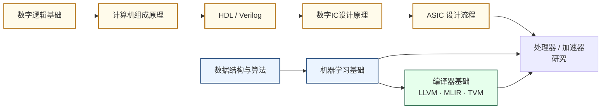

---
hide:
  - navigation
---
设计让计算机"算得更快、更省电"的核心硬件与软件栈——从通用 CPU 到神经网络加速器，再到将算法高效映射到硬件的编译器，三者构成一条完整的纵向研究方向。

## 这个方向在研究什么

2004 年，Intel 的 Pentium 4 Prescott 处理器频率达到 3.8 GHz，散热功耗高达 115 瓦——某些评测媒体真的把它当成炉子来煎鸡蛋。那是"提频率换性能"这条路的终点：晶体管开关越快，动态功耗就越高；漏电流随温度指数级上涨，芯片开始自我加热失控。从那以后，工程师必须接受一个现实：同等制程下多放一倍的晶体管，性能不会自动翻倍。你必须用架构设计来挣每一点性能。

CPU 的设计哲学是"让一件事情尽快完成"——为延迟而生。芯片内部大半面积不是执行单元，而是服务于"快"的控制机构：乱序执行引擎把原本串行的指令重排并行运行；分支预测器在 if-else 分叉前猜测哪条路会被走到，提前加载指令，猜错了再撤销；几十 MB 的 L3 缓存把最近用过的数据留在片内，避免去慢速 DRAM 取。这些机制让单条指令的延迟低至几个时钟周期——但在一块顶级服务器 CPU 的 Die 上，真正做乘法的执行单元只占很小一角，其余面积全在支撑这套复杂的控制逻辑。

GPU 的设计哲学截然相反——为吞吐而生。渲染一帧图像时，屏幕上每个像素的颜色计算完全独立，天然并行。NVIDIA H100 有 16,896 个 CUDA 核心，每个核心不需要分支预测器，不需要乱序引擎，只需要执行最简单的浮点运算——但同时执行近两万个。当一批线程在等内存数据时，GPU 调度器立刻切换到另一批线程，让计算单元始终不空转。2012 年，AlexNet 在两块 GTX 580 上训练，比当时最好的 CPU 实现快了 40 倍。这不只是速度差异，而是揭示了神经网络的计算本质：大规模的、高度规律的矩阵乘法，没有数据相关的分支跳转，和 GPU 的并行结构天然匹配。

但当模型从 AlexNet 的 6000 万参数膨胀到 GPT-3 的 1750 亿参数，新的瓶颈出现了：不是计算，是搬运数据。H100 的峰值算力是 2000 TFLOPS，但显存带宽只有 3.35 TB/s——一次 GPT-3 前向推理需要把数百 GB 的权重从显存搬进计算单元，芯片大量时间不是在算，而是在等。Google 的 TPU（2016）用脉动阵列（systolic array）回答了这个问题：矩阵的每行数据从左侧流入，权重固定在各自的乘法-累加单元上，计算结果向右传递，参数只需加载一次就能被反复复用。整块芯片的电路只做一件事——矩阵乘法——但这件事做到了极致，在神经网络推理上的能效比同代 GPU 高 30-80 倍。代价是：它几乎不能做别的。

<svg viewBox="0 0 860 260" xmlns="http://www.w3.org/2000/svg" style="width:100%;max-width:860px;display:block;margin:1.5rem auto;font-family:system-ui,sans-serif;">
  <rect x="8" y="8" width="844" height="244" rx="10" fill="#F8FAFC" stroke="#CBD5E1" stroke-width="1.5"/>
  <!-- ── CPU column ── -->
  <text x="148" y="32" text-anchor="middle" font-size="13" font-weight="700" fill="#1D4ED8">CPU</text>
  <text x="148" y="47" text-anchor="middle" font-size="10" fill="#64748B">少数复杂核 · 为延迟而生</text>
  <!-- 4 big cores -->
  <rect x="36" y="56" width="100" height="52" rx="5" fill="#DBEAFE" stroke="#3B82F6" stroke-width="1.5"/>
  <text x="86" y="75" text-anchor="middle" font-size="9" fill="#1E40AF">OOO执行引擎</text>
  <text x="86" y="88" text-anchor="middle" font-size="9" fill="#1E40AF">分支预测器</text>
  <text x="86" y="101" text-anchor="middle" font-size="9" fill="#1E40AF">L1/L2 Cache</text>
  <rect x="160" y="56" width="100" height="52" rx="5" fill="#DBEAFE" stroke="#3B82F6" stroke-width="1.5"/>
  <text x="210" y="75" text-anchor="middle" font-size="9" fill="#1E40AF">OOO执行引擎</text>
  <text x="210" y="88" text-anchor="middle" font-size="9" fill="#1E40AF">分支预测器</text>
  <text x="210" y="101" text-anchor="middle" font-size="9" fill="#1E40AF">L1/L2 Cache</text>
  <rect x="36" y="116" width="100" height="52" rx="5" fill="#DBEAFE" stroke="#3B82F6" stroke-width="1.5"/>
  <text x="86" y="135" text-anchor="middle" font-size="9" fill="#1E40AF">OOO执行引擎</text>
  <text x="86" y="148" text-anchor="middle" font-size="9" fill="#1E40AF">分支预测器</text>
  <text x="86" y="161" text-anchor="middle" font-size="9" fill="#1E40AF">L1/L2 Cache</text>
  <rect x="160" y="116" width="100" height="52" rx="5" fill="#DBEAFE" stroke="#3B82F6" stroke-width="1.5"/>
  <text x="210" y="135" text-anchor="middle" font-size="9" fill="#1E40AF">OOO执行引擎</text>
  <text x="210" y="148" text-anchor="middle" font-size="9" fill="#1E40AF">分支预测器</text>
  <text x="210" y="161" text-anchor="middle" font-size="9" fill="#1E40AF">L1/L2 Cache</text>
  <!-- L3 shared cache bar -->
  <rect x="36" y="177" width="224" height="22" rx="4" fill="#BFDBFE" stroke="#3B82F6" stroke-width="1"/>
  <text x="148" y="193" text-anchor="middle" font-size="10" fill="#1D4ED8">共享 L3 Cache（数十 MB）</text>
  <text x="148" y="228" text-anchor="middle" font-size="11" fill="#1D4ED8" font-weight="600">4–64 核心</text>
  <text x="148" y="244" text-anchor="middle" font-size="9" fill="#64748B">任意程序，低延迟</text>
  <!-- divider -->
  <line x1="295" y1="20" x2="295" y2="248" stroke="#E2E8F0" stroke-width="1.5"/>
  <!-- ── GPU column ── -->
  <text x="438" y="32" text-anchor="middle" font-size="13" font-weight="700" fill="#7C3AED">GPU</text>
  <text x="438" y="47" text-anchor="middle" font-size="10" fill="#64748B">海量简单核 · 为吞吐而生</text>
  <!-- 5×6 grid of small cores -->
  <rect x="305" y="56" width="266" height="145" rx="6" fill="#F5F3FF" stroke="#7C3AED" stroke-width="1.5"/>
  <text x="438" y="73" text-anchor="middle" font-size="9" fill="#6D28D9">流式多处理器（SM）× 132</text>
  <!-- grid dots: 8 cols × 5 rows -->
  <rect x="316" y="79" width="18" height="14" rx="2" fill="#C4B5FD"/>
  <rect x="340" y="79" width="18" height="14" rx="2" fill="#C4B5FD"/>
  <rect x="364" y="79" width="18" height="14" rx="2" fill="#C4B5FD"/>
  <rect x="388" y="79" width="18" height="14" rx="2" fill="#C4B5FD"/>
  <rect x="412" y="79" width="18" height="14" rx="2" fill="#C4B5FD"/>
  <rect x="436" y="79" width="18" height="14" rx="2" fill="#C4B5FD"/>
  <rect x="460" y="79" width="18" height="14" rx="2" fill="#C4B5FD"/>
  <rect x="484" y="79" width="18" height="14" rx="2" fill="#C4B5FD"/>
  <rect x="508" y="79" width="18" height="14" rx="2" fill="#C4B5FD"/>
  <rect x="532" y="79" width="18" height="14" rx="2" fill="#C4B5FD"/>
  <rect x="316" y="99" width="18" height="14" rx="2" fill="#C4B5FD"/>
  <rect x="340" y="99" width="18" height="14" rx="2" fill="#C4B5FD"/>
  <rect x="364" y="99" width="18" height="14" rx="2" fill="#C4B5FD"/>
  <rect x="388" y="99" width="18" height="14" rx="2" fill="#C4B5FD"/>
  <rect x="412" y="99" width="18" height="14" rx="2" fill="#C4B5FD"/>
  <rect x="436" y="99" width="18" height="14" rx="2" fill="#C4B5FD"/>
  <rect x="460" y="99" width="18" height="14" rx="2" fill="#C4B5FD"/>
  <rect x="484" y="99" width="18" height="14" rx="2" fill="#C4B5FD"/>
  <rect x="508" y="99" width="18" height="14" rx="2" fill="#C4B5FD"/>
  <rect x="532" y="99" width="18" height="14" rx="2" fill="#C4B5FD"/>
  <rect x="316" y="119" width="18" height="14" rx="2" fill="#C4B5FD"/>
  <rect x="340" y="119" width="18" height="14" rx="2" fill="#C4B5FD"/>
  <rect x="364" y="119" width="18" height="14" rx="2" fill="#C4B5FD"/>
  <rect x="388" y="119" width="18" height="14" rx="2" fill="#C4B5FD"/>
  <rect x="412" y="119" width="18" height="14" rx="2" fill="#C4B5FD"/>
  <rect x="436" y="119" width="18" height="14" rx="2" fill="#C4B5FD"/>
  <rect x="460" y="119" width="18" height="14" rx="2" fill="#C4B5FD"/>
  <rect x="484" y="119" width="18" height="14" rx="2" fill="#C4B5FD"/>
  <rect x="508" y="119" width="18" height="14" rx="2" fill="#C4B5FD"/>
  <rect x="532" y="119" width="18" height="14" rx="2" fill="#C4B5FD"/>
  <rect x="316" y="139" width="18" height="14" rx="2" fill="#A78BFA"/>
  <rect x="340" y="139" width="18" height="14" rx="2" fill="#A78BFA"/>
  <rect x="364" y="139" width="18" height="14" rx="2" fill="#A78BFA"/>
  <rect x="388" y="139" width="18" height="14" rx="2" fill="#A78BFA"/>
  <rect x="412" y="139" width="18" height="14" rx="2" fill="#A78BFA"/>
  <rect x="436" y="139" width="18" height="14" rx="2" fill="#A78BFA"/>
  <rect x="460" y="139" width="18" height="14" rx="2" fill="#A78BFA"/>
  <rect x="484" y="139" width="18" height="14" rx="2" fill="#A78BFA"/>
  <rect x="508" y="139" width="18" height="14" rx="2" fill="#A78BFA"/>
  <rect x="532" y="139" width="18" height="14" rx="2" fill="#A78BFA"/>
  <rect x="316" y="159" width="18" height="14" rx="2" fill="#A78BFA"/>
  <rect x="340" y="159" width="18" height="14" rx="2" fill="#A78BFA"/>
  <rect x="364" y="159" width="18" height="14" rx="2" fill="#A78BFA"/>
  <rect x="388" y="159" width="18" height="14" rx="2" fill="#A78BFA"/>
  <rect x="412" y="159" width="18" height="14" rx="2" fill="#A78BFA"/>
  <rect x="436" y="159" width="18" height="14" rx="2" fill="#A78BFA"/>
  <rect x="460" y="159" width="18" height="14" rx="2" fill="#A78BFA"/>
  <rect x="484" y="159" width="18" height="14" rx="2" fill="#A78BFA"/>
  <rect x="508" y="159" width="18" height="14" rx="2" fill="#A78BFA"/>
  <rect x="532" y="159" width="18" height="14" rx="2" fill="#A78BFA"/>
  <text x="438" y="228" text-anchor="middle" font-size="11" fill="#7C3AED" font-weight="600">~17,000 核心</text>
  <text x="438" y="244" text-anchor="middle" font-size="9" fill="#64748B">并行规则计算，隐藏延迟</text>
  <!-- divider -->
  <line x1="582" y1="20" x2="582" y2="248" stroke="#E2E8F0" stroke-width="1.5"/>
  <!-- ── TPU/DSA column ── -->
  <text x="722" y="32" text-anchor="middle" font-size="13" font-weight="700" fill="#15803D">TPU / DSA</text>
  <text x="722" y="47" text-anchor="middle" font-size="10" fill="#64748B">脉动阵列 · 为矩阵乘而生</text>
  <!-- systolic array: 5×5 MAC units with flow arrows -->
  <!-- data flows right →, partial sums flow down ↓ -->
  <!-- row 1 -->
  <rect x="600" y="60" width="28" height="22" rx="3" fill="#BBF7D0" stroke="#16A34A" stroke-width="1.2"/>
  <text x="614" y="75" text-anchor="middle" font-size="8" fill="#166534">MAC</text>
  <rect x="642" y="60" width="28" height="22" rx="3" fill="#BBF7D0" stroke="#16A34A" stroke-width="1.2"/>
  <text x="656" y="75" text-anchor="middle" font-size="8" fill="#166534">MAC</text>
  <rect x="684" y="60" width="28" height="22" rx="3" fill="#BBF7D0" stroke="#16A34A" stroke-width="1.2"/>
  <text x="698" y="75" text-anchor="middle" font-size="8" fill="#166534">MAC</text>
  <rect x="726" y="60" width="28" height="22" rx="3" fill="#BBF7D0" stroke="#16A34A" stroke-width="1.2"/>
  <text x="740" y="75" text-anchor="middle" font-size="8" fill="#166534">MAC</text>
  <rect x="768" y="60" width="28" height="22" rx="3" fill="#BBF7D0" stroke="#16A34A" stroke-width="1.2"/>
  <text x="782" y="75" text-anchor="middle" font-size="8" fill="#166534">MAC</text>
  <!-- row 2 -->
  <rect x="600" y="94" width="28" height="22" rx="3" fill="#BBF7D0" stroke="#16A34A" stroke-width="1.2"/>
  <text x="614" y="109" text-anchor="middle" font-size="8" fill="#166534">MAC</text>
  <rect x="642" y="94" width="28" height="22" rx="3" fill="#BBF7D0" stroke="#16A34A" stroke-width="1.2"/>
  <text x="656" y="109" text-anchor="middle" font-size="8" fill="#166534">MAC</text>
  <rect x="684" y="94" width="28" height="22" rx="3" fill="#BBF7D0" stroke="#16A34A" stroke-width="1.2"/>
  <text x="698" y="109" text-anchor="middle" font-size="8" fill="#166534">MAC</text>
  <rect x="726" y="94" width="28" height="22" rx="3" fill="#BBF7D0" stroke="#16A34A" stroke-width="1.2"/>
  <text x="740" y="109" text-anchor="middle" font-size="8" fill="#166534">MAC</text>
  <rect x="768" y="94" width="28" height="22" rx="3" fill="#BBF7D0" stroke="#16A34A" stroke-width="1.2"/>
  <text x="782" y="109" text-anchor="middle" font-size="8" fill="#166534">MAC</text>
  <!-- row 3 -->
  <rect x="600" y="128" width="28" height="22" rx="3" fill="#86EFAC" stroke="#16A34A" stroke-width="1.2"/>
  <text x="614" y="143" text-anchor="middle" font-size="8" fill="#166534">MAC</text>
  <rect x="642" y="128" width="28" height="22" rx="3" fill="#86EFAC" stroke="#16A34A" stroke-width="1.2"/>
  <text x="656" y="143" text-anchor="middle" font-size="8" fill="#166534">MAC</text>
  <rect x="684" y="128" width="28" height="22" rx="3" fill="#86EFAC" stroke="#16A34A" stroke-width="1.2"/>
  <text x="698" y="143" text-anchor="middle" font-size="8" fill="#166534">MAC</text>
  <rect x="726" y="128" width="28" height="22" rx="3" fill="#86EFAC" stroke="#16A34A" stroke-width="1.2"/>
  <text x="740" y="143" text-anchor="middle" font-size="8" fill="#166534">MAC</text>
  <rect x="768" y="128" width="28" height="22" rx="3" fill="#86EFAC" stroke="#16A34A" stroke-width="1.2"/>
  <text x="782" y="143" text-anchor="middle" font-size="8" fill="#166534">MAC</text>
  <!-- row 4 -->
  <rect x="600" y="162" width="28" height="22" rx="3" fill="#86EFAC" stroke="#16A34A" stroke-width="1.2"/>
  <text x="614" y="177" text-anchor="middle" font-size="8" fill="#166534">MAC</text>
  <rect x="642" y="162" width="28" height="22" rx="3" fill="#86EFAC" stroke="#16A34A" stroke-width="1.2"/>
  <text x="656" y="177" text-anchor="middle" font-size="8" fill="#166534">MAC</text>
  <rect x="684" y="162" width="28" height="22" rx="3" fill="#86EFAC" stroke="#16A34A" stroke-width="1.2"/>
  <text x="698" y="177" text-anchor="middle" font-size="8" fill="#166534">MAC</text>
  <rect x="726" y="162" width="28" height="22" rx="3" fill="#86EFAC" stroke="#16A34A" stroke-width="1.2"/>
  <text x="740" y="177" text-anchor="middle" font-size="8" fill="#166534">MAC</text>
  <rect x="768" y="162" width="28" height="22" rx="3" fill="#86EFAC" stroke="#16A34A" stroke-width="1.2"/>
  <text x="782" y="177" text-anchor="middle" font-size="8" fill="#166534">MAC</text>
  <!-- data flow arrow: → left side -->
  <text x="592" y="73" text-anchor="end" font-size="9" fill="#15803D">输入→</text>
  <text x="592" y="107" text-anchor="end" font-size="9" fill="#15803D">输入→</text>
  <text x="592" y="141" text-anchor="end" font-size="9" fill="#15803D">输入→</text>
  <text x="592" y="175" text-anchor="end" font-size="9" fill="#15803D">输入→</text>
  <!-- partial sum arrow: ↓ bottom -->
  <text x="614" y="196" text-anchor="middle" font-size="9" fill="#15803D">↓</text>
  <text x="656" y="196" text-anchor="middle" font-size="9" fill="#15803D">↓</text>
  <text x="698" y="196" text-anchor="middle" font-size="9" fill="#15803D">↓</text>
  <text x="740" y="196" text-anchor="middle" font-size="9" fill="#15803D">↓</text>
  <text x="782" y="196" text-anchor="middle" font-size="9" fill="#15803D">↓</text>
  <text x="722" y="228" text-anchor="middle" font-size="11" fill="#15803D" font-weight="600">256×256 MAC</text>
  <text x="722" y="244" text-anchor="middle" font-size="9" fill="#64748B">只做矩阵乘，能效极高</text>
</svg>

这就带来了现代架构研究最棘手的问题：你现在有 CPU、GPU、TPU、Apple Neural Engine、华为昇腾、寒武纪 MLU——每种芯片内部的计算单元、内存层次、指令集都不一样，你的 PyTorch 模型怎么在它们上面都跑？答案是编译器。LLVM 提供一套"通用中间层"，所有芯片厂商把自己的硬件规格写成后端，所有编程语言把语法翻译成前端，中间层负责优化和衔接；MLIR 把这个想法扩展到张量运算层次，允许在"矩阵乘法"和"硬件指令"之间多个抽象层灵活变换；TVM 在此基础上加入自动调优——用搜索算法在数百万种可能的循环分块和内存布局方案里，找出针对特定硬件的最优配置。架构和编译器的研究问题深度交织：你设计了一块新芯片，必须同时设计编译器才能让别人用得上；你发现了一种新的编译优化，可能需要微架构提供硬件支持才能真正生效。研究者日常工作的核心是"RTL设计—仿真验证—编译器支持"的循环，ASPLOS 这个顶会名字里同时带着 Architecture、Programming Languages 和 Operating Systems，不是偶然。

## 适合什么样的人

这个方向最适合那些对"计算机为什么能快"这个问题感到真正好奇的人——不满足于"因为时钟频率高"这种答案，而是想弄清楚每一条指令从发出到执行中间经历了什么，每一块电路为什么要那样设计。

如果你学 Verilog 或 Chisel 的时候会忍不住想"这段代码综合出来的电路长什么样"，而不只是把它当作描述语言用，这个方向非常适合你。同样，如果你读 Transformer 的论文时第一反应是"这个 attention 的矩阵乘法要消耗多少带宽"而不只是"精度怎么样"，你已经有了这个方向研究者需要的直觉。

从背景来看，EE/微电子方向的学生进入这个方向有天然优势——数字电路、计算机组成、信号完整性的底子让你能真正理解 RTL 仿真和时序分析。CS 背景的同学如果补上 Verilog 和流水线设计基础，切入编译器一侧（MLIR/TVM）则更顺畅。这个方向对两类人都友好，关键是你要愿意同时在两个抽象层次（算法和电路）上来回切换，而不是只待在其中一个。

发表阵地主要是 ISCA、MICRO、HPCA（架构侧）和 ASPLOS、CGO、PLDI（编译侧），发表周期和 AI 顶会相比偏长，通常一篇论文需要扎实的 RTL 实现和量化实验支撑。如果你喜欢深挖一个问题而不是快速迭代，这个节奏会让你觉得舒适。

## 核心研究问题

- **内存墙（Memory Wall）**：计算速度远超内存带宽，数据搬运成为瓶颈，如何设计存储层次和数据流？
- **能效墙（Power Wall）**：芯片功耗密度接近散热极限，如何在有限功耗内最大化算力？
- **专用 vs 通用**：CPU 灵活但低效，DSA（领域专用架构）高效但不灵活，如何找到最优平衡？
- **可编程性**：AI 模型快速迭代，如何让硬件架构跟上算法变化？
- **编译器-硬件协同**：如何设计可扩展的中间表示（MLIR/ONNX）与自动调优框架，将算法高效映射到新型加速器？
- **编译正确性与性能**：如何保证循环变换、算子融合等优化的语义等价性，同时充分挖掘硬件并行性与存储层次？

## 代表性机构

| | 国际 | 国内 |
|--|------|------|
| **企业** | NVIDIA、Apple、Google（TPU）、Qualcomm | 华为海思、寒武纪、地平线、摩尔线程 |
| **顶会** | ISCA · MICRO · HPCA · ASPLOS · CGO · PLDI · Hot Chips | — |

## 知识路径

图中节点对应以下知识板块（按需选修）：

- [系统架构（体系结构·编译原理）](../课程资源/系统架构/index.md)
- [电路（数字方向）](../课程资源/电路/index.md)
- [算法编程（数据结构·算法）](../课程资源/算法编程/index.md)
- [人工智能（机器学习系统）](../课程资源/人工智能/index.md)（EDA AI方向）

## 入门三步走

**典型研究长什么样**

一篇处理器架构方向的论文通常是这样的：作者观察到某类神经网络负载（比如 Transformer 的 KV Cache 访问）在现有硬件上存在严重的带宽瓶颈，提出一种新的数据流或存储层次设计，用 Verilog/Chisel 实现 RTL，在 FPGA 或仿真器上验证功能正确，再通过 EDA 工具综合到目标工艺节点（如 TSMC 28nm），报告面积、频率、功耗和吞吐量的量化结果，最终与 GPU 或先前工作做 Pareto 对比。编译器侧的论文则通常提出新的 IR 变换或调优算法，在 LLVM/MLIR 框架内实现，并在多个真实模型（ResNet/BERT/LLaMA）上报告端到端加速比。

**第一步：建立直觉**  
观看 Hennessy & Patterson 2017 年图灵奖演讲（YouTube 搜索"Turing Lecture 2017 Hennessy Patterson"），20 分钟，了解计算机架构 50 年演进脉络。

**第二步：动手实现**  
跟随 UCB EECS151 的 FPGA Lab，在真实硬件上实现一个五级流水线 RISC-V 处理器。这是目前开放资料中最完整的处理器设计实验。

**第三步：读经典论文**  
架构侧：
- Jouppi et al., *In-Datacenter Performance Analysis of a Tensor Processing Unit* (Google TPU, ISCA 2017)  
- Chen et al., *Eyeriss: An Energy-Efficient Reconfigurable Accelerator for Deep CNN* (ISSCC 2016)

编译侧：
- Chen et al., *TVM: An Automated End-to-End Optimizing Compiler for Deep Learning* (OSDI 2018)  
- Lattner et al., *MLIR: Scaling Compiler Infrastructure for Domain Specific Computation* (CGO 2021)

## 相关课题组

### 境内

-   **[马恺声](http://group.iiis.tsinghua.edu.cn/~maks/)** 清华

    Post-Moore 芯片架构 · AI 算法协同设计

-   **[高鸣宇](https://people.iiis.tsinghua.edu.cn/~gaomy/)** 清华

    计算机体系结构 · 高效内存系统 · 数据密集型负载加速

-   **[汪玉](https://web.ee.tsinghua.edu.cn/wangyu/zh_CN/index.htm)** 清华

    DNN/LLM 加速器 · FPGA 异构计算 · IEEE Fellow

-   **[尹首一](https://www.sic.tsinghua.edu.cn/info/1040/1567.htm) & [魏少军](https://www.sic.tsinghua.edu.cn/en/info/1083/1444.htm)** 清华

    神经网络加速器（Thinker）· 软件定义芯片 · 可重构计算架构 · VLSI 设计方法学

-   **[翟季冬](https://pacman.cs.tsinghua.edu.cn/~zjd/)** 清华

    并行计算 · 编译器优化 · HPC 与 AI 编程模型

-   **[刘雷波](https://www.sic.tsinghua.edu.cn/info/1014/1807.htm)** 清华

    软件定义芯片架构 · 可重构计算 · 编译器协同优化

-   **[孙广宇](https://ic.pku.edu.cn/szdw/zzjs/sjzdhyjsxtx1/sgy/index.htm)** 北大

    领域定制体系架构 · 存算融合 · 深度学习加速器

-   **[叶乐](https://ic.pku.edu.cn/szdw/zzjs/jcdlsjx1/yl/index.htm)** 北大

    存算一体 AI 芯片 · 3D 集成 · ISSCC 2021 最佳芯片

-   **[罗国杰](http://ceca.pku.edu.cn/en/people_/faculty_/guojie_luo/)** 北大

    可重构架构与 EDA · 近数据计算 · 深度学习加速器

-   **[程旭](https://cs.pku.edu.cn/info/1062/1607.htm)** 北大

    计算机系统结构 · 国产 CPU（北大-众志）

-   **[曾晓洋](https://sme.fudan.edu.cn/60/76/c31158a352374/page.htm)** 复旦

    高能效 SoC · 嵌入式 AI 芯片 · 智能集成系统

-   **[韩军](https://sme.fudan.edu.cn/5f/da/c31145a352218/page.htm)** 复旦

    RISC-V 处理器 · AI 边缘 SoC · 二维半导体处理器

-   **[范益波](https://sme.fudan.edu.cn/5f/d2/c31143a352210/page.htm)** 复旦

    多媒体 SoC · VPU/ISP/NPU 架构

-   **[陈迟晓](https://fics.fudan.edu.cn/4c/e6/c39908a412902/page.htm)** 复旦

    AI 芯片算法-电路-架构协同 · 感存算一体 · Chiplet

-   **[陈云霁](https://novel.ict.ac.cn/ychen_cn/)** 中科院

    深度学习处理器（DianNao）· 寒武纪创始人

-   **[包云岗](https://acs.ict.ac.cn/baoyg/)** 中科院

    开源 RISC-V 处理器（香山）· 数据中心架构

<button class="prof-show-all">显示全部 ↓</button>

### 境外

-   **[谢源](https://ece.hkust.edu.hk/yuanxie)** 港科大

    计算机体系结构 · 3D IC · AI 加速器 · IEEE Fellow

-   **[涂锋斌](https://ece.hkust.edu.hk/fengbintu)** 港科大

    高能效深度学习加速器 · 存算一体芯片

-   **[Song Han（韩松）](https://hanlab.mit.edu/songhan)** MIT

    高效深度学习 · LLM 量化（AWQ）· 硬件感知 NAS

-   **[Vivienne Sze](https://eems.mit.edu/)** MIT

    深度学习硬件加速 · Eyeriss 加速器 · 视频压缩

-   **[Yakun Sophia Shao](https://people.eecs.berkeley.edu/~ysshao/)** UC Berkeley

    领域专用加速器 · 敏捷 VLSI · Chipyard/Gemmini

-   **[Zhiru Zhang](https://zhang.ece.cornell.edu/)** Cornell

    高层次综合（HLS）· FPGA 加速 · 算法硬件协同

-   **[Onur Mutlu](https://people.inf.ethz.ch/omutlu/)** ETH Zürich

    存储系统（RowHammer）· 近存计算 · DRAM 可靠性

-   **[Yiran Chen](https://ece.duke.edu/people/yiran-chen/)** Duke

    NVM/STT-MRAM · AI 硬件协同 · DNN 压缩与加速

-   **[Joel Emer](https://people.csail.mit.edu/emer/)** MIT

    稀疏张量加速器（Eyeriss/Sparseloop）· 深度学习硬件架构 · 微架构分析

-   **[Priyanka Raina](https://priyanka-raina.github.io/)** Stanford

    领域专用加速器 · 近数据处理（NDP）· 敏捷 VLSI 设计

-   **[Vijay Janapa Reddi](https://scholar.harvard.edu/vijay-janapa-reddi)** Harvard

    TinyML / 边缘 AI · MLPerf 基准测试 · 移动设备推理系统

-   **[Gu-Yeon Wei](https://seas.harvard.edu/person/gu-yeon-wei)** Harvard

    AI 加速器 · 数模混合 IC · 高能效计算系统

-   **[Tushar Krishna](https://www.tushar-krishna.com/)** Georgia Tech

    片上网络（NoC）· DNN 加速器互联 · 多芯片系统架构

-   **[Hyesoon Kim](https://hyesoon-kim.com/)** Georgia Tech

    GPU / CPU 架构 · 硬件-软件协同 · 图计算加速

-   **[Nathan Beckmann](https://www.cs.cmu.edu/~beckmann/)** CMU

    缓存层次结构 · 内存系统架构 · 计算机体系结构

-   **[Tony Nowatzki](https://web.cs.ucla.edu/~nowatzki/)** UCLA

    领域专用加速器 · 数据流架构 · 近存计算（PIM）

<button class="prof-show-all">显示全部 ↓</button>
