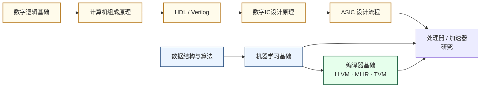

---
hide:
  - navigation
---
设计让计算机"算得更快、更省电"的核心硬件与软件栈——从通用 CPU 到神经网络加速器，再到将算法高效映射到硬件的编译器，三者构成一条完整的纵向研究方向。

## 这个方向在研究什么

你的手机每次用面容解锁，背后有一颗专用神经引擎在工作：不到一瓦的功耗，几毫秒内完成整个神经网络的推理。拿同一个模型跑在手机的通用处理器上，速度慢二十倍，耗电多十倍，续航会被明显拖累。算法没变，模型参数没变，差别只在芯片内部——计算单元如何组织、数据以什么路径流动、中间结果存在哪里。处理器架构研究的核心问题就是这个：给定一批晶体管，怎样把它们排布成一台计算机，让它在物理约束下算得最快、耗电最少。

过去四十年，这个问题其实并不紧迫。摩尔定律运转的时候，架构师几乎可以什么都不做——等下一代制程，晶体管缩小一半，芯片自动快一倍。这套躺赢的机制大约在 2005 年前后开始松动：晶体管越来越小，漏电流越来越大，芯片的功耗密度触到了散热极限，主频不能再提了。2015 年之后，制程推进的节奏更是显著放缓，每一代的性能红利都在递减。偏偏这时候，大语言模型把算力需求推上了指数曲线——训练 GPT-4 所需的算力，比五年前的 GPT-2 多了将近一万倍。制程红利在衰减，需求在暴涨。Hennessy 与 Patterson 把这个剪刀差叫做"计算机架构的新黄金时代"：越是不能靠制程，架构设计本身越重要。

这股压力集中体现在三个相互缠绕的矛盾上。第一个是算力与带宽的剪刀差：处理器的浮点算力以每秒数百万亿次计，但从内存搬运数据的速度远远跟不上，访问一次主内存的时间够处理器做几百次乘法，芯片大量时间不在算，而在等。GPU 用一个巧妙的办法绕开了这个问题——同时调度数以万计的线程，当一批线程卡在等内存时，立刻切换到下一批，计算单元始终不空转；TPU 的脉动阵列换了个思路，让权重固定在计算单元上，输入数据像波浪一样流过，每个权重只从内存取一次就被反复复用。两种方案，同一个矛盾，截然不同的应对。第二个是专用与通用的永恒权衡：通用处理器要能跑任意程序，芯片里塞满了分支预测器、乱序执行引擎和巨大的缓存，这些机构跑神经网络推理时几乎全部空转；Apple Neural Engine 把它们拆掉，只留矩阵乘法所需的电路，能效提高了一两个数量级，代价是一旦模型架构变化，芯片可能就要重新设计。这个权衡没有终点，随算法迭代和应用场景持续移动。第三个矛盾更隐蔽：硬件与软件的边界在移动——什么计算固化进硬件、什么留给编译器在运行前排定、什么交给运行时动态调度，这条边界本身就是研究对象。同一块 GPU，换一套内存调度策略，LLM 推理的吞吐量可以相差十倍以上。

<svg viewBox="0 0 860 256" xmlns="http://www.w3.org/2000/svg" style="width:100%;max-width:860px;display:block;margin:1.5rem auto;font-family:system-ui,sans-serif;">
  <rect x="8" y="8" width="844" height="240" rx="10" fill="#F8FAFC" stroke="#CBD5E1" stroke-width="1.5"/>
  <text x="148" y="32" text-anchor="middle" font-size="13" font-weight="700" fill="#1D4ED8">CPU</text>
  <text x="148" y="47" text-anchor="middle" font-size="10" fill="#64748B">少数复杂核 · 为低延迟而生</text>
  <rect x="36" y="56" width="100" height="50" rx="5" fill="#DBEAFE" stroke="#3B82F6" stroke-width="1.5"/>
  <text x="86" y="75" text-anchor="middle" font-size="9" fill="#1E40AF">乱序执行引擎</text>
  <text x="86" y="88" text-anchor="middle" font-size="9" fill="#1E40AF">分支预测器</text>
  <text x="86" y="101" text-anchor="middle" font-size="9" fill="#1E40AF">L1/L2 Cache</text>
  <rect x="160" y="56" width="100" height="50" rx="5" fill="#DBEAFE" stroke="#3B82F6" stroke-width="1.5"/>
  <text x="210" y="75" text-anchor="middle" font-size="9" fill="#1E40AF">乱序执行引擎</text>
  <text x="210" y="88" text-anchor="middle" font-size="9" fill="#1E40AF">分支预测器</text>
  <text x="210" y="101" text-anchor="middle" font-size="9" fill="#1E40AF">L1/L2 Cache</text>
  <rect x="36" y="114" width="100" height="50" rx="5" fill="#DBEAFE" stroke="#3B82F6" stroke-width="1.5"/>
  <text x="86" y="133" text-anchor="middle" font-size="9" fill="#1E40AF">乱序执行引擎</text>
  <text x="86" y="146" text-anchor="middle" font-size="9" fill="#1E40AF">分支预测器</text>
  <text x="86" y="159" text-anchor="middle" font-size="9" fill="#1E40AF">L1/L2 Cache</text>
  <rect x="160" y="114" width="100" height="50" rx="5" fill="#DBEAFE" stroke="#3B82F6" stroke-width="1.5"/>
  <text x="210" y="133" text-anchor="middle" font-size="9" fill="#1E40AF">乱序执行引擎</text>
  <text x="210" y="146" text-anchor="middle" font-size="9" fill="#1E40AF">分支预测器</text>
  <text x="210" y="159" text-anchor="middle" font-size="9" fill="#1E40AF">L1/L2 Cache</text>
  <rect x="36" y="172" width="224" height="20" rx="4" fill="#BFDBFE" stroke="#3B82F6" stroke-width="1"/>
  <text x="148" y="186" text-anchor="middle" font-size="10" fill="#1D4ED8">共享 L3 Cache（数十 MB）</text>
  <text x="148" y="220" text-anchor="middle" font-size="11" font-weight="600" fill="#1D4ED8">4–64 核</text>
  <text x="148" y="236" text-anchor="middle" font-size="9" fill="#64748B">通用程序，单线程延迟低</text>
  <line x1="290" y1="18" x2="290" y2="242" stroke="#E2E8F0" stroke-width="1.5"/>
  <text x="438" y="32" text-anchor="middle" font-size="13" font-weight="700" fill="#7C3AED">GPU</text>
  <text x="438" y="47" text-anchor="middle" font-size="10" fill="#64748B">海量简单核 · 靠切换线程隐藏延迟</text>
  <rect x="300" y="56" width="276" height="136" rx="6" fill="#F5F3FF" stroke="#7C3AED" stroke-width="1.5"/>
  <text x="438" y="72" text-anchor="middle" font-size="9" fill="#6D28D9">流式多处理器（SM）× 132</text>
  <rect x="311" y="79" width="17" height="13" rx="2" fill="#C4B5FD"/>
  <rect x="333" y="79" width="17" height="13" rx="2" fill="#C4B5FD"/>
  <rect x="355" y="79" width="17" height="13" rx="2" fill="#C4B5FD"/>
  <rect x="377" y="79" width="17" height="13" rx="2" fill="#C4B5FD"/>
  <rect x="399" y="79" width="17" height="13" rx="2" fill="#C4B5FD"/>
  <rect x="421" y="79" width="17" height="13" rx="2" fill="#C4B5FD"/>
  <rect x="443" y="79" width="17" height="13" rx="2" fill="#C4B5FD"/>
  <rect x="465" y="79" width="17" height="13" rx="2" fill="#C4B5FD"/>
  <rect x="487" y="79" width="17" height="13" rx="2" fill="#C4B5FD"/>
  <rect x="509" y="79" width="17" height="13" rx="2" fill="#C4B5FD"/>
  <rect x="531" y="79" width="17" height="13" rx="2" fill="#C4B5FD"/>
  <rect x="553" y="79" width="17" height="13" rx="2" fill="#C4B5FD"/>
  <rect x="311" y="98" width="17" height="13" rx="2" fill="#C4B5FD"/>
  <rect x="333" y="98" width="17" height="13" rx="2" fill="#C4B5FD"/>
  <rect x="355" y="98" width="17" height="13" rx="2" fill="#C4B5FD"/>
  <rect x="377" y="98" width="17" height="13" rx="2" fill="#C4B5FD"/>
  <rect x="399" y="98" width="17" height="13" rx="2" fill="#C4B5FD"/>
  <rect x="421" y="98" width="17" height="13" rx="2" fill="#C4B5FD"/>
  <rect x="443" y="98" width="17" height="13" rx="2" fill="#C4B5FD"/>
  <rect x="465" y="98" width="17" height="13" rx="2" fill="#C4B5FD"/>
  <rect x="487" y="98" width="17" height="13" rx="2" fill="#C4B5FD"/>
  <rect x="509" y="98" width="17" height="13" rx="2" fill="#C4B5FD"/>
  <rect x="531" y="98" width="17" height="13" rx="2" fill="#C4B5FD"/>
  <rect x="553" y="98" width="17" height="13" rx="2" fill="#C4B5FD"/>
  <rect x="311" y="117" width="17" height="13" rx="2" fill="#A78BFA"/>
  <rect x="333" y="117" width="17" height="13" rx="2" fill="#A78BFA"/>
  <rect x="355" y="117" width="17" height="13" rx="2" fill="#A78BFA"/>
  <rect x="377" y="117" width="17" height="13" rx="2" fill="#A78BFA"/>
  <rect x="399" y="117" width="17" height="13" rx="2" fill="#A78BFA"/>
  <rect x="421" y="117" width="17" height="13" rx="2" fill="#A78BFA"/>
  <rect x="443" y="117" width="17" height="13" rx="2" fill="#A78BFA"/>
  <rect x="465" y="117" width="17" height="13" rx="2" fill="#A78BFA"/>
  <rect x="487" y="117" width="17" height="13" rx="2" fill="#A78BFA"/>
  <rect x="509" y="117" width="17" height="13" rx="2" fill="#A78BFA"/>
  <rect x="531" y="117" width="17" height="13" rx="2" fill="#A78BFA"/>
  <rect x="553" y="117" width="17" height="13" rx="2" fill="#A78BFA"/>
  <rect x="311" y="136" width="17" height="13" rx="2" fill="#A78BFA"/>
  <rect x="333" y="136" width="17" height="13" rx="2" fill="#A78BFA"/>
  <rect x="355" y="136" width="17" height="13" rx="2" fill="#A78BFA"/>
  <rect x="377" y="136" width="17" height="13" rx="2" fill="#A78BFA"/>
  <rect x="399" y="136" width="17" height="13" rx="2" fill="#A78BFA"/>
  <rect x="421" y="136" width="17" height="13" rx="2" fill="#A78BFA"/>
  <rect x="443" y="136" width="17" height="13" rx="2" fill="#A78BFA"/>
  <rect x="465" y="136" width="17" height="13" rx="2" fill="#A78BFA"/>
  <rect x="487" y="136" width="17" height="13" rx="2" fill="#A78BFA"/>
  <rect x="509" y="136" width="17" height="13" rx="2" fill="#A78BFA"/>
  <rect x="531" y="136" width="17" height="13" rx="2" fill="#A78BFA"/>
  <rect x="553" y="136" width="17" height="13" rx="2" fill="#A78BFA"/>
  <rect x="311" y="155" width="17" height="13" rx="2" fill="#8B5CF6"/>
  <rect x="333" y="155" width="17" height="13" rx="2" fill="#8B5CF6"/>
  <rect x="355" y="155" width="17" height="13" rx="2" fill="#8B5CF6"/>
  <rect x="377" y="155" width="17" height="13" rx="2" fill="#8B5CF6"/>
  <rect x="399" y="155" width="17" height="13" rx="2" fill="#8B5CF6"/>
  <rect x="421" y="155" width="17" height="13" rx="2" fill="#8B5CF6"/>
  <rect x="443" y="155" width="17" height="13" rx="2" fill="#8B5CF6"/>
  <rect x="465" y="155" width="17" height="13" rx="2" fill="#8B5CF6"/>
  <rect x="487" y="155" width="17" height="13" rx="2" fill="#8B5CF6"/>
  <rect x="509" y="155" width="17" height="13" rx="2" fill="#8B5CF6"/>
  <rect x="531" y="155" width="17" height="13" rx="2" fill="#8B5CF6"/>
  <rect x="553" y="155" width="17" height="13" rx="2" fill="#8B5CF6"/>
  <text x="438" y="220" text-anchor="middle" font-size="11" font-weight="600" fill="#7C3AED">~17,000 核</text>
  <text x="438" y="236" text-anchor="middle" font-size="9" fill="#64748B">并行规则计算，吞吐量极高</text>
  <line x1="584" y1="18" x2="584" y2="242" stroke="#E2E8F0" stroke-width="1.5"/>
  <text x="722" y="32" text-anchor="middle" font-size="13" font-weight="700" fill="#15803D">TPU / DSA</text>
  <text x="722" y="47" text-anchor="middle" font-size="10" fill="#64748B">脉动阵列 · 权重只搬一次</text>
  <text x="596" y="73" text-anchor="start" font-size="9" fill="#15803D">输入行→</text>
  <rect x="648" y="62" width="26" height="20" rx="3" fill="#BBF7D0" stroke="#16A34A" stroke-width="1.2"/>
  <text x="661" y="76" text-anchor="middle" font-size="8" fill="#166534">MAC</text>
  <rect x="688" y="62" width="26" height="20" rx="3" fill="#BBF7D0" stroke="#16A34A" stroke-width="1.2"/>
  <text x="701" y="76" text-anchor="middle" font-size="8" fill="#166534">MAC</text>
  <rect x="728" y="62" width="26" height="20" rx="3" fill="#BBF7D0" stroke="#16A34A" stroke-width="1.2"/>
  <text x="741" y="76" text-anchor="middle" font-size="8" fill="#166534">MAC</text>
  <rect x="768" y="62" width="26" height="20" rx="3" fill="#BBF7D0" stroke="#16A34A" stroke-width="1.2"/>
  <text x="781" y="76" text-anchor="middle" font-size="8" fill="#166534">MAC</text>
  <text x="596" y="103" text-anchor="start" font-size="9" fill="#15803D">输入行→</text>
  <rect x="648" y="92" width="26" height="20" rx="3" fill="#BBF7D0" stroke="#16A34A" stroke-width="1.2"/>
  <text x="661" y="106" text-anchor="middle" font-size="8" fill="#166534">MAC</text>
  <rect x="688" y="92" width="26" height="20" rx="3" fill="#BBF7D0" stroke="#16A34A" stroke-width="1.2"/>
  <text x="701" y="106" text-anchor="middle" font-size="8" fill="#166534">MAC</text>
  <rect x="728" y="92" width="26" height="20" rx="3" fill="#BBF7D0" stroke="#16A34A" stroke-width="1.2"/>
  <text x="741" y="106" text-anchor="middle" font-size="8" fill="#166534">MAC</text>
  <rect x="768" y="92" width="26" height="20" rx="3" fill="#BBF7D0" stroke="#16A34A" stroke-width="1.2"/>
  <text x="781" y="106" text-anchor="middle" font-size="8" fill="#166534">MAC</text>
  <text x="596" y="133" text-anchor="start" font-size="9" fill="#15803D">输入行→</text>
  <rect x="648" y="122" width="26" height="20" rx="3" fill="#86EFAC" stroke="#16A34A" stroke-width="1.2"/>
  <text x="661" y="136" text-anchor="middle" font-size="8" fill="#166534">MAC</text>
  <rect x="688" y="122" width="26" height="20" rx="3" fill="#86EFAC" stroke="#16A34A" stroke-width="1.2"/>
  <text x="701" y="136" text-anchor="middle" font-size="8" fill="#166534">MAC</text>
  <rect x="728" y="122" width="26" height="20" rx="3" fill="#86EFAC" stroke="#16A34A" stroke-width="1.2"/>
  <text x="741" y="136" text-anchor="middle" font-size="8" fill="#166534">MAC</text>
  <rect x="768" y="122" width="26" height="20" rx="3" fill="#86EFAC" stroke="#16A34A" stroke-width="1.2"/>
  <text x="781" y="136" text-anchor="middle" font-size="8" fill="#166534">MAC</text>
  <text x="596" y="163" text-anchor="start" font-size="9" fill="#15803D">输入行→</text>
  <rect x="648" y="152" width="26" height="20" rx="3" fill="#86EFAC" stroke="#16A34A" stroke-width="1.2"/>
  <text x="661" y="166" text-anchor="middle" font-size="8" fill="#166534">MAC</text>
  <rect x="688" y="152" width="26" height="20" rx="3" fill="#86EFAC" stroke="#16A34A" stroke-width="1.2"/>
  <text x="701" y="166" text-anchor="middle" font-size="8" fill="#166534">MAC</text>
  <rect x="728" y="152" width="26" height="20" rx="3" fill="#86EFAC" stroke="#16A34A" stroke-width="1.2"/>
  <text x="741" y="166" text-anchor="middle" font-size="8" fill="#166534">MAC</text>
  <rect x="768" y="152" width="26" height="20" rx="3" fill="#86EFAC" stroke="#16A34A" stroke-width="1.2"/>
  <text x="781" y="166" text-anchor="middle" font-size="8" fill="#166534">MAC</text>
  <text x="661" y="185" text-anchor="middle" font-size="9" fill="#15803D">↓结果</text>
  <text x="701" y="185" text-anchor="middle" font-size="9" fill="#15803D">↓结果</text>
  <text x="741" y="185" text-anchor="middle" font-size="9" fill="#15803D">↓结果</text>
  <text x="781" y="185" text-anchor="middle" font-size="9" fill="#15803D">↓结果</text>
  <text x="722" y="220" text-anchor="middle" font-size="11" font-weight="600" fill="#15803D">256 × 256 MAC阵列</text>
  <text x="722" y="236" text-anchor="middle" font-size="9" fill="#64748B">只做矩阵乘，能效极高</text>
</svg>

带着这三个矛盾，可以更清楚地看到架构研究的具体疆域。设计一块处理器，首先要确定的是指令集（ISA）——软件能看到、硬件必须实现的那层接口。x86 走的是"指令越丰富越好"的路，几十年向后兼容积累了大量包袱，解码电路本身就要消耗不少功耗；ARM 用精简指令集换来更低的实现成本，在移动端大获全胜；RISC-V 把指令集完全开源，第一次让人不交授权费就能设计和修改指令集——Hennessy 与 Patterson 专门把这一点列为新黄金时代的结构性条件，因为它把芯片创新的门槛从亿级资本降到了学术组可以参与的范围。

指令集之下是微架构——同一套 ISA 可以有无数种不同的电路实现。同样是 x86，Intel Raptor Lake 和 AMD Zen 4 的流水线级数、乱序执行宽度、分支预测算法完全不同，性能和功耗可以相差 30%。微架构是架构研究发表最密集的战场：分支预测命中率多高、预取器提前几步取数据、缓存替换选 LRU 还是 RRIP，每一个细节都是独立的研究课题。贯穿其中的是存储层次这条暗线——L1 缓存命中四拍，L3 要四十拍，DRAM 等两百拍，每一级的大小、替换算法、与相邻层的预取协议，无不影响真实性能，内存墙不只是宏观叙事，它具体体现在每一个缓存设计决策里。

以上这些研究，全部在冯·诺依曼架构的框架之内进行：计算与存储分离、指令顺序取来执行，这是 1945 年以来所有主流处理器共同遵守的基本假设。近年来，研究者开始正面质疑这个假设本身——神经形态计算用脉冲信号取代精确数值，数据流架构让计算随数据到来自动触发，近存计算（NMP）把处理单元挪到内存旁边，存算一体（CIM）直接在存储阵列内部完成乘加运算。这些非冯方向共同指向同一个动机：数据搬运的成本已经大到不得不从根本上重新考虑计算与存储的关系。其中 CIM 和 NMP 目前研究热度最高，本指南设有专门章节，此处不展开。

架构研究离不开编译器，因为一块新芯片如果没有配套的软件栈，只是一块昂贵的硅片。编译器的核心工作是调度——决定指令以什么顺序执行、数据从哪里取、什么时候取。两种基本哲学：静态调度在编译期把一切安排好，生成的指令序列运行时无需硬件再做决策，是 VLIW 等架构的基础；动态调度把决策权留给硬件，处理器在运行时根据实际情况乱序执行，能应对编译期无法预知的变化，是现代高性能 CPU 的标配。LLVM 系统化地解决了不同硬件后端与不同语言前端之间的适配问题；MLIR 把这套思路延伸到张量运算层次，允许在"矩阵乘法"和"硬件寄存器"之间定义多个中间层；TVM 进一步加入自动调优，用搜索在数百万种循环分块方案里找出最优配置。调度的思想也延伸到了运行时层面——vLLM 把操作系统虚拟内存的分页思路用于管理 LLM 的 KV Cache，让同一块 GPU 上的推理吞吐量提升了二十余倍，这不是新硬件，是调度逻辑的重新设计。架构与编译器的研究问题深度交织，ASPLOS 这个顶会的名字里同时带着 Architecture、Programming Languages 和 Operating Systems，正因如此。

## 适合什么样的人

这个方向最适合那些对"计算机为什么能快"这个问题感到真正好奇的人——不满足于"因为时钟频率高"这种答案，而是想弄清楚每一条指令从发出到执行中间经历了什么，每一块电路为什么要那样设计。

如果你学 Verilog 或 Chisel 的时候会忍不住想"这段代码综合出来的电路长什么样"，而不只是把它当作描述语言用，这个方向非常适合你。同样，如果你读 Transformer 的论文时第一反应是"这个 attention 的矩阵乘法要消耗多少带宽"而不只是"精度怎么样"，你已经有了这个方向研究者需要的直觉。

从背景来看，EE/微电子方向的学生进入这个方向有天然优势——数字电路、计算机组成、信号完整性的底子让你能真正理解 RTL 仿真和时序分析。CS 背景的同学如果补上 Verilog 和流水线设计基础，切入编译器一侧（MLIR/TVM）则更顺畅。这个方向对两类人都友好，关键是你要愿意同时在两个抽象层次（算法和电路）上来回切换，而不是只待在其中一个。

发表阵地主要是 ISCA、MICRO、HPCA（架构侧）和 ASPLOS、CGO、PLDI（编译侧），发表周期和 AI 顶会相比偏长，通常一篇论文需要扎实的 RTL 实现和量化实验支撑。如果你喜欢深挖一个问题而不是快速迭代，这个节奏会让你觉得舒适。

## 核心研究问题

- **内存墙（Memory Wall）**：计算速度远超内存带宽，数据搬运成为瓶颈，如何设计存储层次和数据流？
- **能效墙（Power Wall）**：芯片功耗密度接近散热极限，如何在有限功耗内最大化算力？
- **专用 vs 通用**：CPU 灵活但低效，DSA（领域专用架构）高效但不灵活，如何找到最优平衡？
- **可编程性**：AI 模型快速迭代，如何让硬件架构跟上算法变化？
- **编译器-硬件协同**：如何设计可扩展的中间表示（MLIR/ONNX）与自动调优框架，将算法高效映射到新型加速器？
- **编译正确性与性能**：如何保证循环变换、算子融合等优化的语义等价性，同时充分挖掘硬件并行性与存储层次？

## 代表性机构

| | 国际 | 国内 |
|--|------|------|
| **企业** | NVIDIA、Apple、Google（TPU）、Qualcomm | 华为海思、寒武纪、地平线、摩尔线程 |
| **顶会** | ISCA · MICRO · HPCA · ASPLOS · CGO · PLDI · Hot Chips | — |

## 知识路径

图中节点对应以下知识板块（按需选修）：

- [系统架构（体系结构·编译原理）](../课程资源/系统架构/index.md)
- [电路（数字方向）](../课程资源/电路/index.md)
- [算法编程（数据结构·算法）](../课程资源/算法编程/index.md)
- [人工智能（机器学习系统）](../课程资源/人工智能/index.md)（EDA AI方向）

## 入门三步走

**典型研究长什么样**

一篇处理器架构方向的论文通常是这样的：作者观察到某类神经网络负载（比如 Transformer 的 KV Cache 访问）在现有硬件上存在严重的带宽瓶颈，提出一种新的数据流或存储层次设计，用 Verilog/Chisel 实现 RTL，在 FPGA 或仿真器上验证功能正确，再通过 EDA 工具综合到目标工艺节点（如 TSMC 28nm），报告面积、频率、功耗和吞吐量的量化结果，最终与 GPU 或先前工作做 Pareto 对比。编译器侧的论文则通常提出新的 IR 变换或调优算法，在 LLVM/MLIR 框架内实现，并在多个真实模型（ResNet/BERT/LLaMA）上报告端到端加速比。

**第一步：建立直觉**  
观看 Hennessy & Patterson 2017 年图灵奖演讲（YouTube 搜索"Turing Lecture 2017 Hennessy Patterson"），20 分钟，了解计算机架构 50 年演进脉络。

**第二步：动手实现**  
跟随 UCB EECS151 的 FPGA Lab，在真实硬件上实现一个五级流水线 RISC-V 处理器。这是目前开放资料中最完整的处理器设计实验。

**第三步：读经典论文**  
架构侧：
- Jouppi et al., *In-Datacenter Performance Analysis of a Tensor Processing Unit* (Google TPU, ISCA 2017)  
- Chen et al., *Eyeriss: An Energy-Efficient Reconfigurable Accelerator for Deep CNN* (ISSCC 2016)

编译侧：
- Chen et al., *TVM: An Automated End-to-End Optimizing Compiler for Deep Learning* (OSDI 2018)  
- Lattner et al., *MLIR: Scaling Compiler Infrastructure for Domain Specific Computation* (CGO 2021)

## 相关课题组

### 境内

-   **[马恺声](http://group.iiis.tsinghua.edu.cn/~maks/)** 清华

    Post-Moore 芯片架构 · AI 算法协同设计

-   **[高鸣宇](https://people.iiis.tsinghua.edu.cn/~gaomy/)** 清华

    计算机体系结构 · 高效内存系统 · 数据密集型负载加速

-   **[汪玉](https://web.ee.tsinghua.edu.cn/wangyu/zh_CN/index.htm)** 清华

    DNN/LLM 加速器 · FPGA 异构计算 · IEEE Fellow

-   **[尹首一](https://www.sic.tsinghua.edu.cn/info/1040/1567.htm) & [魏少军](https://www.sic.tsinghua.edu.cn/en/info/1083/1444.htm)** 清华

    神经网络加速器（Thinker）· 软件定义芯片 · 可重构计算架构 · VLSI 设计方法学

-   **[翟季冬](https://pacman.cs.tsinghua.edu.cn/~zjd/)** 清华

    并行计算 · 编译器优化 · HPC 与 AI 编程模型

-   **[刘雷波](https://www.sic.tsinghua.edu.cn/info/1014/1807.htm)** 清华

    软件定义芯片架构 · 可重构计算 · 编译器协同优化

-   **[孙广宇](https://ic.pku.edu.cn/szdw/zzjs/sjzdhyjsxtx1/sgy/index.htm)** 北大

    领域定制体系架构 · 存算融合 · 深度学习加速器

-   **[叶乐](https://ic.pku.edu.cn/szdw/zzjs/jcdlsjx1/yl/index.htm)** 北大

    存算一体 AI 芯片 · 3D 集成 · ISSCC 2021 最佳芯片

-   **[罗国杰](http://ceca.pku.edu.cn/en/people_/faculty_/guojie_luo/)** 北大

    可重构架构与 EDA · 近数据计算 · 深度学习加速器

-   **[程旭](https://cs.pku.edu.cn/info/1062/1607.htm)** 北大

    计算机系统结构 · 国产 CPU（北大-众志）

-   **[曾晓洋](https://sme.fudan.edu.cn/60/76/c31158a352374/page.htm)** 复旦

    高能效 SoC · 嵌入式 AI 芯片 · 智能集成系统

-   **[韩军](https://sme.fudan.edu.cn/5f/da/c31145a352218/page.htm)** 复旦

    RISC-V 处理器 · AI 边缘 SoC · 二维半导体处理器

-   **[范益波](https://sme.fudan.edu.cn/5f/d2/c31143a352210/page.htm)** 复旦

    多媒体 SoC · VPU/ISP/NPU 架构

-   **[陈迟晓](https://fics.fudan.edu.cn/4c/e6/c39908a412902/page.htm)** 复旦

    AI 芯片算法-电路-架构协同 · 感存算一体 · Chiplet

-   **[陈云霁](https://novel.ict.ac.cn/ychen_cn/)** 中科院

    深度学习处理器（DianNao）· 寒武纪创始人

-   **[包云岗](https://acs.ict.ac.cn/baoyg/)** 中科院

    开源 RISC-V 处理器（香山）· 数据中心架构

<button class="prof-show-all">显示全部 ↓</button>

### 境外

-   **[谢源](https://ece.hkust.edu.hk/yuanxie)** 港科大

    计算机体系结构 · 3D IC · AI 加速器 · IEEE Fellow

-   **[涂锋斌](https://ece.hkust.edu.hk/fengbintu)** 港科大

    高能效深度学习加速器 · 存算一体芯片

-   **[Song Han（韩松）](https://hanlab.mit.edu/songhan)** MIT

    高效深度学习 · LLM 量化（AWQ）· 硬件感知 NAS

-   **[Vivienne Sze](https://eems.mit.edu/)** MIT

    深度学习硬件加速 · Eyeriss 加速器 · 视频压缩

-   **[Yakun Sophia Shao](https://people.eecs.berkeley.edu/~ysshao/)** UC Berkeley

    领域专用加速器 · 敏捷 VLSI · Chipyard/Gemmini

-   **[Zhiru Zhang](https://zhang.ece.cornell.edu/)** Cornell

    高层次综合（HLS）· FPGA 加速 · 算法硬件协同

-   **[Onur Mutlu](https://people.inf.ethz.ch/omutlu/)** ETH Zürich

    存储系统（RowHammer）· 近存计算 · DRAM 可靠性

-   **[Yiran Chen](https://ece.duke.edu/people/yiran-chen/)** Duke

    NVM/STT-MRAM · AI 硬件协同 · DNN 压缩与加速

-   **[Joel Emer](https://people.csail.mit.edu/emer/)** MIT

    稀疏张量加速器（Eyeriss/Sparseloop）· 深度学习硬件架构 · 微架构分析

-   **[Priyanka Raina](https://priyanka-raina.github.io/)** Stanford

    领域专用加速器 · 近数据处理（NDP）· 敏捷 VLSI 设计

-   **[Vijay Janapa Reddi](https://scholar.harvard.edu/vijay-janapa-reddi)** Harvard

    TinyML / 边缘 AI · MLPerf 基准测试 · 移动设备推理系统

-   **[Gu-Yeon Wei](https://seas.harvard.edu/person/gu-yeon-wei)** Harvard

    AI 加速器 · 数模混合 IC · 高能效计算系统

-   **[Tushar Krishna](https://www.tushar-krishna.com/)** Georgia Tech

    片上网络（NoC）· DNN 加速器互联 · 多芯片系统架构

-   **[Hyesoon Kim](https://hyesoon-kim.com/)** Georgia Tech

    GPU / CPU 架构 · 硬件-软件协同 · 图计算加速

-   **[Nathan Beckmann](https://www.cs.cmu.edu/~beckmann/)** CMU

    缓存层次结构 · 内存系统架构 · 计算机体系结构

-   **[Tony Nowatzki](https://web.cs.ucla.edu/~nowatzki/)** UCLA

    领域专用加速器 · 数据流架构 · 近存计算（PIM）

<button class="prof-show-all">显示全部 ↓</button>
